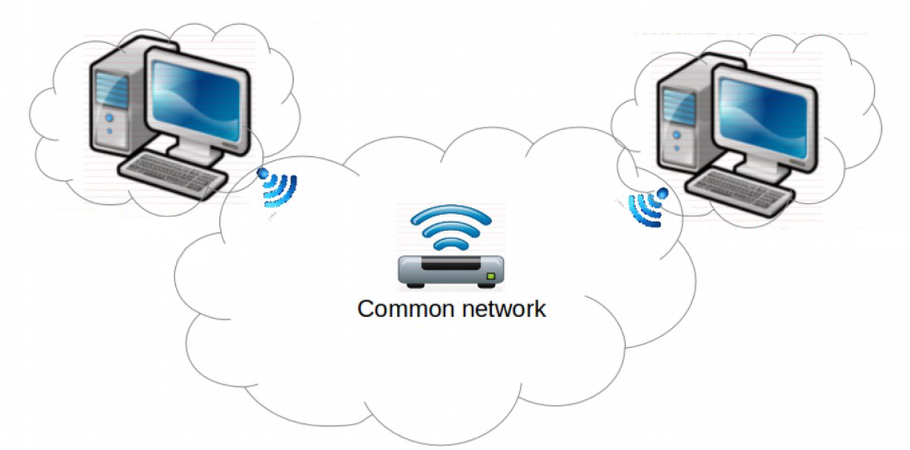
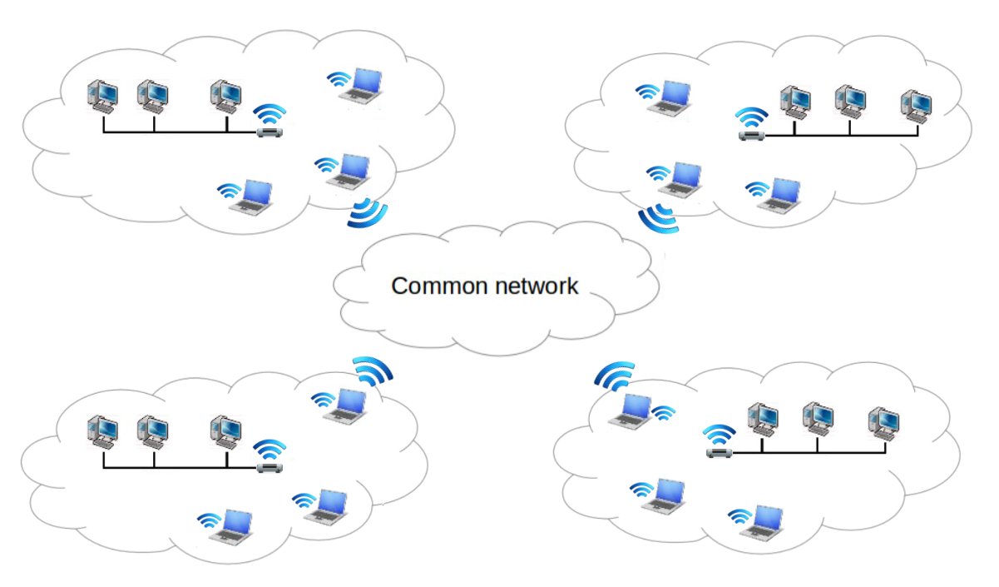
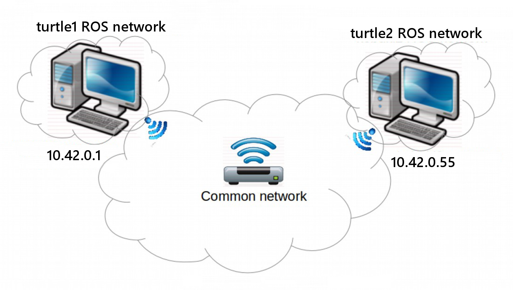

## multimaster_fkie


------

## multimaster_fkie 를 이용한 멀티 로봇 제어

**튜토리얼 레벨 :**  Intermediate(중급)

**이 튜토리얼 작성 환경 :**  catkin **/** Ubuntu 16.04 **/** Kinetic

**튜토리얼 목록 :** [README.md](../README.md)

**참고자료 :** <http://digital.csic.es/bitstream/10261/133333/1/ROS-systems.pdf>

------

### ROS Multi Master 환경

ROS 네트워크에서 MASTER는 `roscore` 가 실행되는 컴퓨터를 말한다. 일반적으로 단일 마스터( Single Master ) ROS 네트워크를 이용하지만, 다수의 로봇을 제어, 모바일 플랫폼, Manipulators 제어와 같이 각각의 `roscore` 노드가 실행 중인 복수의 ROS 네트워크를 가진 시스템의 경우 다중 마스터( Multi Master ) 환경이 요구된다. 이 같은 경우를 위해 ROS는 `mulrimaster_fkie` 라는 솔루션을 제공한다. 

멀티마스터( Multi Master )환경을 크게 두 가지로 분류해보면 **Single Computer ROS Network** 와 **Multiple Computer ROS Network** 로 구분할 수 있다.

- **Single Computer ROS Network**

  `roscore` 가 실행중인 복수의 컴퓨터로 이루어진 **단일 컴퓨터 ROS 네크워크 환경**

  

- **Multiple Computer ROS Network**

  `roscore` 가 실행중인 복수의 컴퓨터가 각각의 서로 다른 ROS 네트워크에 속해 있는 **다중 컴퓨터 ROS 네트워크 환경**

  

이 문서에서는 Single computer ROS network 에서의 Multi-Master 환경 구현방법만을 알아볼 것이다. Multiple computer ROS network 에서의 Multi-Master 구현방법은 문서 시작 부분의 [**참고자료**](./ROS-systems.pdf) 를 참조한다.


### Single computer ROS network 에서의 Multi Master 구현

앞서 언급한 바와 같이 ROS `multimaster_fkie` 패키지를 사용한다.

#### 1. 설치

2대 이상의 PC를 준비하고, 각 PC에서 터미널을 열어 아래 명령을 실행하여 ROS `multimaster_fkie` 패키지를 설치한다.

```bash
$ sudo apt-get install ros-kinetic-multimaster-fkie
```

#### 2. `multimaster_fkie` 패키지 제공 노드 및 그 기능

`multimaster_fkie` 패키지는 `master_discovery` 와 `master_sync` 2개의 노드를 제공한다. 각 노드의 기능은 다음과 같다. 

- **`master_discovery` 노드**
  - 각 로컬( Local ) 네트워크에서 실행중인 `ROS Master` 들이 서로의 존재를 인지할 수 있도록 공통 네트워크( Common Network )를 통해 주기적으로 멀티캐스트 메세지를 전파한다. 
  - 각 로컬의 `roscore` 에서 로컬 네트워크의 변경사항을 확인하고, 공통 네트워크의 다른 모든 `ROS Master` 에게 전파한다. 
- **`master_sync` 노드**
  - 다른 원격(Remote) `master_discovery` 노드로부터 제공받은 정보를 사용하여 원격 토픽 및 서비스를 로컬(Local) `roscore` 에 등록하고, 변경사항이 발생할 경우 그 변경사항을 반영(Update)한다. 
  - 동기화 또는 무시(Ignore)할 호스트(host), 토픽(Topic), 서비스(Service)들을 선택 구성한다. ( 기본적으로 모든 호스트의 모든 topic 와 service 가 동기화 되지만, 네트워크 대역폭 점유를 줄여야 할 경우 꼭 필요한 topic 과 service 만 동기화하여 사용할 수 있다. )

`master_sync` 노드는 원격 `topic` 또는 `service` 를 로컬 `roscore` 에 동기 시킬 뿐이다. 반대로 로컬 `topic` 과 `service` 를 원격 `roscore` 에 동기하려면 원격 `roscore` 는 자신의 `master_sync` 노드가 있어야만 한다.

`multimaster_fkie` 솔루션은 topic 과 service 만을 지원하지만 묵시적으로 action 또한 지원하는데, 이는 `action` 이 상위 5 개의 `topic` 으로 만들어지기 때문이다. 각 `roscore` 의 `parameter` 서버의 경우, 원격으로 접근할 수 없다.

표준 ROS 시스템에서 발생하는 것과 유사하게, `topic` , `service` 및 `action` 이 원격 ROS 서브 시스템에 등록되면 지점 간 소켓이 작성되어 둘 이상의 노드를 직접 연결하고 다중 Master 메커니즘 구성이 변경( 새 `publisher` / `subscriber` 가 나타나거나 기존 항목이 사라지는 등 )될 때까지 사용되지 않는다. 

이 multimaster 솔루션(`multimaster_fkie`)은 현재 ROS Hydro 이후 버전의 ROS 에서 모두 지원되지만  `catkin`프레임 워크에서만 지원된다.

#### 3. `multimaster_fkie` 패키지 사용을 위한 네트워크 설정

다음 그림은 단일 컴퓨터 ROS 네트워크 구성 예이다. 이 후의 내용은 모두 이 사례를 기준으로 설명한 것임을 알려둔다. 



##### 3.1 `/etc/hosts` 파일 편집

호스트 이름과 IP 주소를 바인딩하기 위해  `/etc/hosts` 파일을 편집한다.


```
$ sudo nano /etc/hosts
```


```
$ sudo nano /etc/hosts
```


```
$ sudo nano /etc/hosts
```


```
$ sudo nano /etc/hosts
```


앞서 설명한 바와 같이 `master_discovery` 노드는 멀티캐스트를 통해 다른`master_discovery` 노드와 정보를 주고받아야 한다. 하지만 Ubuntu 시스템에서는 이 멀티캐스트 기능이 기본적으로 비활성화되어 있으므로 이를 활성화해야 한다. 또한 이 Multi-Master 네트워크에 참여하는 Master 들이 사용할 멀티캐스트 주소그룹( 기본값  226.0.0.0 )을 선택해주어야 한다. 

이 때, 사용될 기 설정 및 작동이 10 분 정도 후에 올바른 것으로 보이지만 모든 네트워크 간 연결이 닫히기 때문이다.
멀티캐스트 기능의 활성화 외에도, master_discovery 노드가 다른 컴퓨터에게 변경 사항 전파를 위해 사용될 모든
컴퓨터에 대해 멀티캐스트 주소그룹을 선택해야 한다. 기본값으로 226.0.0.0 주소가 사용되지만 노드의 매개 변수
를 사용하여 변경할 수 있다.
로컬 ROS 노드에 mas_discovery 및 master_sync 노드가 제공하는 원격 노드 정보가 있으면 다른 ROS 네트워크의
노드 간 통신이 가능하도록 원격 네트워크용 네트워크 트래픽을 올바르게 라우팅해야 한다.
이는 라우터, 액세스 포인트 또는 공통 네트워크를 관리하는 데 사용되는 컴퓨터에 고정 경로를 추가하여 쉽게 달성
할 수 있다. 그러나 트래픽을 원하는 대상으로 올바르게 라우팅하려면 각 컴퓨터마다 고유한 IP 주소가 있어야 한다.
간단한 단일 컴퓨터의 경우 모든 로컬 ROS 네트워크가 기본적으로 로컬 호스트( 127.0.0.1 ) 주소에서 작동하기
때문에 문제가 될 수 있다 .
이같은 경우 가장 간단한 해결책은 각 컴퓨터에 할당 된 공통 네트워크의 IP 주소를 ROS_MASTER_URI 변수로 사용하
는 것이다. 이렇게 하면 별도의 roscore 노드를 사용하더라도 모든 컴퓨터가 동일한 네트워크 인터페이스를 공유하
므로 고정 경로의 추가 작업이 필요하지 않다 .
로컬 네트워크에 각각 여러 대의 컴퓨터가 있는 경우이 솔루션은 더 이상 유효하지 않습니다. 대체 솔루션은
Section 4 에서 설명한다.

```bash
user1@nt930ros1:~$ ifconfig
lo        Link encap:Local Loopback  
          inet addr:127.0.0.1  Mask:255.0.0.0
          inet6 addr: ::1/128 Scope:Host
          UP LOOPBACK RUNNING  MTU:65536  Metric:1
          RX packets:6068 errors:0 dropped:0 overruns:0 frame:0
          TX packets:6068 errors:0 dropped:0 overruns:0 carrier:0
          collisions:0 txqueuelen:1000 
          RX bytes:530164 (530.1 KB)  TX bytes:530164 (530.1 KB)
wlp1s0    Link encap:Ethernet  HWaddr e4:42:a6:ed:ea:18  
          inet addr:10.42.0.1  Bcast:10.42.0.255  Mask:255.255.255.0
          inet6 addr: fe80::e642:a6ff:feed:ea18/64 Scope:Link
          UP BROADCAST RUNNING MULTICAST  MTU:1500  Metric:1
          RX packets:41511 errors:0 dropped:0 overruns:0 frame:0
          TX packets:50070 errors:0 dropped:0 overruns:0 carrier:0
          collisions:0 txqueuelen:1000 
          RX bytes:4004995 (4.0 MB)  TX bytes:64958436 (64.9 MB)
```


```bash
user@nt930ros1:~$ cat /etc/hosts
127.0.0.1	localhost
127.0.1.1	nt930ros1

10.42.0.1	nt930ros1
10.42.0.55	nt930ros2

# The following lines are desirable for IPv6 capable hosts
::1     ip6-localhost ip6-loopback
fe00::0 ip6-localnet
ff00::0 ip6-mcastprefix
ff02::1 ip6-allnodes
ff02::2 ip6-allrouters
```


```bash
user2@nt930ros2:~$ ifconfig
lo        Link encap:Local Loopback  
          inet addr:127.0.0.1  Mask:255.0.0.0
          inet6 addr: ::1/128 Scope:Host
          UP LOOPBACK RUNNING  MTU:65536  Metric:1
          RX packets:559 errors:0 dropped:0 overruns:0 frame:0
          TX packets:559 errors:0 dropped:0 overruns:0 carrier:0
          collisions:0 txqueuelen:1000 
          RX bytes:73980 (73.9 KB)  TX bytes:73980 (73.9 KB)

wlo1      Link encap:Ethernet  HWaddr d0:c6:37:f3:65:97  
          inet addr:10.42.0.55  Bcast:10.42.0.255  Mask:255.255.255.0
          inet6 addr: fe80::b8fd:bd62:e6ca:1760/64 Scope:Link
          UP BROADCAST RUNNING MULTICAST  MTU:1500  Metric:1
          RX packets:49564 errors:0 dropped:0 overruns:0 frame:0
          TX packets:41446 errors:0 dropped:0 overruns:0 carrier:0
          collisions:0 txqueuelen:1000 
          RX bytes:63489322 (63.4 MB)  TX bytes:5160433 (5.1 MB)
```


```bash
user20@nt930ros2:~$ cat /etc/hosts
127.0.0.1	localhost
127.0.1.1	nt930ros2

10.42.0.55	nt930ros2
10.42.0.1	nt930ros1

172.16.91.37	nt930ros2
172.16.91.12	nt930ros1

# The following lines are desirable for IPv6 capable hosts
::1     ip6-localhost ip6-loopback
fe00::0 ip6-localnet
ff00::0 ip6-mcastprefix
ff02::1 ip6-allnodes
ff02::2 ip6-allrouters
```


- [튜토리얼 목록 열기](../README.md) 


