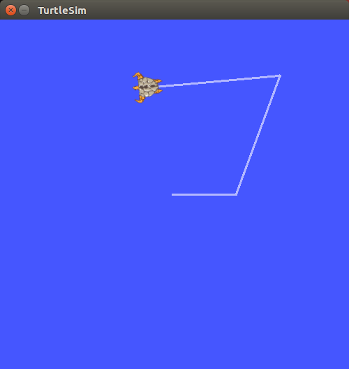

# multimaster_fkie


------

# multimaster_fkie 를 이용한 멀티 로봇 제어

**튜토리얼 레벨 :**  Intermediate(중급)

**이 튜토리얼 작성 환경 :**  catkin **/** Ubuntu 16.04 **/** Kinetic

**튜토리얼 목록 :** [README.md](../README.md)

**참고자료 :** <http://digital.csic.es/bitstream/10261/133333/1/ROS-systems.pdf>

------

## ROS Multi Master 환경

ROS 네트워크에서 MASTER는 `roscore` 가 실행되는 컴퓨터를 말한다. 일반적으로 단일 마스터( Single Master ) ROS 네트워크를 이용하지만, 다수의 로봇을 제어, 모바일 플랫폼, Manipulators 제어와 같이 각각의 `roscore` 노드가 실행 중인 복수의 ROS 네트워크를 가진 시스템의 경우 다중 마스터( Multi Master ) 환경이 요구된다. 이 같은 경우를 위해 ROS는 `mulrimaster_fkie` 라는 솔루션을 제공한다. 

멀티마스터( Multi Master )환경을 크게 두 가지로 분류해보면 **Single Computer ROS Network** 와 **Multiple Computer ROS Network** 로 구분할 수 있다.

- **Single Computer ROS Network**

  `roscore` 가 실행중인 복수의 컴퓨터로 이루어진 **단일컴퓨터 ROS 네크워크 환경**

  

- **Multiple Computer ROS Network**

  `roscore` 가 실행중인 복수의 컴퓨터가 각각의 서로 다른 ROS 네트워크에 속해 있는 **다중컴퓨터 ROS 네트워크 환경**

  

**이 문서에서는 Single computer ROS network 에서의 Multi-Master 환경 구현방법만을 알아볼 것이다.** Multiple computer ROS network 에서의 Multi-Master 구현방법은 문서 시작 부분의 [**참고자료**](./ROS-systems.pdf) 를 참조한다.


## Single computer ROS network 에서의 Multi Master 구현

앞서 언급한 바와 같이 ROS `multimaster_fkie` 패키지를 사용한다.


### 1. 설치

2대 이상의 PC를 준비하고, 각 PC에서 터미널을 열어 아래 명령을 실행하여 ROS `multimaster_fkie` 패키지를 설치한다.

```bash
$ sudo apt-get install ros-kinetic-multimaster-fkie
```


### 2. `multimaster_fkie` 패키지의 노드 및 그 기능

`multimaster_fkie` 패키지는 `master_discovery` 와 `master_sync` 2개의 노드를 제공한다. 각 노드의 기능은 다음과 같다. 

- **`master_discovery` 노드**
  - 각 로컬( Local ) 네트워크에서 실행중인 `ROS Master` 들이 서로의 존재를 인지할 수 있도록 공통 네트워크( Common Network )를 통해 주기적으로 멀티캐스트 메세지를 전파한다. 
  - 각 로컬의 `roscore` 에서 로컬 네트워크의 변경사항을 확인하고, 공통 네트워크의 다른 모든 `ROS Master` 에게 전파한다. 
- **`master_sync` 노드**
  - 다른 원격(Remote) `master_discovery` 노드로부터 제공받은 정보를 사용하여 원격 토픽 및 서비스를 로컬(Local) `roscore` 에 등록하고, 변경사항이 발생할 경우 그 변경사항을 반영(Update)한다. 
  - 동기화 또는 무시(Ignore)할 호스트(host), 토픽(Topic), 서비스(Service)들을 선택 구성한다. ( 기본적으로 모든 호스트의 모든 topic 와 service 가 동기화 되지만, 네트워크 대역폭 점유를 줄여야 할 경우 꼭 필요한 topic 과 service 만 동기화하여 사용할 수 있다. )

`master_sync` 노드는 원격 `topic` 또는 `service` 를 로컬 `roscore` 에 동기 시킬 뿐이다. 반대로 로컬 `topic` 과 `service` 를 원격 `roscore` 에 동기하려면 원격 `roscore` 는 자신의 `master_sync` 노드가 있어야만 한다.

`multimaster_fkie` 솔루션은 topic 과 service 만을 지원하지만 묵시적으로 action 또한 지원하는데, 이는 `action` 이 상위 5 개의 `topic` 으로 만들어지기 때문이다. 각 `roscore` 의 `parameter` 서버의 경우, 원격으로 접근할 수 없다.

표준 ROS 시스템에서 발생하는 것과 유사하게, `topic` , `service` 및 `action` 이 원격 ROS 서브 시스템에 등록되면 지점 간 소켓이 작성되어 둘 이상의 노드를 직접 연결하고 다중 Master 메커니즘 구성이 변경( 새 `publisher` / `subscriber` 가 나타나거나 기존 항목이 사라지는 등 )될 때까지 사용되지 않는다. 

이 multimaster 솔루션(`multimaster_fkie`)은 현재 ROS Hydro 이후 버전의 ROS 에서 모두 지원되지만  `catkin`프레임 워크에서만 지원된다.


### 3. `multimaster_fkie` 패키지 사용을 위한 네트워크 설정

다음 그림은 **단일 컴퓨터 ROS 네트워크 구성** 예이다. 이 후의 내용은 모두 이 사례를 기준으로 설명한 것임을 알려둔다. 


#### 3.1 개별 컴퓨터에서 수행할 작업

1. 각 PC의 호스트 이름과 IP 주소를 바인딩하기 위해 각 컴퓨터의  `/etc/hosts` 파일을 편집 
2. `export ROS_MASTER_URI` 설정을 `http://localhost:11311` 에서 `http://${IP_ADDRESS}: 11311` 또는 `http://${HOST_NAME}:11311` 로 변경


#####   1. PC1 ( turtle1 ROS network )

- **네트워크 구성 확인**

  ```bash
  $ ifconfig
  lo        Link encap:Local Loopback  
            inet addr:127.0.0.1  Mask:255.0.0.0
            inet6 addr: ::1/128 Scope:Host
            UP LOOPBACK RUNNING  MTU:65536  Metric:1
            RX packets:634 errors:0 dropped:0 overruns:0 frame:0
            TX packets:634 errors:0 dropped:0 overruns:0 carrier:0
            collisions:0 txqueuelen:1000 
            RX bytes:54995 (54.9 KB)  TX bytes:54995 (54.9 KB)
  
  wlan0     Link encap:Ethernet  HWaddr e4:42:a6:ed:ea:18  
            inet addr:172.16.91.42  Bcast:172.16.91.255  Mask:255.255.255.0
            inet6 addr: fe80::e642:a6ff:feed:ea18/64 Scope:Link
            UP BROADCAST RUNNING MULTICAST  MTU:1500  Metric:1
            RX packets:1688 errors:0 dropped:0 overruns:0 frame:0
            TX packets:7744 errors:0 dropped:0 overruns:0 carrier:0
            collisions:0 txqueuelen:1000 
            RX bytes:124568 (124.5 KB)  TX bytes:11507088 (11.5 MB)
  ```

- `/etc/hosts` 파일 편집 

  ```bash
  $ sudo nano /etc/hosts
  ```

  ```bash
  127.0.0.1	localhost
  127.0.1.1	turtle1
  
  172.16.91.48	turtle1
  172.16.91.37	turtle2
  
  # The following lines are desirable for IPv6 capable hosts
  ::1     ip6-localhost ip6-loopback
  fe00::0 ip6-localnet
  ff00::0 ip6-mcastprefix
  ff02::1 ip6-allnodes
  ff02::2 ip6-allrouters
  ```

- `~/.bashrc` 파일 편집

  ```bash
  $ gedit ~/.bashrc
  ```

  ```bash
  .
  .
  .
  # export ROS_MASTER_URI=http://localhost:11311
  # export ROS_HOSTNAME=localhost
  export ROS_MASTER_URI=http://172.16.91.48:11311
  export ROS_HOSTNAME=172.16.91.48
  .
  .
  .
  ```


#####   2. PC2 ( turtle2 ROS network )

- **네트워크 구성 확인**

  ```bash
  $ ifconfig
  lo        Link encap:Local Loopback  
            inet addr:127.0.0.1  Mask:255.0.0.0
            inet6 addr: ::1/128 Scope:Host
            UP LOOPBACK RUNNING  MTU:65536  Metric:1
            RX packets:675 errors:0 dropped:0 overruns:0 frame:0
            TX packets:675 errors:0 dropped:0 overruns:0 carrier:0
            collisions:0 txqueuelen:1000 
            RX bytes:53613 (53.6 KB)  TX bytes:53613 (53.6 KB)
  
  wlo1      Link encap:Ethernet  HWaddr d0:c6:37:f3:65:97  
            inet addr:172.16.91.37  Bcast:172.16.91.255  Mask:255.255.255.0
            inet6 addr: fe80::b8fd:bd62:e6ca:1760/64 Scope:Link
            UP BROADCAST RUNNING MULTICAST  MTU:1500  Metric:1
            RX packets:17802 errors:0 dropped:0 overruns:0 frame:0
            TX packets:4576 errors:0 dropped:0 overruns:0 carrier:0
            collisions:0 txqueuelen:1000 
            RX bytes:26556215 (26.5 MB)  TX bytes:467586 (467.5 KB)
  ```

- `/etc/hosts` 파일 편집 

  ```bash
  $ sudo nano /etc/hosts
  ```

  ```bash
  127.0.0.1	localhost
  127.0.1.1	turtle2
  
  172.16.91.37	turtle2
  172.16.91.48	turtle1
  
  # The following lines are desirable for IPv6 capable hosts
  ::1     ip6-localhost ip6-loopback
  fe00::0 ip6-localnet
  ff00::0 ip6-mcastprefix
  ff02::1 ip6-allnodes
  ff02::2 ip6-allrouters
  ```

- `~/.bashrc` 파일 편집

  ```bash
  $ gedit ~/.bashrc
  ```

  ```bash
  .
  .
  .
  # export ROS_MASTER_URI=http://localhost:11311
  # export ROS_HOSTNAME=localhost
  export ROS_MASTER_URI=http://172.16.91.37:11311
  export ROS_HOSTNAME=172.16.91.37
  .
  .
  .
  ```

  

#### 3.2 모든 컴퓨터에서 수행할 작업

**멀티캐스트( Multicast ) 활성화**

`multicast` 기능 활성화 여부 확인을 위해 다음 명령을 수행한다.

```bash
$ cat /proc/sys/net/ipv4/icmp_echo_ignore_broadcasts
```

위 명령의 수행 결과가 `0` 이면 `multicast` 기능이 활성화 되어있다는 의미이다.  결과가  `1` 이라면 `multicast` 기능을 활성화해 주어야 한다. 

다음 명령은 1회성으로 `multicast` 기능을 활성화 시킨다. 컴퓨터가 재시작되면 다시 명령을 수행해야 한다.

```bash
$ sudo sh -c "echo 0 > /proc/sys/net/ipv4/icmp_echo_ignore_broadcasts"
```

영구적인 `multicast` 기능 활성화를 위해서는 `/etc/sysctl.conf` 파일을 수정 편집해야 한다. 

```bash
$ sudo gedit /etc/sysctl.conf
```

파일 끝부분에 다음과 같이 내용을 추가한다. ( 내용 중 `#net.ipv4.icmp_echo_ignore_broadcasts = 0` 와 같은 행이 이미 존재한다면 `#` 을 지워 주석 해제 후 저장한다. )

```bash
.
.
.
net.ipv4.icmp_echo_ignore_broadcasts = 0
```

변경한 내용을 반영하기 위해 컴퓨터를 재시작하거나 또는 다음 명령을 실행한다.

```bash
$ sudo service procps restart
```


**멀티캐스트( Multicast ) 활성상태 확인**

컴퓨터에 어떤 멀티캐스트 그룹이 정의 되어 있는가를 알아보기 위해 다음 명령을 수행한다. 

```bash
$  ip maddr show
1:	lo
	inet  224.0.0.1
	inet6 ff02::1
	inet6 ff01::1
2:	wlan0
	link  01:00:5e:00:00:01 users 2
	link  33:33:00:00:00:01 users 2
	link  01:00:5e:00:00:fb users 2
	link  33:33:ff:ed:ea:18 users 2
	link  33:33:00:00:00:fb users 2
	inet  224.0.0.251 users 2
	inet  224.0.0.1
	inet6 ff02::fb
	inet6 ff02::1:ffed:ea18
	inet6 ff02::1
	inet6 ff01::1
```

이 명령은 모든 네트워크 인터페이스( 위 사례에서는 `lo` 와 `wlan0` )의 멀티 캐스트 주소( `IPv4` 및 `IPv6` )를 출력한다. 표준 멀티 캐스트 IP 주소 `224.0.0.1` 이 사용하는 인터페이스 이름에 대해 나타나야 한다. ( 위 사례의 `2:  wlan0` 하위의 `inet  224.0.0.1` )

이 시점에서 멀티 캐스트 기능이 작동 중인지 확인하려면 다음 명령을 실행한다.

```bash
$ ping 224.0.0.1
PING 224.0.0.1 (224.0.0.1) 56(84) bytes of data.
64 bytes from 172.16.91.48: icmp_seq=1 ttl=64 time=0.154 ms
64 bytes from 172.16.91.48: icmp_seq=2 ttl=64 time=0.087 ms
64 bytes from 172.16.91.48: icmp_seq=3 ttl=64 time=0.088 ms
64 bytes from 172.16.91.48: icmp_seq=4 ttl=64 time=0.089 ms
64 bytes from 172.16.91.48: icmp_seq=5 ttl=64 time=0.071 ms
64 bytes from 172.16.91.48: icmp_seq=6 ttl=64 time=0.072 ms
64 bytes from 172.16.91.48: icmp_seq=7 ttl=64 time=0.082 ms
64 bytes from 172.16.91.48: icmp_seq=8 ttl=64 time=0.079 ms
64 bytes from 172.16.91.48: icmp_seq=9 ttl=64 time=0.079 ms
```


#### 3.3 테스트

`multimaster_fkie` 노드를 구동함으로써 그 사용법을 알아보자.

각 컴퓨터에서 `roscore` 를 구동한다. 

```bash
$ roscore
```

각 컴퓨터에사 `master_discovery` 노드를 `mcast_group`( 사용할 멀티캐스트 주소를 지정 인수 ) `argument` 를 지정( `224.0.0.1` )하여 구동한다.  ( 아래는 PC1 에서 실행한 화면 출력 내용이다.  )

```bash
$ rosrun master_discovery_fkie master_discovery _mcast_group:=224.0.0.1
[INFO] [1621412189.361402]: ROS Master URI: http://172.16.91.48:11311
[INFO] [1621412189.390417]: Check the ROS Master[Hz]: 1
[INFO] [1621412189.391093]: Heart beat [Hz]: 0.02
[INFO] [1621412189.391530]: Active request after [sec]: 60
[INFO] [1621412189.391935]: Remove after [sec]: 300
[INFO] [1621412189.392362]: Robot hosts: []
[INFO] [1621412189.392894]: Approx. mininum avg. network load: 1.36 bytes/s
[INFO] [1621412189.408764]: Start RPC-XML Server at ('0.0.0.0', 11611)
[INFO] [1621412189.409931]: Subscribe to parameter `/roslaunch/uris`
[INFO] [1621412189.420657]: + Bind to specified unicast socket @(172.16.91.48:11511)
[INFO] [1621412189.421406]: Create multicast socket at ('224.0.0.1', 11511)
[INFO] [1621412189.651291]: Detected master discovery: http://localhost:11611
[INFO] [1621412189.759488]: Added master with ROS_MASTER_URI=http://172.16.91.48:11311/
[INFO] [1621412190.631024]: Detected master discovery: http://172.16.91.37:11611
[INFO] [1621412190.796836]: Added master with ROS_MASTER_URI=http://172.16.91.37:11311/
```

이제 각 컴퓨터에서 `master_sync` 노드를 실행한다. 실행 시 추가 `arguments` 가 없으면 모든 컴퓨터의 모든 항목과
`service` 가 다른 컴퓨터와 동기화된다. ( 아래는 PC1 에서 실행한 화면 출력 내용이다.  )

```bash
$ rosrun master_sync_fkie master_sync
[INFO] [1621412203.905942]: ignore_hosts: []
[INFO] [1621412203.909406]: sync_hosts: []
[INFO] [1621412203.913053]: sync_topics_on_demand: False
[INFO] [1621412203.916264]: resync_on_reconnect: True
[INFO] [1621412203.919784]: resync_on_reconnect_timeout: 0
[INFO] [1621412203.934250]: listen for updates on /master_discovery/changes
[INFO] [1621412203.954166]: ROS masters obtained from '/master_discovery/list_masters': ['172.16.91.37', '172.16.91.48']
[INFO] [1621412203.958642]: [172.16.91.37] ignore_nodes: ['/master_sync', '/node_manager', '/master_discovery', '/rosout', '/zeroconf']
[INFO] [1621412203.961102]: [172.16.91.37] sync_nodes: []
[INFO] [1621412203.963101]: [172.16.91.37] ignore_topics: ['/rosout', '/rosout_agg']
[INFO] [1621412203.965188]: [172.16.91.37] sync_topics: []
[INFO] [1621412203.967385]: [172.16.91.37] ignore_services: ['/*get_loggers', '/*set_logger_level']
[INFO] [1621412203.969740]: [172.16.91.37] sync_services: []
[INFO] [1621412203.972000]: [172.16.91.37] ignore_type: ['bond/Status']
[INFO] [1621412203.974257]: [172.16.91.37] ignore_publishers: []
[INFO] [1621412203.976114]: [172.16.91.37] ignore_subscribers: []
[INFO] [1621412204.200142]: SyncThread[172.16.91.37] Requesting remote state from 'http://172.16.91.37:11611'
[INFO] [1621412204.212105]: SyncThread[172.16.91.37] Applying remote state...
[INFO] [1621412204.216695]: SyncThread[172.16.91.37] remote state applied.
```

각 컴퓨터 에서 동일한 공통 네트워크에서 `master_discovery` 노드를 실행하는 다른 컴퓨터 가 자동으로 감지되고
이들 간의 타임 스탬프 차이가 보고된다. 

위의 `master_discovery` 및 `master_sync`  노드의 화면 출력을 보면 현재 2대의 `ROS Master` 가 동작 중임을 알 수 있다. `rosservice` 명령을 통해 이를 확인할 수 있다. 

```bash
$ rosservice call /master_discovery/list_masters 
masters: 
  - 
    name: "172.16.91.37"
    uri: "http://172.16.91.37:11311/"
    timestamp: 1621414497.05
    timestamp_local: 1621414497.05
    online: True
    discoverer_name: "/master_discovery"
    monitoruri: "http://172.16.91.37:11611"
  - 
    name: "172.16.91.48"
    uri: "http://172.16.91.48:11311/"
    timestamp: 1621414498.42
    timestamp_local: 1621414498.42
    online: True
    discoverer_name: "/master_discovery"
    monitoruri: "http://localhost:11611
```

한 컴퓨터( `PC1` )에서 다음 명령으로 `topic` 을 `publish` 하고, 

```bash
$ rostopic pub -r 1 /test std_msgs/Int32 1
```

다른 컴퓨터( `PC2` )에서 해당 `topic` 을 `rostopic list` 로 확인 후,

```bash
$ rostopic list
/master_discovery/changes
/master_discovery/linkstats
/rosout
/rosout_agg
/test
```

 `rostopic echo` 시켜보자. 

```bash
$ rostopic echo /test
data: 1
---
data: 1
---
data: 1
---
data: 1
---
```


### 4. turtlesim_node 를 이용한 multimaster 테스트

`PC1`, `PC2` 에서 각각 `roscore` 와  `master_discovery` ,  `master_sync` 노드를 실행한 후, `turtlesim_node` 를 실행 후, 두 컴퓨터의 `turtlesim_node` 를 동시에 제어하는 `fkie_teleop_turtles.py` 를 작성하여, 동시에 2마리의 거북이를 제어하므로서 `multimaster_fkie` 패키지를 이용한 `multimaster` 환경을 테스트해보자. 이 작업이 성공하면 각 PC에 연결된 `Turtlebot3` 또는 `Parrot Bebop` 드론에도 똑같이 적용할 수 있다. 


**2대의 PC에서 각각 `turtlesim_node` 실행**

**`PC1` , `PC2`**

```bash
$ roscore
```

**`PC1` , `PC2`**

```bash
$ rosrun master_discovery_fkie master_discovery __mcast_group:=224.0.0.1
```

**`PC1` , `PC2`**

```bash
$ rosrun master_sync_fkie master_sync
```

**`PC1`**

```bash
$ rosrun turtlesim turtlesim_node __ns:=pc1
```

**`PC2`**

```bash
$ rosrun turtlesim turtlesim_node __ns:=pc2
```

**`PC1` or `PC2`** 

```bash
$ rostopic list
/master_discovery/changes
/master_discovery/linkstats
/pc1/turtle1/cmd_vel
/pc1/turtle1/color_sensor
/pc1/turtle1/pose
/pc2/turtle1/cmd_vel
/pc2/turtle1/color_sensor
/pc2/turtle1/pose
/rosout
/rosout_agg
```


**2대의 PC에서 각각 실행한 `turtlesim_node` 동시 제어 노드패키지 작성**

**`PC1` or `PC2`** 

`PC1` 의 거북이와 `PC2` 의 거북이를 동시에 키보드로 제어하는 노드 패키지를 만들기위해 작업경로를 `~/catkin_ws/src` 로 변경한다.  

```bash
$ cd ~/catkin_ws/src
```
`catkin_create_pkg` 명령으로 `rospy` 와 `geometry_msgs` 에 대해 의존성을 갖는 `fkie_app` 노드 패키지 작성.
```bash
$ cd catkin_create_pkg fkie_app rospy geometry_msgs
```
생성된 `fkie_app` 패키지 폴더로 작업경로 변경
```bash
$ cd fkie_app
```
`gedit` 으로 `setup.py` 파일 작성
```bash
$ gedit setup.py &
```
다음과 같이 `setup.py` 를 작성 후, 저장한다. 
```python
from distutils.core import setup
from catkin_pkg.python_setup import generate_distutils_setup

setup_args = generate_distutils_setup(
    packages=['fkie_app'],
    package_dir={'': 'src'},
)

setup(**setup_args)
```

패키지 생성시 만들어져 있는 `src` 하위에 `fkie_app` 폴더를 생성한다.


```bash
$ mkdir ./src/fkie_app
```

생성된 `src/fkie_app` 폴더에 `__init__.py` 파일을 만든다. 

```bash
$ touch ./src/fkie_app/__init__.py
```

생성된 `src/fkie_app` 폴더에 `GetChar.py` 파일을 만든다. 

```bash
$ touch ./src/fkie_app/GetChar.py
```

`gedit` 으로 `src/fkie_app/GetChar.py` 파일을 편집한다.

```bash
$ gedit ./src/fkie_app/GetChar.py &
```

다음 내용으로 `GetChar.py` 를 편집 후, 저장

```python
#!/usr/bin/env python
 
import os, time, sys, termios, atexit, tty
from select import select
  
# class for checking keyboard input
class GetChar:
    def __init__(self):
        # Save the terminal settings
        self.fd = sys.stdin.fileno()
        self.new_term = termios.tcgetattr(self.fd)
        self.old_term = termios.tcgetattr(self.fd)
  
        # New terminal setting unbuffered
        self.new_term[3] = (self.new_term[3] & ~termios.ICANON & ~termios.ECHO)
        termios.tcsetattr(self.fd, termios.TCSAFLUSH, self.new_term)
  
        # Support normal-terminal reset at exit
        atexit.register(self.set_normal_term)
      
      
    def set_normal_term(self):
        termios.tcsetattr(self.fd, termios.TCSAFLUSH, self.old_term)
  
    def getch(self):        # get 1 byte from stdin
        """ Returns a keyboard character after getch() has been called """
        return sys.stdin.read(1)
  
    def chk_stdin(self):    # check keyboard input
        """ Returns True if keyboard character was hit, False otherwise. """
        dr, dw, de = select([sys.stdin], [], [], 0)
        return dr
```

`scripts` 폴더 생성

```bash
$ mkdir ./scripts
```

`./scripts` 폴더 안에 `fkie_teleop_turtles.py` 파일 생성


```bash
$ touch ./scripts/fkie_teleop_turtles.py
```

`./scripts` 폴더 안에 만들어진 `fkie_teleop_turtles.py` 파일에 실행속성 부여


```bash
$ chmod +x ./scripts/fkie_teleop_turtles.py
```

`gedit` 으로 `./scripts/fkie_teleop_turtles.py` 파일 편집

```bash
$ gedit ./scripts/fkie_teleop_turtles.py &
```

다음 내용으로 `fkie_teleop_turtles.py` 를 편집 후, 저장


```python
#!/usr/bin/env python
import rospy
from geometry_msgs.msg import Twist
from my_pkg.GetChar import GetChar

msg = """
---------------------------------------
              (forward)
                 'w'

  (left)'a'      's'       'd'(right)
              (backward)
---------------------------------------
type 'Q' for quit program..."""

if __name__ == '__main__':
    rospy.init_node('remote_multi_turtles')    
    pb1   = rospy.Publisher('pc1/turtle1/cmd_vel', Twist, queue_size=10)
    pb2   = rospy.Publisher('pc2/turtle1/cmd_vel', Twist, queue_size=10)
    tw    = Twist()
    rate  = rospy.Rate(10)
    kb    = GetChar()
    count = 0
    ch    = 0
    print msg

    while not rospy.is_shutdown():
        ch = kb.getch()

        if   ch == 'w':
            tw.linear.x  =  2.0;    print "forward"
        elif ch == 's': 
            tw.linear.x  = -2.0;    print "backward"
        elif ch == 'a':
            tw.angular.z =  2.0;    print "turn left"
        elif ch == 'd':
            tw.angular.z = -2.0;    print "turn right"
        elif ch == 'Q':     break
        else:               pass

        pb1.publish(tw);    pb2.publish(tw)
        tw.linear.x  =  tw.angular.z = 0.0

        count = count + 1
        if count == 20:
            count = 0
            print msg

        rate.sleep()
```

`gedit` 으로 `CMakeList.txt` 파일 편집


```bash
$ mkdir CMakeList.txt
```

아래와 같이 22번 행의 주석 해제 후 저장


```bash
## Uncomment this if the package has a setup.py. This macro ensures
## modules and global scripts declared therein get installed
## See http://ros.org/doc/api/catkin/html/user_guide/setup_dot_py.html
catkin_python_setup()  # <-------------- 22번째 줄, 첫 칸의 `#` 제거

################################################
## Declare ROS messages, services and actions ##
################################################
```

패키지 빌드를 위해 작업경로를 `~/catkin_ws` 로 변경


```bash
$ cd ~/catkin_ws
```

패키지 빌드


```bash
$ catkin_make
```

빌드된 패키지 정보 반영


```bash
$ source ./devel/setup.bash
```


**`turtlesim_node` 동시 제어 노드 구동을 통한 multimaster 테스트**

새로 빌드한 `fkie_app` 패키지의 `fkie_teleop_turtles.py` 노드 구동


```bash
$ rosrun fkie_app fkie_teleop_turtles.py
---------------------------------------
              (forward)
                 'w'

  (left)'a'      's'       'd'(right)
              (backward)
---------------------------------------
type 'Q' for quit program...
```

`w` ,  `s` ,  `a` ,  `d` 키를 이용하여 `PC1` ,  `PC2` 의 거북이가 아래 그림과 같이, 동시에 똑같이 제어되는 것을 확인한다. 

 


