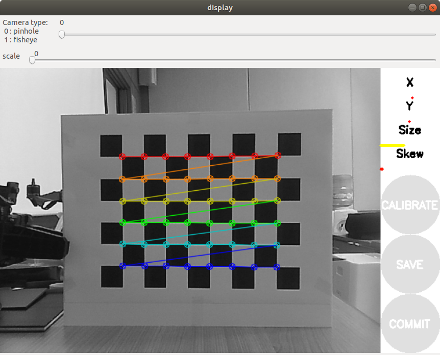
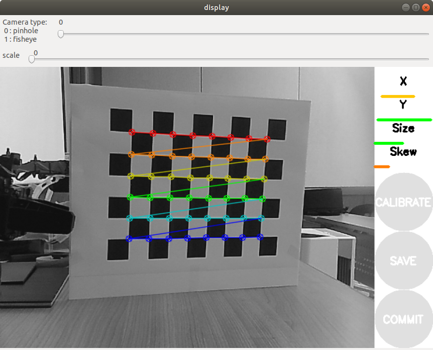
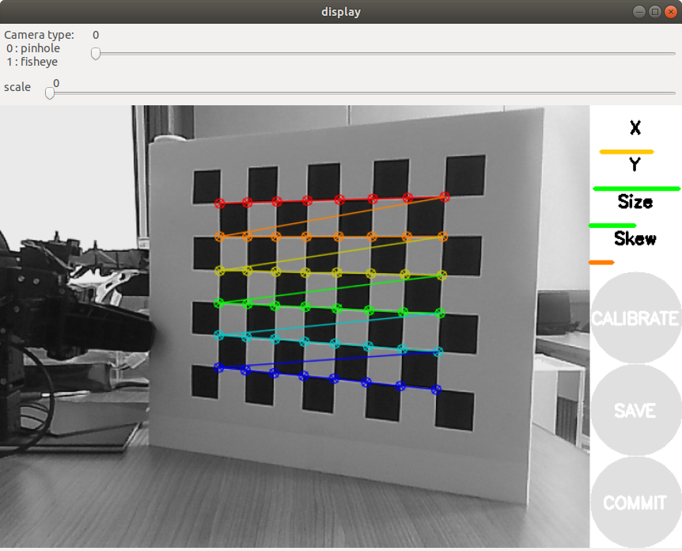
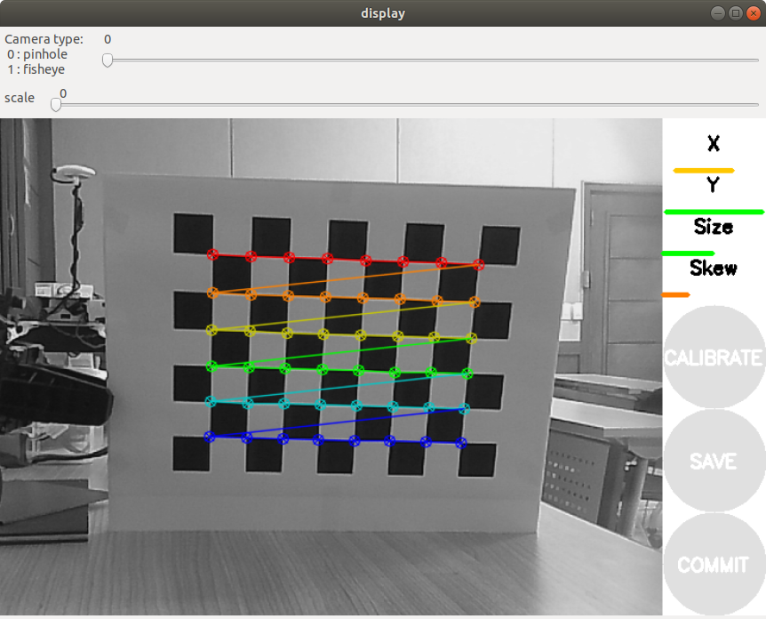
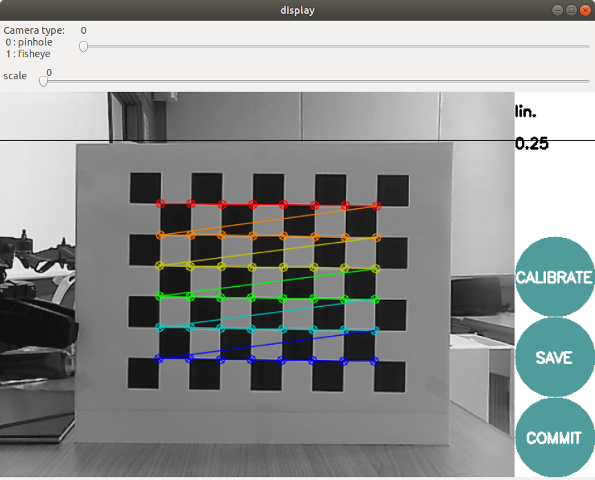

## camera_calibration/Tutorial/MonocularCalibration


## Monocular Camera Calibration

**출처 :** <http://wiki.ros.org/camera_calibration/Tutorials/MonocularCalibration> 

**튜토리얼 레벨 :**  beginner(초급)

**이 튜토리얼 작성 환경 :**  catkin **/** Ubuntu 16.04 **/** Kinetic

**튜토리얼 목록 :** [README.md](../README.md) 

------

이 튜토리얼은 `camera_calibration` 패키지의 `calibrator.py` 노드를 이용하여 `image_raw` 토픽을 발행하고 있는`Monocular Camera` ( `Stereo Camera` 가 아닌 )를 calibrate 하는 방법을 알아본다.


### 1. 시작 전 준비

[**checkerboard**](http://wiki.ros.org/camera_calibration/Tutorials/MonocularCalibration?action=AttachFile&do=view&target=check-108.pdf) 

- 이 문서의 [출처](http://wiki.ros.org/camera_calibration/Tutorials/MonocularCalibration)인 원래의 영문 튜토리얼에서는 가로의 길이가 1(m)가 넘는 체커보드를 이용하여 Calibration을 진행하지만 이 문서에서는 A4 용지에 출력한 체커보드를 이용한다. 출력한 체커보드
- Calibration 에 사용되는 체커보드는 `9x8` 의 체크무늬를 가지고 있지만 흑, 백의 사각형의 교차점의 개 수 `8x6` 체커보드라고 말한다. 
- 체크무늬를 구성하는 정사각형의 한변의 길이를 측정한다. 측정 결과는 2.45(cm) = 0.0245(m) 이었다.
- 체커보드를 이용한 Calibration 을 시작하기 전에 Calibration 이 필요한 해당 카메라를 이용한 `image_raw` 토픽이 `ROS` 네트워크에 발행 중이어야 한다.


### 2. 의존성 설치 및 카메라 구동

`camera_calibration` `ROS` 노드 패키지 구동에 필요한 의존성 설치

```bash
$ rosdep install camera_calibration
```

`roscore` 구동

```bash
$ roscore
```

`uvc_camera_node` 구동

```bash
$ rosrun uvc_camera uvc_camera_node
```

아래 내용은 `uvc_camera_node` 구동 시 출력된 메세지이다.

`camera calibration URL` 기본 경로가 `file:///home/user01/.ros/camera_info/camera.yaml` 인데, 해당 파일이 존재하지 않아 열 수 없다는 메세지와 경고가 4 ~ 7 행에,  출력된 것을 볼 수 있다. `camera calibration` 작업의 목적은 결국 제대로 된 `~/.ros/camera_info/camera.yaml` 파일을 만드는 것이다. 

```bash
[ INFO] [1622265487.419362823]: using default calibration URL
[ INFO] [1622265487.419984028]: camera calibration URL: file:///home/user01/.ros/camera_info/camera.yaml
[ INFO] [1622265487.420032830]: Unable to open camera calibration file [/home/user01/.ros/camera_info/camera.yaml]
[ WARN] [1622265487.420050872]: Camera calibration file /home/user01/.ros/camera_info/camera.yaml not found.
opening /dev/video0
pixfmt 0 = 'YUYV' desc = 'YUYV 4:2:2'
  discrete: 640x480:   1/30 1/15 
  discrete: 1280x960:   1/6 
  discrete: 352x288:   1/30 1/15 
  discrete: 320x240:   1/30 1/15 
  discrete: 176x144:   1/30 1/15 
  discrete: 160x120:   1/30 1/15 
  discrete: 800x600:   1/15 
pixfmt 1 = 'MJPG' desc = 'Motion-JPEG'
  discrete: 640x480:   1/30 1/15 
  discrete: 1280x960:   1/15 
  discrete: 352x288:   1/30 1/15 
  discrete: 320x240:   1/30 1/15 
  discrete: 176x144:   1/30 1/15 
  discrete: 160x120:   1/30 1/15 
  discrete: 800x600:   1/30 1/15 
  int (Brightness, 0, id = 980900): -64 to 64 (1)
  int (Contrast, 0, id = 980901): 0 to 30 (1)
  int (Saturation, 0, id = 980902): 0 to 127 (1)
  int (Hue, 0, id = 980903): -16000 to 16000 (1)
  bool (White Balance Temperature, Auto, 0, id = 98090c): 0 to 1 (1)
  int (Gamma, 0, id = 980910): 20 to 250 (1)
  menu (Power Line Frequency, 0, id = 980918): 0 to 2 (1)
    0: Disabled
    1: 50 Hz
    2: 60 Hz
  int (White Balance Temperature, 16, id = 98091a): 2800 to 6500 (1)
  int (Sharpness, 0, id = 98091b): 0 to 100 (1)
  int (Backlight Compensation, 0, id = 98091c): 0 to 1 (1)
  
```

카메라 관련 토픽 확인

```bash
$ rostopic list
/camera_info  
/image_raw
   .
   .
   .
```


### 3. Calibration 노드 구동

`cameracalibrator.py` 노드는 calibration 이 필요한 카메라가 발행하는 이미지 토픽을 load 해야한다. ( 이 전 단계에서  `rostopic list` 명령 수행 시 확인된 토픽명은 `/image_raw` 이었다. )

`cameracalibrator.py` 노드 구동

```bash
$ rosrun camera_calibration cameracalibrator.py --size 8x6 --square 0.0245 image:=/image_raw camera:=/
```

- --size : 체커보드 가로, 세로 교차점의 개 수

- --square : 체커보드 정사각형의 길이를 (m) 로 기입 

- image : 카메라 이미지 토픽명

- camera : 카메라 토픽들의 `name space`

  위( `uvc_camear_node` 의 경우 따로 `name space` 가 적용되지 않았기 때문에 ` / ` 만 적어주었다.

  아래의 경우는 `/usb_cam` 이 ,
  
  ```
  $ rostopic list
  /usb_cam/image_raw
  /usb_cam/camera_info
     .
     .
     .
  ```

  다음의 경우 `/bebop` 이 네임 스페이스에 해당한다. 
  
  ```
  $ rostopic list
  /bebop/image_raw
  /bebop/camera_info
     .
     .
     .
  ```

`cameracalibrator.py` 노드가 구동되면 다음과 같은 카메라 칼리브레이션 화면이 나타나고



아래 메세지와 함께 첫 번째 `sample` 추가된 후, 

```bash
Waiting for service //set_camera_info ...
OK
*** Added sample 1, p_x = 0.534, p_y = 0.482, p_size = 0.398, skew = 0.036
```

`checkerboard` 를 이리 저리 움직임에 따라 

  

  

`sample` 이 계속 추가된다. 

```bash
*** Added sample 2, p_x = 0.675, p_y = 0.434, p_size = 0.404, skew = 0.048
*** Added sample 3, p_x = 0.383, p_y = 0.481, p_size = 0.346, skew = 0.026
*** Added sample 4, p_x = 0.433, p_y = 0.333, p_size = 0.348, skew = 0.044
*** Added sample 5, p_x = 0.604, p_y = 0.324, p_size = 0.352, skew = 0.072
*** Added sample 6, p_x = 0.631, p_y = 0.513, p_size = 0.340, skew = 0.062
*** Added sample 7, p_x = 0.510, p_y = 0.593, p_size = 0.336, skew = 0.029
*** Added sample 8, p_x = 0.413, p_y = 0.684, p_size = 0.337, skew = 0.016
*** Added sample 9, p_x = 0.246, p_y = 0.640, p_size = 0.342, skew = 0.019
*** Added sample 10, p_x = 0.126, p_y = 0.726, p_size = 0.362, skew = 0.013
*** Added sample 11, p_x = 0.236, p_y = 0.779, p_size = 0.366, skew = 0.079
*** Added sample 12, p_x = 0.559, p_y = 0.051, p_size = 0.377, skew = 0.056
*** Added sample 13, p_x = 0.449, p_y = 0.120, p_size = 0.372, skew = 0.028
*** Added sample 14, p_x = 0.381, p_y = 0.208, p_size = 0.365, skew = 0.076
*** Added sample 15, p_x = 0.306, p_y = 0.152, p_size = 0.365, skew = 0.005
*** Added sample 16, p_x = 0.550, p_y = 0.228, p_size = 0.412, skew = 0.066
*** Added sample 17, p_x = 0.412, p_y = 0.863, p_size = 0.396, skew = 0.015
*** Added sample 18, p_x = 0.359, p_y = 0.380, p_size = 0.397, skew = 0.001
*** Added sample 19, p_x = 0.516, p_y = 0.714, p_size = 0.391, skew = 0.001
*** Added sample 20, p_x = 0.264, p_y = 0.288, p_size = 0.422, skew = 0.013
*** Added sample 21, p_x = 0.464, p_y = 0.278, p_size = 0.433, skew = 0.002
*** Added sample 22, p_x = 0.580, p_y = 0.625, p_size = 0.431, skew = 0.015
*** Added sample 23, p_x = 0.575, p_y = 0.836, p_size = 0.427, skew = 0.008
*** Added sample 24, p_x = 0.436, p_y = 0.566, p_size = 0.413, skew = 0.005
*** Added sample 25, p_x = 0.582, p_y = 0.411, p_size = 0.425, skew = 0.114
*** Added sample 26, p_x = 0.549, p_y = 0.861, p_size = 0.305, skew = 0.047
*** Added sample 27, p_x = 0.574, p_y = 0.441, p_size = 0.290, skew = 0.004
*** Added sample 28, p_x = 0.571, p_y = 0.689, p_size = 0.284, skew = 0.027
*** Added sample 29, p_x = 0.667, p_y = 0.286, p_size = 0.456, skew = 0.066
*** Added sample 30, p_x = 0.471, p_y = 0.960, p_size = 0.435, skew = 0.008
*** Added sample 31, p_x = 0.501, p_y = 0.390, p_size = 0.470, skew = 0.026
*** Added sample 32, p_x = 0.502, p_y = 0.140, p_size = 0.485, skew = 0.047
*** Added sample 33, p_x = 0.568, p_y = 0.417, p_size = 0.370, skew = 0.245
*** Added sample 34, p_x = 0.515, p_y = 0.375, p_size = 0.344, skew = 0.132
*** Added sample 35, p_x = 0.517, p_y = 0.284, p_size = 0.445, skew = 0.158
*** Added sample 36, p_x = 0.576, p_y = 0.168, p_size = 0.396, skew = 0.182
*** Added sample 37, p_x = 0.603, p_y = 0.031, p_size = 0.425, skew = 0.201
*** Added sample 38, p_x = 0.231, p_y = 0.452, p_size = 0.394, skew = 0.004
*** Added sample 39, p_x = 0.800, p_y = 0.096, p_size = 0.399, skew = 0.126
*** Added sample 40, p_x = 0.775, p_y = 0.358, p_size = 0.391, skew = 0.032
*** Added sample 41, p_x = 0.857, p_y = 0.467, p_size = 0.423, skew = 0.000
```

충분한 `sample` 이 추가되고 나면 카메라 칼리브레이션 화면이 멈추고 `CALIBRATE` 버튼이 활성화된다. 


활성화된 `CALIBRATE` 버튼을 클릭하면 아래 메세지와 함께 카메라 칼리브레이션 화면이 검게 변하기를 반복한다.

```bash
**** Calibrating ****
```

카메라 칼리브레이션이 완료되면 그 결과가 터미널 창에 출력되고,

```bash
D = [0.3144991978980468, -1.5989806127391157, 0.0055451285156754, -0.007943943540312852, 0.0]
K = [916.657411627527, 0.0, 272.1155185992783, 0.0, 916.010169034029, 262.7070115316001, 0.0, 0.0, 1.0]
R = [1.0, 0.0, 0.0, 0.0, 1.0, 0.0, 0.0, 0.0, 1.0]
P = [925.9728393554688, 0.0, 268.2554919679733, 0.0, 0.0, 931.9431762695312, 264.01520836573036, 0.0, 0.0, 0.0, 1.0, 0.0]
None
# oST version 5.0 parameters


[image]

width
640

height
480

[narrow_stereo]

camera matrix
916.657412 0.000000 272.115519
0.000000 916.010169 262.707012
0.000000 0.000000 1.000000

distortion
0.314499 -1.598981 0.005545 -0.007944 0.000000

rectification
1.000000 0.000000 0.000000
0.000000 1.000000 0.000000
0.000000 0.000000 1.000000

projection
925.972839 0.000000 268.255492 0.000000
0.000000 931.943176 264.015208 0.000000
0.000000 0.000000 1.000000 0.000000

```

다음 그림과 같이 카메라 칼리브레이션 화면에 `SAVE` ,  `COMMIT` 버튼까지 활성화 된 것을 볼 수 있다.



이 때 `SAVE` 버튼을 클릭하면 다음 메세지가 출력되면서 카메라 칼리브레이션 결과가 `/tmp/calibrationdata.tar.gz` 파일로 저장된다. 

```bash
('Wrote calibration data to', '/tmp/calibrationdata.tar.gz')
```

`COMMIT` 버튼을 클릭하면 최종결과의 화면 출력과 동시에 그 결과를 `~/.ros/camera_info/camera.yaml` 에 기록 후  카메라 칼리브레이션이 종료된다. 

```bash
D = [0.3144991978980468, -1.5989806127391157, 0.0055451285156754, -0.007943943540312852, 0.0]
K = [916.657411627527, 0.0, 272.1155185992783, 0.0, 916.010169034029, 262.7070115316001, 0.0, 0.0, 1.0]
R = [1.0, 0.0, 0.0, 0.0, 1.0, 0.0, 0.0, 0.0, 1.0]
P = [925.9728393554688, 0.0, 268.2554919679733, 0.0, 0.0, 931.9431762695312, 264.01520836573036, 0.0, 0.0, 0.0, 1.0, 0.0]
# oST version 5.0 parameters


[image]

width
640

height
480

[narrow_stereo]

camera matrix
916.657412 0.000000 272.115519
0.000000 916.010169 262.707012
0.000000 0.000000 1.000000

distortion
0.314499 -1.598981 0.005545 -0.007944 0.000000

rectification
1.000000 0.000000 0.000000
0.000000 1.000000 0.000000
0.000000 0.000000 1.000000

projection
925.972839 0.000000 268.255492 0.000000
0.000000 931.943176 264.015208 0.000000
0.000000 0.000000 1.000000 0.000000

```

`gedit` 으로 `~/.ros/camera_info/camera.yaml` 파일을 열어 화면에 출력된 최종결과와 비교해보자.

```bash
$ gedit ~/.ros/camera_info/camera.yaml
```

```yaml
image_width: 640
image_height: 480
camera_name: camera
camera_matrix:
  rows: 3
  cols: 3
  data: [885.1539189634087, 0, 263.1519416114306, 0, 884.0249681920377, 271.9336808885551, 0, 0, 1]
distortion_model: plumb_bob
distortion_coefficients:
  rows: 1
  cols: 5
  data: [0.1787951805159445, -0.5381009491987961, 0.001860106017531674, -0.01248581488854411, 0]
rectification_matrix:
  rows: 3
  cols: 3
  data: [1, 0, 0, 0, 1, 0, 0, 0, 1]
projection_matrix:
  rows: 3
  cols: 4
  data: [894.7117309570312, 0, 258.6353957601023, 0, 0, 902.9822998046875, 272.3630170296092, 0, 0, 0, 1, 0]
```

이 PC에서 카메라를 사용하는 ROS 노드를 구동할 경우 이 파일을 참조하여 구동된다. 따라서 다른 카메라를 사용할 경우가 있다면 이 파일을 백업하고, 새로운 카메라에 대한 칼리브레이션을 수행하여 그 결과가 반영된 새로운 `camera.yaml` 을 사용해야 한다. 이 역시 백업해 두고, 경우마다 알맞은 `camera.yaml` 파일을 `~/.ros/camera_info` 폴더에 복사하여 사용해야 한다.  

`uvc_camera_node` 를 종료 후, 재시작 시켜 `camera calibration` 에 관련된 어떤 에러, 또는 경고가 화면에 출력 되지 않는 것을 확인한다.  


이 후 내용은 건너 띄어도 상관없다. 

### 4. `/tmp/calibration.tar.gz` 를 이용한 `camera.yaml` 생성 

이미 앞의 **3장**에서 **카메라 칼리브레이션**은 완료된 것이다. 이 **4장**의 내용은 **카메라 칼리브레이션** 과정에서 저장된 `/tmp/calibrationdata.tar.gz` 파일을 활용하는 방법에 대한 설명이다. 

`/tmp` 폴더는 임시 파일들이 저장되는 폴더로 그 안의 폴더나 파일들은 `sudo` 명령 없이도 읽기, 쓰기가 가능하다. 하지만 시스템이 종료 또는 재시작되면 모든 내용이 삭제된다. 

`/tmp/calibrationdata.tar.gz` 파일의 압축을 해제하면, 카메라 칼리브레이션 중 `add` 했던 `sample` 파일들과 `ost.txt` ,  `ost.yaml` 파일이 나온다. 

```bash
$ cd /tmp
$ $ tar -xvzf ../calibrationdata.tar.gz
$ ls 
left-0000.png  left-0009.png  left-0018.png  left-0027.png  left-0036.png
left-0001.png  left-0010.png  left-0019.png  left-0028.png  left-0037.png
left-0002.png  left-0011.png  left-0020.png  left-0029.png  left-0038.png
left-0003.png  left-0012.png  left-0021.png  left-0030.png  left-0039.png
left-0004.png  left-0013.png  left-0022.png  left-0031.png  left-0040.png
left-0005.png  left-0014.png  left-0023.png  left-0032.png  left-0041.png
left-0006.png  left-0015.png  left-0024.png  left-0033.png  ost.txt
left-0007.png  left-0016.png  left-0025.png  left-0034.png  ost.yaml
left-0008.png  left-0017.png  left-0026.png  left-0035.png
```


#### 4.1 `ost.yaml` 이용하기

`gedit` 으로 `ost.yaml` 파일을 연다.

```bash
$ gedit ost.yaml &
```

아래 내용 중`camera_name: narrow_stereo` 를 `camera_name: camera` 로 변경 후 저장한다. 

```yaml
image_width: 640
image_height: 480
camera_name: narrow_stereo # <---- change 'narrow_stereo' to 'camera'
camera_matrix:
  rows: 3
  cols: 3
  data: [885.153919, 0, 263.151942, 0, 884.0249679999999, 271.933681, 0, 0, 1]
distortion_model: plumb_bob
distortion_coefficients:
  rows: 1
  cols: 5
  data: [0.178795, -0.5381009999999999, 0.00186, -0.012486, 0]
rectification_matrix:
  rows: 3
  cols: 3
  data: [1, 0, 0, 0, 1, 0, 0, 0, 1]
projection_matrix:
  rows: 3
  cols: 4
  data: [894.711731, 0, 258.635396, 0, 0, 902.9823, 272.363017, 0, 0, 0, 1, 0]
```

수정 완료한 `ost.yaml` 을 반영하기 위해 `~/.ros/camera_info/camera.yaml` 으로 복사한다.

```bash
$ cp ost.yaml ~/.ros/camera_info/camera.yaml
```


#### 4.2 `ost.txt` 이용하기

`gedit` 으로 `ost.yaml` 파일을 연다.

```bash
$ gedit ost.txt &
```

아래 내용 중`[narrow_stereo]` 를 `[camera]` 로 변경 후 저장한다. 

```
# oST version 5.0 parameters


[image]

width
640

height
480

[narrow_stereo]  <--- change '[narrow_stereo]' to '[camera]'

camera matrix
885.153919 0.000000 263.151942
0.000000 884.024968 271.933681
0.000000 0.000000 1.000000

distortion
0.178795 -0.538101 0.001860 -0.012486 0.000000

rectification
1.000000 0.000000 0.000000
0.000000 1.000000 0.000000
0.000000 0.000000 1.000000

projection
894.711731 0.000000 258.635396 0.000000
0.000000 902.982300 272.363017 0.000000
0.000000 0.000000 1.000000 0.000000
```

`ost.txt` 파일을 `ost.ini` 로 파일명을 변경한다. 

```
$ mv ost.txt ost.ini
```

`camera_calibration_parsers` 패키지의 `convert` 노드를 이용하여 `camera.yaml` 생성

```
$rosrun camera_calibration_parsers convert ost.ini camera.yaml
```

생성된 `camera.yaml` 을 반영하기 위해 `~/.ros/camera_info/camera.yaml` 으로 복사한다.

```bash
$ cp camera.yaml ~/.ros/camera_info/camera.yaml
```


---

[튜토리얼 목록](../../README.md)

[다음 튜토리얼](../rospy/ar_1_ar_track_alvar.md)

