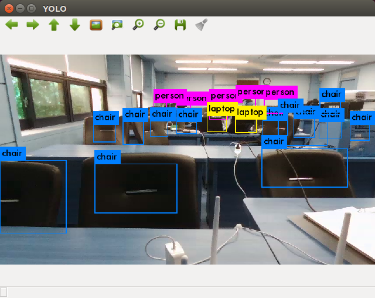
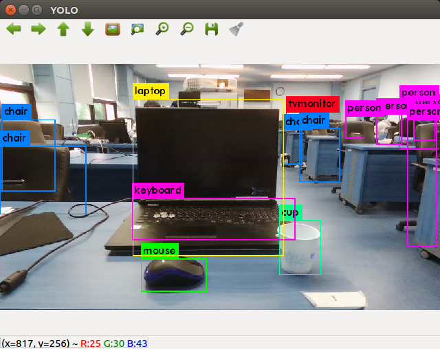
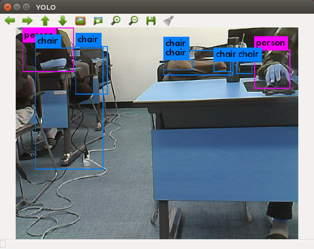

## YOLO with ROS


------

## darknet_ros

**튜토리얼 레벨 :**  Intermediate(중급)

**이 튜토리얼 작성 환경 :**  catkin **/** Ubuntu 16.04 **/** Kinetic

**자료원본(출처) :** <https://github.com/leggedrobotics/darknet_ros>

**튜토리얼 목록 :** [README.md](../README.md)

------

영상속의 객체( Object )들을 실시간으로 검출( Detection )하는 라이브러리로 요 몇 년 사이 가장 유명한 YOLO( You Only Look Once )의 ROS 패키지인 `darknet_ros` 를 설치하고, 간단한 example 노드를 만들어 구동해본다.


### 1. 설치


#### 1.1 의존성(dependencies)

- [**OpenCV**](https://opencv.org/) ( computer vision library )

- [**Boost**](https://opencv.org/) ( C++ library )

이 의존성들은 별도로 설치해 둘 필요는 없다. 빌드과정에서 설치되어있지 않을 경우 자동으로 다운로드된다.


#### 1.2 빌드(Build)

`darknet_ros` GitHub repository 에서 소스코드를 `--recursive` 옵션을 사용하여 `git clone` 하려면, 반드시 SSH 키를 자신의 GitHub 계정에 등록해 두어야만 한다. SSH 키를 만들고, 자신의 GitHub 에 등록하는 방법은 [**SSH 를 이용한 GitHub 연결**](./darknet_ros_connect2github_ssh.md) 을 참고한다. 


`~/catkin_ws/src` 폴더로 경로를 변경한다. 

```bash
$ cd ~/catkin_ws/src
```

`gitclone` 명령으로 `darknet_ros` `github` 로부터  소스코드 복사한다. ( `--recursive` 옵션을 사용해야만 완벽한 전체 코드가 `clone` 될 수 있다. 이를 위해 GitHub에 SSH 키를 등록해야만 한다. )

```bash
$ git clone --recursive https://github.com/leggedrobotics/darknet_ros.git
```

`catkin_make` 명령으로 빌드하기위해 `~/catkin_ws` 폴더로 경로를 변경한다. 

```bash
$ cd ~/catkin_ws
```

다음 명령으로 빌드한다. 

```bash
$ catkin_make -DCMAKE_BUILD_TYPE=Release
```

CUDA( Nvidia에서 만든 병렬 컴퓨팅 플랫폼 및 API 모델 )가 지원되는 Nvidia GPU 를 이용할 경우 CPU만을 이용할 경우보다 약 500배 빠르다. 이를 이용하기위해서는 Nvidia GPU가 있어야하며 CUDA를 설치해야한다. CMakeLists.txt 파일은 CUDA 설치 여부를 자동으로 감지하도록 작성되었으며, 시스템에 CUDA가없는 경우 빌드 프로세스가 YOLO의 CPU 버전으로 전환됩니다. ( Nvidia GPU 가 있는 경우 CUDA 사용은 [**'darknet-ros 에서의 CUDA 사용'**](./darknet_ros_2_using_cuda.md) 을 참조 )


#### 1.3 `weights` 파일 다운로드 

( 최초 빌드 시 자동으로 다운로드되므로, 바로 1.4 챕터로 건너 띄어도 된다. )

`weights` 파일을 위한 폴더로 경로 변경

```bash
$ cd catkin_ws/src/darknet_ros/darknet_ros/yolo_network_config/weights/
```

다음 명령을 실행하여 COCO 데이터 세트에서 사전 학습 된 `weights` 파일 2개를 다운로드한다. 

```bash
$ wget http://pjreddie.com/media/files/yolov2.weights
$ wget http://pjreddie.com/media/files/yolov2-tiny.weights
```

다음 명령을 실행하여 VOC 데이터 세트에서 사전 학습 된 `weights` 파일 2개를 다운로드한다. 

```bash
$ wget http://pjreddie.com/media/files/yolov2-voc.weights
$ wget http://pjreddie.com/media/files/yolov2-tiny-voc.weights
```

YOLO v3 사전 학습 된 `weights` 파일 2개는 다음 명령으로 다운로드할 수 있다. 

```bash
$ wget http://pjreddie.com/media/files/yolov3.weights
$ wget http://pjreddie.com/media/files/yolov3-tiny.weights
```

[이 외의 미리 학습된 weights 파일 찾아보기](https://pjreddie.com/darknet/yolo/)


#### 1.4 bebop2 의 `/bebop/image_raw` 토픽을 image 소스로 사용하는 `launch` 파일 작성.

`darknet_ros` 를 구동할 PC의 성능이 좋지 못하여 `weights` 파일은 `yolov2-tiny.weights` 를 사용하고, 이미지 소스는 `/bebop/image_raw` 를 사용하도록 하는 `launch` 파일을 만들어보자. 

우선 `darknet_ros` 패키지 폴더로 경로를 변경한다. 

```bash
$ roscd darknet_ros
```

`launch` 폴더에 어떤 `launch` 파일들이 있는가를 알아보기위해 다음 명령을 실행한다.  

```bash
$ ls ./launch
darknet_ros_gdb.launch  darknet_ros_nodelet.launch   yolo_v3.launch
darknet_ros.launch      darknet_ros_valgrind.launch
```

`yolo_v3.launch` 파일을 `bebop_yolo2_tiny.launch` 라는 이름으로 복사한다.

```bash
$ cp ./launch/yolo_v3.launch ./launch/bebop_yolo2_tiny.launch
```

`bebop_yolo2_tiny.launch` 파일 편집. 

```bash
$ gedit ./launch/bebop_yolo2_tiny.launch
```

```xml
<?xml version="1.0" encoding="utf-8"?>

<launch>
  
  <!-- Use YOLOv2-Tiny -->
  <!-- arg name="network_param_file" default="$(find darknet_ros)/config/yolov3.yaml"/ -->
  <arg name="network_param_file" default="$(find darknet_ros)/config/yolov2-tiny.yaml"/>
  <!-- arg name="image" default="camera/rgb/image_raw" / -->
  <arg name="image" default="/bebop/image_raw" />

  <!-- Include main launch file -->
  <include file="$(find darknet_ros)/launch/darknet_ros.launch">
    <arg name="network_param_file"    value="$(arg network_param_file)"/>
    <arg name="image" value="$(arg image)" />
  </include>

</launch>
```

주석처리된 행마다 바로 다음 행에 각각 사용할  `weight` 파일명과 구독할 이미지 토픽명을 변경하였다.


#### 1.5 테스트

**Paarot Bebop2 드론을 이용한 테스트**

1. bebop2 드론 전원 On
2. bebop2 드론의 SSID 에  WiFi 연결
3. `roscore`  실행
4. `bebop_driver`  패키지의  `bebop_nodelet.launch` 파일 구동
5. 바로 전에 편집한 `darknet_ros` 패키지의 `bebop_yolo2_tiny.launch` 파일 구동

5번을 수행하면 다음 그림과 같은 bebop2 드론의 스트리밍된 카메라 영상을 보여주는 창이 열리면서 영상에 인식된 `Object` 가 표시된다. 






Nvidia GPU가 없어 CUDA를 사용하지 못하고, 100% CPU로 처리한 경우로, intel i5 프로세서 / 8GB 메모리 / SSD 화경에서 0.9 fps 정도의 프레임 레이트가 나온 것을 확인할 수 있었다. 


**USB 웹캠을 이용한 테스트**

ROS `uvc_camera` 패키지 설치

```bash
$ sudo apt-get install ros-kinetic-uvc-camera
```

설치가 끝나면 다음 명령을 실행한다. 

```bash
$ source /opt/ros/kinetic/setup.bash
```

`~/.bashrc` 의 `ROS_MASTER_URI`와  `ROS_HOSTNAME` 설정 확인 후,  `roscore` 를 구동한다.

```bash
$ roscore
```

`roscore` 구동

```bash
$ roscore
```

`uvc_camera_node` 구동

```bash
$ rosrun uvc_camera uvc_camera_node
```

`uvc_camera_node` 의 토픽 확인

```bash
$ rosrun rostopic list
/camera_info
/image_raw # <--------------
/image_raw/compressed
/image_raw/compressed/parameter_descriptions
/image_raw/compressed/parameter_updates
/image_raw/compressedDepth
/image_raw/compressedDepth/parameter_descriptions
/image_raw/compressedDepth/parameter_updates
/image_raw/theora
/image_raw/theora/parameter_descriptions
/image_raw/theora/parameter_updates
/rosout
/rosout_agg
```

 `darknet_ros` 패키지의 `launch`  폴더로 경로를 변경한다. 

```bash
$ roscd darknet_ros/launch
```

`yolo_v3.launch` 파일을 `uvc_yolo2_tiny.launch` 라는 이름으로 복사한다.

```bash
$ cp ./yolo_v3.launch ./uvc_yolo2_tiny.launch
```

`uvc_yolo2_tiny.launch` 파일 편집. 

```bash
$ gedit ./uvc_yolo2_tiny.launch
```

```xml
<?xml version="1.0" encoding="utf-8"?>

<launch>
  
  <!-- Use YOLOv2-Tiny -->
  <!-- arg name="network_param_file" default="$(find darknet_ros)/config/yolov3.yaml"/ -->
  <arg name="network_param_file" default="$(find darknet_ros)/config/yolov2-tiny.yaml"/>
  <!-- arg name="image" default="camera/rgb/image_raw" / -->
  <arg name="image" default="/image_raw" />

  <!-- Include main launch file -->
  <include file="$(find darknet_ros)/launch/darknet_ros.launch">
    <arg name="network_param_file"    value="$(arg network_param_file)"/>
    <arg name="image" value="$(arg image)" />
  </include>

</launch>
```

주석처리된 행마다 바로 다음 행에 각각 사용할  `weight` 파일명과 구독할 이미지 토픽명 `rostopic list` 명령으로 확인한 `/image_raw` 로 변경하였다.

이제 좀 전에 수정한 `uvc_yolo2_tiny.launch` 파일을 실행한다.

```bash
$ roslaunch darknet_ros uvc_yolo2_tiny.launch
```




---

 [튜토리얼 목록](../README.md) 
