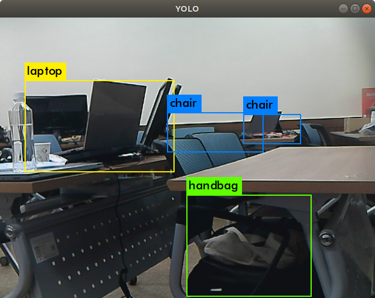

## YOLO with ROS (2/2)


------

## darknet_ros with CUDA

**튜토리얼 레벨 :**  Intermediate(중급)

**이 튜토리얼 작성 환경 :**  catkin **/** Ubuntu 18.04 **/** Melodic

**자료원본(출처) :** <https://github.com/leggedrobotics/darknet_ros>

​                           <https://docs.nvidia.com/cuda/cuda-installation-guide-linux/index.html>

**튜토리얼 목록 :** [README.md](../README.md)

------

사용 중인 컴퓨터에 NVIDIA GPU가 있다면, CUDA 를 사용할 수 있다. CUDA는 NVIDIA에서 제공하는 병렬 컴퓨팅 플랫폼 및 프로그래밍 모델로서 GPU(그래픽 처리 장치)의 성능을 활용하여 컴퓨팅 성능을 획기적으로 높일 수 있는 기술이다. 

CUDA 지원 GPU(NVIDIA Geforce 시리즈 외)에는 수천 개의 컴퓨팅 스레드를 집합적으로 실행할 수 있는 수백 개의 코어가 존재하며, 이 코어들에는 공유 리소스(레지스터 파일 및 공유 메모리 등)가 있다. 온칩 공유 메모리를 사용하면 시스템 메모리 버스를 거치지 않고 이들 코어에서 실행되는 병렬 작업이 데이터를 공유할 수 있다.

그럼 **'Ubuntu 18.04 + ROS Melodic + Nvidia GPU'** 환경에서 `darknet-ros` 패키지를 CUDA를 사용하도록 빌드하는 방법을 알아보자. 


### 1. CUDA 설치

사전준비 / Nvidia GPU 드라이버 설치 / CUDA Toolkit 설치 / cuDNN 설치 

#### 1.1. 사전 준비

- CUDA 지원 GPU 존재 확인

  ```bash
  lspci | grep -i nvidia
  ```

  ```
  02:00.0 3D controler: NVIDIA Corporation Device 1f96 (rev a1)
  ```

  "NVIDIA" 문자열이 들어간 장치가 검색되는 지 확인

- 리눅스 버전 확인

  ```bash
  uname -m && cat /etc/*release
  ```

  ```
  x86_64
  DISTRIB_ID=Ubuntu
  DISTRIB_RELEASE=18.04
  DISTRIB_CODENAME=bionic
  DISTRIB_DESCRIPTION="Ubuntu 18.04.5 LTS"
  NAME="Ubuntu"
  VERSION="18.04.5 LTS (Bionic Beaver)"
  ID=ubuntu
  ID_LIKE=debian
  PRETTY_NAME="Ubuntu 18.04.5 LTS"
  VERSION_ID="18.04"
  HOME_URL="https://www.ubuntu.com/"
  SUPPORT_URL="https://help.ubuntu.com/"
  BUG_REPORT_URL="https://bugs.launchpad.net/ubuntu/"
  PRIVACY_POLICY_URL="https://www.ubuntu.com/legal/terms-and-policies/privacy-policy"
  VERSION_CODENAME=bionic
  UBUNTU_CODENAME=bionic
  ```

  우분투의 경우 x86_64 플랫폼의 경우 18.04.5, 20.04.2 가 지원된다.

- gcc 컴파일러 설치 여부 및 버전 확인

  ```bash
  gcc --version
  ```

  ```
  gcc (Ubuntu 7.5.0-3ubuntu1~18.04) 7.5.0
  Copyright (C) 2017 Free Software Foundation, Inc.
  This is free software; see the source for copying conditions.  There is NO
  warranty; not even for MERCHANTABILITY or FITNESS FOR A PARTICULAR PURPOSE.
  ```

  gcc 버전은 6.0 부터 지원된다. 

- kernel header 및 개발 패키지 설치여부 확인

  우분투 18.04 의 경우 다음 명령으로 kernel header 및 개발 패키지를 설치한다.

  ```
  sudo apt-get install linux-headers-$(uname -r)
  ```


#### 1.2. CUDA Toolkit 설치

- **Disabling Nouveau Driver**

  CUDA Toolkit 이 설치될 때 디스플레이 드라이버 또한 함께 설치되므로 Nouveau 드라이버를 disable 시켜야만 한다. 이를 위해서 우분투 18.04 에서는 우선 다음 내용의 `/etc/modprobe.d/blacklist-nouveau.conf` 파일을 작성한 후, 

  ```bash
  sudo nano /etc/modprobe.d/blacklist-nouveau.conf
  ```

  ```bash
  blacklist nouveau
  options nouveau modeset=0
  ```

  아래 명령을 실행하여 `kernel initramfs` 을 재생성시킴으로서 `/etc/modprobe.d/blacklist-nouveau.conf` 파일의 설정을 반영한다. 

  ```bash
  sudo update-initramfs -u
  ```

- **CUDA Toolkit 다운로드**

  CUDA Toolkit 은 NVIDIA GPU Driver 를 포함하고 있으므로 특별히 호환성에 문제가 있는 것이 아니라면, NVIDIA GPU Driver 를 따로 설치하지 않고, CUDA Toolkit 설치 시 함께 설치한다. 

  CUDA Tookit 다운로드 링크 : <https://developer.nvidia.com/cuda-toolkit-archive> 

  위 링크에서 원하는 버전을 클릭 후, Operating Systems, Architecture, Distribution, Version, Install Type 을 차례로 선택하면 하단에 실행할 명령이 나타난다. 

  

  **CUDA Toolkit 11.4** 에서 **Linux** - **x86_64** - **Ubuntu** - **18.04** - **runfile** ( local ) 을 순차적으로 선택하면 두 줄의 명령이 나타난다. 첫 줄의 명령만 실행하고, 두 번 째 명령은 GUI 모드가 아닌 CLI 모드에서 실행하여야 한다. 

  ```
  wget https://developer.download.nvidia.com/compute/cuda/11.4.1/local_installers/cuda_11.4.1_470.57.02_linux.run
  ```

  다운로드가 완료되면 열려진 모든 창을 닫고 터미널 창에서 다음 명령을 실행하여 GUI( Graphic User Interface ) 모드에서 CLI( Command Line Interface ) 모드로 전환한다.

  ```
  sudo init 3
  ```

  실행 레벨을 3수준으로 낮추라는 의미이기도 하다. 명령이 실행되면 CLI 모드로 전환되면서 login 메세지가 나타난다. ( 경우에 따라 `Alt` + `F1` ,  `F2` , ... 를 입력해야 할 수도 있다. )

  ```
  Ubuntu 18.04.5 LTS computer tty1
  computer login: _
  ```

  로그인 ID, 패스워드를 입력하여 로그인 후, 앞서 `wget` 명령으로 다운로드한 `cuda_11.4.1_470.57.02_linux.run` 파일을 찾아 실행한다. 

  ```
  sudo sh cuda_11.4.1_470.57.02_linux.run
  ```
  
  다음 화면에서 `Continue`  선택
  
  ```
  ┌──────────────────────────────────────────────────────────────────────────────┐
  │ Existing package manager installation of the driver found. It is strongly    │
  │ recommended that you remove this before continuing.                          │
  │ Abort                                                                        │
  │ Continue                                                                     │
  │                                                                              │
  │                                                                              │
  │                                                                              │
  │                                                                              │
  │                                                                              │
  │ Up/Down: Move | 'Enter': Select                                              |
  └──────────────────────────────────────────────────────────────────────────────┘
  ```
  
  다음 화면에 `accept` 입력
  
  ```
  ┌──────────────────────────────────────────────────────────────────────────────┐
  │  End User License Agreement                                                  │
  │  --------------------------                                                  │
  │                                                                              │
  │  The CUDA Toolkit End User License Agreement applies to the                  │
  │  NVIDIA CUDA Toolkit, the NVIDIA CUDA Samples, the NVIDIA                    │
  │  Display Driver, NVIDIA Nsight tools (Visual Studio Edition),                │
  │  and the associated documentation on CUDA APIs, programming                  │
  │  model and development tools. If you do not agree with the                   │
  │  terms and conditions of the license agreement, then do not                  │
  │  download or use the software.                                               │
  │                                                                              │
  │  Last updated: May 24, 2021.                                                 │
  │                                                                              │
  │                                                                              │
  │  Preface                                                                     │
  │  -------                                                                     │
  │                                                                              │
  │  The Software License Agreement in Chapter 1 and the Supplement              │
  │  in Chapter 2 contain license terms and conditions that govern               │
  │  the use of NVIDIA software. By accepting this agreement, you                │
  │──────────────────────────────────────────────────────────────────────────────│
  │ Do you accept the above EULA? (accept/decline/quit):                         │
  │ accept                                                                       │
  └──────────────────────────────────────────────────────────────────────────────┘
  ```
  
  다음 화면에서 `Install` 선택
  
  ```
  ┌──────────────────────────────────────────────────────────────────────────────┐
  │ CUDA Installer                                                               │
  │ - [X] Driver                                                                 │
  │      [X] 470.57.02                                                           │
  │ + [X] CUDA Toolkit 11.4                                                      │
  │   [X] CUDA Samples 11.4                                                      │
  │   [X] CUDA Demo Suite 11.4                                                   │
  │   [X] CUDA Documentation 11.4                                                │
  │   Options                                                                    │
  │   Install                                                                    │
  │                                                                              │
  │                                                                              │
  │                                                                              │
  │ Up/Down: Move | Left/Right: Expand | 'Enter': Select | 'A': Advanced options │
  └──────────────────────────────────────────────────────────────────────────────┘
  ```
  
  설치가 끝나면 아래와 같은 내용이 화면에 출력된다. 
  
  ```
  ===========
  = Summary =
  ===========
  
  Driver:   Installed
  Toolkit:  Installed in /usr/local/cuda-11.4/
  Samples:  Installed in /home/user/, but missing recommended libraries
  
  Please make sure that
   -   PATH includes /usr/local/cuda-11.4/bin
   -   LD_LIBRARY_PATH includes /usr/local/cuda-11.4/lib64, or, add /usr/local/cuda-11.4/lib64 to /etc/ld.so.conf and run ldconfig as root
  
  To uninstall the CUDA Toolkit, run cuda-uninstaller in /usr/local/cuda-11.4/bin
  To uninstall the NVIDIA Driver, run nvidia-uninstall
  Logfile is /var/log/cuda-installer.log
  ```
  
  다음 명령을 실행하여 GUI 모드로 전환한다.
  
  ```
  sudo init 5
  ```
  
  `~/.bashrc` 파일에 다음 내용을 추가한다. 
  
  ```
  gedit ~/.bashrc &
  ```
  
  ```
  export PATH=/usr/local/cuda-11.4/bin${PATH:+:${PATH}}
  export LD_LIBRARY_PATH=/usr/local/cuda-11.4/lib64${LD_LIBRARY_PATH:+:${LD_LIBRARY_PATH}}
  ```
  
  `source` 명령으로 변경된 내용을 반영한다. 
  
  ```
  source ~/.bashrc
  ```
  
  NVIDIA GPU 드라이버 설치 상태를 확인하기 위해 `nvidia-smi` 를 실행한다. 
  
  ```
  nvidia-smi
  ```
  
  ```
  Tue Aug  3 13:05:54 2021       
  +-----------------------------------------------------------------------------+
  | NVIDIA-SMI 470.57.02    Driver Version: 470.57.02    CUDA Version: 11.4     |
  |-------------------------------+----------------------+----------------------+
  | GPU  Name        Persistence-M| Bus-Id        Disp.A | Volatile Uncorr. ECC |
  | Fan  Temp  Perf  Pwr:Usage/Cap|         Memory-Usage | GPU-Util  Compute M. |
  |                               |                      |               MIG M. |
  |===============================+======================+======================|
  |   0  NVIDIA GeForce ...  Off  | 00000000:2D:00.0 Off |                  N/A |
  | N/A   49C    P8    N/A /  N/A |    359MiB /  1878MiB |      0%      Default |
  |                               |                      |                  N/A |
  +-------------------------------+----------------------+----------------------+
                                                                                 
  +-----------------------------------------------------------------------------+
  | Processes:                                                                  |
  |  GPU   GI   CI        PID   Type   Process name                  GPU Memory |
  |        ID   ID                                                   Usage      |
  |=============================================================================|
  |    0   N/A  N/A     14970      G   /usr/lib/xorg/Xorg                 62MiB |
  |    0   N/A  N/A     15519      G   /usr/lib/xorg/Xorg                154MiB |
  |    0   N/A  N/A     15711      G   /usr/bin/gnome-shell               81MiB |
  |    0   N/A  N/A     16319      G   /usr/lib/firefox/firefox           49MiB |
  |    0   N/A  N/A     16539      G   /usr/lib/firefox/firefox            1MiB |
  +-----------------------------------------------------------------------------+
  ```
  
  CUDA 설치 상태 확인을 위해 `nvcc --version` 을 실행한다. 
  
  ```
  nvcc --version
  ```
  
  ```
  nvcc: NVIDIA (R) Cuda compiler driver
  Copyright (c) 2005-2021 NVIDIA Corporation
  Built on Wed_Jul_14_19:41:19_PDT_2021
  Cuda compilation tools, release 11.4, V11.4.100
  Build cuda_11.4.r11.4/compiler.30188945_0
  ```
  
  

#### 1.3 cuDNN 설치

cuDNN 은 NVIDIA CUDA® 를 이용한 심층 신경망 라이브러리( NVIDIA CUDA® Deep Neural Network library )이다. Tensorflow 와 같은 딥러닝 어플리케이션 개발 시 고성능 GPU 가속기능을 지원해 준다.

- cuDNN 다운로드 ( cuDNN 을 다운로드하기 위해서는 NVIDIA Developer 포럼에 가입하고, 설문에 응하는 과정을 거쳐야 한다. )

  cuDNN 다운로드 링크 : <https://developer.nvidia.com/cudnn> 

  

  다운로드가 완료되면 경로를 `~/Downloads` 로 변경한다. 

  ```
  cd ~/Downloads
  ```

  다음 명령으로 압축을 해제한다. 

  ```
  tar -xzvf cudnn-11.4-linux-x64-v8.2.2.26.tgz
  ```

  다음 명령을 차례대로 실행하여 적절한 위치에 해당 라이브러리를 복사한다. 

  ```
  sudo cp cuda/include/cudnn*.h /usr/local/cuda/include
  sudo cp -P cuda/lib64/libcudnn* /usr/local/cuda/lib64
  sudo chmod a+r /usr/local/cuda/include/cudnn*.h /usr/local/cuda/lib64/libcudnn*
  ```

  

### 2. darknet-ros 빌드

#### 2.1. 소스코드 복사

`-recursive` 옵션을 사용하여 `git clone` 명령을 수행하려면 `ssh-key` 가 자신의 github 계정에 등록되어 있어야 한다. 그 방법은 [**github 계정에 `ssh-key` 등록**](./darknet_ros_connect2github_ssh.md) 문서를 참조한다. 

```bash
cd ~/catkin_ws/src
```

```bash
git clone --recursive https://github.com/leggedrobotics/darknet_ros.git
```

#### 2.2. `CMakeList.txt` 수정

다음 작업 없이 빌드하면, CPU 를 사용하도록 빌드된다. 

```
gedit ./src/darknet-ros/darkenet-ros/CMakeList.txt &
```

`# Find CUDA` 섹션을  [**CUDA** 위키피디어 페이지](https://en.wikipedia.org/wiki/CUDA#Supported_GPUs)  **'GPUs supported'** 챕터의 표( 아래는 해당 표의 일부를 발췌한 것임 )를 참조하여 편집해주어야 한다. 

사용하는 Graphic Card 가 GTX 1650 또는 MX450 인 경우 Compute Capability 가 7.5 에 해당한다는 것을 알 수 있다.

<table>
  <tr>
    <td><b>Compute<br>Capability</b></td>
    <td align="center">
        <b>Nvidia Graphic Card</b>
    </td>
  </tr>
  <tr>
    <td align="center"><b> 6.1 </b></td>
    <td>
      Nvidia TITAN Xp, Titan X,
GeForce GTX 1080 Ti, GTX 1080, GTX 1070 Ti, GTX 1070, GTX 1060, GTX 1050 Ti, GTX 1050, GT 1030, GT 1010,MX350, MX330, MX250, MX230, MX150, MX130, MX110
    </td>
  </tr>
  <tr>
    <td align="center"><b> 7.5 </b></td>
    <td>
      NVIDIA TITAN RTX, GeForce RTX 2080 Ti, RTX 2080 Super, RTX 2080, RTX 2070 Super, RTX 2070, TX 2060 Super, RTX 2060, GeForce GTX 1660 Ti, GTX 1660 Super, GTX 1660, GTX 1650 Super, <b>GTX 1650</b>, <b>MX450</b>
    </td>
  </tr>
  <tr>
    <td align="center"><b> 8.6 </b></td>
    <td>
      GeForce RTX 3090, RTX 3080 Ti, RTX 3080, RTX 3070 Ti, RTX 3070, RTX 3060 Ti, RTX 3060
    </td>
  </tr>
</table>

`# Find CUDA` 섹션에 다음과 같이 `-gencode arch=compute_75,code=sm_75` 를 추가해 준다.


```makefile
# Find CUDA
find_package(CUDA QUIET)
if (CUDA_FOUND)
  find_package(CUDA REQUIRED)
  message(STATUS "CUDA Version: ${CUDA_VERSION_STRINGS}")
  message(STATUS "CUDA Libararies: ${CUDA_LIBRARIES}")
  set(
    CUDA_NVCC_FLAGS
    ${CUDA_NVCC_FLAGS};
    -O3
    # -gencode arch=compute_30,code=sm_30               # <---+
    # -gencode arch=compute_35,code=sm_35               #     |
    # -gencode arch=compute_50,code=[sm_50,compute_50]  #     +-- comment out
    # -gencode arch=compute_52,code=[sm_52,compute_52]  #     |
    # -gencode arch=compute_61,code=sm_61               #     |
    # -gencode arch=compute_62,code=sm_62               # <---+
    -gencode arch=compute_75,code=sm_75 # <---- insert for MX450 or GTX1650
  )
  add_definitions(-DGPU)
else()
  list(APPEND LIBRARIES "m")
endif()
```

#### 2.3. 빌드

단순히 `catkin_make` 로 빌드하지 않고 아래와 같이 `-DCMAKE_BUILD_TYPE=Release` 옵션을 주어 빌드한다. 

```
catkin_make -DCMAKE_BUILD_TYPE=Release
```

`darknet_ros` 패키지만 해당 옵션으로 빌드하려면 다음과 같이 실행한다. 

```
catkin_make -DCMAKE_BUILD_TYPE=Release --only-pkg-with-deps darknet_ros
```


#### 2.4 테스트

`source`  명령으로 변경된 `~/catkin_ws/devel/setup.bash` 정보를 반영해 준다. 

```
source ~/catkin_ws/devel/setup.bash
```

`rospack` 명령도 실행한다.

```
rospack profile
```

작업 경로를 `darknet_ros/launch` 로 변경한다.

```
roscd darknet_ros/launch
```

`ls` 명령으로 기존의 `launch` 파일 목록을 확인한다. 

```
ls
```

`yolo_v3.launch` 파일을 `uvc_v2tiny_cuda.launch` 로 복사한다. 

```
cp yolo_v3.launch uvc_v2tiny_cuda.launch
```

`uvc_v2tiny_cuda.launch` 파일의 내용을 다음과 같이 편집한다. 

```
gedit uvc_v2tiny_cuda.launch
```

```xml
<?xml version="1.0" encoding="utf-8"?>
<launch>
  <!-- Use YOLOv3 -->
  <arg name="network_param_file" default="$(find darknet_ros)/config/yolov2-tiny.yaml"/>
  <arg name="image" default="/image_raw" />

  <!-- Include main launch file -->
  <include file="$(find darknet_ros)/launch/darknet_ros.launch">
    <arg name="network_param_file"    value="$(arg network_param_file)"/>
    <arg name="image" value="$(arg image)" />
  </include>
</launch>
```

3개의 터미널을 열고 첫번째 터미널에서 `roscore` 를 실행한다.

```
roscore
```

두 번 째 터미널에서 `uvc_camera_node` 를 실행한다. 

```
rosrun uvc_camera uvc_camera_node
```

세 번 째 터미널에서 좀 전에 편집한 `uvc_v2tiny_cuda.launch` 파일을 실행한다. 

```
roslaunch darknet_ros uvc_v2tiny_cuda.launch
```

```
FPS:92.4
Objects:

chair: 48%
laptop: 51%
chair: 32%
```



[CUDA를 사용하지 않을 때](./darknet_ros_1_install_n_example.md), FPS 가 1 도 되지 않았던 것( 0.9 )에 비하면 100배가 넘는 성능이 발휘되는 것을 확인할 수 있다.


---

 [튜토리얼 목록](../../README.md) 
