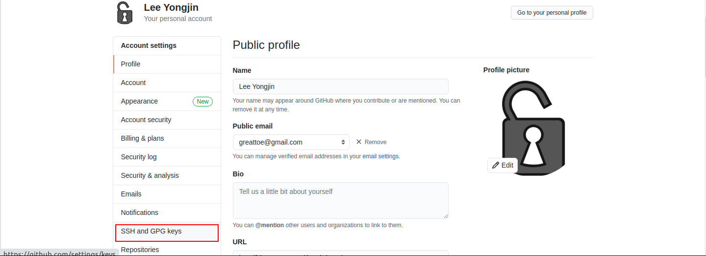
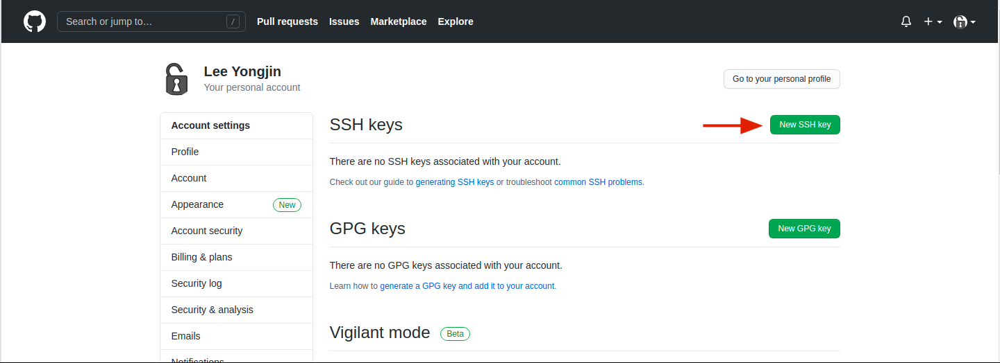
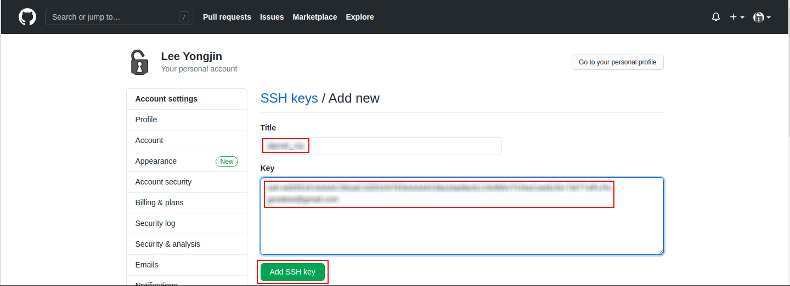
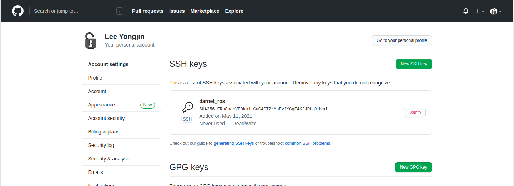

## Connecting to GitHub with SSH


------

## SSH key generation & register to github acount

**튜토리얼 레벨 :**  Intermediate(중급)

**이 튜토리얼 작성 환경 :**  catkin **/** Ubuntu 16.04 **/** Kinetic

**자료원본(출처) :** [Connecting to GitHub with SSH](https://docs.github.com/en/github/authenticating-to-github/generating-a-new-ssh-key-and-adding-it-to-the-ssh-agent)

**튜토리얼 목록 :** [README.md](../README.md)

------

Ubuntu 에서  SSH 키를  만들고,  만들어진  SSH 키를 자신의 GitHub 계정에 등록하는 방법을 알아보자.


#### 1. SSH Key 생성 

`Ctrl`+`Alt`+`T` 를 입력하여 터미널 창을 열고 다음 명령을 입력한다. `"your_email@address4github"` 에는 GitHub 사용자 ID 로 사용하는 자신의 이메일 주소를 적는다.  이 명령은 GitHub 계정 사용자 ID 로 사용하는 이메일 주소정보가 포함된 SSH 키를 `~/.ssh` 폴더에 생성해줄 것이다. 

```bash
$ ssh-keygen -t ed25519 -C "your_email@address"
```

명령을 입력하면 키를 생성한다는 메세지와 함께 키의 경로와 이름을 입력하라는 메세지가 출력된다. 이 때 ( )안에 적혀있는 경로와 이름을 그대로 사용하려면 `Enter` 만 입력한다.  

```bash
Generating public/private ed25519 key pair.
Enter file in which to save the key (/home/YourUserName/.ssh/id_ed25519): 
```

새로 생성될 키의 암호를 정하는 과정으로 암호 없이 사용하기위해 역시 `Enter` 만 입력한다. 

```bash
Enter passphrase (empty for no passphrase): 
```

암호를 확인하는 과정이므로 역시 `Enter` 만 입력한다. 

```bash
Enter same passphrase again: 
```

다음과 같은 메세지와 함께 새로운 SSH 키가 생성된다. 

```bash
ssh-keygen -t ed25519 -C "your_email@address"
Generating public/private ed25519 key pair.
Enter file in which to save the key (/home/YourUserName/.ssh/id_ed25519): 
Enter passphrase (empty for no passphrase): 
Enter same passphrase again: 
Your identification has been saved in /home/YourUserName/.ssh/id_ed25519.
Your public key has been saved in /home/YourUserName/.ssh/id_ed25519.pub.
The key fingerprint is:
SHA256:FRb8aceVE0kmi+CuC4CT2rMnEvfYGgF4KfJDUqYHvpI your_email@address
The key's randomart image is:
+--[ED25519 256]--+
|. o      o+. ..++|
|o= .    ..o.. ++.|
|B.=      ..o + ..|
|.X+     ..  + o  |
|E=+.    S. . .   |
|+.oo.   .        |
|.o++ . .         |
|. o++ . .        |
| .o+   .         |
+----[SHA256]-----+
```

다음 명령을 실행하여 `ssh-agent` 에 생성된 SSH 의 권한을 변경한다. 

```bash
$ chmod 600 ~/.ssh/id_ed25519.pub
```


#### 2. GitHub 계정에 새 SSH 키 추가

터미널에서 다음 명령을 실행하여 `xclip` ( 터미널에서 텍스트 파일의 내용을 클립보드에 복사하는 프로그램 )을 설치한다.

```bash
$ sudo apt-get install xclip
```

설치가 끝나면 아래의 `xclip` 을 이용한 명령을 실행하여, 새로 만든 SSH 키의 내용을 클립보드로 복사한다. 

```bash
$ xclip -selection clipboard < ~/.ssh/id_ed25519.pub
```

웹브라우저에서 [**GitHub**](https://github.com) 를 열고 자신의 계정으로 로그인한다. 

아래 그림과 같이 화면 우측 상단의 로그인한 사용자를 나타내는 이미지를 클릭하여 열린 메뉴에서 **'Setting'** 을 클릭한다.  


좌측 메뉴항목 중 **'SSH and GPG keys'** 를 클릭한다. 



**'New SSH key'** 버튼을 클릭한다. 



**'Title'** 란에 적당한 제목을 적어주고 **'Key'** 란에는 앞서 `xcliper` 를 이용해 클립보드로 복사한 `~/.ssh/id_ed25519.pub` 키 파일의 내용을 붙혀넣기 한 후, **'Add SSH Key'** 버튼을 클릭한다.



다음과 같이 등록된 SSH 키 정보를 확인할 수 있다. 




---

 [튜토리얼 목록](../README.md) 
