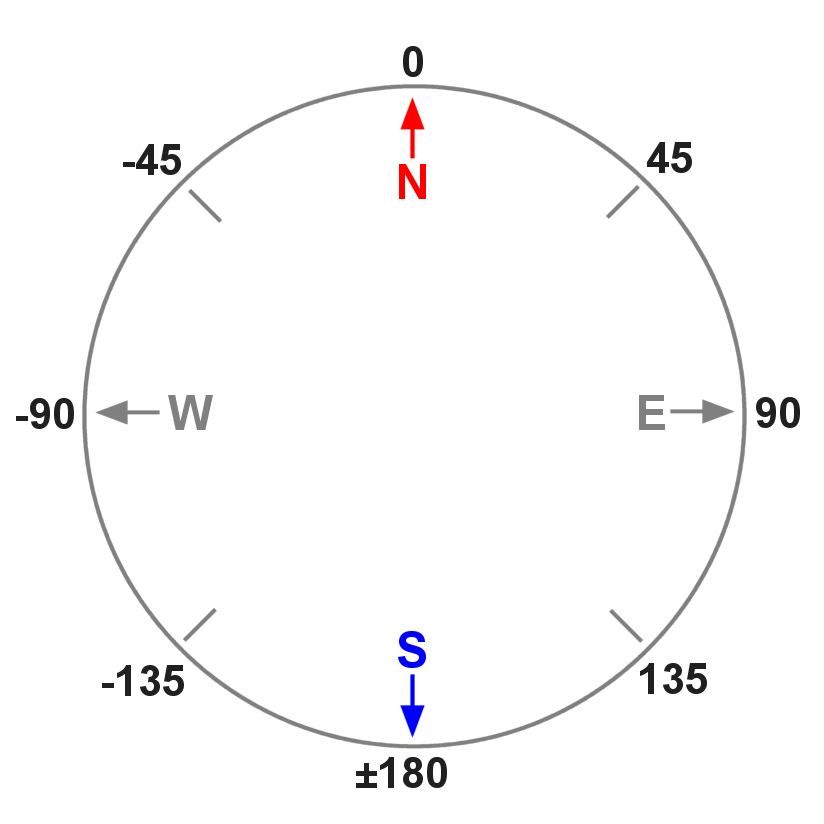
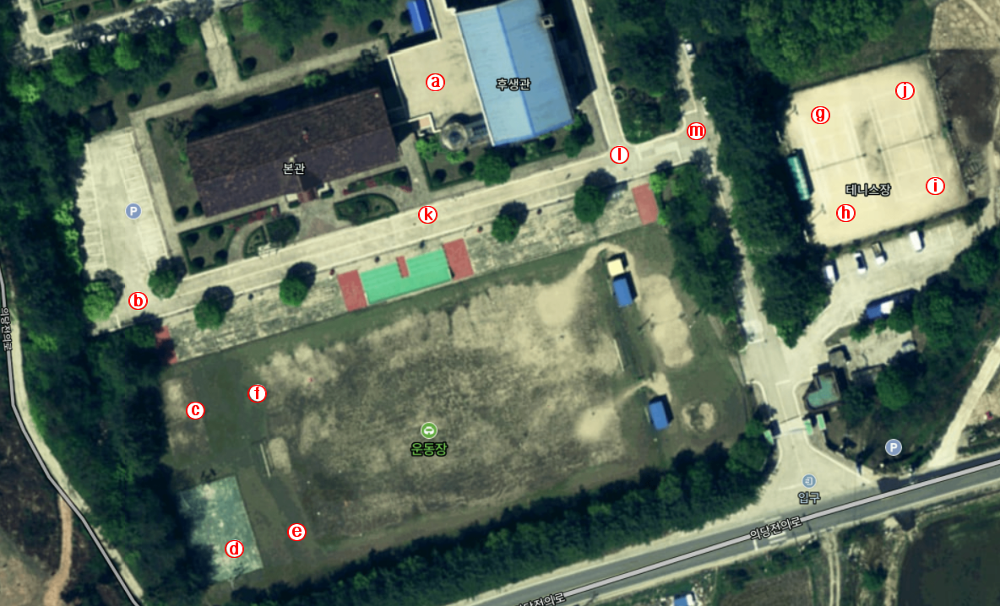

## 6. GPS 위치정보에 의한 이동 

**튜토리얼 레벨 :**  Intermediate(중급)(수정)

**이 튜토리얼 작성 환경 :**  catkin **/** Ubuntu 16.04 **/** ROS Kinetic

**다음 튜토리얼 :** [링크 수정 필요]() 

**이전 튜토리얼 :** [링크 수정 필요]() 

**목록보기:** [README.md](../../README.md) 


GPS 로부터 수신된 위도, 경도 정보를 바탕으로 드론이 최초 이륙한 GPS 위치정보를 이용한 RTB( Return to Base ) 기능 및, 목적지 GPS 좌표를 전달받아 해당 위치로 이동하는 기능을 구현한다. 

---

**필요기능 정의**

- GPS Positiion 정보 구독
- 목표 GPS 좌표 방향을 향해 회전
- 목표 GPS 좌표까지의 이동
- 이동 중 위치확인 및 보정


### 1. 두 지점의 GPS 좌표로부터 두 지점 사이의 거리 및 방위각 계산

#### 1.1 두 지점의 위, 경도를 이용한 거리 및 방위각 계산

두 지점의 GPS 좌표로부터 두 지점 사이의 거리 및 방위각 계산하는 코드를 작성해보자.

파이썬 라이브러리 `haversine` 과  `scipy` 를 설치한다.

```bash
$ pip install haversine
```

```bash
$ pip install scipy
```


#### 1.2 거리 및 방위각 계산

두 지점의 GPS 좌표로부터 두 지점 사이의 거리 및 방위각 계산하는 코드 `gps_dist_bear.py` 를 `bb2_pkg` 패키지에 작성하기 위해 작업경로를 변경한다.

```bash
$ roscd bb2_pkg/scripts
```

`touch` 명령으로 파일명이 `gps_dist_bear.py`  이고, 크기가 0 KB 인 빈 파일을 생성한다.

```bash
$ touch gps_dist_bear.py
```

생성된 `gps_dist_bear.py` 파일에 실행속성을 부여한다. 

```bash
$ chmod +x gps_dist_bear.py
```

텍스트 에디터를 이용해 아래 코드와 같이 `gedit gps_dist_bear.py` 파일을 편집한다. 

```bash
$ gedit gps_dist_bear.py &
```

```python
#!/usr/bin/env python
import rospy
from math import pow, degrees, radians, atan2 
from scipy import cos, sin, arctan, sqrt, arctan2
from haversine import haversine
'''         
                |<-- 100(m)-->|<-- 100(m)-->|
           --- p8------------p1-------------p2-> 35.234694 (35.233795+0.0008993204)
            ^   | .-45        |0          . |
            |   |   .         |         . 45|
           100  |     .       |       .     |
           (m)  |       .     |     .       |
            |   |         .   |   .         |
            v   |-90        . | .           |
           --- p7------------p0-------------p3-> 35.233795
            ^   |           . | .         90|
            |   |         .   |   .         |
           100  |       .     |     .       |
           (m)  |     .       |       .     |
            |   -135.         |         .   |
            v   | .           |       135 . |
           --- p6------------p5-------------p4-> 35.232895 (35.233795-0.0008993204)
                v             v             v
             129.081752    129.082850    129.083947
             
     (129.082850-0.0010978720)    (129.082850+0.0010978720) 
     
        
        distance  of latitude   1(deg) = 111195.0802340(m/deg)  p1( 35, 129) p2( 36, 129)
        distance  of longtitude 1(deg) =  91085.2969372(m/deg)  p1( 35, 129) p2( 35, 130)
        latitude  of distance   1(m)   =      0.00000899320363720(deg/m)
        longitude of distance   1(m)   =      0.00001097872031629(deg/m)
        
        -------------+-----------------+-----------------
         Distance(m) |  latitude(deg)  |  longitude(deg)
        -------------+-----------------+-----------------
               1.0   |   0.0000089932  |   0.0000109787
              10.0   |   0.0000899320  |   0.0001097872
             100.0   |   0.0008993204  |   0.0010978720
        -------------+-----------------+-----------------

        p0 = (35.233795, 129.082850)
        
        p1 = (35.234694, 129.082850);   p5 = (35.232895, 129.082850) 
        p2 = (35.234694, 129.083947);   p6 = (35.232895, 129.081752) 
        p3 = (35.233795, 129.083947);   p7 = (35.233795, 129.081752) 
        p4 = (35.232895, 129.083947);   p8 = (35.234694, 129.081752) 
'''
def bearing((lat1, long1), (lat2, long2)):
    
    Lat1,  Lat2  = radians(lat1),  radians(lat2) 
    Long1, Long2 = radians(long1), radians(long2) 
    
    y = sin(Long2-Long1)*cos(Lat2) 
    x = cos(Lat1)*sin(Lat2) - sin(Lat1)*cos(Lat2)*cos(Long2-Long1) 
    
    return degrees(atan2(y, x))   
    
if __name__ == '__main__':
    try:
        rospy.init_node('get_distance_n_bearing_from_gps', anonymous = True)
        
        a = (35, 129);  b = (36, 129);  c = (35, 130)
        print "latitude  1(deg) is   %s(m)" %(haversine(a,b) * 1000)
        print "longitude 1(deg) is   %s(m)" %(haversine(a,c) * 1000)
        
        p0 = (35.233795, 129.082850)        
        p1 = (35.234694, 129.082850);   p5 = (35.232895, 129.082850) 
        p2 = (35.234694, 129.083947);   p6 = (35.232895, 129.081752) 
        p3 = (35.233795, 129.083947);   p7 = (35.233795, 129.081752) 
        p4 = (35.232895, 129.083947);   p8 = (35.234694, 129.081752) 
        
        print "p1: dist = %s(m),\tbearing = %s(deg)" %(haversine(p0,p1)*1000, bearing(p0,p1))
        print "p2: dist = %s(m),\tbearing = %s(deg)" %(haversine(p0,p2)*1000, bearing(p0,p2))
        print "p3: dist = %s(m),\tbearing = %s(deg)" %(haversine(p0,p3)*1000, bearing(p0,p3))
        print "p4: dist = %s(m),\tbearing = %s(deg)" %(haversine(p0,p4)*1000, bearing(p0,p4))
        print "p5: dist = %s(m),\tbearing = %s(deg)" %(haversine(p0,p5)*1000, bearing(p0,p5))
        print "p6: dist = %s(m),\tbearing = %s(deg)" %(haversine(p0,p6)*1000, bearing(p0,p6))
        print "p7: dist = %s(m),\tbearing = %s(deg)" %(haversine(p0,p7)*1000, bearing(p0,p7))
        print "p8: dist = %s(m),\tbearing = %s(deg)" %(haversine(p0,p8)*1000, bearing(p0,p8))
        
    except rospy.ROSInterruptException:  pass
```

코드 실행을 위해 `roscore` 를 구동하고, 다음 명령을 실행한다. 

```bash
$ rosrun bb2_pkg get_dist_bearing.py 
latitude  1(deg) is   111195.080234(m)
longitude 1(deg) is   91085.2969372(m)
p1: dist = 99.9643771291(m),	bearing = 0.0(deg)
p2: dist = 141.137637966(m),	bearing = 44.9048791623(deg)
p3: dist = 99.6346635036(m),	bearing = 89.9996835625(deg)
p4: dist = 141.217196053(m),	bearing = 135.126018751(deg)
p5: dist = 100.07557221(m),	    bearing = 180.0(deg)
p6: dist = 141.281292047(m),	bearing = -135.099915804(deg)
p7: dist = 99.7254881767(m),	bearing = -89.9996832741(deg)
p8: dist = 141.201768653(m),	bearing = -44.93098163(deg)
```

`p0` 로 부터 `p1` , `p2` , ... , `p8` 까지의 각 지점에 대한 거리와 방위각이 비교적 정확히 구해진 것을 확인할 수 있다.


### 2. 기능 구현

#### 2.1 GPS 정보 수신 가능 위성 수 토픽 Subscriber

- 토픽 명     : `/bebop/states/ardrone3/GPSState/NumberOfSatelliteChanged`

- 토픽 형식 : `bebop_msgs.msg.Ardrone3GPSStateNumberOfSatelliteChanged`

- 코드

  ```python
  #!/usr/bin/env python
  
  import rospy
  from bebop_msgs.msg import Ardrone3GPSStateNumberOfSatelliteChanged
  
  class NumOfSatellite:
      def __init__(self):
          rospy.init_node('num_of_satellite', anonymous = True)
          rospy.Subscriber('/bebop/states/ardrone3/GPSState/NumberOfSatelliteChanged',
                           Ardrone3GPSStateNumberOfSatelliteChanged,
                           self.get_num_sat_cb, queue_size = 1)
          self.num_sat = 0
                
      def get_num_sat_cb(self, msg):
          self.num_sat = msg.numberOfSatellite
          print "We can recieve gps signal from %s of satellites!" %(self.num_sat)
          
  if __name__ == '__main__':
      try:
          NumOfSatellite()
          rospy.spin()
          
      except rospy.ROSInterruptException:  pass
  ```

  

#### 2.2 GPS 위치정보 토픽 Subscriber

- 토픽 명     : `/bebop/states/ardrone3/PilotingState/PositionChanged`

- 토픽 형식 : `bebop_msgs.msg.Ardrone3PilotingStatePositionChanged`

- 코드

  ```python
  #!/usr/bin/env python
  
  import rospy
  from bebop_msgs.msg import Ardrone3PilotingStatePositionChanged
  
  class SubGPS:
      def __init__(self):
          rospy.init_node('get_gps_location', anonymous = True)
          rospy.Subscriber('/bebop/states/ardrone3/PilotingState/PositionChanged',
                           Ardrone3PilotingStatePositionChanged,
                           self.get_gps_cb, queue_size = 1)
          self.gps_pos = Ardrone3PilotingStatePositionChanged()
                
      def get_gps_cb(self, msg):
          self.gps_pos = msg
          print "lati = %s, long = %s" %(self.gps_pos.latitude, self.gps_pos.longitude)
          
  if __name__ == '__main__':
      try:
          SubGPS()
          rospy.spin()
          
      except rospy.ROSInterruptException:  pass
  ```


#### 2.3 Bebop2 방위각(Attitude) 토픽 Subscriber

- 토픽 명     : `/bebop/states/ardrone3/PilotingState/AttitudeChanged`

- 토픽 형식 : `bebop_msgs.msg.Ardrone3PilotingStateAttitudeChanged`

- 코드

  ```python
  #!/usr/bin/env python
  
  import rospy
  from bebop_msgs.msg import Ardrone3PilotingStateAttitudeChanged
  from math import degrees
  
  class SubAttitude:
      def __init__(self):
          rospy.init_node('get_bb2_attitude', anonymous = True)
          rospy.Subscriber('/bebop/states/ardrone3/PilotingState/AttitudeChanged',
                           Ardrone3PilotingStateAttitudeChanged,
                           self.get_atti_cb, queue_size = 1)
          self.atti_cur = Ardrone3PilotingStateAttitudeChanged()
                
      def get_atti_cb(self, msg):
          self.atti_cur = msg.yaw
          print "attitude = %s" %(degrees(self.atti_cur))
          
  if __name__ == '__main__':
      try:
          SubAttitude()
          rospy.spin()
          
      except rospy.ROSInterruptException:  pass
  ```

  

#### 2.4 주어진 방위각으로 회전

현재 위치의 GPS 좌표를 수신하여 `p1` 에 저장하고, 목적지 좌표를 입력받아 `p2` 에 저장 후, `p1` , `p2` 를 앞서 작성한 `GPS.py` 멤버함수 `get_bearing(p1,p2)` 호출 시 매개변수로 전달하면 방위각을 계산해 리턴한다. 이 때 리턴 받은 방위각( 목적지 방위각-Target Bearing )과 드론에 탑재된 지자기센서( 나침반 센서 )로 측정된 드론이 현재 향하고 있는 방위각 토픽 `/bebop/states/ardrone3/PilotingState/AttitudeChanged` 중 방위각에 해당하는 `yaw` 가 사용하는 방위각의 관계는 다음 그림과 같다. 



정 북 방향에서 동쪽으로 정 남 방향까지 0 ~ 180도, 서쪽으로 정 남 방향까지 0 ~ -180도 로 표현된다.   


`beaing()` 구한 목적방위각( `Target_Attitude` )과 드론의 현재방위각( `Current_Attitude` )의 위치관계에 따라 다음 4가지 경우로 구분하여 회전시켜야 할 필요가 있다. 

**case1.**  `Current_Attitude` >= 0 **and**  `Target_Attitude` >= 0

**case2.**  `Current_Attitude` >= 0 **and**  `Target_Attitude` <     0

**case3.**  `Current_Attitude` < &nbsp;  0 **and**  `Target_Attitude` >= 0

**case4.**  `Current_Attitude` < &nbsp;  0 **and**  `Target_Attitude` < &nbsp;  0 

이를 이용하여  `get_bearing()` 으로 구한 방위각으로 부터 `Target_Attitude` 를 구하고,  `Target_Attitude` 에 도달할 때까지 기체를 회전시키는 코드를 구현해보자. 


```python
#!/usr/bin/env python

import rospy
from geometry_msgs.msg import Twist
from math import degrees, radians, pi
from bebop_msgs.msg import Ardrone3PilotingStateAttitudeChanged

class RotateByAtti:
    
    def __init__(self):
        rospy.init_node('bb2_sub_atti', anonymous = True)
        rospy.Subscriber('/bebop/states/ardrone3/PilotingState/AttitudeChanged',
                         Ardrone3PilotingStateAttitudeChanged,
                         self.get_atti)
                         
        self.atti_now = 0.0

    def get_atti(self, msg):
        self.atti_now = msg.yaw

if __name__ == '__main__':
    
    pb  = rospy.Publisher('/bebop/cmd_vel', Twist, queue_size = 1)
    rba = RotateByAtti()
    tw  = Twist()    
    
    try:
        angle = radians(input("input angle(deg) to rotate: ")) * -1
        
        current = rba.atti_now
        target  = current + angle
        
        if target > pi: #radians(180):
            target = -pi + (target - pi)
        elif target < -pi:
            target = pi + (target + pi)
        else:   pass
        
        print "start from: %s" %(degrees(current))
        
        if   current >= 0 and target >= 0:
            '''                                   |     T             C         T
            <-+-+-+-+-+-+-+-+-+-+-+-+-+-+-+-+-+-+-+-+-+-+-+-+-+-+-+-+-+-+-+-+-+-+-+-+-+->
            -180               -90                0                 90               180
            '''
            if   target > current:
                tw.angular.z = -0.2
                while target > rba.atti_now:
                    pb.publish(tw); 
            elif target < current:
                tw.angular.z =  0.2
                while target < rba.atti_now:
                    pb.publish(tw)
            else:   pass
        
        elif current <  0 and target <  0:
            '''     T     C             T         |                              
            <-+-+-+-+-+-+-+-+-+-+-+-+-+-+-+-+-+-+-+-+-+-+-+-+-+-+-+-+-+-+-+-+-+-+-+-+-+->
            -180               -90                0                 90               180
            '''
            if   target > current:
                tw.angular.z = -0.2
                while target > rba.atti_now:
                    pb.publish(tw)
            elif target < current:
                tw.angular.z =  0.2
                while target < rba.atti_now:
                    pb.publish(tw)
            else:   pass
        
        elif current <  0 and target >= 0:
            '''           C                       |                 T            
            <-+-+-+-+-+-+-+-+-+-+-+-+-+-+-+-+-+-+-+-+-+-+-+-+-+-+-+-+-+-+-+-+-+-+-+-+-+->
            -180               -90                0                 90               180
            '''
            tw.angular.z = -0.2
            while target > rba.atti_now:
                pb.publish(tw)
            
        elif current >= 0 and target <  0:
            '''           T                       |                 C            
            <-+-+-+-+-+-+-+-+-+-+-+-+-+-+-+-+-+-+-+-+-+-+-+-+-+-+-+-+-+-+-+-+-+-+-+-+-+->
            -180               -90                0                 90               180
            '''
            tw.angular.z = 0.2
            while target < rba.atti_now:
                pb.publish(tw)
                
        else:   pass
        
        tw.angular.z = 0.0; pb.publish(tw); rospy.sleep(2.0)        
        print "stop to   : %s" %(degrees(rba.atti_now))            
            
        rospy.spin()
        
    except rospy.ROSInterruptException:
        pass
```


#### 2.5 주어진 GPS 좌표로 이동

입력 받은 GPS 경, 위도 지점으로 Bebop2 드론을 이동하는 코드를 작성해보자. 

```python
#!/usr/bin/env python

import rospy, sys
from std_msgs.msg import Empty
from geometry_msgs.msg import Twist
from bebop_msgs.msg import Ardrone3PilotingStateAttitudeChanged, \
                           Ardrone3PilotingStatePositionChanged
from haversine import haversine
from scipy import cos, sin, arctan, sqrt, arctan2

USE_SPHINX = bool(int(sys.argv[1]))
'''
    GPS for center of map  (  36.32793567300377, 127.42284217051652 )
    Parot-Sphinx start GPS (  48.87890000000000,   2.36778000000000 )
    diffrence              ( -12.550964327,     +125.055062171 )
'''
OFFSET_LAT = -12.550964327
OFFSET_LON = 125.055062171
PI         = 3.14159265358979323846
DEG_PER_M  = 0.00001097872031629
LIN_SPD    = 1.0
'''
                               p2 (lat2,lon2)
                       |       /         
                       |      / 
                       |     /  
                       |    /              
                       |   /    
                       |  /      
                       |0/<--- bearing         
                       |/_______      
                       p1 (lat1,lon1)
                       
  when center is (a,b), equation of circle : pow((x-a),2) + pow((y-b),2) = pow(r,2)
'''

class MoveByGPS:
    
    def __init__(self):
        rospy.init_node('bb2_move_to_gps', anonymous = True)
        rospy.Subscriber('/bebop/states/ardrone3/PilotingState/AttitudeChanged',
                         Ardrone3PilotingStateAttitudeChanged,
                         self.cb_get_atti)
        rospy.Subscriber('/bebop/states/ardrone3/PilotingState/PositionChanged',
                         Ardrone3PilotingStatePositionChanged,
                         self.cb_get_gps)
                         
        self.atti_now =   0.0
        self.lati_now = 500.0
        self.long_now = 500.0
        
        self.bearing_now = 0.0
        self.bearing_ref = 0.0
        
        self.margin_angle  = self.deg2rad(5)
        self.margin_radius = DEG_PER_M * 2.5
        
        rospy.sleep(3.0)

    def cb_get_atti(self, msg):
        self.atti_now = msg.yaw

    def cb_get_gps(self, msg):
        
        if USE_SPHINX is True:
            self.lati_now = msg.latitude  + OFFSET_LAT
            self.long_now = msg.longitude + OFFSET_LON
        else:
            self.lati_now = msg.latitude
            self.long_now = msg.longitude
                    
        #print("latitude = %s, longitude = %s" %(self.lati_now, self.long_now))
        
    def deg2rad(self, deg):
        return deg * PI / 180
        
    def rad2deg(self, rad):
        return rad * 180 / PI
        
    def get_bearing(self, p1_lati, p1_long, p2_lati, p2_long):
    
        P1_LAT = self.deg2rad(p1_lati)
        P2_LAT = self.deg2rad(p2_lati)
        
        LONG_DIFFERENCE = self.deg2rad(p2_long - p1_long)
        
        y = sin(LONG_DIFFERENCE) * P2_LAT
        x = cos(P1_LAT) * sin(P2_LAT) - sin(P1_LAT) * cos(P2_LAT) * cos(LONG_DIFFERENCE)
        
        return arctan2(y, x)    # return radian value
        
    def rotate(self, lat1, lon1, lat2, lon2):
    
        bearing = self.get_bearing(lat1, lon1, lat2, lon2)
        
        if   bearing - self.atti_now > 0.0:
            angle =  abs(bearing - self.atti_now)
        elif bearing - self.atti_now < 0.0:
            angle = -abs(bearing - self.atti_now)
        else:   pass
        
        current = self.atti_now
        target  = current + angle
        
        # retarget for case of passing +180 or -180
        if   target > PI:
            target = -PI + (target - PI)
        elif target < -PI:
            target =  PI + (target + PI)
        else:   pass
        
        print "start from: %s" %(self.rad2deg(current))
        
        if   current >= 0 and target >= 0:
            '''                                   |     T             C         T
            <-+-+-+-+-+-+-+-+-+-+-+-+-+-+-+-+-+-+-+-+-+-+-+-+-+-+-+-+-+-+-+-+-+-+-+-+-+->
            -180               -90                0                 90               180
            '''
            print "case1"
            if   target > current:
                tw.angular.z = -0.2
                while target > self.atti_now:
                    pb.publish(tw); 
            elif target < current:
                tw.angular.z =  0.2
                while target < self.atti_now:
                    pb.publish(tw)
            else:   pass
        
        elif current <  0 and target <  0:
            '''     T     C             T         |                              
            <-+-+-+-+-+-+-+-+-+-+-+-+-+-+-+-+-+-+-+-+-+-+-+-+-+-+-+-+-+-+-+-+-+-+-+-+-+->
            -180               -90                0                 90               180
            '''
            print "case2"
            if   target > current:
                tw.angular.z = -0.2
                while target > self.atti_now:
                    pb.publish(tw)
            elif target < current:
                tw.angular.z =  0.2
                while target < self.atti_now:
                    pb.publish(tw)
            else:   pass
        
        elif current <  0 and target >= 0:
            '''           C                       |                 T            
            <-+-+-+-+-+-+-+-+-+-+-+-+-+-+-+-+-+-+-+-+-+-+-+-+-+-+-+-+-+-+-+-+-+-+-+-+-+->
            -180               -90                0                 90               180
            '''
            print "case3"
            tw.angular.z = -0.2
            while target > self.atti_now:
                pb.publish(tw)
            
        elif current >= 0 and target <  0:
            '''           T                       |                 C            
            <-+-+-+-+-+-+-+-+-+-+-+-+-+-+-+-+-+-+-+-+-+-+-+-+-+-+-+-+-+-+-+-+-+-+-+-+-+->
            -180               -90                0                 90               180
            '''
            print "case4"
            tw.angular.z = 0.2
            while target < self.atti_now:
                pb.publish(tw)
                
        else:   pass
        
        tw.angular.z = 0.0; pb.publish(tw); rospy.sleep(2.0)        
        print "stop to   : %s" %(self.rad2deg(self.atti_now))
        
        
    def get_gps_now(self):
        return self.lati_now, self.long_now
        
        
    def check_route(self, lat2, lon2):
        
        lat_now, lon_now = self.get_gps_now()
        
        bearing = self.get_bearing(lat_now, lon_now, lat2, lon2)
        
        if bearing > self.bearing_ref - self.margin_angle and \
           bearing < self.bearing_ref + self.margin_angle:
            return True
        else:
            return False
    
    
    def check_arrived(self, lat2, lon2):
        '''
        when center is (a,b), equation of circle : pow((x-a),2) + pow((y-b),2) = pow(r,2)
        pow((lat_now-lat2), 2) + pow((lon_now-lon2), 2) = pow(self.margin_radius, 2)
        self.margin_radius = sqrt(pow((lat_now-lat2), 2) + pow((lon_now - lon2), 2))
        '''
        lat_now, lon_now = self.get_gps_now()
        radius = sqrt(pow((lat_now-lat2), 2) + pow((lon_now - lon2), 2))
        
        if radius < self.margin_radius:
            return True
        else:
            return False
    
    
    def move_to_target(self, lat1, lon1, lat2, lon2):
        
        pub = rospy.Publisher('/bebop/cmd_vel', Twist, queue_size=1)        
        tw  = Twist()
        
        while self.check_arrived(lat2, lon2) is False:
            
            if self.check_route(lat2, lon2) is True:
                tw.linear.x = LIN_SPD;  pub.publish(tw)
            else:
                tw.linear.x = 0;  pub.publish(tw); rospy.sleep(2.0)
                lat1, lon1 = self.get_gps_now()
                bearing = self.get_bearing(lat1, lon1, lat2, lon2)
                self.bearing_ref = bearing
                self.rotate(lat1, lon1, lat2, lon2)
                
        print "arrived to target gps position!!!"
        tw.linear.x = 0;  pub.publish(tw); rospy.sleep(2.0)
              
            
if __name__ == '__main__':
    
    pb  = rospy.Publisher('/bebop/cmd_vel', Twist, queue_size = 1)
    mbg = MoveByGPS()
    tw  = Twist()    
    
    try:
        p2_lati_deg = float(input("input target latitude : "))
        p2_long_deg = float(input("input target longitude: "))
        
        p1_lati_deg = mbg.lati_now
        p1_long_deg = mbg.long_now
        print "p1(%s, %s), p2(%s, %s)" %(p1_lati_deg, p1_long_deg, p2_lati_deg, p2_long_deg)
        
        mbg.bearing_ref = mbg.get_bearing(p1_lati_deg, p1_long_deg, p2_lati_deg, p2_long_deg)
        atti_now        = mbg.atti_now
        print "current = %s, target = %s" %(mbg.rad2deg(atti_now), mbg.rad2deg(mbg.bearing_ref))
        
        mbg.rotate(p1_lati_deg, p1_long_deg, p2_lati_deg, p2_long_deg)        
        mbg.move_to_target(p1_lati_deg, p1_long_deg, p2_lati_deg, p2_long_deg)
        
        rospy.spin()
        
    except rospy.ROSInterruptException:
        pass
```

 


**Sphinx 를  이용한 GPS 위치로 이동 테스트를 위한 지도상의 장소와 그 GPS 좌표**



| Location  | GPS(Latitude, Longitude)                  |
| --------- | ----------------------------------------- |
| a.        | (36.520398094760720, 127.172979977470760) |
| b.        | (36.520032823914410, 127.172413021085160) |
| c.        | (36.519747571654280, 127.172567676021660) |
| d.        | (36.519470468451750, 127.172554999387500) |
| e.        | (36.519505106406320, 127.172889662528730) |
| f.        | (36.519806659708810, 127.172780643475150) |
| g.        | (36.520314000116294, 127.173984923700260) |
| h.        | (36.520102099307820, 127.174040700890460) |
| i.        | (36.520134699469990, 127.174281556939050) |
| j.        | (36.520346600189160, 127.174220709095200) |
| k.        | (36.520110249349656, 127.173039246793640) |
| l.        | (36.520214162307674, 127.173490534968900) |
| m.        | (36.520250837436016, 127.173688290461430) |


[튜토리얼 목록 열기](../../README.md)