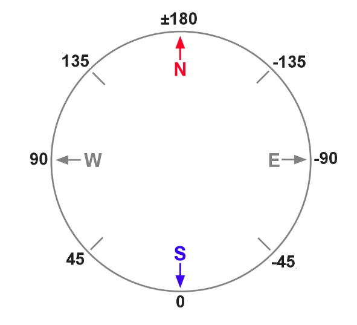

## 6. GPS 위치정보에 의한 이동 

**튜토리얼 레벨 :**  Intermediate(중급)(수정)

**이 튜토리얼 작성 환경 :**  catkin **/** Ubuntu 16.04 **/** ROS Kinetic

**다음 튜토리얼 :** [링크 수정 필요]() 

**이전 튜토리얼 :** [링크 수정 필요]() 

**목록보기:** [README.md](../../README.md) 


GPS 로부터 수신된 위도, 경도 정보를 바탕으로 드론이 최초 이륙한 GPS 위치정보를 이용한 RTB( Return to Base ) 기능 및, 목적지 GPS 좌표를 전달받아 해당 위치로 이동하는 기능을 구현한다. 

---

**필요기능 정의**

- GPS Positiion 정보 구독
- 목표 GPS 좌표 방향을 향해 회전
- 목표 GPS 좌표까지의 이동
- 이동 중 위치확인 및 보정


### 1. 두 지점의 GPS 좌표로부터 두 지점 사이의 거리 및 방위각 계산

GPS 좌표는 지구 표면의 위치를 위도와 경도를 이용하여 특정한다. 두 지점의 GPS 좌표를 이용하여 두 지점간 거리를 계산할 때 평면이 아닌 구면상의 거리를 계산하여야 하는데, 이 때 이용하는 공식이 **Haversine Fomular** 이다. 


위 위성사진의 중심 GPS 좌표는 (36.5199484869802, 127.173065814662) 이다. 경도가 같고, 위도가 0.5도 작은 위치를 `A` , 0.5도 큰 좌표 `B` 는 `A(36.0199484869802, 127.173065814662)` , `B(37.0199484869802, 127.173065814662)` 이다. 이 두 지점 사이의 거리를 구하면 위 지도를 중심으로 하는 위도 1도의 거리를 구할 수 있다.

같은 요령으로 위도가 같고, 경도가 0.5도 작은 위치를 `C` , 0.5도 큰 좌표 `D` 는 `C(36.5199484869802, 126.673065814662)` , `D(36.5199484869802, 127.673065814662)` 이다. 이 두 지점 사이의 거리를 구하면 위 지도를 중심으로 하는 경도 1도의 거리도 구할 수 있다.

파이썬 `haversine` 라이브러리를 이용해 위도 1도 의 거리와 경도 1도의 거리를 구해보자. 우선 `pip` 명령을 이용하여 `haversine` 라이브러리를 설치한다.

```bash
$ pip install haversine
```

```bash
$ python
Python 2.7.17 (default, Feb 27 2021, 15:10:58) 
[GCC 7.5.0] on linux2
Type "help", "copyright", "credits" or "license" for more information.
>>> from haversine import haversine
>>> A = (36.0199484869802, 127.173065814662)
>>> B = (37.0199484869802, 127.173065814662)
>>> C = (36.5199484869802, 126.673065814662)
>>> D = (36.5199484869802, 127.673065814662)
>>> print "distance of latitude  1(deg) is %s(m)" %(haversine(A,B)*1000)
distance of latitude  1(deg) is 111195.080234(m)
>>> print "distance of longitude 1(deg) is %s(m)" %(haversine(C,D)*1000)
distance of longitude 1(deg) is 89361.4927818(m)
>>>
```

위 결과로부터 위성사진에 표시된 지역의 위도 1도는 111195.080234(m), 경도 1도는 89361.4927818(m) 임을 알 수 있으며 이 사실로부터 이 지역의 1(m) 당 위도와 경도를 구할 수 있다. 

**- 1(m) = (위도 1도) / 111195.080234 = 0.00000899320363721**

**- 1(m) = (경도 1도) / 89361.4927818 = 0.0000111905024062**


#### 1.1 두 지점의 위, 경도를 이용한 거리 및 방위각 계산

두 지점의 GPS 좌표로부터 두 지점 사이의 거리 및 방위각 계산하는 코드를 작성해보자.

파이썬 라이브러리 `haversine` 과  `scipy` 를 설치한다.

```bash
$ pip install haversine
```

```bash
$ pip install scipy
```


#### 1.2 거리 및 방위각 계산

두 지점의 GPS 좌표로부터 두 지점 사이의 거리 및 방위각 계산하는 코드 `gps_dist_bear.py` 를 `bb2_pkg` 패키지에 작성하기 위해 작업경로를 변경한다.

```bash
$ roscd bb2_pkg/scripts
```

`touch` 명령으로 파일명이 `gps_dist_bear.py`  이고, 크기가 0 KB 인 빈 파일을 생성한다.

```bash
$ touch gps_dist_bear.py
```

생성된 `gps_dist_bear.py` 파일에 실행속성을 부여한다. 

```bash
$ chmod +x gps_dist_bear.py
```

텍스트 에디터를 이용해 아래 코드와 같이 `gedit gps_dist_bear.py` 파일을 편집한다. 

```bash
$ gedit gps_dist_bear.py &
```

```python
#!/usr/bin/env python
import rospy
from math import degrees, radians, sin, cos, atan2
from haversine import haversine
'''         
                |<-- 100(m)-->|<-- 100(m)-->|
           --- p8------------p1-------------p2-> 36.5208478073 (36.51994848698016+0.000899320363721)
            ^   | .-45        |0          . |
            |   |   .         |         . 45|
           100  |     .       |       .     |
           (m)  |       .     |     .       |
            |   |         .   |   .         |
            v   |-90        . | .           |
           --- p7------------p0-------------p3-> 36.51994848698016
            ^   |           . | .         90|
            |   |         .   |   .         |
           100  |       .     |     .       |
           (m)  |     .       |       .     |
            |   -135.         |         .   |
            v   | .           |       135 . |
           --- p6------------p5-------------p4-> 36.5190491666 (36.51994848698016-0.000899320363721)
                |             v             |
                v        127.173065814662   v
             127.171946764               127.174184865
(127.173065814662-0.00111905024062) (127.173065814662+0.00111905024062)
     
        
        distance  of latitude   1(deg) = 111195.0802340(m/deg)
        distance  of longtitude 1(deg) =  89361.4927818(m/deg)
        latitude  of distance   1(m)   =      0.00000899320363721(deg/m)
        longitude of distance   1(m)   =      0.00001119050240620(deg/m)
        
        -------------+---------------------+----------------------
         Distance(m) |    latitude(deg)    |    longitude(deg)
        -------------+---------------------+----------------------
               1.0   | 0.00000899320363721 |   0.0000111905024062
              10.0   | 0.0000899320363721  |   0.000111905024062
             100.0   | 0.000899320363721   |   0.00111905024062
        -------------+---------------------+----------------------

        p0 = (36.51994848698016, 127.173065814662)
        
        p1 = (36.52084780730000, 127.173065814662);   p5 = (36.51904916660000, 127.173065814662)
        p2 = (36.52084780730000, 127.174184865000);   p6 = (36.51904916660000, 127.171946764000)
        p3 = (36.51994848698016, 127.174184865000);   p7 = (36.51994848698016, 127.171946764000)
        p4 = (36.51904916660000, 127.174184865000);   p8 = (36.52084780730000, 127.171946764000)
'''
def bearing((lat1, long1), (lat2, long2)):
    
    Lat1,  Lat2  = radians(lat1),  radians(lat2) 
    Long1, Long2 = radians(long1), radians(long2) 
    
    y = sin(Long2-Long1)*cos(Lat2) 
    x = cos(Lat1)*sin(Lat2) - sin(Lat1)*cos(Lat2)*cos(Long2-Long1) 
    
    return degrees(atan2(y, x))   
    
if __name__ == '__main__':
    try:
        rospy.init_node('get_distance_n_bearing_from_gps', anonymous = True)
        
        A = (36.0199484869802, 127.173065814662);   B = (37.0199484869802, 127.173065814662)
        C = (36.5199484869802, 126.673065814662);   D = (36.5199484869802, 127.673065814662)
        
        print "latitude  1(deg) is %s0(m)" %(haversine(A,B) * 1000)
        print "longitude 1(deg) is  %s(m)" %(haversine(C,D) * 1000)
        
        p0 = (36.51994848698016, 127.173065814662)        
        p1 = (36.52084780730000, 127.173065814662);   p5 = (36.51904916660000, 127.173065814662)
        p2 = (36.52084780730000, 127.174184865000);   p6 = (36.51904916660000, 127.171946764000)
        p3 = (36.51994848698016, 127.174184865000);   p7 = (36.51994848698016, 127.171946764000)
        p4 = (36.51904916660000, 127.174184865000);   p8 = (36.52084780730000, 127.171946764000)
        
        print "p1: dist = %s(m),\tbearing = %s(deg)" %(haversine(p0,p1)*1000, bearing(p0,p1))
        print "p2: dist = %s(m),\tbearing = %s(deg)" %(haversine(p0,p2)*1000, bearing(p0,p2))
        print "p3: dist = %s(m),\tbearing = %s(deg)" %(haversine(p0,p3)*1000, bearing(p0,p3))
        print "p4: dist = %s(m),\tbearing = %s(deg)" %(haversine(p0,p4)*1000, bearing(p0,p4))
        print "p5: dist = %s(m),\tbearing = %s(deg)" %(haversine(p0,p5)*1000, bearing(p0,p5))
        print "p6: dist = %s(m),\tbearing = %s(deg)" %(haversine(p0,p6)*1000, bearing(p0,p6))
        print "p7: dist = %s(m),\tbearing = %s(deg)" %(haversine(p0,p7)*1000, bearing(p0,p7))
        print "p8: dist = %s(m),\tbearing = %s(deg)" %(haversine(p0,p8)*1000, bearing(p0,p8))
        
    except rospy.ROSInterruptException:  pass
```

코드 실행을 위해 `roscore` 를 구동하고, 다음 명령을 실행한다. 

```bash
$ rosrun bb2_pkg get_dist_bearing.py 
latitude  1(deg) is 111195.0802340(m)
longitude 1(deg) is  89361.4927818(m)
p1: dist = 99.99999512(m),	bearing = 0.0(deg)
p2: dist = 141.421265849(m),	bearing = 44.9996331998(deg)
p3: dist = 100.000458209(m),	bearing = 89.999667025(deg)
p4: dist = 141.422092466(m),	bearing = 134.999369799(deg)
p5: dist = 100.000001828(m),	bearing = 180.0(deg)
p6: dist = 141.422112938(m),	bearing = -134.999361505(deg)
p7: dist = 100.000487161(m),	bearing = -89.9996670249(deg)
p8: dist = 141.421286321(m),	bearing = -44.9996414938(deg)
```

`p0` 로 부터 `p1` , `p2` , ... , `p8` 까지의 각 지점에 대한 거리와 방위각이 비교적 정확히 구해진 것을 확인할 수 있다.


### 2. 기능 구현

#### 2.1 GPS 정보 수신 가능 위성 수 토픽 Subscriber

- 토픽 명     : `/bebop/states/ardrone3/GPSState/NumberOfSatelliteChanged`

- 토픽 형식 : `bebop_msgs.msg.Ardrone3GPSStateNumberOfSatelliteChanged`

- 코드

  ```python
  #!/usr/bin/env python
  
  import rospy
  from bebop_msgs.msg import Ardrone3GPSStateNumberOfSatelliteChanged
  
  class NumOfSatellite:
      def __init__(self):
          rospy.init_node('num_of_satellite', anonymous = True)
          rospy.Subscriber('/bebop/states/ardrone3/GPSState/NumberOfSatelliteChanged',
                           Ardrone3GPSStateNumberOfSatelliteChanged,
                           self.get_num_sat_cb, queue_size = 1)
          self.num_sat = 0
                
      def get_num_sat_cb(self, msg):
          self.num_sat = msg.numberOfSatellite
          print "We can recieve gps signal from %s of satellites!" %(self.num_sat)
          
  if __name__ == '__main__':
      try:
          NumOfSatellite()
          rospy.spin()
          
      except rospy.ROSInterruptException:  pass
  ```

  

#### 2.2 GPS 위치정보 토픽 Subscriber

- 토픽 명     : `/bebop/states/ardrone3/PilotingState/PositionChanged`

- 토픽 형식 : `bebop_msgs.msg.Ardrone3PilotingStatePositionChanged`

- 코드

  ```python
  #!/usr/bin/env python
  
  import rospy
  from bebop_msgs.msg import Ardrone3PilotingStatePositionChanged
  
  class SubGPS:
      def __init__(self):
          rospy.init_node('get_gps_location', anonymous = True)
          rospy.Subscriber('/bebop/states/ardrone3/PilotingState/PositionChanged',
                           Ardrone3PilotingStatePositionChanged,
                           self.get_gps_cb, queue_size = 1)
          self.gps_pos = Ardrone3PilotingStatePositionChanged()
                
      def get_gps_cb(self, msg):
          self.gps_pos = msg
          print "lati = %s, long = %s" %(self.gps_pos.latitude, self.gps_pos.longitude)
          
  if __name__ == '__main__':
      try:
          SubGPS()
          rospy.spin()
          
      except rospy.ROSInterruptException:  pass
  ```


#### 2.3 Bebop2 방위각(Attitude) 토픽 Subscriber

- 토픽 명     : `/bebop/states/ardrone3/PilotingState/AttitudeChanged`

- 토픽 형식 : `bebop_msgs.msg.Ardrone3PilotingStateAttitudeChanged`

- 코드

  ```python
  #!/usr/bin/env python
  
  import rospy
  from bebop_msgs.msg import Ardrone3PilotingStateAttitudeChanged
  from math import degrees
  
  class SubAttitude:
      def __init__(self):
          rospy.init_node('get_bb2_attitude', anonymous = True)
          rospy.Subscriber('/bebop/states/ardrone3/PilotingState/AttitudeChanged',
                           Ardrone3PilotingStateAttitudeChanged,
                           self.get_atti_cb, queue_size = 1)
          self.atti_cur = Ardrone3PilotingStateAttitudeChanged()
                
      def get_atti_cb(self, msg):
          self.atti_cur = msg.yaw
          print "attitude = %s" %(degrees(self.atti_cur))
          
  if __name__ == '__main__':
      try:
          SubAttitude()
          rospy.spin()
          
      except rospy.ROSInterruptException:  pass
  ```

  

#### 2.4 주어진 방위각을 이용한 회전 코드 구현

현재 드론이 향하고 있는 방위각을 토픽 `/bebop/states/ardrone3/PilotingState/AttitudeChanged` 의  `yaw` 로부터 구한 후, `input()` 함수로 입력받은 각도가 `+` 값이 면, 입력박은 각도만큼 `ccw` 회전을, `-` 값이 면 입력 받은 각도 만큼 `cw` 회전을 하는 코드를 구현해보자.  

토픽 `/bebop/states/ardrone3/PilotingState/AttitudeChanged` 중 방위각에 해당하는 `yaw` 값이 나타내는 방위는 다음 그림과 같다. 


정 북 방향에서 동쪽으로 정 남 방향까지 0 ~ 180도, 서쪽으로 정 남 방향까지 0 ~ -180도 로 표현된다. 그림에서 알 수 있듯이

- `ccw` 회전을 하면 180, 135, 90, ... 0 ... -90, -135, -180 와 같이 값이 줄어들고,
- `cw` 회전을 할 경우 -180, -135, -90, ... 0 ... 90, 135, 180 와 같이 값이 커지는 것을 볼 수 있다. 

따라서 현재 드론이 향하고 있는 방위를 `current ` ,  회전이 끝났을 때 향하는 방위를 `target` 이라 할때, 

- 입력 값이 `+` 값이면, `target` = `current` - `abs(입력값)` ( `target` < `current` ) 이 되고, 

- 입력 값이 `-` 값이면,  `target` = `current` + `abs(입력값)` ( `target` > `current` ) 이 된다. 

하지만, `target` >= `pi` (180도) 이거나, `target` <= `-pi`(-180도) 인 경우 (회전 중 정 남향을 지나가는 경우) 는 갑자기 부호가 반대로 바뀌므로 이런 경우는 따로 따져줘야만한다.

**1. `abs(target) < pi`** ( **`target > -pi` and `target < pi`** ) 인 경우

-  `target` < `current` 인 경우와
-  `target` > `current` 인 경우로 나누어 처리 

**2. `abs(target) >= pi`** ( **`target <= -pi` or `target >= pi`** ) 인 경우

일단 토픽 `/bebop/states/ardrone3/PilotingState/AttitudeChanged` 의 `yaw` 값이

- `-` 인 경우에는 `pi` (180도)를 더하고, 
- `+` 인 경우에는 `pi` (180도)를 빼서 각 방위에 해당하는 값을 아래 오른쪽 그림과 같이 바꾸어 준다. 



 `target` 과 `current` 를 이 변경된 값을 기준으로 구하고, 이렇게 구해진 값을 기준으로 

-  `target` < `current` 인 경우와
-  `target` > `current` 인 경우로 나누어 처리 한다.


```python
#!/usr/bin/env python

import rospy
from geometry_msgs.msg import Twist
from math import degrees, radians, pi
from bebop_msgs.msg import Ardrone3PilotingStateAttitudeChanged

class RotateByAtti:
    
    def __init__(self):
        rospy.Subscriber('/bebop/states/ardrone3/PilotingState/AttitudeChanged',
                         Ardrone3PilotingStateAttitudeChanged,
                         self.cb_get_atti)
        self.atti_now  = 0.0
        self.atti_tmp  = 0.0
        
        self.use_tmp   = False

    def cb_get_atti(self, msg):    
        self.atti_now = msg.yaw        
        if   msg.yaw < 0:
            self.atti_tmp = msg.yaw + pi 
        elif msg.yaw > 0:
            self.atti_tmp = msg.yaw - pi
        else:
            self.atti_tmp = 0.0
    
    def get_atti(self):
        if self.use_tmp == True:
            return self.atti_tmp
        else:
            return self.atti_now
        
    
    def rotate(self, angle, speed):
        pb  = rospy.Publisher('/bebop/cmd_vel', Twist, queue_size = 1)
        tw  = Twist()
        
        current = self.atti_now
        
        if angle < 0:
            target  = current + abs(angle)
        else:
            target  = current - abs(angle)
            
        if abs(target) > pi:
            self.use_tmp = True               
            if target  < 0:
                target  = target + pi
            else:
                target  = target - pi
            current = self.get_atti();  angle = abs(target - current)            
        else:
            self.use_tmp = False
        
        print "start rotate from: %s" %(degrees(self.atti_now))
                
        if   target > current:    # cw, -angular.z
            
            tw.angular.z = -speed
            
            if   angle > radians(50):
                target = target - radians(5)
            elif angle > radians(20): 
                target = target - radians(10)
            else:
                tw.angular.z = -0.1125
                
            while target > current:
                if abs(tw.angular.z) > 0.125:
                    tw.angular.z = -speed * abs(target - current) / angle
                else:
                    tw.angular.z = -0.125
                current = self.get_atti();  pb.publish(tw)
                
        elif target < current:    # ccw,  angular.z            
            
            tw.angular.z =  speed
            
            if   angle > radians(50):
                target = target + radians(5)
            elif angle > radians(20): 
                target = target + radians(10)
            else:
                tw.angular.z =  0.1125
                
            while target < current:
                if abs(tw.angular.z) > 0.125:
                    tw.angular.z =  speed * abs(target - current) / angle
                else:
                    tw.angular.z =  0.125
                current = self.get_atti();  pb.publish(tw)
                
        else:   pass
        
        tw.angular.z =  0.0;    pb.publish(tw); rospy.sleep(3.0)
        print "stop rotate to   : %s" %(degrees(self.atti_now)) 
        
        
if __name__ == '__main__':
    
    rospy.init_node('bb2_rotate_by_atti', anonymous = True)
    rba = RotateByAtti()
    
    try:
        while not rospy.is_shutdown():
            angle   = radians(float(input("input angle(deg)   to rotate: ")))
            speed   = radians(float(input("input speed(deg/s) to rotate: ")))
            rba.rotate(angle, speed)            
        rospy.spin()
        
    except rospy.ROSInterruptException:
        pass
```


#### 2.5 현재 지점의 GPS 값을 p1, 입력받은 GPS 값을 p2 로 하여, p1을 기점으로 p2를 향한 방향으로 회전하기

```python
#!/usr/bin/env python
import rospy, sys
from std_msgs.msg import Empty
from geometry_msgs.msg import Twist
from bebop_msgs.msg import Ardrone3PilotingStateAttitudeChanged, \
                           Ardrone3PilotingStatePositionChanged
from scipy import cos, sin, arctan2, pi
from math import degrees, radians

USE_SPHINX = bool(int(sys.argv[1]))
'''
    GPS for center of map  ( 36.51994848698016, 127.17306581466163)
    Parot-Sphinx start GPS ( 48.878900,           2.367780        )
    diffrence              (-12.358951513,     +124.805285815     ) 
'''
OFFSET_LAT = -12.358951513
OFFSET_LON = 124.805285815
PI         =   3.14159265358979323846
ANG_SPD    =   0.25 * PI
'''
        distance  of latitude   1(deg) = 111195.0802340(m/deg)
        distance  of longtitude 1(deg) =  89361.4927818(m/deg)
        latitude  of distance   1(m)   =      0.00000899320363721(deg/m)
        longitude of distance   1(m)   =      0.00001119050240620(deg/m)
        
        -------------+---------------------+----------------------
         Distance(m) |    latitude(deg)    |    longitude(deg)
        -------------+---------------------+----------------------
               1.0   | 0.00000899320363721 |   0.0000111905024062
              10.0   | 0.0000899320363721  |   0.000111905024062
             100.0   | 0.000899320363721   |   0.00111905024062
        -------------+---------------------+----------------------
        
                |<-- 100(m)-->|<-- 100(m)-->|
           --- p8------------p1-------------p2-> 36.5208478073 (36.51994848698016+0.000899320363721)
            ^   | .-45        |0          . |
            |   |   .         |         . 45|
           100  |     .       |       .     |
           (m)  |       .     |     .       |
            |   |         .   |   .         |
            v   |-90        . | .           |
           --- p7------------p0-------------p3-> 36.51994848698016
            ^   |           . | .         90|
            |   |         .   |   .         |
           100  |       .     |     .       |
           (m)  |     .       |       .     |
            |   -135.         |         .   |
            v   | .           |       135 . |
           --- p6------------p5-------------p4-> 36.5190491666 (36.51994848698016-0.000899320363721)
                |             v             |
                v        127.173065814662   v
             127.171946764               127.174184865
(127.173065814662-0.00111905024062) (127.173065814662+0.00111905024062)

        p0 = (36.51994848698016, 127.173065814662)
        
        p1 = (36.52084780730000, 127.173065814662);   p5 = (36.51904916660000, 127.173065814662)
        p2 = (36.52084780730000, 127.174184865000);   p6 = (36.51904916660000, 127.171946764000)
        p3 = (36.51994848698016, 127.174184865000);   p7 = (36.51994848698016, 127.171946764000)
        p4 = (36.51904916660000, 127.174184865000);   p8 = (36.52084780730000, 127.171946764000)
'''
class RotateByGPS:
    
    def __init__(self):
        rospy.Subscriber('/bebop/states/ardrone3/PilotingState/AttitudeChanged',
                         Ardrone3PilotingStateAttitudeChanged,
                         self.cb_get_atti)
        rospy.Subscriber('/bebop/states/ardrone3/PilotingState/PositionChanged',
                         Ardrone3PilotingStatePositionChanged,
                         self.cb_get_gps)
                         
        self.atti_now  = 0.0
        self.atti_tmp  = 0.0
        
        self.use_tmp   = False
        
        self.lati_now = 500.0
        self.long_now = 500.0

    def cb_get_gps(self, msg):
        
        if USE_SPHINX is True:
            self.lati_now = msg.latitude  + OFFSET_LAT
            self.long_now = msg.longitude + OFFSET_LON
        else:
            self.lati_now = msg.latitude
            self.long_now = msg.longitude

    def cb_get_atti(self, msg):
    
        self.atti_now = msg.yaw
        
        if   msg.yaw < 0:
            self.atti_tmp = msg.yaw + PI 
        else:
            self.atti_tmp = msg.yaw - PI
    
    def get_atti(self):
        if self.use_tmp == True:
            return self.atti_tmp
        else:
            return self.atti_now
    
    def get_bearing(self, lat1, lon1, lat2, lon2):
    
        Lat1,  Lon1 = radians(lat1), radians(lon1) 
        Lat2,  Lon2 = radians(lat2), radians(lon2) 
        
        y = sin(Lon2-Lon1) * cos(Lat2) 
        x = cos(Lat1) * sin(Lat2) - sin(Lat1) * cos(Lat2) * cos(Lon2-Lon1) 
        
        return arctan2(y, x)
        
    def get_gps_now(self):
        return self.lati_now, self.long_now     
    
    def rotate(self, lat2, lon2, speed):
        
        pub = rospy.Publisher('/bebop/cmd_vel', Twist, queue_size = 1)
        tw  = Twist()
        
        lat1, lon1 = self.get_gps_now()
        
        target  = self.get_bearing(lat1, lon1, lat2, lon2)
        
        current = self.atti_now;        angle = abs(target-current)
        
        print "target:%s, current:%s, angle:%s" %(degrees(target), degrees(current), degrees(angle))
        
        if angle > pi:  #   if angle > radians(180):
            print "---"
            self.use_tmp = True            
            if   target > 0.0:
                target = target - pi
            elif target < 0.0:
                target = target + pi
            else:   pass
            current = self.get_atti();  angle = abs(target - current)
            print "target:%s, current:%s, angle:%s" %(degrees(target), degrees(current), degrees(angle))
        else:           #   if angle > radians(180):
            self.use_tmp = False        
        
        print "start from: %s" %(degrees(self.atti_now))
            
        if   target > current:    # cw, -angular.z
            tw.angular.z = -speed
            
            if angle > radians(50):
                target = target - radians(5)
            elif angle > radians(20):
                target = target - radians(10)
            else:
                tw.angular.z = -0.1125
                
            while target > current:
                if abs(tw.angular.z) > 0.125:
                    tw.angular.z = -speed * abs(target - current) / angle
                else:
                    tw.angular.z = -0.125
                pub.publish(tw);    current = self.get_atti()
        elif target < current:    # ccw,  angular.z
            tw.angular.z =  speed
           if angle > radians(50):
                target = target + radians(5)
            elif angle > radians(20):
                target = target + radians(10)
            else:
                tw.angular.z =  0.1125
            while target < current:
                if abs(tw.angular.z) > 0.125:
                    tw.angular.z =  speed * abs(target - current) / angle
                else:
                    tw.angular.z =  0.125
                pub.publish(tw);    current = self.get_atti()
        else:   pass
        
        tw.angular.z = 0.0; pub.publish(tw); rospy.sleep(3.0)
        print "stop to   : %s" %(degrees(self.atti_now))
        
            
if __name__ == '__main__':
    
    rospy.init_node('bb2_rotate_to_gps', anonymous = True)
    rbg = RotateByGPS()
    
    try:
        while not rospy.is_shutdown():
            p2_lati_deg = float(input("input target latitude : "))
            p2_long_deg = float(input("input target longitude: "))
            
            rbg.rotate(p2_lati_deg, p2_long_deg)
            
        rospy.spin()
        
    except rospy.ROSInterruptException:
        pass
```

 

#### 2.6 주어진 GPS 좌표로 이동

입력 받은 GPS 경, 위도 지점으로 Bebop2 드론을 이동하는 코드를 작성해보자. 

```python
#!/usr/bin/env python
import rospy, sys
from std_msgs.msg import Empty
from geometry_msgs.msg import Twist
from bebop_msgs.msg import Ardrone3PilotingStateAttitudeChanged, \
                           Ardrone3PilotingStatePositionChanged, \
                           Ardrone3PilotingStateAltitudeChanged, \
                           Ardrone3GPSStateNumberOfSatelliteChanged
from scipy import sqrt, cos, sin, arctan2, pi
from math import degrees, radians

USE_SPHINX = bool(int(sys.argv[1]))
'''
    GPS for center of map  ( 36.51994848698016, 127.17306581466163)
    Parot-Sphinx start GPS ( 48.878900,           2.367780        )
    diffrence              (-12.358951513,     +124.805285815     ) 
'''
OFFSET_LAT = -12.358951513
OFFSET_LON = 124.805285815
LIN_SPD    =   0.55
ANG_SPD    =   0.25 * pi
FLIGHT_ALT =  10.0
DEG_PER_M  =   0.00000899320363721
'''
                               p2 (lat2,lon2)
                       | | |   /         
                       | | |  / 
                       | | |0/  
                       | | |/              
                       | |0/    
                       | |/      
                       |0/<--- bearing         
                       |/________     
                       p1 (lat1,lon1)
                       
  when center is (a,b), equation of circle : pow((x-a),2) + pow((y-b),2) = pow(r,2)
'''
class MoveByGPS:
    
    def __init__(self):
        rospy.init_node('bb2_move_to_gps', anonymous = True)
        
        rospy.Subscriber('/bebop/states/ardrone3/PilotingState/AttitudeChanged',
                         Ardrone3PilotingStateAttitudeChanged,
                         self.cb_get_atti)
        rospy.Subscriber('/bebop/states/ardrone3/PilotingState/PositionChanged',
                         Ardrone3PilotingStatePositionChanged,
                         self.cb_get_gps)
        rospy.Subscriber('/bebop/states/ardrone3/PilotingState/AltitudeChanged',
                         Ardrone3PilotingStateAttitudeChanged,
                         self.cb_get_alti)
        rospy.Subscriber('/bebop/states/ardrone3/GPSState/NumberOfSatelliteChanged',
                         Ardrone3GPSStateNumberOfSatelliteChanged,
                         self.cb_get_num_sat)   
                            
        self.atti_now    = self.atti_tmp  =   0.0        
        self.use_tmp     = False        
        self.lati_now    = self.long_now  = 500.0
        self.alti_gps    = self.alti_bar  =   0.0
        self.bearing_now = self.bearing_ref = 0.0
        
        
        self.margin_angle  = radians(5.0)
        self.margin_radius = DEG_PER_M * 1.5
        self.margin_alt    = 0.25
        
        rospy.sleep(3.0)


    def cb_get_num_sat(self, msg):
        pass


    def cb_get_alti(self, msg):
        self.alti_bar = msg.altitude


    def cb_get_gps(self, msg):
        
        if USE_SPHINX is True:
            self.lati_now = msg.latitude  + OFFSET_LAT
            self.long_now = msg.longitude + OFFSET_LON
        else:
            self.lati_now = msg.latitude
            self.long_now = msg.longitude
            
        self.alti_gps = msg.altitude


    def cb_get_atti(self, msg):
    
        self.atti_now = msg.yaw
        
        if   msg.yaw < 0:
            self.atti_tmp = msg.yaw + pi 
        elif msg.yaw > 0:
            self.atti_tmp = msg.yaw - pi
        else:
            self.atti_tmp = 0.0
            
    
    def get_atti(self):
        if self.use_tmp == True:
            return self.atti_tmp
        else:
            return self.atti_now
            
    
    def get_bearing(self, lat1, lon1, lat2, lon2):
    
        Lat1,  Lon1 = radians(lat1), radians(lon1) 
        Lat2,  Lon2 = radians(lat2), radians(lon2) 
        
        y = sin(Lon2-Lon1) * cos(Lat2) 
        x = cos(Lat1) * sin(Lat2) - sin(Lat1) * cos(Lat2) * cos(Lon2-Lon1) 
        
        return arctan2(y, x)
    
        
    def get_gps_now(self):
        return self.lati_now, self.long_now
            
    
    def rotate(self, lat2, lon2, speed):
        
        pub = rospy.Publisher('/bebop/cmd_vel', Twist, queue_size = 1)
        tw  = Twist()
        
        lat1, lon1 = self.get_gps_now()
        
        target  = self.get_bearing(lat1, lon1, lat2, lon2)
        
        current = self.atti_now;        angle = abs(target-current)
        
        if angle > pi:  #   if angle > radians(180):
            self.use_tmp = True            
            if   target > 0.0:
                target = target - pi
            elif target < 0.0:
                target = target + pi
            else:   pass
            current = self.get_atti();  angle = abs(target - current)
        else:           #   if angle > radians(180):
            self.use_tmp = False        
        
        print "start rotate from: %s" %(degrees(self.atti_now))
            
        if   target > current:    # cw, -angular.z
            
            tw.angular.z = -speed
            
            if   angle > radians(50):
                target = target - radians(5)
            elif angle > radians(20): 
                target = target - radians(10)
            else:
                tw.angular.z = -0.1125
                
            while target > current:
                if abs(tw.angular.z) > 0.125:
                    tw.angular.z = -speed * abs(target - current) / angle
                else:
                    tw.angular.z = -0.125
                current = self.get_atti();  pub.publish(tw)
                
        elif target < current:    # ccw,  angular.z            
            
            tw.angular.z =  speed
            
            if   angle > radians(50):
                target = target + radians(5)
            elif angle > radians(20): 
                target = target + radians(10)
            else:
                tw.angular.z =  0.1125
                
            while target < current:
                if abs(tw.angular.z) > 0.125:
                    tw.angular.z =  speed * abs(target - current) / angle
                else:
                    tw.angular.z =  0.125
                current = self.get_atti();  pub.publish(tw)
                
        else:   pass
        
        print "stop rotate to   : %s" %(degrees(self.atti_now))
        
        
    def check_route(self, lat2, lon2):
        
        lat_now, lon_now = self.get_gps_now()
        
        bearing = self.get_bearing(lat_now, lon_now, lat2, lon2)
        
        if bearing > self.bearing_ref - self.margin_angle and \
           bearing < self.bearing_ref + self.margin_angle:
            return True
        else:
            return False
        
        
    def check_alt(self):
        if self.alti_gps > FLIGHT_ALT - self.margin_alt and \
           self.alti_gps < FLIGHT_ALT + self.margin_alt:
            return True
        else:
            return False
            
    
    def check_arrived(self, lat2, lon2):
        '''
        when center is (a,b), equation of circle : pow((x-a),2) + pow((y-b),2) = pow(r,2)
        pow((lat_now-lat2), 2) + pow((lon_now-lon2), 2) = pow(self.margin_radius, 2)
        self.margin_radius = sqrt(pow((lat_now-lat2), 2) + pow((lon_now - lon2), 2))
        '''
        lat_now, lon_now = self.get_gps_now()
        radius = sqrt(pow((lat_now-lat2), 2) + pow((lon_now - lon2), 2))
        
        if radius < self.margin_radius:
            return True
        else:
            return False
    
    
    def move_to_target(self, lat1, lon1, lat2, lon2):
        
        pub = rospy.Publisher('/bebop/cmd_vel', Twist, queue_size=1)        
        tw  = Twist()
        
        while self.check_arrived(lat2, lon2) is False:
            
            if self.check_alt() is False:
                if self.check_alt() > FLIGHT_ALT:
                    tw.linear.z = -0.1
                else:
                    tw.linear.z =  0.1
            else:
                tw.linear.z = 0.0
            
            if self.check_route(lat2, lon2) is True:
                tw.linear.x = LIN_SPD;  pub.publish(tw)
                
            else:
                lat1, lon1 = self.get_gps_now()
                self.bearing_ref = self.get_bearing(lat1, lon1, lat2, lon2)
                self.rotate(lat2, lon2, radians(45))
                
        tw.linear.x = 0;  pub.publish(tw); rospy.sleep(2.0)
        print "arrived to target gps position(%s, %s) %s(m) above sea level!!!" \
              %(self.lati_now, self.long_now, self.alti_gps)
              
            
if __name__ == '__main__':
    
    take = rospy.Publisher('/bebop/takeoff', Empty, queue_size = 1)
    land = rospy.Publisher('/bebop/land',    Empty, queue_size = 1)
    cmd  = rospy.Publisher('/bebop/cmd_vel', Twist, queue_size = 1)
    
    mbg  = MoveByGPS()
    tw   = Twist()
    off  = empty = Empty()
    
    take.publish(off);  rospy.sleep(0.5)
    
    tw.linear.z = LIN_SPD
    
    while mbg.alti_gps < FLIGHT_ALT:
        cmd.publish(tw)
    print "now reached flight altitude!"
    tw.linear.z = 0.0;  cmd.publish(tw)       
    
    try:
        while not rospy.is_shutdown():
            p2_lati_deg = float(input("input target latitude : "))
            p2_long_deg = float(input("input target longitude: "))
            
            p1_lati_deg = mbg.lati_now
            p1_long_deg = mbg.long_now
            print "p1(%s, %s), p2(%s, %s)" %(p1_lati_deg, p1_long_deg, p2_lati_deg, p2_long_deg)
            
            mbg.bearing_ref = mbg.get_bearing(p1_lati_deg, p1_long_deg, p2_lati_deg, p2_long_deg)
            
            mbg.rotate(p2_lati_deg, p2_long_deg, radians(45))        
            mbg.move_to_target(p1_lati_deg, p1_long_deg, p2_lati_deg, p2_long_deg)
        
        rospy.spin()
        
    except rospy.ROSInterruptException:
        land.publish(empty);    rospy.sleep(5.0)
```

 


**Sphinx 를  이용한 GPS 위치로 이동 테스트를 위한 지도상의 장소와 그 GPS 좌표**


| Location | GPS(Latitude, Longitude)                  |
| -------- | ----------------------------------------- |
| a.       | (36.520398094760720, 127.172979977470760) |
| b.       | (36.520032823914410, 127.172413021085160) |
| c.       | (36.519747571654280, 127.172567676021660) |
| d.       | (36.519470468451750, 127.172554999387500) |
| e.       | (36.519505106406320, 127.172889662528730) |
| f.       | (36.519806659708810, 127.172780643475150) |
| g.       | (36.520314000116294, 127.173984923700260) |
| h.       | (36.520102099307820, 127.174040700890460) |
| i.       | (36.520134699469990, 127.174281556939050) |
| j.       | (36.520346600189160, 127.174220709095200) |
| k.       | (36.520110249349656, 127.173039246793640) |
| l.       | (36.520214162307674, 127.173490534968900) |
| m.       | (36.520250837436016, 127.173688290461430) |


[튜토리얼 목록 열기](../../README.md)