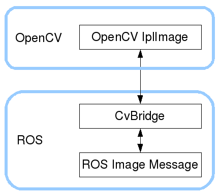
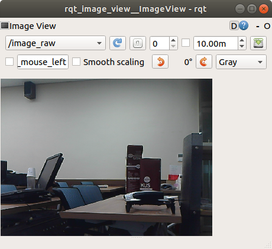
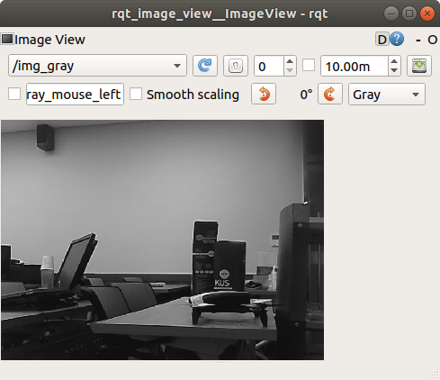

## cv_bridge/ Tutorials/ ConvertingBetweenROSImageAndOpenCVImagePython


---

## ROS Image 토픽과 OpenCV Image 간의 상호 변환  

**출처 :**  <http://wiki.ros.org/cv_bridge/Tutorials/ConvertingBetweenROSImagesAndOpenCVImagesPython>

**튜토리얼 레벨 :**  중급

**선수 학습 :**  ROS 튜토리얼 

**이전 튜토리얼 :** 

**다음 튜토리얼 :** 

**빌드 환경 :**  catkin **/** Ubuntu 18.04 **/** Melodic

---

`uvc_camera` 패키지의 `uvc_camera_node` 노드를 실행할 경우 `rostopic list` 명령을 실행하면

```
$ rostopic list
/camera_info
/image_raw
/image_raw/compressed
︙
```

이 들 토픽 중 `/image_raw` 토픽의 `type` 을 알아보려면 `rostopic type` 을 사용한다. 

```
$ rostopic type /image_raw
sensor_msgs/Image
```

`sensor_msgs/Image` 타입 임을 알 수 있다.

이런 영상소스를 OpenCV 라이브러리를 이용하여 처리하려면 형식이 맞지 않아 곤란하다. ROS 에서는 이 같은 상황에서 `sensor_msgs/Image` 타입의 데이터를 OpenCV 가 처리할 수 있는 형태로 변경하거나, 이렇게 처리된 OpenCV 형식의데이터를 ROS 에서 publish 할 수 있는 `sensor_msgs/Image` 타입으로 변경할 수 있는 방법으로 CvBridge 라이브러리를 제공한다. 



CvBridge 와 OpenCV 라이브러리를 사용하여 `/image_raw` 토픽을 그레이스케일로 변환하여 토픽명 `/img_gray` 으로 재발행하는 노드 예제를 작성해보자.

작업 경로를 `~/catkin_ws/src` 로 변경

```
cd ~/catkin_ws/src
```

ROS 노드 패키지 `related_cv` 생성

```
catkin_create_pkg related_cv rospy
```

작업 경로를 `~/catkin_ws/src/related_cv` 로 변경

```
cd src/related_cv
```

`scripts` 폴더 생성

```
mkdir scripts
```

작업 경로를 `~/catkin_ws/src/related_cv/scripts` 로 변경

```
cd scripts
```

파일명 `grayscale.py` 파일 생성

```
touch grayscale.py
```

파일 `grayscale.py` 에 실행 속성 부여

```
chmod +x grayscale.py
```

파일 `grayscale.py` 편집

```
gedit grayscale.py
```

```python
#!/usr/bin/env python
import rospy, cv2
from sensor_msgs.msg import Image
from cv_bridge import CvBridge, CvBridgeError

class image_converter:

  def __init__(self):
    rospy.init_node('image_converter', anonymous=True)
    rospy.Subscriber("/image_raw", Image, self.get_img_cb)
    self.image_pub = rospy.Publisher("/img_gray", Image, queue_size=10)
    self.bridge = CvBridge()

  def get_img_cb(self, msg):
    try:
      cv_img = self.bridge.imgmsg_to_cv2(msg, "bgr8")
    except CvBridgeError as e:
      print(e)
      
    img = cv2.cvtColor(cv_img, cv2.COLOR_BGR2GRAY)
    '''
    cv2.imshow("Grayscale Conversion", img)
    cv2.waitKey(3)
    '''
    try:
      self.image_pub.publish(self.bridge.cv2_to_imgmsg(img, "mono8"))
    except CvBridgeError as e:
      print(e)

if __name__ == '__main__':
  ic = image_converter()
  try:
    rospy.spin()
  except KeyboardInterrupt:
    print("Shutting down")
  #cv2.destroyAllWindows()
```

패키지 `related_cv` 빌드를 위해 작업경로를 `~/catkin_ws` 로 변경

```
cd ~/catkin_ws
```

패키지 `related_cv` 빌드

```
catkin_make --only-pkg-with-deps related_cv
```

위 명령 대신 `catkin_make` 만 실행해도 상관없다. 차이점은 빌드 대상이 ROS 워크스페이스( `~/catkin_ws/src` )의 모든 패키지인가, 해당 패키지만인가의 차이다. 

`source` 명령으로 빌드 정보를 반영한다. 

```
source ~/catkin_ws/devel/setup.bash
```

`roscore` ,  `rosrun uvc_camera uvc_camera_node` 를 각각의 터미널에서 실행 후, 좀 전에 작성한 `related_cv` 패키지의 `grayscale.py` 를 실행한다.

```
rosrun related_cv grayscle.py
```

추가로 2개의 터미널을 열고, 각 터미널에서`rqt_image_view` 를 실행 후 하나는 `/image_raw` 토픽을, 다른 하나는 `/img_gray` 를 선택해 주면 다음과 같은 영상을 확인할 수 있다. 

  


---


[튜토리얼 목록](../README.md) 


