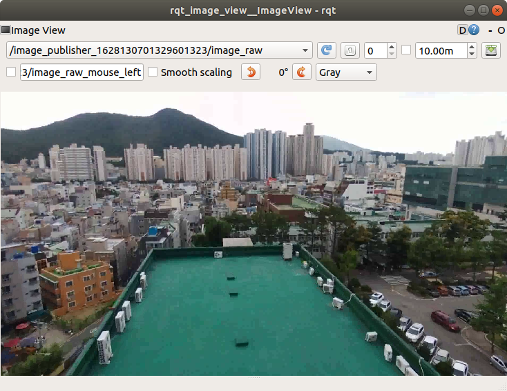

## image_publisher


---

## 동영상 파일을 sensor_msgs/Image 토픽으로 발행  

**출처 :**  <http://wiki.ros.org/image_publisher>

**소스 :**  https://github.com/ros-perception/image_pipeline.git (branch: indigo)

**빌드 환경 :**  catkin **/** Ubuntu 18.04 **/** Melodic

---

드론의 카메라 영상을 처리해야 할 경우, 매 번 드론을 비행시키면서 발행하는 토픽을 Subscribe 하여 테스트한다는 것은 매우 번거러운 작업이다. 이런 경우 드론이 촬영한 동영상 파일을 `sensor_msgs/Image` 토픽으로 Publish 한다면, 보다 편리하게 작업을 할 수 있다. 

이 때 사용할 수 있는 ROS 패키지가 `image_publisher` 패키지이다. ( `image_publisher` 패키지는 메타 패키지 `image_pipeline` 중 하나로 ROS 설치를 Desktop Full 옵션으로 설치했다면 기본으로 설치되어 있다. )

`rosrun image_publisher image_publisher` 를 실행할 경우 아래와 같은 에러 메세지가 출력된다면 이미 설치되어 있는 것이다. 

```
$ rosrun image_publisher image_publisher 
[ERROR] [1628125244.150584943]: image_publisher requires filename. Typical command-line usage:
	$ rosrun image_publisher image_publisher <filename>
```

설치가 되어있지 않다면 다음 명령으로 설치한다. 

```
sudo apt install ros-melodic-image-publisher
```

그럼 `~/Videos/sample1.mp4` 파일을 `image_publisher` 노드로 `sensor_msgs/Image` 형식의 토픽으로 발행해보자. 

`roscore` 를 실행 후, 다음 명령을 실행한다. 

```
rosrun image_publisher image_publisher ~/Videos/bebop2_2021023.mp4
```

`rostopic list` 실행.

```
$ rostopic list
/image_publisher_1628130701329601323/camera_info
/image_publisher_1628130701329601323/image_raw
/image_publisher_1628130701329601323/image_raw/compressed
/image_publisher_1628130701329601323/image_raw/compressed/parameter_descriptions
/image_publisher_1628130701329601323/image_raw/compressed/parameter_updates
︙
```

이 들 토픽 중 `/image_pub.../image_raw` 토픽의 `type` 을 알아보려면 `rostopic type` 을 사용한다. 

```
$ rostopic type /image_publisher_1628130701329601323/image_raw
sensor_msgs/Image
```

`rqt_image_view` 를 실행하여 확인해보자. 



이제 드론을 직접 띄우지 않아도 드론 영상으로부터 토픽을 발행할 수 있다. 

불편한 점이 하나 있다. 토픽명이 너무 길다. 이것을 개선하기 위해서는 소스코드를 수정해야 한다. 바이너리로 설치( `apt-get install` )한 패키지를 삭제하고, https://github.com/ros-perception/image_pipeline.git 으로부터 소스코드를 복사하여 수정 후 빌드하면된다. 

우선 실행 중인 `image_publisher` 노드를 종료한 후 다음 내용들을 진행한다. 

바이너리 설치파일 삭제

```
sudo apt-get remove ros-melodic-image-publisher
```

임시 저장 폴더 생성

```
mkdir ~/temp
```

작업 경로 변경

```
cd ~/temp
```

소스코드 복사

```
git clone https://github.com/ros-perception/image_pipeline.git
```

작업경로 변경

```
cd image_pipeline
```

`image_publisher` 폴더를 `~/catkin_ws/src` 로 복사

```
cp -r ./image_publisher ~/catkin_ws/src
```

작업경로 변경

```
cd ~/catkin_ws/src/image_publisher/src/node
```

`image_publisher.cpp` 편집

```
gedit image_publisher.cpp &
```

수정 전

```c
#include <ros/ros.h>
#include <nodelet/loader.h>

int main(int argc, char **argv)
{
  ros::init(argc, argv, "image_publisher", ros::init_options::AnonymousName);
```

수정 후

```c
#include <ros/ros.h>
#include <nodelet/loader.h>

int main(int argc, char **argv)
{
  ros::init(argc, argv, "image_publisher");	//, ros::init_options::AnonymousName);
```

빌드를 위해 작업경로 변경

```
cd ~/catkin_ws
```

빌드

```
catkin_make --only-pkg-with-deps image_publisher
```

위 명령 대신 `catkin_make` 만 실행해도 상관없다. 차이점은 빌드 대상이 ROS 워크스페이스( `~/catkin_ws/src` )의 모든 패키지인가, 해당 패키지만인가의 차이다. 

`source` 명령으로 빌드 정보를 반영한다. 

```
source ~/catkin_ws/devel/setup.bash
```

`image_publisher` 노드를 다시 실행한다. 

```
rosrun image_publisher image_publisher ~/Videos/bebop2_2021023.mp4
```

`rostopic list` 를 실행하여 토픽명을 확인한다. 

```
$ rostopic list
/image_publisher/camera_info
/image_publisher/image_raw
/image_publisher/image_raw/compressed
/image_publisher/image_raw/compressed/parameter_descriptions
/image_publisher/image_raw/compressed/parameter_updates
︙
```


---


[튜토리얼 목록](../README.md) 


