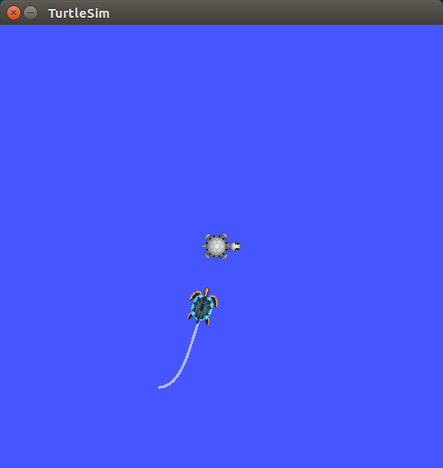
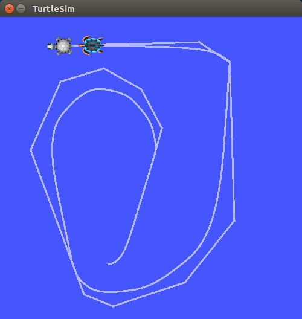
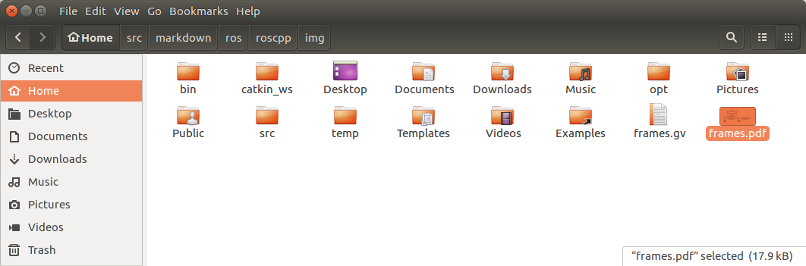
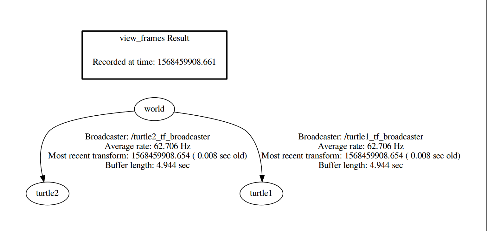
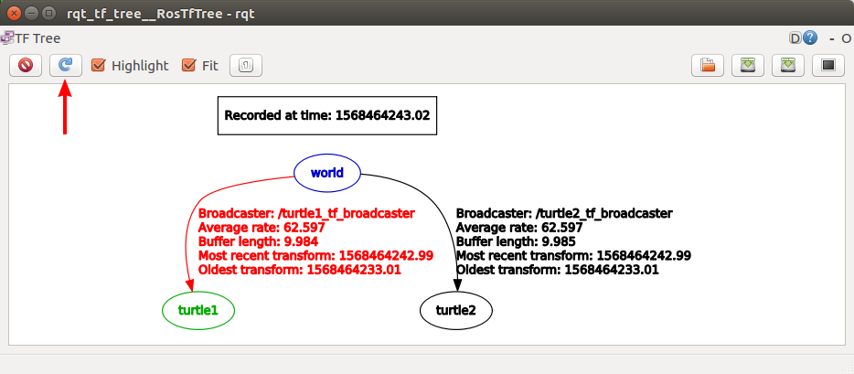
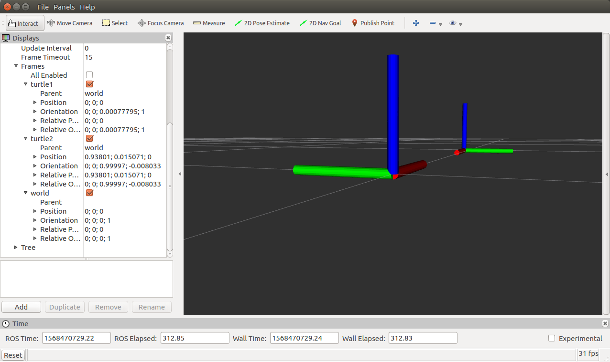

## tf/ Tutorials/ Instroduction to tf


---

## Instroduction to tf

**튜토리얼 레벨 :**  beginner(초급)

**이 튜토리얼 작성 환경 :**  catkin **/** Ubuntu 16.04 **/** Kinetic

**다음 튜토리얼 :** [tf broadcaster](./tf_1_broadcaster.md)

**튜토리얼 목록 :** [README.md](../README.md)

**튜토리얼 원문 :** <http://wiki.ros.org/tf/Tutorials/Introduction%20to%20tf>

------


### 1. 데모 설치

```
user@computer:~$ sudo apt-get install ros-kinetic-ros-tutorials ros-kinetic-geometry-tutorials ros-kinetic-rviz ros-kinetic-rosbash ros-kinetic-rqt-tf-tree
```


### 2. 데모 실행

```
user@computer:~$ roslaunch turtle_tf turtle_tf_demo.launch
```

데모가 실행되면 두 번째 거북이가 가운데 있는 첫 번째 거북이를 향해 접근한다. 이 때 키보드 방향키(화살표키)를 조작하면 첫 번 째 거북이를 제어할 수 있다. 첫 번 째 거북이를 조작하면 두 번 째 거북이가 첫 번 째 거북이를 계속 쫓아다니는 데모 코드이다.

    

간 혹 키 조작이 되지 않는 경우에는 다른 터미널 창에서 다음 명령을 실행하고 포커스를 데모를 실행한 창으로 옮기면 키 조작이 제대로 동작한다. ( 이 때 한쪽 구석에 나타난 세 번 째 거북이나 아래 명령을 실행한 창에 나타난 빨간 에러 메세지는 무시한다. )

```
user@computer:~$ rosrun turtle_tf turtle_tf_listener
```


### 3. 무슨일이 벌어지고 있는가?

이 데모에서는 tf 라이브러리를 사용하여 월드 프레임, turtle1 프레임 및 turtle2 프레임의 세 가지 좌표 프레임을 만든다. 그리고나서는 tf 브로드 캐스터를 이용하여 거북이 좌표 프레임을 Publish하고 tf 리스너를 사용하여 거북이 프레임의 차이를 계산하고 한 거북이를 움직여 다른 거북이를 따라가도록 한다.


### 4. tf Tools

이 데모의 동작에 tf가 어떻게 사용되었는 지 살펴보자. 보여지는 장면( 두 번 째 거북이가 첫 번 째 거북이를 따라다니는 ) 이면에서 tf가 무얼 하고 있는가를 살펴보기 위해 tf Tools를 사용할 수 있다.


#### 4.1 view_frames

view_frames 는 tf 가 ROS 를 통해 broadcast 하고 있는 tf 프레임들의 다이어그램 pdf 파일을 만들어낸다.

```
user@computer:~$ rosrun tf view_frames
Listening to /tf for 5.000000 seconds
Done Listening
dot - graphviz version 2.38.0 (20140413.2041)

Detected dot version 2.38
frames.pdf generated
user@computer:~$ 
```

노틸러스에서 생성된 frames.pdf 파일을 연다.





이 frames.pdf 파일에서  tf 에 의해 broadcast 되고 있는 `world`, `turtle1`, `turtle2` 3개의 frame 들을 볼 수 있다. 그 뿐이 아니라, `world` 프레임이  `turtle1` 프레임과  `turtle2` 프레임의 parent 인 것도 알 수 있다. 또한 view_frames 는 언제 가장 오래된 프레임과 가장 최근 프레임의 변환이 수신되었는지와 얼마나 빠르게 tf 프레임이 다른 tf 에게 publish 되는가에 대한 것과 같은 몇 가지 진단 정보 레포트를 제공한다. 


#### 4.2 rqt_tf_tree

[rqt_tf_tree](http://wiki.ros.org/rqt_tf_tree) 는 ROS 전체에 broadcast 되고 있는 프레임 tree 의 시각화를 위한 runtime tool 이다. 단순히 화면 상단 왼쪽(빨간색 화살표)에 있는 refresh 버튼을 누르는 것만으로 디스플레이 되는 정보를 최신 정보로 갱신할 수 있다.

사용법 :

```
user@computer:~$ rosrun turtle_tf turtle_tf_listener
```




#### 4.3 tf_echo

tf_echo 는 ROS 에서 broadcast 되고 있는 아무 두 프레임들 사이의 변환에 대한 레포트를 제공한다.

사용법 :

```
user@computer:~$ rosrun tf tf_echo [refernce_frame] [target_frame]
```

다음 수식과 등가인 turtle1 프레임에 대한 turtle2 프레임의 변환을 살펴보자


```
user@computer:~$ rosrun tf tf_echo turtle1 turtle2
At time 1568466477.728
- Translation: [-2.508, 0.027, 0.000]
- Rotation: in Quaternion [0.000, 0.000, -0.005, 1.000]
            in RPY (radian) [0.000, 0.000, -0.011]
            in RPY (degree) [0.000, 0.000, -0.613]
At time 1568466478.496
- Translation: [-1.692, 0.018, 0.000]
- Rotation: in Quaternion [0.000, 0.000, -0.005, 1.000]
            in RPY (radian) [0.000, 0.000, -0.011]
            in RPY (degree) [0.000, 0.000, -0.608]
At time 1568466479.488
- Translation: [-1.016, 0.011, 0.000]
- Rotation: in Quaternion [0.000, 0.000, -0.005, 1.000]
            in RPY (radian) [0.000, 0.000, -0.011]
            in RPY (degree) [0.000, 0.000, -0.608]
```

키보드로 첫 번 째 거북이를 조종하면 두 거북이의 상대적인 움직임 변화에 의한 변환값의 변화를 볼 수 있다.


### 5. rviz and tf

[rviz](http://wiki.ros.org/rviz) 는 tf 프레임들을의 검사에 유용한 시각화 툴이다. rviz를 이용하여 두 거북이들의 프레임들을 살펴보자.  -d 옵션으로 turtle_tf 설정 파일과 함께 rviz를 구동한다. : 

```
user@computer:~$ rosrun rviz rviz -d `rospack find turtle_tf`/rviz/turtle_rviz.rviz
```



rviz 화면의 왼쪽 사이드바에서 tf 에의한 각 프레임들의 `broadcast` 를 확인할 수 있다. 또 거북이를 조종하면 rviz 화면속의 프레임이 움직이는 것을 볼 수 있다.

지금까지 `turtle_tf_demo` 노드를 조사해봤다. 이제 이 데모에 사용된 `tf` `broadcaster` 가 [C++](../roscpp/tf_1_broadcaster.md)으로, 또는 [파이썬](./tf_1_broadcaster.md)으로 어떻게 작성되었는지 들여다 보자.


[튜토리얼 목록 열기](../README.md)  

[다음 튜토리얼](./tf_1_broadcaster.md)

