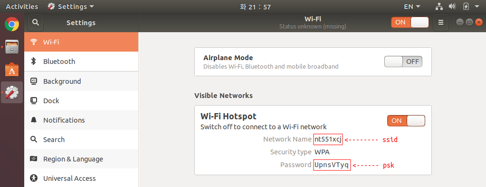

## Tuetlebot3

---

## 우분투 18.04 핫스팟 설정


**튜토리얼 목록 :** [README.md](../../README.md)

---

우분투로 운영하는 노트북(PC)의 내장 WiFi 를 Hotspot 으로 동작 시키고, 터틀봇3의 SBC(라즈베리파이)가 이 Hotspot 에 연결하면 노트북 WiFi 인터페이스의 IP 주소는 10.42.0.1 이되고, 터틀봇3의 SBC(라즈베리파이)는 10.42.0.xxx 와 같은 형식의 IP 주소를 할당받게 된다. 

이렇게 사용할 경우 비교적 안정된 네트워크 속도를 보장받을 수 있고, 별다른 장비 추가 없이 터틀봇3를 운영하는 것이 가능하다는 장점이 있다.

그럼 우분투 18.04 LTS 에서 WiFi 핫스팟 구성 방법을 알아보자.


### 1. PC 핫스팟 구동

화면 오른쪽 상단에 있는  버튼을 클릭 후 [ WiFi ... ] - [ WiFi Settings ] 메뉴를 선택한다. 

 

윈도우의 제어판에 해당하는 Settings 의 WiFi 항목이 열리면 버튼을 클릭 후, [ Turn On Wi-Fi Hotspot... ] 메뉴를 선택한다. 


Turn On WiFi Hotspot? 을 묻는 팝업창이 나타나면 [ Turn On ] 버튼을 클릭한다. 


Hotspot 이 구동된 화면이다. 아래 그림에 표시한 Network Name 과 Password 에 해당하는 문자열들은 SBC의 WiFi 연결 설정파일(`/etc/wpa_supplicant/wpa_supplicant.conf`)의 `ssid` 와 `psk` 값으로 적어 주어야 할 정보이므로 정확히 메모해 둔다.



`Ctrl` + `Alt`  + `T` 를 입력하여 터미널 창을 열고 `ifconfig` 명령을 실행하여 WiFi 인터페이스에 할당된 IP 주소를 알아보면 10.42.0.1 이라는 주소가 할당되어 있는 것을 확인할 수 있다. 

```bash
$ ifconfig
eth0: flags=4163<UP,BROADCAST,RUNNING,MULTICAST>  mtu 1500
        inet 192.168.100.6  netmask 255.255.255.0  broadcast 192.168.100.255
        inet6 fe80::971e:bdb4:6d77:3537  prefixlen 64  scopeid 0x20<link>
        ether 8c:b0:e9:21:4d:2b  txqueuelen 1000  (Ethernet)
        RX packets 150901  bytes 47713952 (47.7 MB)
        RX errors 0  dropped 0  overruns 0  frame 0
        TX packets 134804  bytes 166469723 (166.4 MB)
        TX errors 0  dropped 0 overruns 0  carrier 0  collisions 0

lo: flags=73<UP,LOOPBACK,RUNNING>  mtu 65536
        inet 127.0.0.1  netmask 255.0.0.0
        inet6 ::1  prefixlen 128  scopeid 0x10<host>
        loop  txqueuelen 1000  (Local Loopback)
        RX packets 32255  bytes 2555993 (2.5 MB)
        RX errors 0  dropped 0  overruns 0  frame 0
        TX packets 32255  bytes 2555993 (2.5 MB)
        TX errors 0  dropped 0 overruns 0  carrier 0  collisions 0

wlan0: flags=4099<UP,BROADCAST,MULTICAST>  mtu 1500
        inet 10.42.0.1  netmask 255.255.255.0  broadcast 10.42.0.255
        inet6 fe80::d6e4:2433:4a6f:646b  prefixlen 64  scopeid 0x20<link>
        ether 78:2b:46:8d:82:0e  txqueuelen 1000  (Ethernet)
        RX packets 272410  bytes 236146129 (236.1 MB)
        RX errors 0  dropped 5  overruns 0  frame 0
        TX packets 272177  bytes 23930691 (23.9 MB)
        TX errors 0  dropped 0 overruns 0  carrier 0  collisions 0

```


### 2. SBC의 WiFi 연결 설정

터틀봇3에 탑재된 라즈베리파이의 마이크로 SD 카드를 꺼내어 노트북(PC)에 연결 후, 아래 그림과 같이 `boot` 와 `rootfs` 2개의 파티션이 나타나면 그 중 `rootfs` 를 연다. 


`rootfs` 의`etc` 폴더를 연다. 


`etc` 의 `wpa_supplicant` 폴더를 연다.


`wpa_supplicant` 창에서 마우스 오른쪽 버튼을 클릭하여 열린 메뉴에서 '터미널에서 열기(Open in Terminal)'를 선택한다. 


앞서 핫스팟 구동시 메모한 Network Name 과 Password 에 해당하는 문자열을 `ssid` 와 `psk` 항목 값으로 하여 다음과 같이 `wpa_supplicant.conf` 파일을 편집한다. 

```bash
$ sudo nano wpa_supplicant.conf
```

```bash
ctrl_interface=DIR=/var/run/wpa_supplicant GROUP=netdev
update_config=1
country=US

network={
        ssid="nt551xcj" # Network Name of Hotspot
        psk="UpnsVTyq"  # Password of Hotspot
}
```

편집 내용을 저장 후, 안전하게 마이크로 SD 카드를 노트북(PC)에서 제거하여 터틀봇3의 라즈베리파이에 장착하고 전원을 켠다.


### 3. 터틀봇3의 IP 주소 알아내기

앞서의 작업을 정확하게 수행했다면, 터틀봇3가 켜지면 노트북(PC)의 핫스팟에 자동으로 연결될 것이다. 하지만 그 IP 주소를 알 수가 없다. 10.42.0.2 ~ 10.42.0.254 범위의 IP 주소에 응답을 받을 때까지 `ping` 을 보내 본다면 응답이 있는 해당 IP 주소가 바로 터틀봇3의 IP 주소일 것이다. 바로 이런 작업을 해 주는 프로그램이 `nmap` 이다.

다음 명령으로 `nmap` 을 설치한다.

```bash
$ sudo apt install nmap
```

현재 구동중인 핫스팟이 사용할 수 있는 IP 주소는 10.42.0.xxx 이다. xxx 에는 0 ~ 255 모두 256개의 숫자가 올 수 있지만  그 중 0 과 255 를 제외한 1 ~ 254 의 254 개의 주소만 일반 단말에 할당할 수 있다. 0 ( 10.42.0.0 )은 네트워크 전체를 대표하는 주소이고, 255 ( 10.42.0.255 )는 브로드캐스트 주소이기 때문이다. 설치한 `nmap` 을 이용하여 연결된 단말을 검색할 때는 네트워크 주소( 10.42.0.0 )를 이용하여 다음과 같이 입력한다. 

```bash
$ nmap -sn 10.42.0.0/24

Starting Nmap 7.60 ( https://nmap.org ) at 2021-07-07 01:32 KST
Nmap scan report for nt551xcj (10.42.0.1)
Host is up (0.00015s latency).
Nmap scan report for 10.42.0.77
Host is up (0.0048s latency).
Nmap done: 256 IP addresses (2 hosts up) scanned in 2.33 seconds
```

위 `nmap` 실행 결과를 보면 10.42.0.77 이 터틀봇3의 IP 주소인 것을 알 수 있다. 그렇다면 이 주소를 이용한 `ssh` 연결 등을 통해 터틀봇3에 접근하여 설정을 변경하거나, 구동할 수 있다. 


[튜토리얼 목록](../../README.md) 

