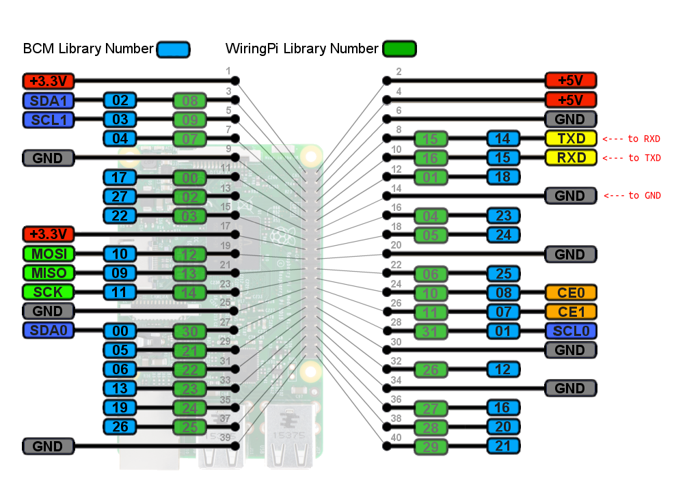
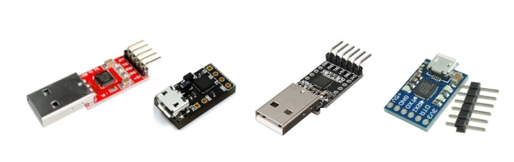
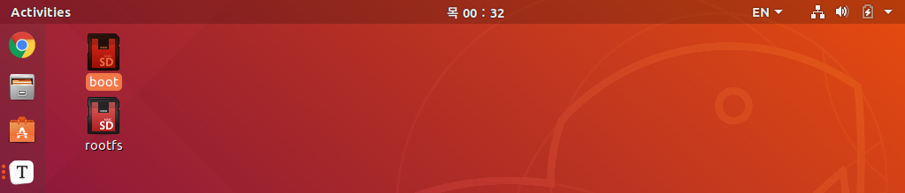
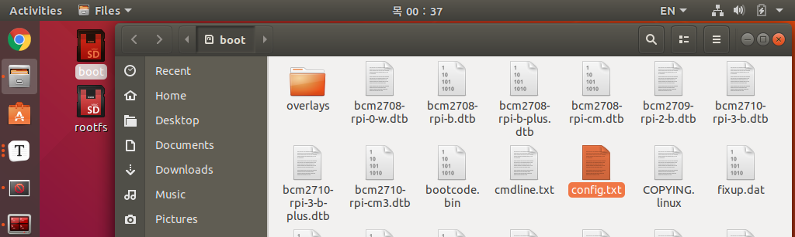
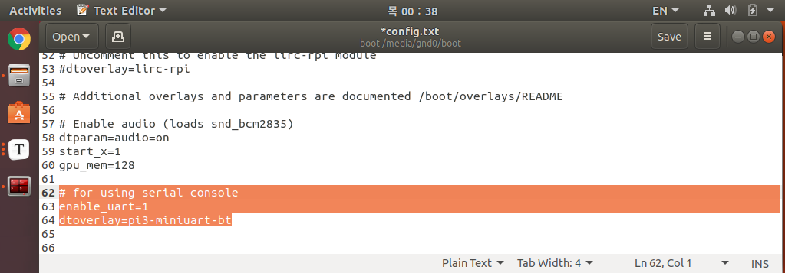

## Tuetlebot3

---

## SBC(Raspberry Pi) 시리얼 콘솔


**튜토리얼 목록 :** [README.md](../../README.md)

---

콘솔(Console)은 일반적으로 시스템 관리자가 사용하는 관리용 단말(또는 서버에 직접 연결된 키보드, 모니터)을 말한다. 하지만 임베디드 리눅스로 운영되는 헤드리스(Headless) 환경(케이블 모뎀, 셋톱박스, 공유기 등)에서는 키보드 모니터 등을 연결할 수 없는 경우가 대부분이다. 이 때 관리 및 유지보수 등을 위해 시리얼 포트를 통한 로그인을 활성화 해두는데, 이것을 시리얼 콘솔이라고 한다. 

터틀봇3 버거의 SBC인 라즈베리파이 또한 시리얼 콘솔을 지원한다. 시리얼포트를 통한 1:1 연결이기 때문에 네트워크 상황과 무관하게 항상 사용할 수 있다는 것이 장점이다. 네트워크 장애가 발생한 경우 시리얼 콘솔을 통해 관리자로 로그인 하여 장애를 복구하는 등의 작업을 할 수 있어 Emergency Console 이라고 하기도 한다. 

그럼 라즈베리파이3 B, B+ 등에서 시리얼 콘솔을 사용하는 방법을 알아보자.


### 1. 하드웨어 설정

다음 그림은 라즈베리파이의 GPIO 포트의 핀맵이다.  터틀봇3에서 GPIO 핀 4 (+5V), 6 (GND) 번은 라즈베리파이가 Open-CR 보드로부터 전원을 공급받는데 사용되고 있다. 시리얼 콘솔 기능은 8 (TXD), 10 (RXD), 14(GND) 번 핀을 통해 이용할 수 있다. 



 8 (TXD), 10 (RXD), 14(GND) 번 핀을 이용하여 시리얼 콘솔을 이용하기 위해서는 아래 그림과 같은 USB 신호를 UART(Univrsal Asynchronous Reciever & Tranceiver) 신호로 변환해 주는 장치가 필요하다.



라즈베리파이와 USB to UART 를 점퍼 케이블을 이용하여 다음과 같이 결선한 후 USB to UART 를 PC의 USB 포트에 연결한다.  
<table>
    <tr align="center">
        <td rowspan="3">라즈베리파이</td><td>TXD</td><td>---</td><td>RXD</td><td rowspan="3">USB to UART</td>
    </tr>
    <tr align="center">
        <td>RXD</td><td>---</td><td>TXD</td>
    </tr>
    <tr align="center">
        <td>GND</td><td>---</td><td>GND</td>
    </tr>
</table>
PC 에서 터미널을 열고 다음 명령을 실행하여 `/dev/ttyUSB0` 장치의 존재를 확인한다.

```bash
$ ls /dev/ttyU*
/dev/ttyUSB0
```


### 2. 소프트웨어 설정

#### 2.1 SBC: config.txt 편집

라즈베리파이3 모델B 와 모델B+ 에서 시리얼 콘솔을 사용하기 위해서는 `/boot/config.txt` 을 편집해야만 한다. 다음 내용을  `/boot/config.txt`  마지막에 추가한다. 

**라즈베리파이에 로그인이 가능한 경우**

터미널에서 다음 명령을 실행한다.

```bash
$ sudo nano /boot/config.txt
```
문서 마지막에 다음 내용을 추가, 저장 후 라즈베리파이를 재시작 시킨다.
```bash
# for using serial console
enable_uart=1
dtoverlay=pi3-miniuart-bt
```

**라즈베리파이에 로그인이 불가능한 경우**

마이크로 SD카드를 분리하여 노트북(PC)에 연결 후, `boot` 와  `rootfs` 파티션에 해당하는 드라이브가 바탕화면에 표시되면 그 중 `boot` 를 더블클릭하여 연다.



`boot` 가 열리면, `config.txt` 를 찾아 `gedit` 로 연다. 



문서 마지막에 역시 다음 내용을 추가한다. 

```bash
# for using serial console
enable_uart=1
dtoverlay=pi3-miniuart-bt
```




#### 2.2 PC: 시리얼 통신 프로그램 준비

리눅스에서 사용할 수 있는 대표적인 시리얼 통신 에뮬레이터로는 `minicom` 이 있지만 사용법이 다소 복잡할 수 있으므로 인터넷에서 찾은 `com.c` 라는 공개된 시리얼 통신 소스코드를 컴파일하여 사용해보자. 

`Ctrl` + `Alt` + `T` 를 입력하여 터미널을 열고 다음 명령을 실행한다. 

```bash
$ gedit ~/com.c
```

`gedit` 에서 다음 코드를 작성 후, 저장, 종료한다. 

```c
#include <termios.h>
#include <stdio.h>
#include <stdlib.h>
#include <string.h>
#include <unistd.h>
#include <sys/signal.h>
#include <sys/types.h>
#include <sys/ioctl.h>
#include <fcntl.h>
#include <errno.h>

int transfer_byte(int from, int to, int is_control);

typedef struct {char *name; int flag; } speed_spec;

void print_status(int fd) {
	int status;
	unsigned int arg;
	status = ioctl(fd, TIOCMGET, &arg);
	fprintf(stderr, "[STATUS]: ");
	if(arg & TIOCM_RTS) fprintf(stderr, "RTS ");
	if(arg & TIOCM_CTS) fprintf(stderr, "CTS ");
	if(arg & TIOCM_DSR) fprintf(stderr, "DSR ");
	if(arg & TIOCM_CAR) fprintf(stderr, "DCD ");
	if(arg & TIOCM_DTR) fprintf(stderr, "DTR ");
	if(arg & TIOCM_RNG) fprintf(stderr, "RI ");
	fprintf(stderr, "\r\n");
}

int main(int argc, char *argv[])
{
	int comfd;
	struct termios oldtio, newtio; //place for old and new port settings for serial port
	struct termios oldkey, newkey; //place tor old and new port settings for keyboard teletype
	char *devicename = argv[1];
	int need_exit = 0;
	speed_spec speeds[] =
	{
		{"1200", B1200},
		{"2400", B2400},
		{"4800", B4800},
		{"9600", B9600},
		{"19200", B19200},
		{"38400", B38400},
		{"57600", B57600},
		{"115200", B115200},
		{NULL, 0}
	};
	int speed = B9600;

	if(argc < 2) {
		fprintf(stderr, "example: %s /dev/ttyS0 [115200]\n", argv[0]);
		exit(1);
	}

	comfd = open(devicename, O_RDWR | O_NOCTTY | O_NONBLOCK);
	if (comfd < 0)
	{
		perror(devicename);
		exit(-1);
	}

	if(argc > 2) {	
		speed_spec *s;
		for(s = speeds; s->name; s++) {
			if(strcmp(s->name, argv[2]) == 0) {
				speed = s->flag;
				fprintf(stderr, "setting speed %s\n", s->name);
				break;
			}
		}
	}

	fprintf(stderr, "Ctrl-Q exit, Ctrl-Y modem lines status\n");

	tcgetattr(STDIN_FILENO,&oldkey);
	newkey.c_cflag = B9600 | CRTSCTS | CS8 | CLOCAL | CREAD;
	newkey.c_iflag = IGNPAR;
	newkey.c_oflag = 0;
	newkey.c_lflag = 0;
	newkey.c_cc[VMIN]=1;
	newkey.c_cc[VTIME]=0;
	tcflush(STDIN_FILENO, TCIFLUSH);
	tcsetattr(STDIN_FILENO,TCSANOW,&newkey);

	tcgetattr(comfd,&oldtio); // save current port settings 
	newtio.c_cflag = speed | CS8 | CLOCAL | CREAD;
	newtio.c_iflag = IGNPAR;
	newtio.c_oflag = 0;
	newtio.c_lflag = 0;
	newtio.c_cc[VMIN]=1;
	newtio.c_cc[VTIME]=0;
	tcflush(comfd, TCIFLUSH);
	tcsetattr(comfd,TCSANOW,&newtio);

	print_status(comfd);

	while(!need_exit) {
		fd_set fds;
		int ret;
		
		FD_ZERO(&fds);
		FD_SET(STDIN_FILENO, &fds);
		FD_SET(comfd, &fds);

		ret = select(comfd+1, &fds, NULL, NULL, NULL);
		if(ret == -1) 
			perror("select");
        else if (ret > 0) {
			if(FD_ISSET(STDIN_FILENO, &fds)) {
				need_exit = transfer_byte(STDIN_FILENO, comfd, 1);
			}
			if(FD_ISSET(comfd, &fds)) {
				need_exit = transfer_byte(comfd, STDIN_FILENO, 0);
			}
		}
	}

	tcsetattr(comfd,TCSANOW,&oldtio);
	tcsetattr(STDIN_FILENO,TCSANOW,&oldkey);
	close(comfd);

	return 0;
}

int transfer_byte(int from, int to, int is_control) {
	char c;
	int ret;
	do {
		ret = read(from, &c, 1);
	} 
    while (ret < 0 && errno == EINTR);
	
    if(ret == 1) {
		if(is_control) {
			if(c == '\x11') { // Ctrl-Q
				return -1;
			} else if(c == '\x19') {	// Ctrl-Y
				print_status(to);
				return 0;
			}
		}
		while(write(to, &c, 1) == -1) {
			if(errno!=EAGAIN && errno!=EINTR) { perror("write failed"); break; }
		}
	}
    else {
		fprintf(stderr, "\nnothing to read. probably port disconnected.\n");
		return -2;
	}
	return 0;
}
```

다음 명령으로 `com.c` 를 컴파일한다. 

```
$ gcc -o ~/com ~/com.c
```

앞서 설명한 내용들을 참고하여 터틀봇3의 라즈베리파이와 USB to UART 를 통해 PC를 연결한 후, PC에서 터미널을 열고 다음 명령들을 순서대로 실행한다.

USB to UART 장치가 인식되었는지를 알아보자

```bash
$ ls /dev/ttyU*
ttyUSB0
```

앞서 컴파일한 `com.c` 의 실행파일인 `com` 을 이용해 시리얼콘솔에 접속한다.

```bash
$ sudo ~/com /dev/ttyUSB0 115200
```

```bash
$ sudo ~/com /dev/ttyUSB0 115200
setting speed 115200
Ctrl-Q exit, Ctrl-Y modem lines status
[STATUS]: RTS CTS DSR DTR 

Raspbian GNU/Linux 9 rpi4tb3 ttyAMA0
Raspberrypi login: pi
Password: 
Last login: Wed Jul  7 21:27:57 PDT 2021 from 10.42.0.1 on pts/1
Linux rpi4tb3 4.19.36-v7+ #1213 SMP Thu Apr 25 15:08:02 BST 2019 armv7l

The programs included with the Debian GNU/Linux system are free software;
the exact distribution terms for each program are described in the
individual files in /usr/share/doc/*/copyright.

Debian GNU/Linux comes with ABSOLUTELY NO WARRANTY, to the extent
permitted by applicable law.
pi@Raspberrypi:~$ 
```

`~/com` 실행 시 `sudo` 가 필요한 것은 `/dev/ttyUSB0` 에 대한 접근 권한이 없기 때문이다. `/dev/tty*` 에 대한 권한을 부여받으려면 현재 사용자를 `dialout` 그룹의 멤버로 만들어 주면 된다. 로그인된 사용자가 가입되어 있는 그룹을 알아보려면 `id` 명령을 사용한다. 

```bash
$ id
uid=1000(user) gid=1000(user) groups=1000(user),4(adm),24(cdrom),27(sudo),30(dip),46(plugdev),116(lpadmin),126(sambashare)
```

`id` 명령 수행 결과를 보면, 이 사용자는 `27(sudo)` 그룹에는 속해 있지만 `20(dialout)` 그룹에는 속해 있지 않다는 것을 알 수 있다. `com` 뿐 아니라 Arduino IDE 등의 시리얼 포트에 접근 권한이 필요한 프로그램 사용 편의를 위해서는  `20(dialout)` 그룹 멤버로 만들어 줄 필요가 있다.

아래 명령은 현재 로그인된 사용자를  `20(dialout)` 그룹의 멤버로 만들어 주는 명령이다. 

```bash
$ sudo usermod -aG dialout $USER
```

로그아웃 후 다시 로그인하여 `id` 명령으로 결과를 확인해 보면 다음과 같다.

```bash
$ id
uid=1000(user) gid=1000(user) groups=1000(user),4(adm),20(dialout),24(cdrom),27(sudo),30(dip),46(plugdev),116(lpadmin),126(sambashare)
```

이제 `sudo` 없이 `~/com /dev/ttyUSB0 115200` 과 같이 시리얼 콘솔을 사용할 수 있다. 


[튜토리얼 목록](../../README.md) 

