### Ubuntu 18.04 LTS 설치

본 문서는 우분투 16.04 가 설치되어있는 Intel x64 또는 AMD64 시스템을 기준으로 작성되었다.

---

#### 1. 설치전 준비

우분투 설치전 준비할 작업은 '설치 파일 다운로드', '설치 USB 디스크 작성' 이다. 현재 설치되어 있는 우분투 16.04 를 지우고 그 위치에 우분투 18.04 를 설치할 것이므로 따로 '설치할 PC 의 하드디스크 공간확보' 를 할 필요는 없다. 

**설치 ISO 파일 다운로드 웹 페이지 :** https://releases.ubuntu.com/18.04/  

아래 화면에 표시된 링크를 클릭하여 `ubuntu-18.04.5-desktop-amd64.iso` 파일을 다운로드한다.

**설치디스크 작성**

우분투 18.04 설치디스크로 사용할 4GB 이상의 USB 메모리를 PC에 연결하고,  아이콘을 클릭한 후 'disk' 를 입력하여 검색된 프로그램 아이콘 중 다음 그림의 'Disks' 를 실행한다.

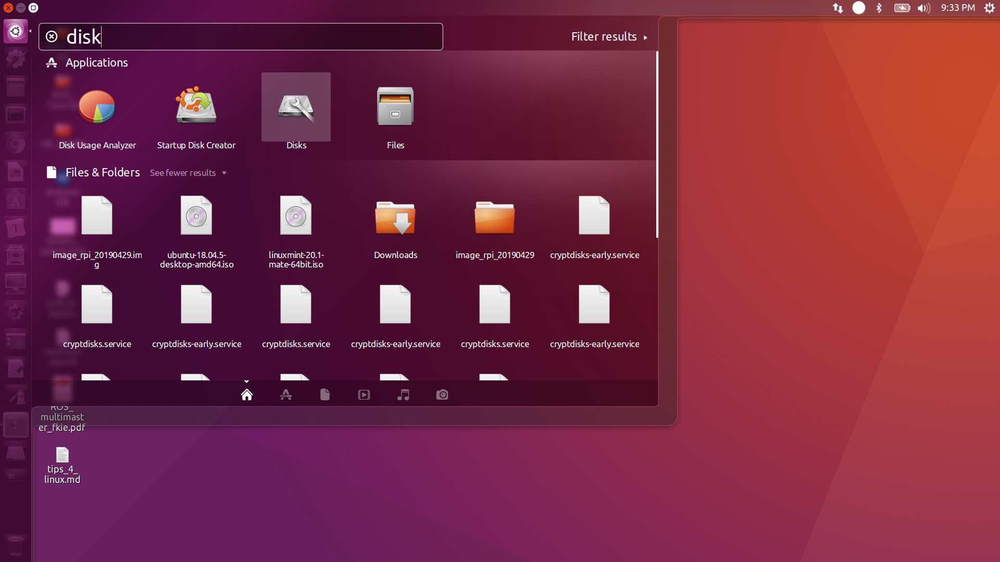

설치디스크로 만들 USB 드라이브를 선택 후, 우측 상단 버튼을 클릭하여 열린 메뉴에서 'Restore Disk Image' 를 클릭한다.

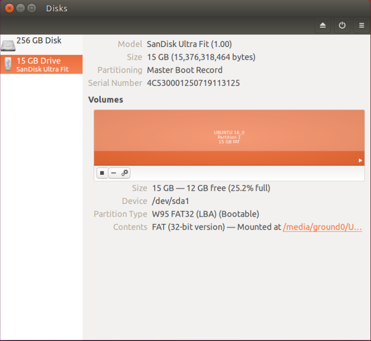 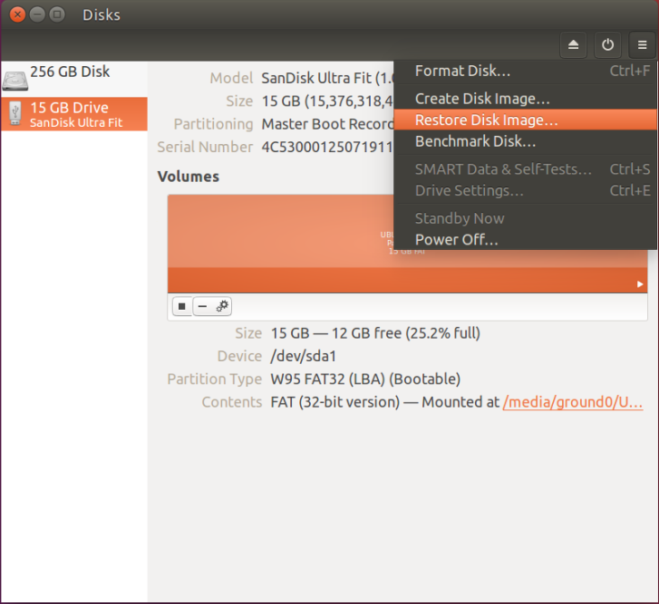

우분투 18.04 설치 ISO 이미지를 선택 후 [Open] 버튼을 클릭한다. 다음 화면에서 [Start Restoring] 버튼을 클릭한다.

 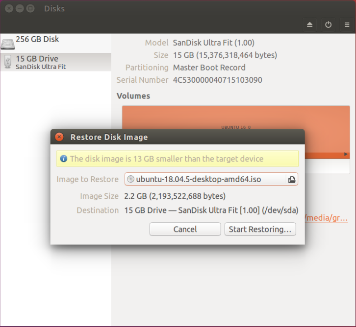

대상 드라이브와 이미지 확인 팝업에서 [Restore] 버튼을 클릭하면, 관리자권한(sudo) 실행을 위한 패스워드를 입력한다.

 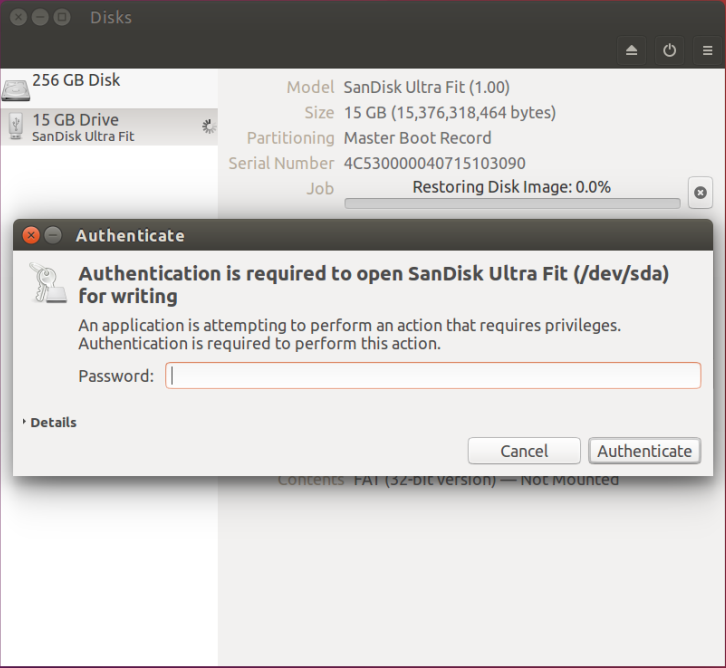

진행 상태가 100%가 되면 'Disks' 를 종료하고, 시스템을 재시작하여 시스템 설정으로 진입한다.

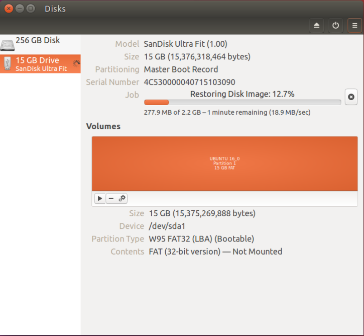 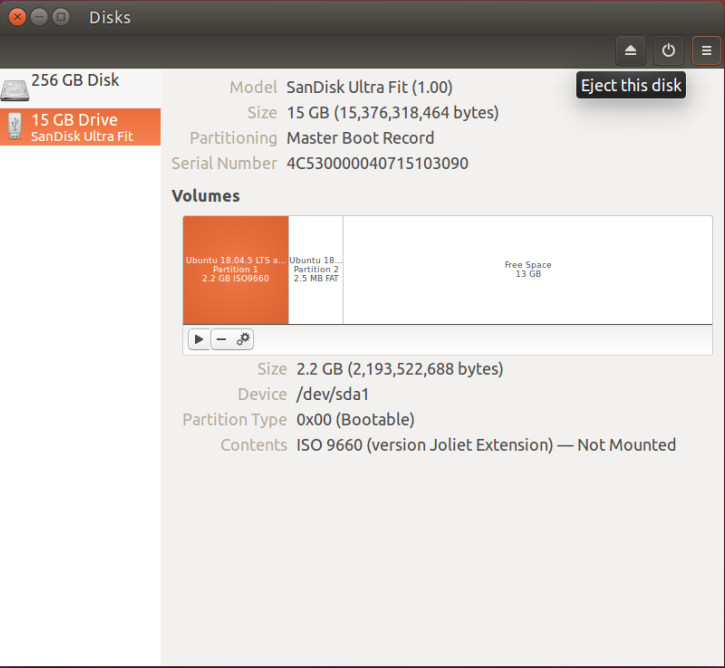

#### 2. 설치

PC 의 시스템 셋업( System Setup )의 부트 순서( Boot Priority ) 중 USB Disk 를 최우선 순서로 변경한 후, 앞에서 제작한 우분투 설치 디스크를  삽입하고 시스템을 재시작한다. 

설치디스크로 부팅이 이루어지면 다음 화면이 나타난다. 이 때 두번째 메뉴 **'Install Ubunt'** 를 선택하고 **Enter** 를 입력한다. 

**'환영합니다'** 화면에서 **'한국어'** 선택 후 **[ 계속하기 ]** 버튼을 클릭한다. 

**'키보드 레이아웃'** 화면에서 **'한국어'** 선택 후 **[ 계속하기 ]** 버튼을 클릭한다. 

 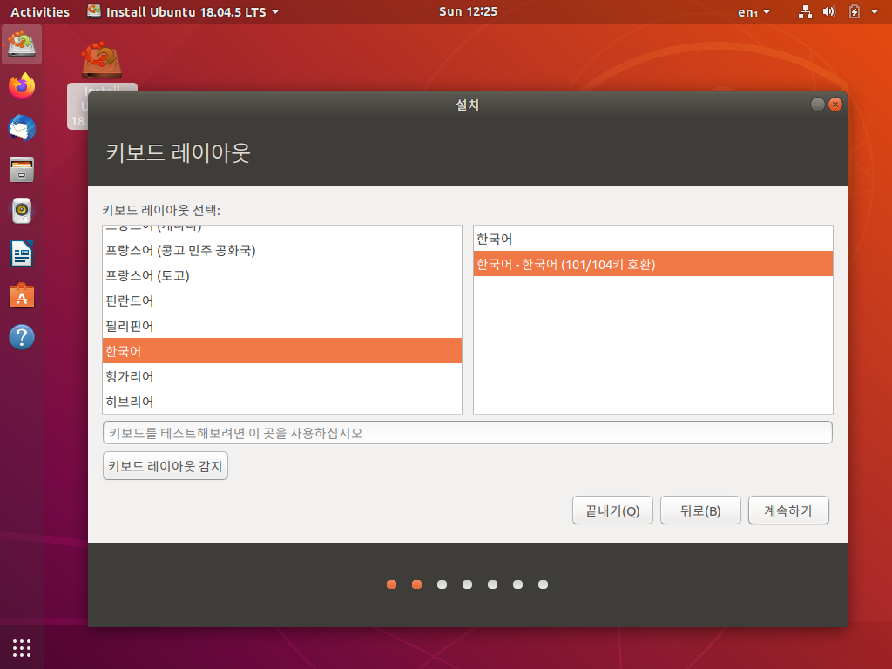

**'업데이트 및 기타 소프트웨어'** 화면에서 **'일반설치'** 선택 후 **[ 계속하기 ]** 버튼을 클릭한다. 

**'설치 형식'** 화면에서 **'Ubuntu 16.04.7 LTS 지우고 다시 설치'** 선택 후 **[ 지금설치(i) ]** 버튼을 클릭한다. 

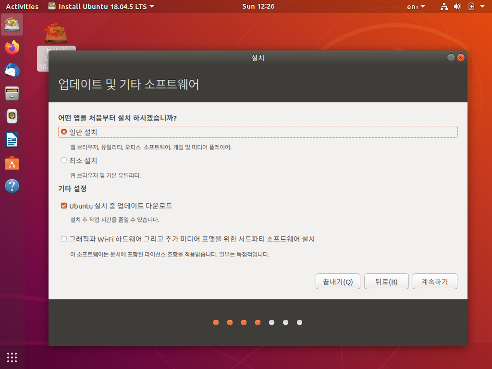 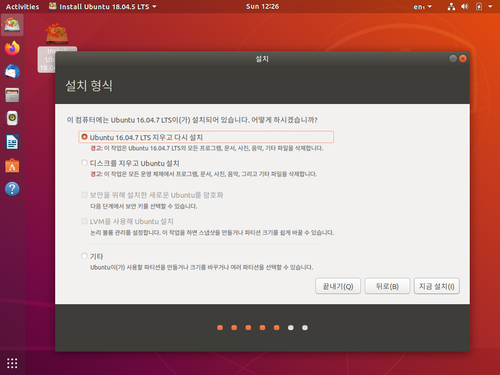

**바뀐 점을 디스크에 쓰시겠습니까?** 화면에서 **[계속하기]** 버튼을을 클릭한다.  

**어디에 거주하고 계십니까?** 화면에서 **'Seoul'** 을 선택 후, **[계속하기]** 버튼을을 클릭한다.  

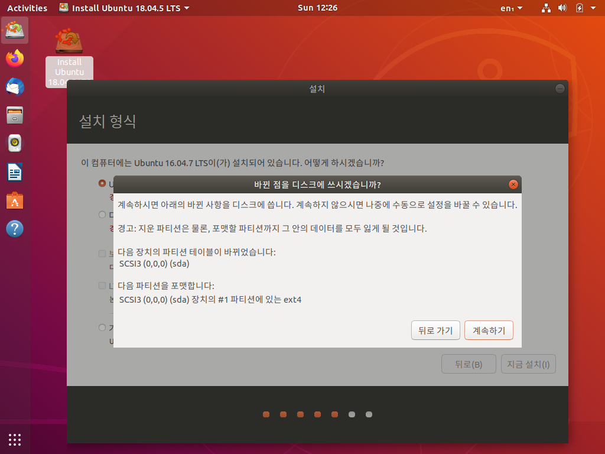 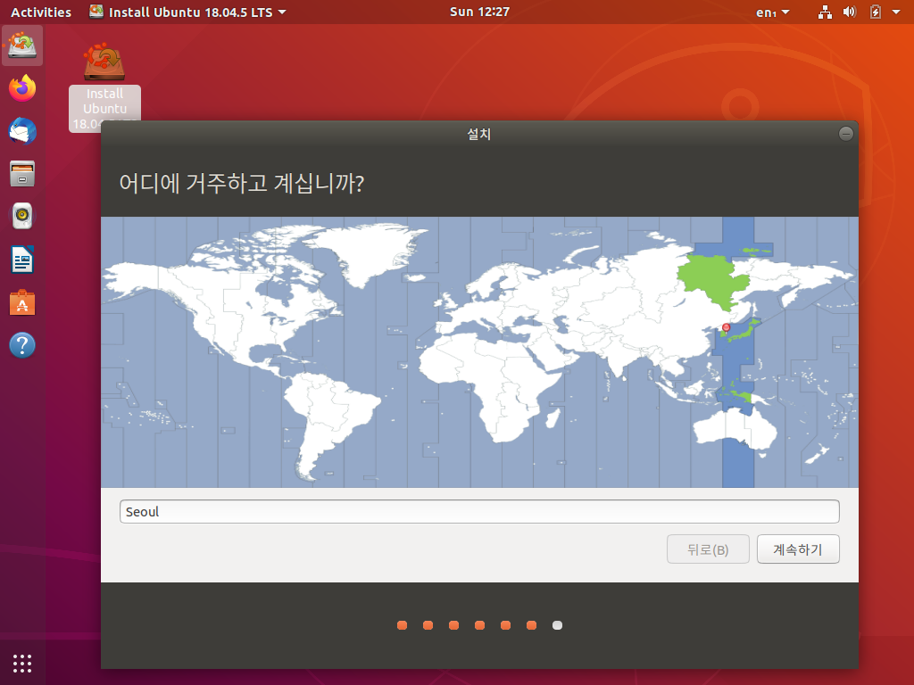

**당신은 누구십니까?** 화면에서 다음 사항들을 설정한다. 

**이름**(Name)은 크게 중요하지 않다.  단지 로그인 화면에 표시되는 이름이다. 심지어 비워 두어도 된다.  

**컴퓨터 이름**(Host Name)은 네트워크에 연결된 단말명으로 표시되는 이름이다. 영문 대소문자, 숫자, 하이픈( - )만을 사용할 수 있으며, 숫자로 시작할 수 없다.  

**사용자 이름**(User Name)은 해당 계정을 대표하는 명칭으로 **사용자 ID** 에 해당한다.  역시 영문 대소문자, 숫자, 하이픈( - )만을 사용할 수 있으며, 숫자로 시작할 수 없다.  

**'암호'**(Password)는 숫자, 특수문자, 대, 소문자를 섞어 보안에 취약하지 않도록 정하는 것이 원칙이지만, 중요한 순간에 생각이 나지 않는다면 낭패이므로, 이를 염두에 두어 신중하게 정하도록하자.  ( **'암호 선택'** 입력시 옆에 나타나는 '짧은 암호', '약한 암호' 같은 메세지는 무시해도 상관없다. )

 **[계속하기]** 버튼을을 클릭한다.  

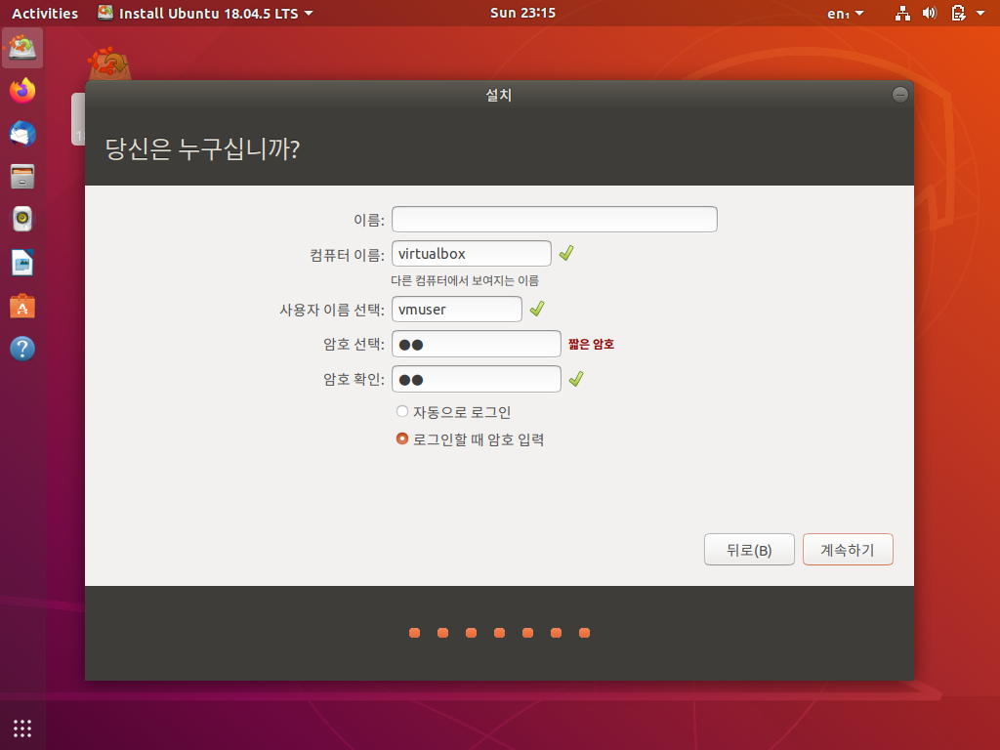

이제부터 **'설치 완료'** 대화상자가 나타날 때까지 기다린다. 

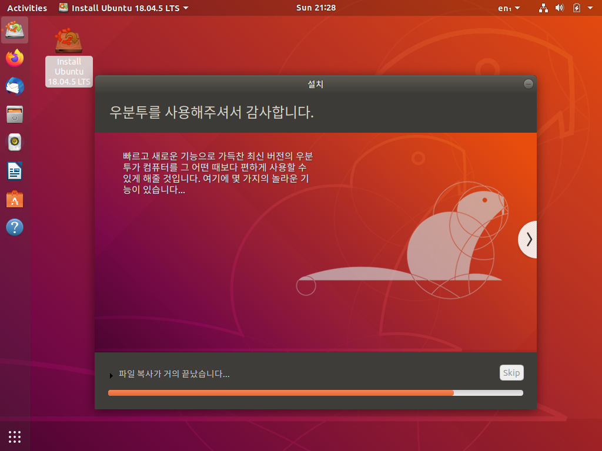

