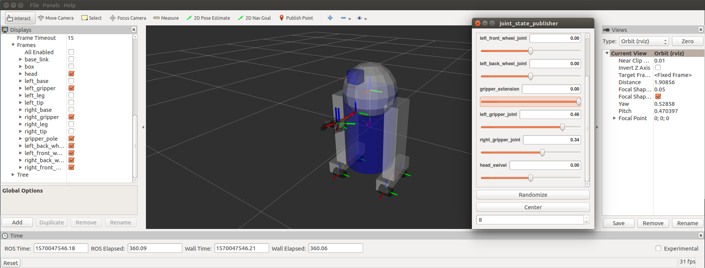

## urdf/ Tutorials/ Building a Movable Robot Model with URDF


------

## Building a Movable Robot Model with URDF

**튜토리얼 레벨 :**  Beginner(초급)

**이 튜토리얼 작성 환경 :**  catkin **/** Ubuntu 16.04 **/** Kinetic

**이전 튜토리얼 :** [Making a Model Move](./urdf_1_building_visual_robot_model.md)

**다음 튜토리얼 :** [Adding Physical & Collision](./urdf_3_adding_physical_n_collision.md)

**튜토리얼 목록 :** [README.md](../README.md)

**튜토리얼 원문 :** <http://wiki.ros.org/urdf/Tutorials/Building%20a%20Movable%20Robot%20Model%20with%20URDF>

------

이 튜토리얼에서 이 전 튜토리얼에서 만든 R2D2 모델을 수정하여, 움직이는 joint를 자지도록 할 것이다. 전에 만든 모델의 모든 joint는 고정된 joint 였다. 이제 중요한 다른 3가지 타입( `continuous` , `revolute` , `prismatic` )의 joint에 대해 알아볼 것이다.


여기 움직일 수 있는 joint들이 적용된 [새로운 urdf 파일](https://github.com/ros/urdf_tutorial/tree/master/urdf/06-flexible.urdf)이 있다. 이 전 파일들과 비교해 보면, 모든 것이 바뀐 것을 알 수 있다. 앞 서 언급한 3가지 종류의 <u>움직일 수 있는</u>( flexible ) joint들에 대해 주의 깊게 들여다 보자.

이 로봇모델을 시각화하고 제어하기위해 지난 튜토리얼과 같은 명령을 실행한다. 

`roslaunch urdf_tutorial display.launch mode:=urdf/06-flexible.urdf` 그렇지만 이번에는 팝업 GUI 에서 non-flexible joint들에 대한 제어를 허용하고 있다. 이 GUI 컨트롤을 통해 어떻게 동작하는 지 움직여 보자.

 


### 1. The Head

```xml
  <joint name="head_swivel" type="continuous">
    <parent link="base_link"/>
    <child link="head"/>
    <axis xyz="0 0 1"/>
    <origin xyz="0 0 0.3"/>
  </joint>
```

The connection between the body and the head is a continuous joint, meaning that it can take on any angle from negative infinity to positive infinity. The wheels are also modeled like this, so that they can roll in both directions forever.

The only additional information we have to add is the axis of rotation, here specified by an xyz triplet, which specifies a vector around which the head will rotate. Since we want it to go around the z axis, we specify the vector "0 0 1".


### 2. The Gripper

```xml
  <joint name="left_gripper_joint" type="revolute">
    <axis xyz="0 0 1"/>
    <limit effort="1000.0" lower="0.0" upper="0.548" velocity="0.5"/>
    <origin rpy="0 0 0" xyz="0.2 0.01 0"/>
    <parent link="gripper_pole"/>
    <child link="left_gripper"/>
  </joint>
```

Both the right and the left gripper joints are modeled as revolute joints. This means that they rotate in the same way that the continuous joints do, but they have strict limits. Hence, we must include the limit tag specifying the upper and lower limits of the joint (in radians). We also must specify a maximum velocity and effort for this joint but the actual values don't matter for our purposes here.


### 3. The Gripper Arm

```xml
  <joint name="gripper_extension" type="prismatic">
    <parent link="base_link"/>
    <child link="gripper_pole"/>
    <limit effort="1000.0" lower="-0.38" upper="0" velocity="0.5"/>
    <origin rpy="0 0 0" xyz="0.19 0 0.2"/>
  </joint>
```

The gripper arm is a different kind of joint...namely a prismatic joint. This means that it moves along an axis, not around it. This translational movement is what allows our robot model to extend and retract its gripper arm.

The limits of the prismatic arm are specified in the same way as a revolute joint, except that the units are meters, not radians.


### 4. Other Types of Joints

There are two other kinds of joints that move around in space. Whereas the prismatic joint can only move along one dimension, a planar joint can move around in a plane, or two dimensions. Furthermore, a floating joint is unconstrained, and can move around in any of the three dimensions. These joints cannot be specified by just one number, and therefore aren’t included in this tutorial.


### 5. Specifying the Pose

As you move the sliders around in the GUI, the model moves in Rviz. How is this done? First the [GUI](http://wiki.ros.org/joint_state_publisher) parses the URDF and finds all the non-fixed joints and their limits. Then, it uses the values of the sliders to publish [sensor_msgs/JointState](http://docs.ros.org/api/sensor_msgs/html/msg/JointState.html) messages. Those are then used by [robot_state_publisher](http://wiki.ros.org/robot_state_publisher) to calculate all of transforms between the different parts. The resulting transform tree is then used to display all of the shapes in Rviz.


### 6. Next steps

Now that you have a visibly functional model, you can [add in some physical properties](http://wiki.ros.org/urdf/Tutorials/Adding Physical and Collision Properties to a URDF Model), or [start using xacro to simplify your code](http://wiki.ros.org/urdf/Tutorials/Using Xacro to Clean Up a URDF File).


---

[튜토리얼 목록 열기](../README.md)

[이전 튜토리얼](./urdf_1_building_visual_robot_model.md)

[다음 튜토리얼](./urdf_3_adding_physical_n_collision.md)

