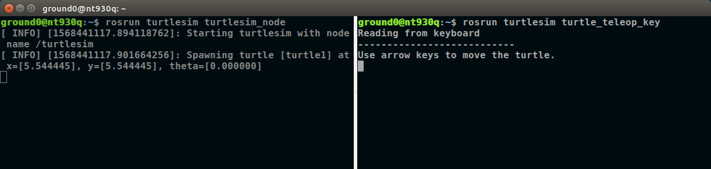
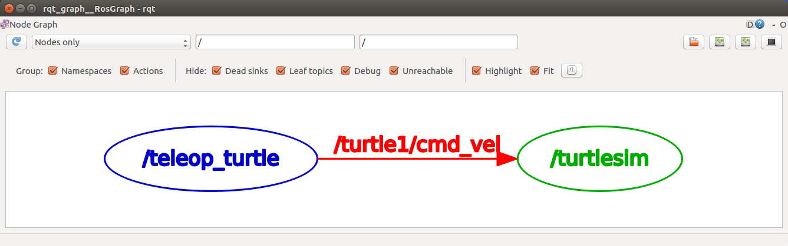

## turtlesim 원격 조종 노드 작성

**참고자료 :** <http://wiki.ros.org/turtlesim>


---

### 1. turtlesim 시작하기


roscore 실행

```bash
$ roscore 
```

turtlesim ROS 패키지 설치

```bash
$ sudo apt-get install ros-kinetic-turtlesim
```

turtlesim 노드 실행

```bash
$ rosrun turtlesim turtlesim_node
```


turtlesim 키보드 원격 조종 노드 실행

```
user@computer:~$ rosrun turtlesim turtle_teleop_key
```




---

### 2. 두 노드 사이에 어떤 일이?

rqt_graph 실행

```bash
$ rqt_graph
```



위 rqt_graph 실행화면은 teleop_turtle 노드가 /turtle1/cmd_vel 토픽을 발행( publish ) 하고 turtlesim 노드가 이를 구독( subscribe ) 하고 있음을 보여주고 있다. 

rostopic list 실행

```bash
$ rostopic list
/rosout
/rosout_agg
/turtle1/cmd_vel
/turtle1/color_sensor
/turtle1/pose
```

`rostopic type [토픽명]`  또는  `rostopic info [토픽명]`  명령으로  `/turtle1/cmd_vel` 토픽의 정보 확인

```bash
$ rostopic type /turtle1/cmd_vel 
geometry_msgs/Twist
```

`rostopic echo` 명령으로 `/turtle1/cmd_vel` 토픽 내용을 화면에 출력하면서 `teleop_turtle` 노드가 실행된 터미널 창에서 키보드입력으로 화면의 거북이를 제어해보자.

```bash
user@computer:~$ rostopic echo /turtle1/cmd_vel 
linear: 
  x: 2.0
  y: 0.0
  z: 0.0
angular: 
  x: 0.0
  y: 0.0
  z: 0.0
---
```

위에서 화면에 나오는 자료 형태가 geometry_msgs의 Twist 메세지 형태이다. 이것을 참고하여 다음의 키 입력에 따른 토픽 값의 변화표를 만들었다.
| 키입력 | linear.x | linear.y | linear.z | angular.x | angular.y | angular.z |
| :-------: | :------: | :------: | :------: | :-------: | :-------: | :-------: |
| [ **↑** ] | **2.0** |   0.0    |   0.0    |    0.0    |    0.0    |    0.0    |
| [ **↓** ] | **-2.0** |   0.0    |   0.0    |    0.0    |    0.0    |    0.0    |
|  [**←**]  |   0.0    |   0.0    |   0.0    |    0.0    |    0.0    |    **2.0**    |
|  [**→**]  |   0.0    |   0.0    |   0.0    |    0.0    |    0.0    |  **-2.0** |

여기까지 알아낸 것을 정리해보자.

1. `/turtle1/cmd_vel` 토픽은 `geometry_msgs/Twist` 형식이다.
2. 거북이는 모든 값이 0.0일 때 `linear.x` 값이 양수이면 전진, 음수이면 후진, `angular.z` 의 값이 양수이면 좌회전, 음수이면 우회전 한다.
3. 1, 2번 사실을 근거로, 키보드 입력에 따라 `/turtle1/cmd_vel`이라는 이름의 토픽으로 `linear.x`와 `angular.z`의 값을 적절히 바꾼 `geometry_msgs/Twist`형식의 메세지를 `publish`하면 화면의 거북이를 이동시킬 수 있다. 

`turtlesim`노드의 거북이를 키보드로 원격 조종할 수 있는 노드를 구현하여 `roscpp_tutorial` 패키지에 추가하자.


---

### 3. turtle_teleop 노드 구현

`turtlesim` 의 거북이 제어와 관련된 새로운 사용자 패키지 `test_turtlesim` 을 만들고 거북이를 키보드로 제어하는 노드 를 추가하기 위해 노드명, 토픽명, 소스 파일명을 다음과 같이 미리 정했다. ( `package.xml` 과 `CMakeList.txt` 수정 작업 시 혼란을 피하기 위해 )

**노드명:** `turtle_teleop` ( 원래 `turtlesim` 패키지의 키보드 제어 노드의 이름인 `teleop_turtle`과 구분하기 위해 )

**토픽명:** `/turtle1/cmd_vel`

**pkg명:** `pkg_4_turtlesim`

**의존성:** `ros_cpp` ,  `geometry_msgs` 

**파일명:** `~/catkin_ws/src/test_turtlesim/src/teleop_turtlesim.cpp`


#### 3.1 `test_turtlesim` 패키지 생성

`~/catkin_ws/src` 로 경로 변경

```bash
$ cd ~/catkin_ws/src
```

`pkg_4_turtlesim` 패키지 생성

```bash
$ catkin_create_pkg pkg_4_turtlesim roscpp geometry_msgs
```


#### 3.2 package.xml 편집

`pkg_4_turtlesim` 패키지는 `roscpp`와 `geometry_msgs`에 의존성을 가진다. 관련 항목들이 제대로 추가되어 있는지 확인한다.

```xml
<?xml version="1.0"?>
<package format="2">
  <name>pkg_4_turtlesim</name>
  <version>0.0.0</version>
  <description>The pkg_4_turtlesim package</description>

  <!-- One maintainer tag required, multiple allowed, one person per tag -->
  <!-- Example:  -->
  <!-- <maintainer email="jane.doe@example.com">Jane Doe</maintainer> -->
  <maintainer email="greattoe@gmail.com">Lee Yongjin</maintainer>

  <!-- One license tag required, multiple allowed, one license per tag -->
  <!-- Commonly used license strings: -->
  <!--   BSD, MIT, Boost Software License, GPLv2, GPLv3, LGPLv2.1, LGPLv3 -->
  <license>BSD, MIT, Boost Software License, GPLv2, GPLv3, LGPLv2.1, LGPLv3</license>

  <!-- Url tags are optional, but multiple are allowed, one per tag -->
  <!-- Optional attribute type can be: website, bugtracker, or repository -->
  <!-- Example: -->
    
  <!-- 일부 생략 -->
  
  <!-- Use doc_depend for packages you need only for building documentation: -->
  <!--   <doc_depend>doxygen</doc_depend> -->
  <buildtool_depend>catkin</buildtool_depend>
  <build_depend>roscpp</build_depend>
  <build_depend>geometry_msgs</build_depend>
  <build_export_depend>roscpp</build_export_depend>
  <build_export_depend>geometry_msgs</build_export_depend>
  <exec_depend>roscpp</exec_depend>
  <exec_depend>geometry_msgs</exec_depend>

  <!-- The export tag contains other, unspecified, tags -->
  <export>
    <!-- Other tools can request additional information be placed here -->

  </export>
</package>
```


#### 3.3 CMakeList.txt 편집

의존성들을 확인하고,  `add_executable` 항목과 `target_link_libraries` 항목을 설정 한다.

```makefile
cmake_minimum_required(VERSION 2.8.3)
project(roscpp_tutorial)

## Compile as C++11, supported in ROS Kinetic and newer
# add_compile_options(-std=c++11)

## Find catkin macros and libraries
## if COMPONENTS list like find_package(catkin REQUIRED COMPONENTS xyz)
## is used, also find other catkin packages
find_package(catkin REQUIRED COMPONENTS
  roscpp
  geometry_msgs
)

## System dependencies are found with CMake's conventions
# find_package(Boost REQUIRED COMPONENTS system)

# 일부 생략

###################################
## catkin specific configuration ##
###################################
## The catkin_package macro generates cmake config files for your package
## Declare things to be passed to dependent projects
## INCLUDE_DIRS: uncomment this if your package contains header files
## LIBRARIES: libraries you create in this project that dependent projects also need
## CATKIN_DEPENDS: catkin_packages dependent projects also need
## DEPENDS: system dependencies of this project that dependent projects also need
catkin_package(
#  INCLUDE_DIRS include
#  LIBRARIES my_1st_pkg
#  CATKIN_DEPENDS roscpp std_msgs
#  DEPENDS system_lib
)

###########
## Build ##
###########

## Specify additional locations of header files
## Your package locations should be listed before other locations
include_directories(
# include
  ${catkin_INCLUDE_DIRS}
)

## Declare a C++ library
# add_library(${PROJECT_NAME}
#   src/${PROJECT_NAME}/my_1st_pkg.cpp
# )

## Add cmake target dependencies of the library
## as an example, code may need to be generated before libraries
## either from message generation or dynamic reconfigure
# add_dependencies(${PROJECT_NAME} ${${PROJECT_NAME}_EXPORTED_TARGETS} ${catkin_EXPORTED_TARGETS})

## Declare a C++ executable
## With catkin_make all packages are built within a single CMake context
## The recommended prefix ensures that target names across packages don't collide
# add_executable(${PROJECT_NAME}_node src/my_1st_pkg_node.cpp)
#                --------------------     -------------------
#       노드명 -------------^   소스코드명 -----------^
# add_executable(노드명 src/소스코드명.cpp)
add_executable(teleop_turtlesim src/teleop_turtlesim.cpp) # 여기에 추가

## Rename C++ executable without prefix
## The above recommended prefix causes long target names, the following renames the
## target back to the shorter version for ease of user use
## e.g. "rosrun someones_pkg node" instead of "rosrun someones_pkg someones_pkg_node"
# set_target_properties(${PROJECT_NAME}_node PROPERTIES OUTPUT_NAME node PREFIX "")

## Add cmake target dependencies of the executable
## same as for the library above
# add_dependencies(${PROJECT_NAME}_node ${${PROJECT_NAME}_EXPORTED_TARGETS} ${catkin_EXPORTED_TARGETS})

## Specify libraries to link a library or executable target against
# target_link_libraries(${PROJECT_NAME}_node  ${catkin_LIBRARIES} )
#                       --------------------
#              노드명 -------------^
target_link_libraries(teleop_turtlesim  ${catkin_LIBRARIES} ) # 여기에 추가

#############
## Install ##
#############

# 이하 생략
```


#### 3.4 turtle_teleop.cpp 작성

```~/catkin_ws/src/test_turtlesim/src/teleop_turtlesim.cpp```

```c++
#include <ros/ros.h>
#include <geometry_msgs/Twist.h>
#include <stdio.h>
#include <unistd.h>
#include <termios.h>

void print_info(void);
int getch(void);

int main(int argc, char **argv)
{
  ros::init(argc, argv, "teleop_turtlesim");
  ros::NodeHandle nh;
  ros::Publisher pub = nh.advertise<geometry_msgs::Twist>("/turtle1/cmd_vel", 10);

  geometry_msgs::Twist t;
  ros::Rate loop_rate(10);

  int ch = 0, cnt = 0;

  print_info();

  while(ros::ok()) {
  {
    ch = getch();
    
    if     (ch == 'w') {
      t.linear.x =  2.0;   t.angular.z =  0.0;  cnt++;
    }
    else if(ch == 's') {
      t.linear.x = -2.0;   t.angular.z =  0.0;  cnt++;
    }
    else if(ch == 'a') {
      t.linear.x =  0.0;   t.angular.z =  2.0;  cnt++;
    }
    else if(ch == 'd') {
      t.linear.x =  0.0;   t.angular.z = -2.0;  cnt++;
    }
    else if(ch == ' ') {
      t.linear.x =  0.0;   t.angular.z =  0.0;  cnt++;
    }
    else if(ch == '\x03') {
      break;
    }
    else;

    if(cnt == 10) {
      cnt = 0;  print_info();
    }

    pub.publish(t);

    t.linear.x = t.angular.z = 0.0;
    loop_rate.sleep();
  }
  return 0;
}

void print_info()
{
  puts("Remote Control turtle of turtlesim_node");
  puts("---------------------------------------");
  puts("               (forward)               ");
  puts("                   w                   ");
  puts("  (turn-left) a    s    d (turn-right) ");
  puts("                (back)                 ");
  puts("---------------------------------------");
  puts("### type Ctrl-C to quit                ");
  puts("");
}

int getch(void)
{
  int ch;
  struct termios oldt;
  struct termios newt;

  tcgetattr(STDIN_FILENO, &oldt);
  newt = oldt;

  newt.c_lflag &= ~(ICANON | ECHO);
  newt.c_iflag |= IGNBRK;
  newt.c_iflag &= ~(INLCR  | ICRNL | IXON  | IXOFF);
  newt.c_lflag &= ~(ICANON | ECHO  | ECHOK | ECHOE | ECHONL | ISIG | IEXTEN);
  newt.c_cc[VMIN] = 1;
  newt.c_cc[VTIME] = 0;
  tcsetattr(fileno(stdin), TCSANOW, &newt);

  ch = getchar();

  tcsetattr(STDIN_FILENO, TCSANOW, &oldt);

  return ch;
}
```


#### 3.5 빌드 및 실행

1. `$ cd ~/catkin_ws` 
2. `$ catkin_make` 
3. `$ source ./devel/setup.bash` 
4. `$ rospack profile` 
5. `$ roscore` 
6. `$ rosrun turtlesim turtlesim_node` 
7. `$ rosrun pkg_4_turtlesim turtlesim_teleop` 
8. 화면의 거북이가 키보드의  `w`,  `s`,  `a`,  `d` 입력으로 제어되는 지 확인한다. 


---

[^1]:**rospack** : ROS 패키지 관리 도구 rospack은 dpkg 와 pkg-config 의 일부분이다. rospack의 주된 기능은 ROS_ROOT 및   ROS_PACKAGE_PATH의 패키지를 크롤링하고 각 패키지의 manifest.xml을 읽고 구문을 분석하며 모든 패키지에 대한 완전한 의존성 트리를 구성하는 것이다.
[^2]: **rospack profile** : rospack의 성능은 매니페스트 파일을 포함하지 않는 매우 광범위하고 깊은 디렉토리 구조의 존재로 인해 악영향을 받을 수 있다. 이러한 디렉토리가 rospack의 검색 경로에 있으면, 패키지를 찾을 수 없다는 것을 발견하기 위해서만 크롤링하는 데 많은 시간을 소비 할 수 있다. 이러한 디렉토리에 rospack_nosubdirs 파일을 작성하여이 대기 시간을 방지 할 수 있다. rospack이 성가신 속도로 느리게 실행되는 것처럼 보이는 경우 profile 명령을 사용하여 크롤링 할 가장 느린 20 개의 트리를 인쇄하거나 profile --length = N을 사용하여 가장 느린 N 개의 트리를 인쇄 할 수 있다.

