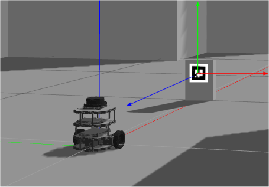

## AR Marker(Python)


------

## Analysis data from marker

**튜토리얼 레벨 :**  Intermediate(중급)

**이 튜토리얼 작성 환경 :**  catkin **/** Ubuntu 16.04 **/** Kinetic

**튜토리얼 목록 :** [README.md](../README.md)

------

지난 튜토리얼에서 만든 track_marker.launch 파일을 구동하면 /ar_pose_marker 토픽을 구독( subscribe )할 수 있다는 것 까지 알아보았다. 그렇다면 그 토픽 정보를 어떻게 해석해야 하는가에 대해 알아보자


### 1. '/ar_pose_marker' 토픽

다음은 토픽 `/ar_pose_marker` 를 `rostopic echo /ar_pose_marker` 명령으로 화면출력 시킨 결과이다.

```
user@computer:~$ rostopic /ar_pose_marker
---
header: 
  seq: 329
  stamp: 
    secs: 0
    nsecs:         0
  frame_id: ''
markers: 
  - 
    header: 
      seq: 0
      stamp: 
        secs: 1569796037
        nsecs: 237993750
      frame_id: "camera"
    id: 3
    confidence: 0
    pose: 
      header: 
        seq: 0
        stamp: 
          secs: 0
          nsecs:         0
        frame_id: ''
      pose: 
        position: 
          x: -0.0091884005952
          y: 0.0549410532295
          z: 0.415940946221
        orientation: 
          x: 0.998650018797
          y: -0.00480358428624
          z: 0.0392601699902
          w: 0.0336705299524
---
```

이 데이터는 항목과 그 값의 조합으로 이루어져 있다. 일단 가장 큰 항목으로 header 와 markers 가 있고 그 하위 항목들로 이루어진다. 그 내용을 들여다 보면 아래와 같다.

```
header    = { seq,
              stamp = { secs, nsecs },
              frame_id
            }

markers = { header = { seq(a), stamp, frame_id },
            id(b),
            confidence,
            pose(c) = { header,
                        pose(d) = { position(e)     = { x,  y,  z },
                                    orientation(f)  = { x,  y,  z,  w }
                                  }
                      }
           }
```

```
(a) 마커스 배열의 몇 번 째 요소인지를 나타낸다
(b) 마커가 나타내는 숫자.
(c) geometry_msgs/PoseStamped 형식의 pose = { header,                                                   ( geometry_msgs/pose ) ------->  (d) pose = (e) position    = { x, y, z }, 
                                                        (f) orientation = { x, y, z, w }                                              }
```


### 2. 마커 pose와 tf

마커를 벽에  고정하고, 로봇이 그 앞에서 정지하기 위해 마커 정보를 해석할 경우, 마커의 tf 축방향을 잘못 적용할 수 있다. 아래 그림은 마커의 tf 축방향을 표시한 그림이다.


#### 2.1 markers.pose.pose.position.z

카메라 - 마커 거리 1m &nbsp; &nbsp; &nbsp; &nbsp; &nbsp; &nbsp; &nbsp; &nbsp; &nbsp; &nbsp; &nbsp; &nbsp; &nbsp; &nbsp; &nbsp; &nbsp; &nbsp; &nbsp; &nbsp; &nbsp; &nbsp; &nbsp;  &nbsp;&nbsp; &nbsp; &nbsp; &nbsp; &nbsp; &nbsp;&nbsp; 카메라 - 마커 거리 2m
 

카메라 - 마커 거리 3m &nbsp; &nbsp; &nbsp; &nbsp; &nbsp; &nbsp; &nbsp; &nbsp; &nbsp; &nbsp; &nbsp; &nbsp; &nbsp; &nbsp; &nbsp; &nbsp; &nbsp; &nbsp; &nbsp; &nbsp; &nbsp; &nbsp;  &nbsp;&nbsp; &nbsp; &nbsp; &nbsp; &nbsp; &nbsp;&nbsp; 카메라 - 마커 거리 4m
 

실험결과 로봇의 x축과 마커의 z축이 마주보고 있음을 알 수 있다.


#### 2.2 markers.pose.pose.position.x

position.x < 0                                        position.x = 0                                        position.x > 0

  


#### 2.3 markers.pose.pose.orientation.z

orientation.z < 0                                   orientation.z = 0                                  orientation.z > 0

  


### 3. 수직 벽에 부착된 마커와 로봇의 tf




[튜토리얼 목록 열기](../README.md)


[이전 튜토리얼](./ar_1_ar_track_alvar.md)

