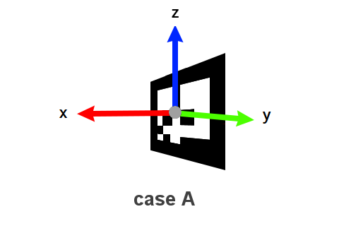
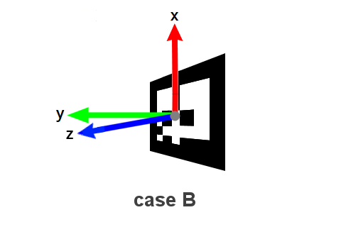
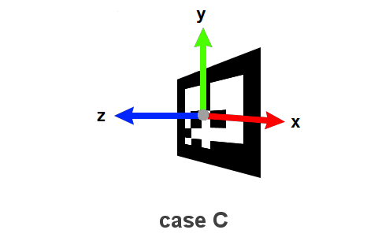
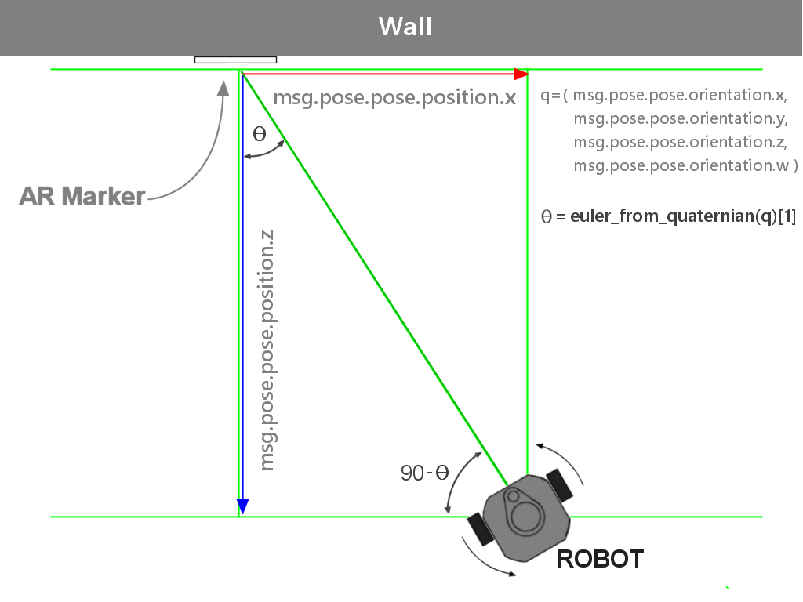

## AR Marker(Python)


------

## Analysis data from marker

**튜토리얼 레벨 :**  Intermediate(중급) 

**이 튜토리얼 작성 환경 :**  catkin **/** Ubuntu 16.04 **/** Kinetic 

**이전 튜토리얼 :** [ar_track_alvar](./ar_1_ar_track_alvar.md) 

**튜토리얼 목록 :** [README.md](../README.md) 

------

지난 튜토리얼에서 만든 track_marker.launch 파일을 구동하면 /ar_pose_marker 토픽을 구독( subscribe )할 수 있다는 것 까지 알아보았다. 그렇다면 그 토픽 정보를 어떻게 해석해야 하는가에 대해 알아보자


### 1. '/ar_pose_marker' 토픽

다음은 토픽 `/ar_pose_marker` 를 `rostopic echo /ar_pose_marker` 명령으로 화면출력 시킨 결과이다.

```bash
$ rostopic /ar_pose_marker
---
header: 
  seq: 329
  stamp: 
    secs: 0
    nsecs:         0
  frame_id: ''
markers: 
  - 
    header: 
      seq: 0
      stamp: 
        secs: 1569796037
        nsecs: 237993750
      frame_id: "camera"
    id: 3
    confidence: 0
    pose: 
      header: 
        seq: 0
        stamp: 
          secs: 0
          nsecs:         0
        frame_id: ''
      pose: 
        position: 
          x: -0.0091884005952
          y: 0.0549410532295
          z: 0.415940946221
        orientation: 
          x: 0.998650018797
          y: -0.00480358428624
          z: 0.0392601699902
          w: 0.0336705299524
---
```

이 데이터의 형식은 항목과 그 값의 조합으로 이루어져 있다. 일단 가장 큰 항목으로 header 와 markers 가 있고 그 하위 항목들로 이루어진다. 그 내용을 들여다 보면 아래와 같다.

```json
header    = { seq,
              stamp = { secs, nsecs },
              frame_id
            }

markers  = { header  = { seq(a), stamp, frame_id },
             id(b),
             confidence,
             pose(c) = { header,
                         pose(d) = { position(e)     = { x,  y,  z },
                                     orientation(f)  = { x,  y,  z,  w }
                                   }
                       }
           }
```

```json
(a) markers[] 배열의 몇 번 째 요소인지를 나타낸다
(b) marker 번호.
(c) geometry_msgs/PoseStamped 형식의 pose = { header,
           ( geometry_msgs/pose ) ------->  (d)pose = (e) position    = { x, y, z }, 
                                                      (f) orientation = { x, y, z, w }                                                }
```


### 2. 마커 pose와 tf

AR 마커는 일단 자신이 몇 번 마커인지에 대한 정보를 담고 있다.  여기까지는 크게 흥미를 끌 지 안는다. 재미있는 부분은 ID 이외의 정보인데, 자체적인 자세(pose)를 알수 있는 축과 방향을 가지고 있고, 이와 관련된 정보를 영상을 통해 알 수 있다는 것이다. 

즉 카메라 화면에 나타난 마커 이미지를 적절히 처리하면, 마커가 바닥에서 하늘을 향하고 있는 지, 벽에 붙어서 전방을 향하고 있는 지 등의 정보를 알 수 있다.

그렇다면 이 전 튜토리얼 내용을 참고하여 카메라를 구동하고,  `AR 마커` 정보를 `publish`하는 노드( ar_track_alvar )를 구동시키고, 해당 토픽( `/ar_pose_marker `)을 `subscribe`하기만 하면 마커 정보를 해석하여 뭔가 재미있는 미션을 수행할 수있다는 것이다.

그렇다면 발행되고 있는 토픽의 각 항목이 어떤 정보를 알려주고 있는 지 해석해 볼 순서다. 당연히 그 정보는 마커와 로봇 사이의 위치관계를 나타낼 것이다. 어떤 항목이 어떤 값을 나타내는지를 토픽의 항목이름으로 추측하자면, `position.x,y,z` 는 `xyz`3축 직교 좌표계에서의 위치관계라 예측할 수 있고, `orientation.x,y,z,w` 는 인터넷 검색에는 쿼터니언( Quaternion ) 이라는 방법으로 회전을 표현한다고 하니, 회전 각도와 관련된 값이라 추측된다. 

`x-y` 평면 위에서만 이동할 수있는 주행로봇의 특성을 고려할 때, 필요한 정보는

1. 마커와 로봇을 연결한 선분을 빗변으로 하는 직각 삼각형의 다른 두 변 x, y 에 대한 정보
2. 마커의 위치를 원점(0, 0)으로, 로봇의 위치를 (x, y)로 두고, 두 점을 연결한 선분이 z축을 회전축으로 얼만큼 회전 했는가에 대한 정보

이다.

'1번을 `posiotion.x,y,z`에서, 2번을 `orientaion.x,y,z,w`에서 알 수 있을 것이다.' 라는 추측은 매우 타당하고, 설득력있는 추측이라 할 수 있다.


#### 2.1 로봇과 마커의 거리변화에 대한 '/ar_pose_marker' 토픽 변화

로봇과 마커를 일직선 상에서 서로 마주보도록 배치하고, 거리를 1m씩 늘여 갈 때 `/ar_pose_marker` 토픽의 변화와  `rqt_image_view`영상의 화면을 캡처한 결과물을 아래 표시해 보았다.

<table width="100%" border="0" bordercolor="#fff">
    <tr align="center">
        <td width="50%">마커와 카메라의 거리 1(m)</td>
        <td width="50%">마커와 카메라의 거리 2(m)</td>
    </tr>
    <tr align="center">
        <td></td>
        <td></td>
    </tr>
    <tr align="center">
        <td width="50%">마커와 카메라의 거리 3(m)</td>
        <td width="50%">마커와 카메라의 거리 4(m)</td>
    </tr>
    <tr align="center">
        <td></td>
        <td></td>
    </tr>
</table>

마커의 position.x 값의 변화 발생을 기대하며 실험에 임했으나, 결과는 엉뚱하게도  position.z 값이 x축의 거리에 비례하는 뚜렷한 변화를 나타냈다.


#### 2.2 로봇과 마커의 y축 방향 거리변화 실험

y축 방향 거리변화에 대한 토픽의 변화를 살펴보기위해 우선, 화면 한 가운데에 마커가 나타나도록 로봇과 마커를 배치하고, 이 위치를 기준으로 카메라가 정면을 향한 상태에서 <u>횡으로 이동</u>( 로봇 입장에서 y축을 따라 이동 )시켜본 결과다.

<table width="100%" border="0" bordercolor="#fff">
    <tr align="center">
        <td width="33%">position.x < 0</td>
        <td width="33%">position.x = 0</td>
        <td width="33%">position.x > 0</td>
    </tr>
    <tr align="center">
        <td></td>
        <td></td>
        <td></td>
    </tr>
</table>

또 한 번 예상을 뒤엎고 position.y 가 아닌 position.x 에서 변화가 관찰됬다.


#### 2.3 로봇과 마커의 z축을 회전축으로 하는  각도 변화 실험

이 실험에 대해서는 `orientation.x,y,z,w`에서의 변화는 예측했지만, `Quaternion` 에 대한 개념이 없는 상태에서는 구체적인 예측은 할 수 없었다. 실험 결과는 일직선 위에서 마주보는 의치에서 Orientation.z 가 0에 가까운 값을 유지하다, 로봇이 z축을 회전축으로 +회전(ccw)할 경우 -값으로, -회전(cw)할 경우 +값으로 변하는 것을 관측할 수 있었다.

<table width="100%" border="0" bordercolor="#fff">
    <tr align="center">
        <td width="33%">orientation.z < 0</td>
        <td width="33%">orientation.z = 0</td>
        <td width="33%">orientation.z > 0</td>
    </tr>
    <tr align="center">
        <td></td>
        <td></td>
        <td></td>
    </tr>
</table>


### 3. 실험을 통한 벽에 부착된 마커와 로봇의 tf 관계

실험 전 AR 마커의 축 방향은 `x` 축이 마커 전방을 향하는 방향( case A )일 것이라 예측했었지만, 실험 결과로 보아  `z` 축이 마커의 전방을 향하는 방향( 일반적인 경우의 `x` 축 방향 )이라고 생각할 수 밖에 없었다. 이를 기준으로 가능한 경우(`z` 축이 마커 전방을 향하는 경우 ) 중 나머지 두 축의 +방향( 값이 증가하는 방향 )이 아래( 지면 )를 향하는 경우는 일단 제외하고 남은 두 가지 경우( case B & C )를 상정하였다. 

<p align="center"></p>

토픽 `/ar_pose_marker` 를 `subscribe` 하여 구한 `pose.orientation.x, y, z, w` 를 `tf.transform.euler_from_quaternion` 함수에 매개변수로 전달하고 그 리턴값 `roll` , `pitch` , `yaw` 를 화면에 출력하는 코드를 작성하여 실험한 결과 `Θ` 값에 가까운 결과는 `pitch` 값이었다. 

따라서 위 그림의 case C 가 실제 AR Marker 의 축방향이다. 이것을 기준으로 수직 벽에 부탁된 AR 마커와 마주보는 로봇의 x, y, z축으 방향은 아래 그림과 같다.


아래는 위 그림과 같은 상황에서의 rviz 화면이다. AR Marker를 `fixed frame` 으로 설정하여 바닥에 마커가 나타나고, 카메라가 허공에서 아래를 내려보는 방향으로 표현되었다.


이제 마커와 로봇사이의 거리를 구해야 하는데,  `/ar_pose_marker` 토픽에서의  `position.z` 를 AR Marker 와 로봇 사이의 거리로 상정한 실험에서 가장 근사한 결과를 얻을 수 있었다.  

아래 그림에 이 때의 AR Marker 와 robot 사이의 거리, 각도 등, 위치관계를 정리해 보았다.


아래는 비슷한 위치관계에 있는 경우의 rviz 화면이다.


그렇다면 지금까지 알아낸 정보를 이용하여, `/ar_pose_marker` 토픽을 `subsicribe` 하여 마커와 로봇  `turtlesim` 구동시 발행되는 토픽 `/turtle1/pose` 와 같은 `Pose` 형식의 `marker_pose` 을 발행하는 노드 `pub_marker_pose.py` 를 작성해보자. 

```python
#!/usr/bin/env python

import sys
import rospy
from turtlesim.msg import Pose
from math import degrees, radians, sin, cos, pi
from ar_track_alvar_msgs.msg import AlvarMarkers
from tf.transformations import euler_from_quaternion

TARGET_ID = int(sys.argv[1]) # argv[1] = id of target marker

class MarkerPose:

    def __init__(self):    
        rospy.init_node('pub_marker_pose2d')        
        rospy.Subscriber('/ar_pose_marker', AlvarMarkers, self.pub_marker_pose2d_cb )
        self.pub = rospy.Publisher('/marker_pose2d', Pose, queue_size = 10)
        """   
                                                 ////////////| ar_marker |////////////
                y                      z         --------+---------+---------+--------
                ^  x                   ^                 |     R-0/|\R-0    R|
                | /                    |                 |       /0|0\       |
         marker |/                     | robot           |      /  |  \      |
                +------> z    x <------+                 |     /   |   \     |
                                      /                  |  dist   |  dist   |
                                     /                   |   /     |     \   |
                                    y                    |  /      |      \  |
                                                         | /       |       \0|
                                                         |/R-0    R|R    R-0\|
        pose.x = position.z                      (0 < O) x---------+---------x (0 > 0)
        pose.y = position.x              [0]roll         ^                   ^   
        theta  = euler_from_quaternion(q)[1]pitch*       |                   |
                                         [2]yaw        robot               robot
        """        
    def pub_marker_pose2d_cb(self, msg):
    	        
        pose2d = Pose()
        
        if len(msg.markers) != 0: # found marker at least 1EA
            
            for msg in msg.markers:
                
                if msg.id == TARGET_ID: # found target marker
                    
                    theta = self.get_marker_th(msg)
                    
					# make theta from -90 to 90
                    if   theta >  radians(270): 
                        pose2d.theta = theta - 2 * pi            
                    elif theta < -radians(270):
                        pose2d.theta = theta + 2 * pi
                    else:
                        pose2d.theta = theta

                    pose2d.x = msg.pose.pose.position.z
                    pose2d.y = msg.pose.pose.position.x

                    self.pub.publish(pose2d)                
                    self.print_pose(pose2d)
                
    def get_marker_th(self, msg):       
        """
        orientation x,y,z,w ----+
                                +--4---> +-------------------------+
        input orientaion of marker-----> |                         |
                                         | euler_from_quaternion() |
        returnned rpy of marker <------- |                         |
                                +--3---- +-------------------------+
        r,p,y angle <-----------+
                                         +------------+------------+
                                         |   marker   |   robot    |
                                         +------------+------------+
          r: euler_from_quaternion(q)[0] | roll   (x) | (y) pitch  |
        * p: euler_from_quaternion(q)[1] | pitch  (y) | (z) yaw ** | <-- 
          y: euler_from_quaternion(q)[2] | yaw    (z) | (x) roll   | 
                                         +------------+------------+
        """    
        q = (msg.pose.pose.orientation.x, msg.pose.pose.orientation.y, 
             msg.pose.pose.orientation.z, msg.pose.pose.orientation.w)
             
        quart = euler_from_quaternion(q)
        theta = quart[1]
        
        # make theta from 0 to 360(deg)
        if theta < 0:
            theta = theta + radians(360)
        if theta > 2 * pi:
            theta = theta - radians(360)

        return theta
    
        
    def print_pose(self, pose2d):
        print "pose2d.x = %s, pose2d.y = %s, pose2d.theta = %s" %(pose2d.x, pose2d.y, degrees(pose2d.theta))
          

if __name__ == '__main__':
    try:        
        MarkerPose()
        rospy.spin()
        
    except rospy.ROSInterruptException:  pass

```

3번 마커를 사용할 경우 다음과 같이 실행한다.

```bash
$ rosrun ar_marker pub_marker_pose.py 3
```


---

[이전 튜토리얼](./ar_1_ar_track_alvar.md) &nbsp; &nbsp; / &nbsp; &nbsp; [튜토리얼 목록](../README.md) &nbsp; &nbsp; / &nbsp; &nbsp;  다음 튜토리얼

