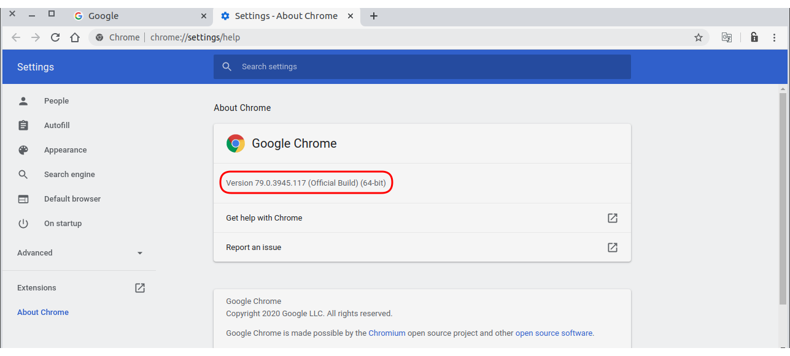

## 3. 웹페이지에 드론 GPS 좌표 출력 

**튜토리얼 레벨 :**  Intermediate(중급)(수정)

**이 튜토리얼 작성 환경 :**  catkin **/** Ubuntu 16.04 **/** Kinetic

**다음 튜토리얼 :** [링크 수정 필요]() 

**이전 튜토리얼 :** [링크 수정 필요]() 

**목록보기:** [README.md](../README.md) 


실시간으로 Parrot Bebop2 드론을 지도에 표시해보자. 파이썬 라이브러리 중 Selenium 라이브러리는 파이썬 코드와 웹서버 사이에 데이터를 전달할 수 있다. 

구현에는 Ubuntu 16.04, ROS Kinetic Kame, Python, Selenium, Node.js, Kakao Map API 를 사용하으며, 먼저 파이썬( rospy )으로 Bebop2 GPS 데이터를 구독하는 Subscriber 를 구현하고, Subscribe 한 Bebop2 드론의 GPS 정보를 Selenium 을 통해 웹서버로 전달하였다. 전달된 GPS 정보는 Kakao Map API를 통해 지도화면에 표시하도록 하였다.

---

### 1. node.js 를 이용한 웹서버

---

#### 1.1 node.js 설치

**node.js** 10.x 버전 설치를 위한 **repository** 등록 및 반영 

```
$ curl -sL https://deb.nodesource.com/setup_10.x | sudo -E bash -
```

( `curl` 또는 `build-essential` 에 관련된 의존성 문제 발생할 경우에는 `sudo apt-get install curl build-essential` 명령으로 의존성 설치 후 진행. )

**node.js** 10.x 버전 설치

```
$ sudo apt-get install -y nodejs
```

설치된 **node.js** 및 **npm** ( Node Package Manager ) 버전 확인. 

```
$ node -v
v10.19.0
$ npm -v
6.13.7
```


#### 1.2 express.js 설치

* 다음과 같이 **express** 와 **express-generator** 를 설치한다.

  ```
  $ sudo npm install -g express
  $ sudo npm install -g express-generator
  ```


#### 1.3 간단한 웹 서버 구현

* express 를 이용하여 웹 어플리케이션 gps2web 생성

  ```
  $ express gps2web
  ```

* 생성된 gps2web 어플리케이션의 기본 의존성 설치

  ```
  $ cd gps2web
  $ npm install
  ```

* `~/gps2web/public/index.html` 을 시작 페이지로 하는 웹 서버 코드 편집

  ```
  $ gedit ~/gps2web/app.js
  ```

  자동으로 생성되어 있는 `app.js` 의 내용을 다음코드로 변경한다.

  ```javascript
  var express = require('express');
  var app = express();
  
  app.use(express.static(__dirname + '/public'));
  
  const port = 8080;
  
  app.listen(port, function(){
      console.log('listening on *:' + port);
  });
  ```

* `~/gps2web/public/index.html` 작성

  ```
  $ gedit ~/gps2web/public/index.html
  ```

  **index.html**

  ```html
  <html>
      <head>
          <title> selenium example </title>
      </head>
      <body>
          <h2> Selenium Sample Page </h2>
          <hr>
          <p>
              Lattitude: <input id="longi" type="text"> &nbsp;
              Longitude: <input id="latti" type="text">
          </p>
          <scripts>
              function update_gps(lat, lon) {
                  var lattitude, longitude;
                  
                  if(lat) document.getElementById('latti').value = lat;
                  else; // if(lat == undefined) do nothing
                  
                  if(lon) document.getElementById('longi').value = lon;
                  else; // if(lon == undefined) do nothing
              }
              let timerId = setInterval(update_gps, 500); // every 0.5(sec)
          </scripts>
      </body>
  </html>
  ```


---

### 2. 웹드라이버 설치

---

* **타겟 브라우저의 버전 확인**

  **Selenium**은 웹브라우저를 제어할 수 있는 프레임워크( Framework )로 제어하고자하는 브라우저의 웹드라이버( web-driver )를 통해 제어를 수행한다. 이 웹드라이버는 브라우저의 종류와 버전에 따라  다르며, **Selenium**을 통해 제어하려는 대상 브라우저와 그 버전에 맞는 드라이버를 설치해야 한다.

  **Chrome** 브라우저의 경우를 예로 들자면 사용중인 Chrome 브라우저를 실행 후 ''버튼을 클릭하여 열린 메뉴에서 **'Help' - 'About Google Chrome'** 메뉴를 선택한다.

  

  열려진 **'Settings - About Chrome'** 탭에서 버전을 확인한다. 

* **웹드라이버 다운로드**

  크롬 브라우저의 버전을 알아냈으면 아래 링크에서 해당 버전의 드라이버를 다운받는다.
  Chrome 웹드라이버 다운로드: https://sites.google.com/a/chromium.org/chromedriver/downloads

  

  크롬 브라우저의 버전과 시작번호가 같은 드라이버를 다운로드한다. ( 다운로드한 웹드라이버는 압축해제하고, 그 경로를 파악해둔다. )

---

### 3. Bebop2 GPS 좌표 Subscriber

---

* **GPS 좌표 Subscriber 노드 작성**

  `bebop_autonomy` 의  `/bebop/states/ardrone3/PilotingState/PositionChanged` 토픽을 구독하는 subscriber 노드를 작성해보자. 패키지는 따로 샌성하지 않고, 이 전 튜토리얼에서 생성한 `bebop2_apps` 패키지의 `scripts` 폴더에 `bebop2_sub_gps.py` 파일만 추가한다.

  ```
  $ gedit ~/catkin_ws/src/bebop2_apps/scripts/bebop2_sub_gps.py
  ```

  **bebop2_sub_gps.py** 

  ```python
  #!/usr/bin/env python
  
import rospy
  from bebop_msgs.msg import Ardrone3PilotingStatePositionChanged
  
  def callback(msg):
      latitude  = msg.latitude
      longitude = msg.longitude
      print('%f  %f' % (latitude, longitude))
  
  if __name__ == '__main__':
  
      rospy.init_node("get_gps", anonymous=10)
      rospy.Subscriber("bebop/states/ardrone3/PilotingState/PositionChanged", 
                       Ardrone3PilotingStatePositionChanged,
                       callback)
  
      rospy.spin()
  ```
  

---

### 4. Subscribe 한 GPS 정보를 HTML 로 전달하는 노드 작성

---

앞서 작성한 코드에서 subscribe 한 GPS 정보를 HTML로 전달하는 노드를 작성해보자. 바로 이 때 **Selenium** 이 필요하다.

* **파이썬 Selenium 라이브러리 추가**

  ```
  pip install selenium
  ```

* **`bebop2_apps` 패키지에 `bebop2_gps2web.py` 노드 추가 편집**

  ```
  $ gedit ~/catkin_ws/src/bebop2_apps/scripts/bebop2_gps2web.py
  ```

  **bebop2_gps2web.py** 

  ```python
  #!/usr/bin/env python
  
  import rospy
  from std_msgs.msg import String
  from bebop_msgs.msg import Ardrone3PilotingStatePositionChanged
  from selenium import webdriver
  import time
  
  drv = webdriver.Chrome(executable_path='./chromedriver')
  
  def callback(msg):
      latitude  = msg.latitude
      longitude = msg.longitude
      print('%f  %f' % (latitude, longitude))
      drv.execute_script('update_gps(%s, %s)' % (str(latitude), str(longitude)))
  
  
  if __name__ == '__main__':
      drv.get('http://localhost:8080')
      time.sleep(3)
  
      rospy.init_node("get_gps", anonymous=10)
      rospy.Subscriber("bebop/states/ardrone3/PilotingState/PositionChanged", 
                       Ardrone3PilotingStatePositionChanged,
                       callback)
  
      rospy.spin()
  ```

---

### 


[튜토리얼 목록 열기](../README.md)


