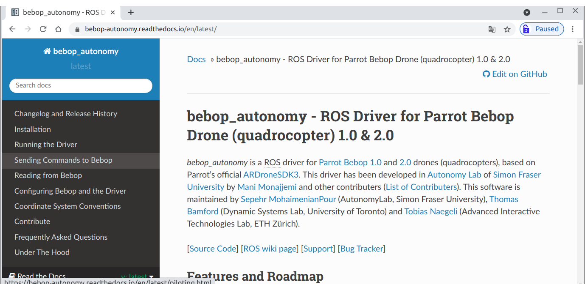

## bebop_autonomy / tele-op-key


---

## Bebop 원격제어 Node 작성

**튜토리얼 레벨 :**  Intermediate(중급)(수정)

**이 튜토리얼 작성 환경 :**  catkin **/** Ubuntu 16.04 **/** Kinetic

**다음 튜토리얼 :** [링크 수정 필요]()

**이전 튜토리얼 :** [링크 수정 필요]()

**자료원본(출처) :** <https://bebop-autonomy.readthedocs.io/en/latest/>

**목록보기:** [README.md](../README.md)

---

키보드를 이용한 Bebop2 드론의 원격조종노드를 작성해보자. 

일단은 Sphinx를 이용한 Gazebo 환경의 시뮬레이션된 드론을 제어하는 코드를 만들지만, 이 코드는 실제 Bebop2 드론에서도 동일하게 작동된다.


### 1. 스핑크스 구동 

스핑크스 구동을 위한 펌웨어 서비스 구동. 

```bash
$ sudo systemctl start firmwared.service
```

스핑크스 구동

```bash
$ sphinx /opt/parrot-sphinx/usr/share/sphinx/drones/bebop2.drone
```

여기까지 과정은 실제 Bebop2 드론을 구동할 경우, 드론과 네트워크 연결 후, `roscore` 를 구동하기까지의 과정에 해당한다.


### 2. 드라이버 구동 

`bebop_driver` 패키지의 `bebop_node.launch` 를 Sphinx 용으로 수정한 `bebop_sphinx.launch` 를 구동한다.

```bash
$ roslaunch bebop_driver bebop_sphinx.launch
```

여기까지 진행한 이유는 topic list 를 확인해보기 위함이다. `rostopic list` 명령을 이용해 발행 중인 토픽목록을 확인해보자.

```bash
$ rostopic list
    .
    .
    .
/bebop/cmd_vel
    .
    .
    .
/bebop/land
    .
    .
/bebop/reset
    .
    .
    .
/bebop/takeoff
    .
    .
    .
```

상당히 많은 수의 토픽 목록이 나타났지만 원격제어를 위해 필요한 토픽은 위 4가지 토픽이다. 


### 3. 원격 제어 코드 작성


#### 3.1. 원격 제어 코드 작성을 위한 레퍼런스

`bebop_teleop.py` 를 작성하기 위한 정보는 이 문서 작성 시 참고한 https://bebop-autonomy.readthedocs.io/en/latest/ 에 잘 설명되어 있다. 오른 쪽 카테고리 항목의 **'Sending Command to Bebop'** 부터 살펴보면 된다.



**이륙( Tankeoff )**

토픽명: `/bebop/takeoff`

토픽타입: `std_msgs/Empty`

```bash
$ rostopic pub --once /bebop/takeoff std_msgs/Empty
```

**착륙( Land )**

토픽명: `/bebop/land`

토픽타입: `std_msgs/Empty`

```bash
$ rostopic pub --once /bebop/land std_msgs/Empty
```

**비상 정지( Emergency )**

토픽명: `/bebop/reset`

토픽타입: `std_msgs/Empty`

```bash
$ rostopic pub --once /bebop/reset std_msgs/Empty
```

**조종( Piloting )**

토픽명: `/bebop/cmd_vel`

토픽타입: `geometry_msgs/Twist` 

```
linear.x  (+) forward   전진
          (-) backward  후진
linear.y  (+) left      좌로 이동
          (-) right     우로 이동
linear.z  (+) ascend    상승
          (-) descend   하강
angular.z (+) ccw       반시계방향 회전
          (-) cw        시계방향 회전
```

모든 필드에 허용되는 범위는 [-1..1]이며, 마지막으로 받은 명령을 드라이버가 구동중인 동안 실행한다. 호버링을 위해서는 모든 필드에 `0` 을 적용한 `Twist` 메세지를 토픽명 `/bebop/cmd_vel` 로 발행한다. ( `Takeoff` ,  `Land` ,  `Emergency` 명령을 수신하면 모든 필드에 `0` 이 적용된다. )


#### 3.2. 원격 제어 코드 작성

**bebop2 drone 제어코드 패키지 만들기**

`~/catkin_ws/src` 로 작업경로 변경

```bash
$ cd ~/catkin_ws/src
```

`rospy` ,  `std_msgs` ,  `geometry_msgs` 에 대해 의존성을 가지는 bebop2 드론 제어 노드 패키지 `bb2_pkg` 생성

```bash
$ catkin_create_pkg bb2_pkg rospy std_msgs geometry_msgs
```

**파이썬  make 파일( setup.py ) 작성**

`bb2_pkg` 폴더로 작업경로 변경 

```bash
$ cd ./bb2_pkg
```

`setup.py` 만들기

```bash
$ touch ./setup.py
```

`setup.py` 편집

```bash
$ gedit ./setup.py &
```

`~/catkin_ws/src/bb2_pkg/src` 폴더에 `bb2_pkg` 폴더를 만들고, 그 안에 파이썬 사용자 라이브러리를 넣어두고 사용하기 위해 다음과 같이 `setup.py` 를 작성한다. 

```python
from distutils.core import setup
from catkin_pkg.python_setup import generate_distutils_setup

setup_args = generate_distutils_setup(
    packages=['bb2_pkg'],
    package_dir={'': 'src'},
)

setup(**setup_args)
```

`./src` 폴더안에 `bb2_pkg` 폴더 생성 

```bash
$ mkdir ./src/bb2_pkg
```

`./src/bb2_pkg`  폴더안에 `__init__.py` 파일 생성 

```bash
$ touch ./src/bb2_pkg/__init__.py
```

**키보드 입력처리 사용자 라이브러리( GetChar.py ) 작성**

`./src/bb2_pkg` 폴더 안에 GetChar.py 파일 만들기

```bash
$ touch ./src/bb2_pkg/GetChar.py
```

`./src/bb2_pkg/GetChar.py` 편집

```bash
$ gedit ./src/bb2_pkg/GetChar.py &
```

다음과 같이  `./src/bb2_pkg/GetChar.py` 를 작성한다. 

```python
#! /usr/bin/env python
 
import os, time, sys, termios, atexit, tty
from select import select
  
# class for checking keyboard input
class GetChar:
    def __init__(self):
        # Save the terminal settings
        self.fd = sys.stdin.fileno()
        self.new_term = termios.tcgetattr(self.fd)
        self.old_term = termios.tcgetattr(self.fd)
  
        # New terminal setting unbuffered
        self.new_term[3] = (self.new_term[3] & ~termios.ICANON & ~termios.ECHO)
        termios.tcsetattr(self.fd, termios.TCSAFLUSH, self.new_term)
  
        # Support normal-terminal reset at exit
        atexit.register(self.set_normal_term)
      
      
    def set_normal_term(self):
        termios.tcsetattr(self.fd, termios.TCSAFLUSH, self.old_term)
  
    def getch(self):        # get 1 byte from stdin
        """ Returns a keyboard character after getch() has been called """
        return sys.stdin.read(1)
  
    def chk_stdin(self):    # check keyboard input
        """ Returns True if keyboard character was hit, False otherwise. """
        dr, dw, de = select([sys.stdin], [], [], 0)
        return dr
```

**Bebop2 드론 원격제어 코드 작성**

`scripts` 폴더 생성 

```bash
$ mkdir ./scripts
```

`./scripts/bebop_teleop.py` 파일 생성

```bash
$ touch ./scripts/bebop_teleop.py
```

`./scripts/bebop_teleop.py` 파일에 실행 속성 부여

```bash
$ chmod +x ./scripts/bebop_teleop.py
```

`./scripts/bebop_teleop.py` 파일 편집

```bash
$ gedit ./scripts/bebop_teleop.py &
```

```python
#!/usr/bin/env python

import rospy
from geometry_msgs.msg import Twist
from std_msgs.msg import Empty
from bb2_pkg.GetChar import GetChar
 
msg = '''
---------------------------------------------------
 1:take off, 2:landing, 3:emergency, sp:stop(hover)
---------------------------------------------------
        w                           i                      
   a    s    d                j     k     l
---------------------------------------------------
w/s : up  / down           i/k : foward / backword
a/d : ccw / cw             j/l : left   / righ
---------------------------------------------------
-/+ : decrease / increase linear  speed by 10%
,/. : decrease / increase angular speed by 10%
---------------------------------------------------
Type 'Q' to quit

'''

# set direction for each move
moveBindings = {
    'w':( 0, 0, 1, 0), 'a':( 0, 0, 0, 1), 'i':( 1, 0, 0, 0), 'j':( 0, 1, 0, 0), 
    's':( 0, 0,-1, 0), 'd':( 0, 0, 0,-1), 'k':(-1, 0, 0, 0), 'l':( 0,-1, 0, 0),
    ' ':( 0, 0, 0, 0)
}

# '+', '-': for linear velocity / '>', '<': for angular velocity
speedBindings = {
#                   '+'             '<'             '>'
    '-':(0.9, 1.0), '=':(1.1, 1.0), ',':(1.0, 0.9), '.':(1.0, 1.1), '0':(1.0, 1.0)
}


class MoveBebop():

    def __init__(self):
    
        rospy.init_node('bebop_teleop_key')
        
        self.pub0 = rospy.Publisher('/bebop/cmd_vel', Twist, queue_size = 1)
        self.pub1 = rospy.Publisher('/bebop/takeoff', Empty, queue_size = 1)
        self.pub2 = rospy.Publisher('/bebop/land',    Empty, queue_size = 1)
        self.pub3 = rospy.Publisher('/bebop/reset',   Empty, queue_size = 1)
        
        self.empty_msg = Empty()
        self.key_input = GetChar()
        
        self.lin_spd = rospy.get_param("~speed", 0.5)
        self.ang_spd = rospy.get_param("~turn",  1.0)
        
        self.lin_x   =  0      # for linear.x
        self.lin_y   =  0      # for linear.y
        self.lin_z   =  0      # for angular.z
        self.ang_z   =  0      # for linear.z
        self.count   =  0
        self.cnt4msg = 10      # print how2use every (cnt4msg)time
        
    def get_speed(self, lin, ang):
        return "current speed:\tlinear = %s, angular = %s " % (lin, ang)


if __name__ == '__main__': 
    try:
        mb = MoveBebop()
        
        print(msg)
        print(mb.get_speed(mb.lin_spd, mb.ang_spd))
        
        key = ' '
        
        while key != 'Q':   # while not rospy.is_shutdown():
        
            key = mb.key_input.getch()
    
            if   key == '1':
                mb.pub1.publish(mb.empty_msg);  print "taking off"
                mb.count = (mb.count + 1) % mb.cnt4msg                
            elif key == '2':
                mb.pub2.publish(mb.empty_msg);  print "landing"
                mb.count = (mb.count + 1) % mb.cnt4msg
                
            elif key == '3':
                mb.pub3.publish(mb.empty_msg);  print "emergency stop!!!"
                mb.count = (mb.count + 1) % mb.cnt4msg
                
            elif key in moveBindings.keys():
            
                mb.lin_x = moveBindings[key][0]
                mb.lin_y = moveBindings[key][1]
                mb.lin_z = moveBindings[key][2]
                mb.ang_z = moveBindings[key][3]
                    
                if   mb.lin_x ==  1:
                    print "forward"
                elif mb.lin_x == -1:
                    print "backward"
                      
                if   mb.lin_y ==  1:
                    print "move left"
                elif mb.lin_y == -1:
                    print "move right"
                
                if   mb.lin_z ==  1:
                    print "ascending"
                elif mb.lin_z == -1:
                    print "descending"
                      
                if   mb.ang_z ==  1:
                    print "turn left"
                elif mb.ang_z == -1:
                    print "turn right"
            
                mb.count = (mb.count + 1) % mb.cnt4msg
                
            elif key in speedBindings.keys():
                mb.lin_spd = mb.lin_spd * speedBindings[key][0]
                mb.ang_spd = mb.ang_spd * speedBindings[key][1]
 
                print(mb.get_speed(mb.lin_spd, mb.ang_spd))
                
                mb.count = (mb.count + 1) % mb.cnt4msg
                
            else:            
                pass
            
            if (mb.count == 0):
                    print(msg)
 
            tw = Twist()
            
            tw.linear.x  = mb.lin_x * mb.lin_spd
            tw.linear.y  = mb.lin_y * mb.lin_spd
            tw.linear.z  = mb.lin_z * mb.lin_spd
            
            tw.angular.x = tw.angular.y = 0
            tw.angular.z = mb.ang_z * mb.ang_spd
            
            mb.pub0.publish(tw)
            
        mb.pub2.publish(mb.empty_msg);  print "landing"
 
    except KeyboardInterrupt:   # rospy.ROSInterruptException:
        mb.pub2.publish(mb.empty_msg);  print "landing"
```

**패키지( bb2_pkg ) 빌드**

`CMakeList.txt` 편집 ( 23행의 주석 해제 )

```makefile
cmake_minimum_required(VERSION 3.0.2)
project(bb2_pkg)

## Compile as C++11, supported in ROS Kinetic and newer
# add_compile_options(-std=c++11)

## Find catkin macros and libraries
## if COMPONENTS list like find_package(catkin REQUIRED COMPONENTS xyz)
## is used, also find other catkin packages
find_package(catkin REQUIRED COMPONENTS
  geometry_msgs
  rospy
  std_msgs
)

## System dependencies are found with CMake's conventions
# find_package(Boost REQUIRED COMPONENTS system)


## Uncomment this if the package has a setup.py. This macro ensures
## modules and global scripts declared therein get installed
## See http://ros.org/doc/api/catkin/html/user_guide/setup_dot_py.html
catkin_python_setup()	# <---- uncomment this line

################################################
## Declare ROS messages, services and actions ##
################################################
```

패키지 빌드

```bash
$ cd ~/catkin_ws && catkin_make
```


[튜토리얼 목록 열기](../README.md)


