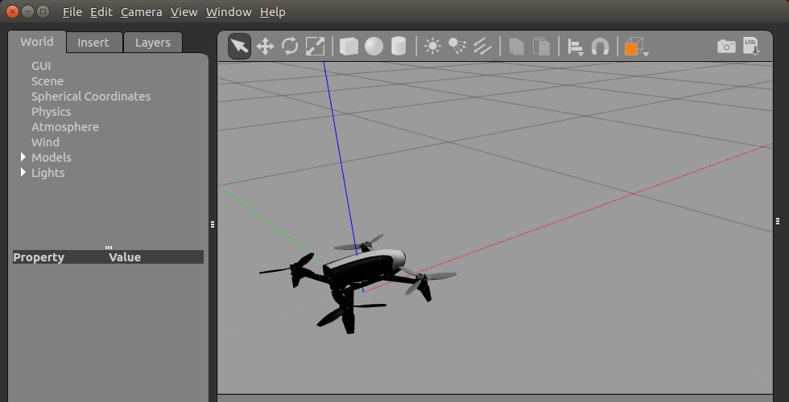

## bebop_autonomy / Parrot-Sphinx


---

## Parrot-Sphinx guide book

**튜토리얼 레벨 :**  Intermediate(중급)(수정)

**이 튜토리얼 작성 환경 :**  catkin **/** Ubuntu 16.04 **/** Kinetic

**다음 튜토리얼 :** [링크 수정 필요]()

**이전 튜토리얼 :** [링크 수정 필요]()

**자료원본(출처) :** <https://developer.parrot.com/docs/sphinx/>

**목록보기:** [README.md](../README.md)

---

이 문서는 [Parrot-Sphix guide book](https://developer.parrot.com/docs/sphinx/) 을 참조하여, 

- 운영체제 : Ubuntu 16.04 (xenial) 

- ROS 버전 : Kinetic Kame

- 타겟 플랫폼 : Parrot Bebop2 드론 
- 의존성 : bebop_autonomy ROS 패키지

상기 환경에서  `Parrot-Sphinx` 를 이용한 개발환경을  구축하는 방법을 설명한다. 


### 1. Parrot-Sphinx는...

`Parrot-Sphinx` 는 원래 드론 SW 를 개발하는 Parrot 社의 엔지니어를 위해 만든 시뮬레이션 툴이다. 

호스트시스템과 격리( 분리 )된 환경의 PC 에서 Parrot 드론 펌웨어를 실행하는 것이 주요개념으로, 이를 위해 `ROS` 의 `Gazebo` 를 통해 드론의 물리, 시각적 환경을 시뮬레이션하며 다음과 같은 기능을 제공한다.

* 웹브라우져를 통한 비행 데이터 시각화( Visualization )
* 동작 중 드론 제어
* 터미널을 통한 스크립팅
* 실제 드론에 사용되는 스마트폰 조종앱( Freefligt 등 )을 이용한 제어
* PC에 연결된 카메라( 웹캠 등 )를 이용한 비디오 스트리밍
* 원격 서버를 통한 실행


### 2. 시스템 요구사양 

* `Parrot-Sphinx` 는 리눅스( 64bit )에서만 실행될 수 있으며, 그 중에서도 다음 배포판에서 보다 정확히 작동한다. 
  
  * Ubuntu 16.04 (xenial) - 이 문서의 작성환경
  * Ubuntu 18.04 (bionic) - 권장 사항
  * Debian 9 (stretch)
  * Debian 10 (buster)
  
* 최소 1GB의 디스크 공간

* 버전 3.0 이상의 OpenGL 지원

  OpenGL 지원 유무를 알아내기 위해 다음 명령을 실행한다. 

  ```bash
  $ glxinfo | grep "OpenGL version"
  OpenGL version string: 3.0 Mesa 18.0.5
  ```

  `glxinfo`  실행 시 다음과 같은 에러가 발생할 경우, 

  ```bash
  $ glxinfo | grep "OpenGL version"
  The program 'glxinfo' is currently not installed. You can install it by typing:
  sudo apt install mesa-utils
  ```

  에러 메세지가 알려주는 것과 같이 다음 명령을 수행 후, 

  ```bash
  $ sudo apt-get install mesa-utils
  ```

  다시 `glxinfo` 명령을 다음과 같이 실행한다. 

  ```bash
  $ glxinfo | grep "OpenGL version"
  OpenGL version string: 3.0 Mesa 18.0.5
  ```

* WiFi Adapter 

  시뮬레이션 된 Parrot 드론 연결을 위한 AP모드를 지원하는 무선 랜카드가 필요하다. 
  
  실제 드론에 연결할 때에도 AP모드로 동작하는 드론의 WiFi에 연결한다. 그처럼 이 무선랜카드를 이용하여 시뮬레이션된 드론에 연결하여 실제 드론대신에 작성한 코드로 동작시켜 볼 수 있다. 
  
  따라서 AP모드( `hostapd` )가 지원되는 무선랜카드를 사용해야 하는데, AP모드( `hostapd` )가 지원되더라도 실제로 동작하지 않는 경우가 있으므로 다음 호환 제품목록을 참조하여 준비할 것을 권한다.
  
  * **Parrot-Sphinx 구동이 테스트된 WiFi어댑터 목록 링크**
    * [USB 방식](https://developer.parrot.com/docs/sphinx/system-requirements.html#id3)
    * [PCI 방식](https://developer.parrot.com/docs/sphinx/system-requirements.html#id4) 
    * 위에는 없지만 테스트 결과 RTL8188CU, MT7610U 칩셋을 탑재한 USB 방식 제품들의 동작 확인.

* 인터넷 연결( 온 라인 )

  위에 설명한 시뮬레이션된 Parrot 드론( ex: Bebop2, ANAFI 등 ) 연결을 위한 WiFi 어댑터와는 별도의 인터넷연결이 필요하다. 시뮬레이션을 위해 인터넷을 통해 펌웨어를 다운받아 실행하기 위함이다.


### 3. 설치

#### 3.1 repository 주소 및 key 추가

`/ets/apt/sources.list.d` 파일에 `Parot-Sphinx` 저장소 주소 추가

```bash
$ echo "deb http://plf.parrot.com/sphinx/binary `lsb_release -cs`/" | sudo tee /etc/apt/sources.list.d/sphinx.list > /dev/null
```

`Parot-Sphinx` 저장소 접근을 위한 키 등록

```bash
sudo apt-key adv --keyserver keyserver.ubuntu.com --recv-keys 508B1AE5
```

#### 3.2 Parrot-Sphinx 패키지 설치

변경된 `/ets/apt/sources.list.d` 파일 반영을 위한 업데이트

```bash
$ sudo apt-get update
```

`Parot-Sphinx` 바이너리 패키지 설치

```bash
$ sudo apt-get install parrot-sphinx
```

설치 중 다음 화면에서 `tab` 키를 이용해 \<Ok> 를 선택 후 `Enter` .


이 후, 다음과 같은 소프트웨어 사용조건에 대한 동의 화면이 나타나면 역시 `tab` 키를 이용해 \<OK> 를 선택 후 `Enter` .


설치가 거의 끝나갈 무렵 다음과 같이 `firmwared` 그룹에 추가할 사용자명을 입력하는 화면이 나타나면, 


우분투에 로그인한 사용자명을 입력 후 `Enter` .

`ctrl` + `alt` + `T` 를 입력하여 아래와 같이 터미널을 열 경우, `david` 에 해당하는 문자열이 현재 로그인한 사용자명이다.

```bash
david@supermachine:~$
```

이 작업이 효력을 갖기 위해서는 로그아웃 후 다시 로그인 하거나 리부팅이 필요하다.


### 4. Sphinx 구동을 위해 필요한 작업

#### 4.1 'bebop2.drone' 파일 수정

적당한 편집기를 이용하여 `/opt/parrot-sphinx/usr/share/sphinx/drones/bebop2.drone` 파일을 수정해야 한다. 이 작업을 위해서는 `Parrot-Sphinx` 로 시뮬레이션된 드론에 연결하기위한 WiFi 네트워크 인터페이스  이름이 필요하다. `ifconfig` 명령으로 알아낸다.

```bash
$ ifconfig
en0123456 Link encap:Ethernet  HWaddr 00:11:22:33:44:55  
          inet addr:xxx.xxx.xxx.71  Bcast:xxx.xxx.xxx.255  Mask:255.255.255.0
                 .
                 .
                 .
                 
lo        Link encap:Local Loopback  
          inet addr:127.0.0.1  Mask:255.0.0.0
      |          .
      |          .
      v          .
_______________  
wlxaabbccddeeff Link encap:Ethernet  HWaddr aa:bb:cc:dd:ee:ff  <--- 앞에 표시한 인터페이스 이름
          UP BROADCAST MULTICAST  MTU:1500  Metric:1
                 .
                 .
                 .
```

위의 `ifconfig` 명령 실행 결과를 보면 `en0123456` , `lo` , `wlxaabbccddeeff` 모두 3개의 네트워크 인터페이스가 보인다. 이 중 `w` 문자로 시작하는 `wlxaabbccddeeff` 가 WiFi 네트워크 인터페이스이름이다. 

 `/opt/parrot-sphinx/usr/share/sphinx/drones/bebop2.drone` 파일 편집. 

```bash
$ sudo nano /opt/parrot-sphinx/usr/share/sphinx/drones/bebop2.drone
```

`bebop2.drone` 파일의 내용은 다음과 같다.

```xml
<?xml version="1.0" encoding="UTF-8"?>
<drone
  name="bebop2"
  firmware="http://plf.parrot.com/sphinx/firmwares/ardrone3/milos_pc/latest/images/
  ardrone3-milos_pc.ext2.zip"
  hardware="milosboard">
  <machine_params
    low_gpu="0"
    with_front_cam="1"
    with_hd_battery="0"
    with_flir="0"
    flir_pos="tilted"/>
  <pose>default</pose>
  <interface>eth1</interface>
  <!-- 'wlan0' may need to be replaced the actual wifi interface name ------------------->
  <stolen_interface>wlan0:eth0:192.168.42.1/24</stolen_interface><!-- modify this line -->
  <!-- stolen_interface>wlxaabbccddeeff:eth0:192.168.42.1/24</stolen_interface ---------->
</drone>
```

위에 주석으로 표시한 것 중 `<stolen_interface>wlan0:eth0:192.168.42.1/24</stolen_interface>` 부분을  `<stolen_interface>wlxaabbccddeeff:eth0:192.168.42.1/24</stolen_interface>` 와 같이 자신이 사용하는 네트워크 인터페이스 이름으로 변경 후 저장, 종료한다. 

시뮬레이션이 원활하지 않을 경우 

 `low_gpu="0"` 를 `low_gpu="1"` 로,  `with_front_cam="1"` 은 `with_front_cam="0"` 로 변경하면 효과가 있다. 

`with_hd_battery="0"` 는 시스템 성능과 상관없이 `with_hd_battery="1"` 로 변경하는 것이 유리하다.


#### 4.2 'bebop_sphinx.launch' 만들기

```bash
$ cd ~/catkin_ws/src/bebop_autonomy/bebop_driver/launch
$ cp bebop_node.launch bebop_sphinx.launch
```


#### 4.3 'bebop_sphinx.launch' 수정

`~/catkin_ws/src/bebop_autonomy/bebop_driver/launch/bebop_node.launch` 파일의 `name` 속성이 `ip` 인 `<arg>` 태그의 `default` 속성의 값을 `192.168.42.1 (실제 드론의 IP )` 에서 `10.202.0.1(시뮬레이션 드론의 ip` 로 변경한다.

```bash
$ gedit ~/catkin_ws/src/bebop_autonomy/bebop_driver/launch/bebop_sphinx.launch
```

`bebop_sphinx.launch` 파일의 내용은 다음과 같다.

```xml
<?xml version="1.0"?>
<launch>
    <arg name="namespace" default="bebop" />
    <arg name="ip" default="192.168.42.1" /> <!-- change this to "10.202.0.1" 로 변경-->
    <arg name="drone_type" default="bebop2" /> 
    <arg name="config_file" default="$(find bebop_driver)/config/defaults.yaml" />
    <arg name="camera_info_url" default="package://bebop_driver/data/$(arg drone_type)_camera_calib.yaml" />
    <group ns="$(arg namespace)">
        <node pkg="bebop_driver" name="bebop_driver" type="bebop_driver_node" output="screen">
            <param name="camera_info_url" value="$(arg camera_info_url)" />
            <param name="bebop_ip" value="$(arg ip)" />
            <rosparam command="load" file="$(arg config_file)" />
        </node>
        <include file="$(find bebop_description)/launch/description.launch" />
    </group>
</launch>
```

```<arg name="ip" default="192.168.42.1" />``` 부분을 ```<arg name="ip" default="10.202.0.1" />``` 와 같이 ( 주석에 표시해둔 것과 같이 ) 변경, 저장한다.


#### 4.4 ROS 네트워크 설정 확인

`~/.bashrc` 파일의 `ROS_HOSTNAME` 및 `ROS_MASTER_URI` 설정이 다음과 같은 지 확인한다.

```bash
export ROS_HOSTNAME=localhost
export ROS_MASTER_URI=http://localhost:11311
```


### 5. Parrot-Sphinx 구동

#### 5.1 펌웨어 서비스 구동

스핑크스에서 드론 펌웨어 파일을 구동하려면 리눅스 펌웨어 서비스가 필요하다. 다음과 같이 실행하면된다.

```bash
$ sudo systemctl start firmwared.service
```

PC 를 껏다 켰거나, 리부팅한 경우 다시 실행 주어야 한다.


#### 5.2 스핑크스 구동 

먼저 인터넷 연결을 확인한 후 다음과 같이 스핑크스를 구동한다. 

```bash
$ sphinx /opt/parrot-sphinx/usr/share/sphinx/drones/bebop2.drone
```

정상적으로 구동된 경우 아래와 같은 화면을 볼 수 있다. 하지만 아직 드론을 움직일 수 없다. 드라이버 노드가 아직 구동되지 않았기 때문이다.




#### 5.3 'bebop_sphinx.launch' 파일 실행

4. 3 에서 수정한 `bebop_sphinx.launch` 파일을 구동한다. 

```bash
$ roslaunch bebop_driver bebop_sphinx.launch
```

에러없이 구동에 성공했다면 `rostopic` 명령으로 `/bebop/takeoff` 라는 토픽명으로 `std_msgs/Empty` 형식의 토픽을 발행하여, 화면의 `bebop2` 드론을 이륙시켜 보자.

```bash
$ rostopic pub /bebop/takeoff std_msgs/Empty
```

아래 화면과 같이 화면 속의 드론이 이륙한 것을 볼 수 있다. ( 착륙은 토픽명만  `/bebop/land`로 변경 실행한다. )


시뮬레이션이 아닌 실제 bebop2 드론에 대한 코드를 작성하고 테스트하기 위해서는, 

1. **Bebop2 전원 켜기** 

2. **WiFi를 bebop2 에 연결**

3. **`roscore` 를 구동**

   ```bash
   $ roscore
   ```

4. **`bebop_driver`  패키지의 `bebop_node.launch` 파일 구동** 

   ```bash
   $ roslaunch bebop_driver bebop_node.launch
   ```


5. **작성한 Bebop2 제어코드 실행**

   ```bash
   $ rosrun bb2_pkg bebop_teleopkey.py
   ```


와 같은 순서로 실행해야 한다. 


스핑크스를 이용할 경우에는, 

1. **리눅스 펌웨어 서비스를 구동**

   ```bash
   $ sudo systemctl start firmwared.service
   ```

2. **스핑크스를 구동**

   ```bash
   $ sphinx /opt/parrot-sphinx/usr/share/sphinx/drones/bebop2.drone
   ```

3. **`bebop_driver`  패키지의 `bebop_sphinx.launch` 파일을 구동** 

   ```bash
   $ roslaunch bebop_driver bebop_sphinx.launch
   ```

4. **작성한 Bebop2 제어코드 실행**

   ```bash
   $ rosrun bb2_pkg bebop_teleopkey.py
   ```

의 순서로 실행한다.


### 6. Sphinx Multi-Drone 구동

`/opt/parrot-sphinx/usr/share/sphinx/drones/bebop2.drone` 파일을 `~/`  위치로 복사

```bash
$ cp /opt/parrot-sphinx/usr/share/sphinx/drones/bebop2.drone ~/sphinx.drone
```

`~/sphinx.drone` 파일 편집

```xaml
<?xml version="1.0" encoding="UTF-8"?>
<drone
  name="bebop2"
  firmware="http://plf.parrot.com/sphinx/firmwares/ardrone3/milos_pc/latest/images/ardrone3-milos_pc.ext2.zip"
  hardware="milosboard">
  <machine_params
    low_gpu="1"
    with_front_cam="0"
    with_hd_battery="0"
    with_flir="0"
    flir_pos="tilted"/>
  <pose>default</pose>
  <interface>eth1</interface>
  <!-- 'wlan0' may need to be replaced the actual wifi interface name -->
  <stolen_interface>wlan0:eth0:192.168.42.1/24</stolen_interface> <!---- replace 'wlan0' to `eth0` -->
</drone>
```

주석으로 표시한 행 `<stolen_interface>wlan0:eth0:192.168.42.1/24</stolen_interface>` 을 `<stolen_interface>eth0:eth0:192.168.42.1/24</stolen_interface>` 으로 수정 후 저장

쉘스크립트 `sphinx.sh` 작성

```bash
$ gedit sphinx.sh &
```

다음과 같이 작성 후 저장

```bash
#!/bin/bash

#::firmware=http://plf.parrot.com/sphinx/firmwares/ardrone3/milos_pc/4.4.2/images/ardrone3-milos_pc.ext2.zip

if [ $# -eq 0 ]; then
	echo How to use:
	echo add connection name as argument up to 3
fi

if [ $# -eq 1 ]; then
	sudo systemctl start firmwared.service
	sphinx ./sphinx.drone::name=bebop1::stolen_interface=$1:eth0:192.168.42.1/24::pose="0 0 0.2 0 0 0.5"
fi

if [ $# -eq 2 ]; then
	sudo systemctl start firmwared.service
	sphinx ./sphinx.drone::name=bebop1::stolen_interface=$1:eth0:192.168.42.1/24::pose="0 -0.5 0.2 0 0 0"::firmware=http://plf.parrot.com/sphinx/firmwares/ardrone3/milos_pc/4.4.2/images/ardrone3-milos_pc.ext2.zip::interface=eth1 ./sphinx.drone::name=bebop2::stolen_interface=$2:eth0:192.168.42.1/24::pose="0 0.5 0.2 0 0 0"::firmware=http://plf.parrot.com/sphinx/firmwares/ardrone3/milos_pc/4.4.2/images/ardrone3-milos_pc.ext2.zip::interface=eths2
fi

if [ $# -eq 3 ]; then
	sudo systemctl start firmwared.service
	sphinx ./sphinx.drone::name=bebop1::stolen_interface=$1:eth0:192.168.42.1/24::pose="0 -1 0.2 0 0 0"::interface=eth1::firmware=http://plf.parrot.com/sphinx/firmwares/ardrone3/milos_pc/4.4.2/images/ardrone3-milos_pc.ext2.zip ./sphinx.drone::name=bebop2::stolen_interface=$2:eth0:192.168.42.1/24::pose="0 0 0.2 0 0 0"::interface=eth2::firmware=http://plf.parrot.com/sphinx/firmwares/ardrone3/milos_pc/4.4.2/images/ardrone3-milos_pc.ext2.zip ./sphinx.drone::name=bebop3::stolen_interface=$3:eth0:192.168.42.1/24::pose="0 1 0.2 0 0 0"::interface=eth3::firmware=http://plf.parrot.com/sphinx/firmwares/ardrone3/milos_pc/4.4.2/images/ardrone3-milos_pc.ext2.zip
fi
```

이 쉘 스크립트는 `arguments` 로 네트워크 인터페이스 이름을 입력해 주어야 한다. `ifconfig` 명령 실행시 나타나는 리얼 네트워크 인터페이스가 `eth0`, `wlan0`, `wlan1`, `wlan2` 들이 있고, 이 중 `wlan2` 가 인터넷에 연결되어 있는 상황을 가정할 때, 이 쉘스크립트로 

3대의 `sphinx` 드론을 구동하려면, 

```bash
$ sh ./sphinx.sh eth0 wlan0 wlan1
```

2대의 `sphinx` 드론을 구동하려면, 

```bash
$ sh ./sphinx.sh eth0 wlan0
```

1대의 `sphinx` 드론을 구동하려면, 

```bash
$ sh ./sphinx.sh eth0
```

와 같이 실행한다. 

구동을 위해서는 네트워크 인터페이스가 `구동할 드론 수 + 1` 만큼 필요하다. 드론 1대마다 `<stolen_interface>` 로 사용하기 위한 인터페이스가 필요하고, 인터넷으로부터 해당 펌웨어를 읽어오기 위한 네트워크 인터페이스가 필요하다.  

`Gazebo` 시뮬레이터에 드론이 3대 나타났다면, 3대에 대한 `driver_node` 를 각각 구동해 주어야만 각각의 드론을 제어할 수 있다. 이 때 각각의 드론에 대한 `topic` , `service` , `action` , `parameter`  등을 구분하려면 각 드론에 대한 `driver_node` 들은 `name space` 를 이용해 구분되어 구동되어야만 한다. 

이를 위해 `~/catkin_ws/src/bebop_autonomy/bebop_driver/launch` 폴더로 작업경로를 변경한다.

```bash
$ cd ~/catkin_ws/src/bebop_autonomy/bebop_driver/launch
```


**1번 드론에 대한 `driver_node` 구동을 위한 `launch` 파일 작성**

`bebop_sphinx.launch` 파일을 파일명 `bebop1_sphinx.launch` 으로 복사

```bash
$ cp bebop_sphinx.launch bebop1_sphinx.launch
```

`bebop1_sphinx.launch` 파일 편집

```bash
$ gedit bebop1_sphinx.launch &
```

다음과 같이 편집 후, 저장

```bash
<?xml version="1.0"?>
<launch>
    <arg name="namespace" default="bebop1" /> <!------ change here -------->
    <arg name="ip" default="10.202.0.1" />
    <arg name="drone_type" default="bebop2" /> <!-- available drone types: bebop1, bebop2 -->
    <arg name="config_file" default="$(find bebop_driver)/config/defaults.yaml" />
    <arg name="camera_info_url" default="package://bebop_driver/data/$(arg drone_type)_camera_calib.yaml" />
    <group ns="$(arg namespace)">
        <node pkg="bebop_driver" name="bebop_driver" type="bebop_driver_node" output="screen">
            <param name="camera_info_url" value="$(arg camera_info_url)" />
            <param name="bebop_ip" value="$(arg ip)" />
            <rosparam command="load" file="$(arg config_file)" />
        </node>
        <include file="$(find bebop_description)/launch/description.launch" />
    </group>
</launch>
```


**2번 드론에 대한 `driver_node` 구동을 위한 `launch` 파일 작성**

`bebop_sphinx.launch` 파일을 파일명 `bebop1_sphinx.launch` 으로 복사

```bash
$ cp bebop_sphinx.launch bebop2_sphinx.launch
```

`bebop2_sphinx.launch` 파일 편집

```bash
$ gedit bebop2_sphinx.launch &
```

다음과 같이 편집 후, 저장

```bash
<?xml version="1.0"?>
<launch>
    <arg name="namespace" default="bebop3" /> <!------ change here -------->
    <arg name="ip" default="10.202.0.1" />
    <arg name="drone_type" default="bebop2" /> <!-- available drone types: bebop1, bebop2 -->
    <arg name="config_file" default="$(find bebop_driver)/config/defaults.yaml" />
    <arg name="camera_info_url" default="package://bebop_driver/data/$(arg drone_type)_camera_calib.yaml" />
    <group ns="$(arg namespace)">
        <node pkg="bebop_driver" name="bebop_driver" type="bebop_driver_node" output="screen">
            <param name="camera_info_url" value="$(arg camera_info_url)" />
            <param name="bebop_ip" value="$(arg ip)" />
            <rosparam command="load" file="$(arg config_file)" />
        </node>
        <include file="$(find bebop_description)/launch/description.launch" />
    </group>
</launch>
```


**3번 드론에 대한 `driver_node` 구동을 위한 `launch` 파일 작성**

`bebop_sphinx.launch` 파일을 파일명 `bebop1_sphinx.launch` 으로 복사

```bash
$ cp bebop_sphinx.launch bebop3_sphinx.launch
```

`bebop3_sphinx.launch` 파일 편집

```bash
$ gedit bebop3_sphinx.launch &
```

다음과 같이 편집 후, 저장

```bash
<?xml version="1.0"?>
<launch>
    <arg name="namespace" default="bebop3" /> <!------ change here -------->
    <arg name="ip" default="10.202.0.1" />
    <arg name="drone_type" default="bebop2" /> <!-- available drone types: bebop1, bebop2 -->
    <arg name="config_file" default="$(find bebop_driver)/config/defaults.yaml" />
    <arg name="camera_info_url" default="package://bebop_driver/data/$(arg drone_type)_camera_calib.yaml" />
    <group ns="$(arg namespace)">
        <node pkg="bebop_driver" name="bebop_driver" type="bebop_driver_node" output="screen">
            <param name="camera_info_url" value="$(arg camera_info_url)" />
            <param name="bebop_ip" value="$(arg ip)" />
            <rosparam command="load" file="$(arg config_file)" />
        </node>
        <include file="$(find bebop_description)/launch/description.launch" />
    </group>
</launch>
```


이제 `sphinx` 로 3대까지의 드론을 시뮬레이션 할 수 있게 되었다. `sphinx.sh` 쉘 스크립트를 실행하고, `bebop1_sphinx.launch` , `bebop2_sphinx.launch` , `bebop3_sphinx.launch` 파일을 구동한 후, `rostopic list` 명령을 실행하면 같은 이름의 `topic` 들이 `/bebop1/...` ,  `/bebop2/...` ,  `/bebop3/...` 와 같이 `namespace` 로 구분되어 있는 것을 볼 수 있다. 


[튜토리얼 목록 열기](../README.md)


