## 3. 웹페이지에 실시간 드론 GPS 위치 표시 

**튜토리얼 레벨 :**  Intermediate(중급)(수정)

**이 튜토리얼 작성 환경 :**  catkin **/** Ubuntu 16.04 **/** ROS Kinetic

**다음 튜토리얼 :** [링크 수정 필요]() 

**이전 튜토리얼 :** [링크 수정 필요]() 

**목록보기:** [README.md](../README.md) 


실시간으로 Parrot Bebop2 드론을 지도에 표시해보자. 파이썬 라이브러리 중 Selenium 라이브러리는 파이썬 코드와 웹서버 사이에 데이터를 전달할 수 있다. 

1. **드론의 GPS 위치를  Selenium을 이용해 웹서버로 전달하는 ROS 노드 작성**
2. **Node.js 와 Kakao 맵 API를 이용한 전달받은 GPS 위치에 마커표시 웹서버 작성** 
3. **Sphinx** 를 이용하여 지도위에 드론 위치 표시

구현에는 Selenium 파이썬 러이브러리, Chrome 웹드라이버, Kakao Map API 와 Node.js 가 사용되었다. 

---

### 1. 드론 GPS 위치 전달 노드

Subscribe 한  드론의 GPS 위치정보를  웹서버로 보내기 위해서는 **Selenium 라이브러리**와 지도를 표시하는데 사용할 웹브라우저의 **웹드라이버가** 필요하다. 


#### 1.1. Selenium 설치

우선 PIP( Package Installer for Python )를 이용해 Sellenium 라이브러리를 설치하자. 

```bash
$ pip install sellenium
```

`pip` 가 설치되어 있지 않다는 에러가 발생한다면 다음 명령으로 `pip` 를 먼저 설치 후, 다시 시도한다.

```bash
$ sudo apt-get install pip
```


#### 1.2. 웹드라이버  설치

* **타겟 브라우저의 버전 확인**

  **Selenium**은 웹브라우저를 제어할 수 있는 프레임워크( Framework )로 제어하고자하는 브라우저의 웹드라이버( web-driver )를 통해 제어를 수행한다. 이 웹드라이버는 브라우저의 종류와 버전에 따라  다르며, **Selenium**을 통해 제어하려는 대상 브라우저와 그 버전에 맞는 드라이버를 설치해야 한다.

  **Chrome** 브라우저의 경우를 예로 들자면 사용중인 Chrome 브라우저를 실행 후 ''버튼을 클릭하여 열린 메뉴에서 **'Help' - 'About Google Chrome'** 메뉴를 선택한다.

  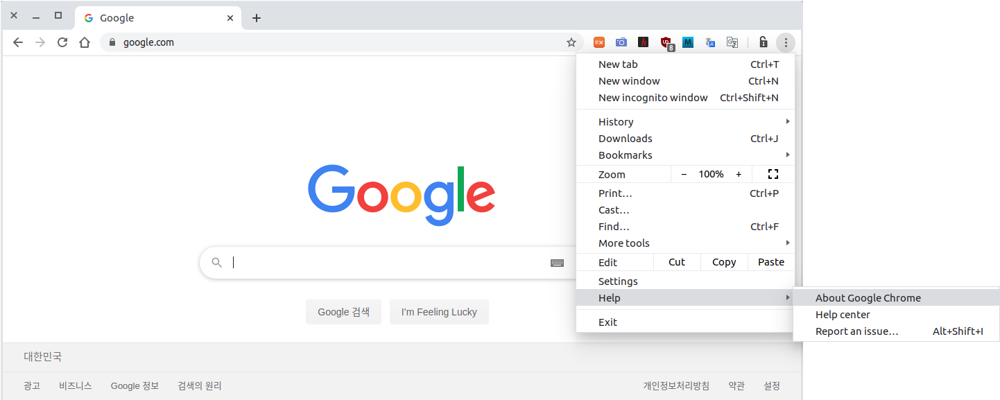

  열려진 **'Settings - About Chrome'** 탭에서 버전을 확인한다. 

* **웹드라이버 다운로드**

  크롬 브라우저의 버전을 알아냈으면 아래 링크에서 해당 버전의 드라이버를 다운받는다.
  Chrome 웹드라이버 다운로드: https://sites.google.com/a/chromium.org/chromedriver/downloads

  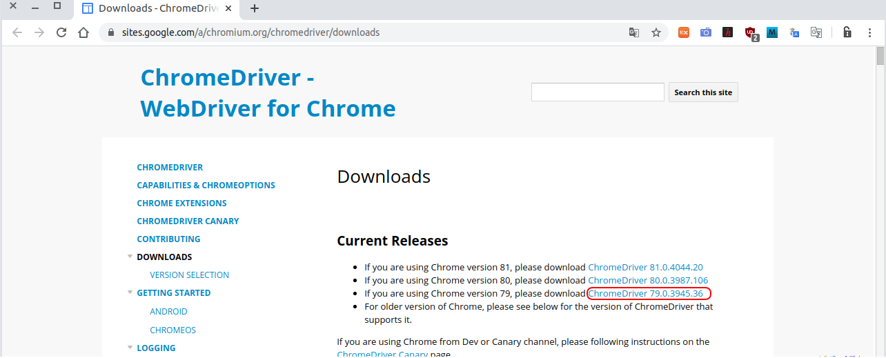

  크롬 브라우저의 버전과 시작번호가 같은 드라이버를 다운로드한다. 다운로드한 웹드라이버는 압축해제하여, 알 수 있는 경로( 예: `~/` )에 복사해 둔다. 
  
  

#### 1.3. 드론 GPS 위치정보 전달 노드 작성

앞서 [3. teleop_key 노드 작성](./bb2_3_teleop_key.md) Chapter 에서 작성한 `bb2_pkg` 노드 패키지의 `scripts` 폴더에 `bebop_gps2web.py` 를 작성한다. 

 `bb2_pkg` 노드 패키지의 `scripts` 폴더로 작업경로 변경

```bash
$ roscd bb2_pkg/scripts
```

 `bebop_gps2web.py` 파일생성

```bash
$ touch bebop_gps2web.py
```

 `bebop_gps2web.py` 파일에 실행속성 부여

```bash
$ chmod +x bebop_gps2web.py
```

 `bebop_gps2web.py` 파일 편집

```python
#!/usr/bin/env python

import rospy, sys
from std_msgs.msg import String
from bebop_msgs.msg import Ardrone3PilotingStatePositionChanged
from selenium import webdriver

USE_SPHINX = bool(int(sys.argv[1]))
'''
    GPS for center of map  (  35.233795,  129.082850 )
    Parot-Sphinx start GPS (  48.878900,    2.367780 )
    diffrence              ( -13.645105, +126.715070 )
'''
OFFSET_LAT = -13.645105
OFFSET_LON = 126.715070
drv = webdriver.Chrome(executable_path="/home/YourUserName/chromedriver")

def get_gps_cb(msg):    
    if USE_SPHINX is True:
        latitude  = msg.latitude  + OFFSET_LAT
        longitude = msg.longitude + OFFSET_LON
    else:
        latitude  = msg.latitude; longitude = msg.longitude        
    print("latitude = %s, longitude = %s" %(latitude, longitude))
    drv.execute_script("update_gps(%s, %s)" %(str(latitude), str(longitude)))

if __name__ == '__main__':
    drv.get('http://localhost:8080')
    rospy.sleep(3)
    rospy.init_node("get_gps_position", anonymous=True)
    rospy.Subscriber("bebop/states/ardrone3/PilotingState/PositionChanged", 
                     Ardrone3PilotingStatePositionChanged,
                     get_gps_cb)
    rospy.spin()
```

`drv = webdriver.Chrome(executable_path="/home/YourUserName/chromedriver")` 의 `YourUserName` 은 

```bash
david@supermachine:~$
```

위 프롬프트에서 `david` 에 해당하는 자신의 사용자명을 적는다. 

위 코드는 구동할 때 인수를 입력하도록 작성했다.  Sphinx 를  이용한 시뮬레이션 상황과 실제 Bebop2 드론을 운영하는 상황에 모두 사용할 수 있게 하기위해서이다. 

따라서 Sphinx 를 사용할 경우 다음과 같이 구동하고, 

```bash
$ rosrun bb2_pkg bebop_gps2web.py 1
```

Sphinx 를 사용하지 않고 실제 Bebop2 드론을 사용할 경우에는 아래와 같이 구동한다. 

```bash
$ rosrun bb2_pkg bebop_gps2web.py 0
```


 

### 2. 드론 위치 표시 웹서버

Node.js 로  웹서버를 구현하고, Kakao 맵 API( 무료사용 조건: 300,000 회/일 )를 이용해 드론의 실시간 위치정보를 마커로 표시하는 웹페이지를 제작하여 게시한다. 


#### 2.1 Kakao API key 발급받기

카카오 지도 API Key URL: <https://apis.map.kakao.com/>  

위 링크를 클릭하여 아래 화면이 열리면 적색 화살표로 표시한 **'APP KEY 발급'** 을 클릭한다. 

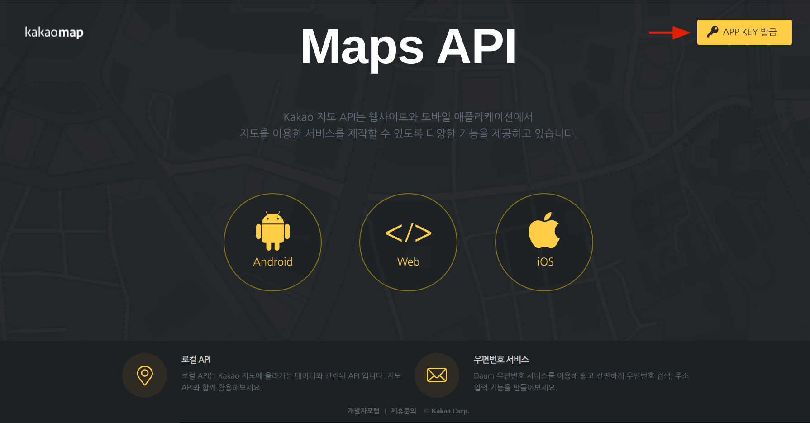

**'kakao developers'** 가입 화면에서 **[필수]** 항목에 체크 후 화면을 스크롤 다운시킨다.

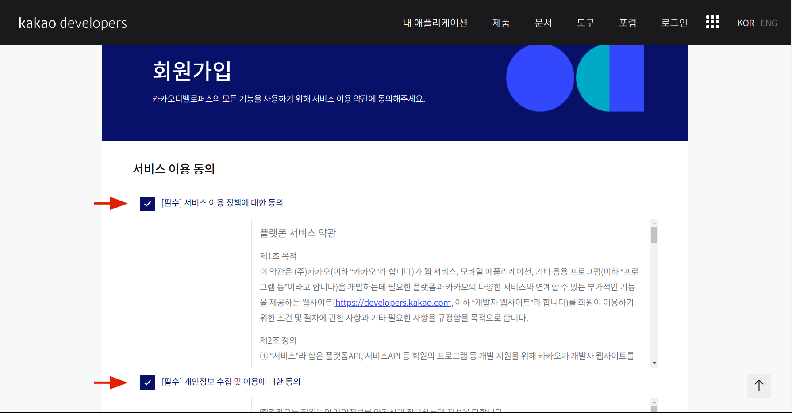

**카카오계정 정보** 를  기입 후,  **'회원가입'** 을 클릭한다. 

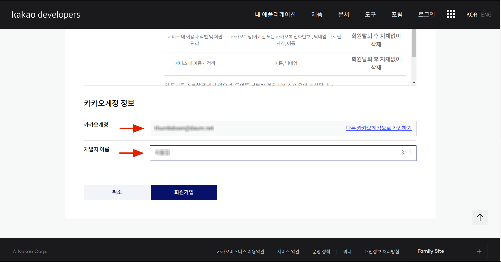

 다음 화면에서 **'시작하기'** 를 클릭한다.


**'애플리케이션 추가하기'** 를  클릭. 

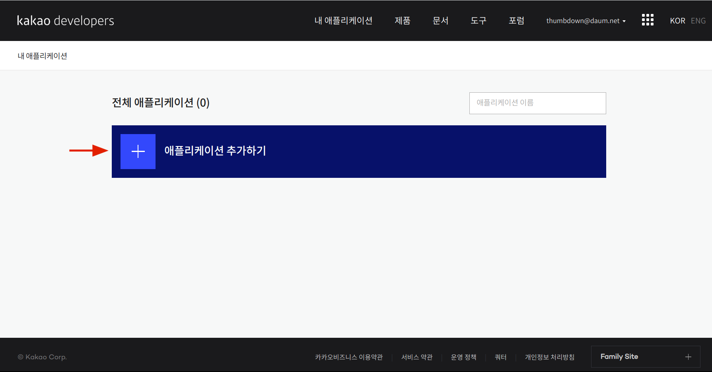

적당한 **'앱이름'** 과  **'사업자명'** (개인은 이름) 을 입력 후, **'저장'** 클릭. 

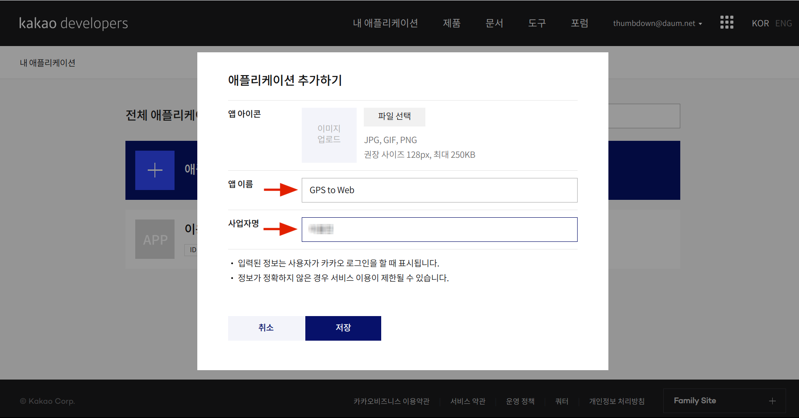

4가지 **앱 키** 가  발급된 것을 확인할 수 있다.  그 중 Javascripts 키를 복사하여 빈 문서에 붙혀넣어 두자. 

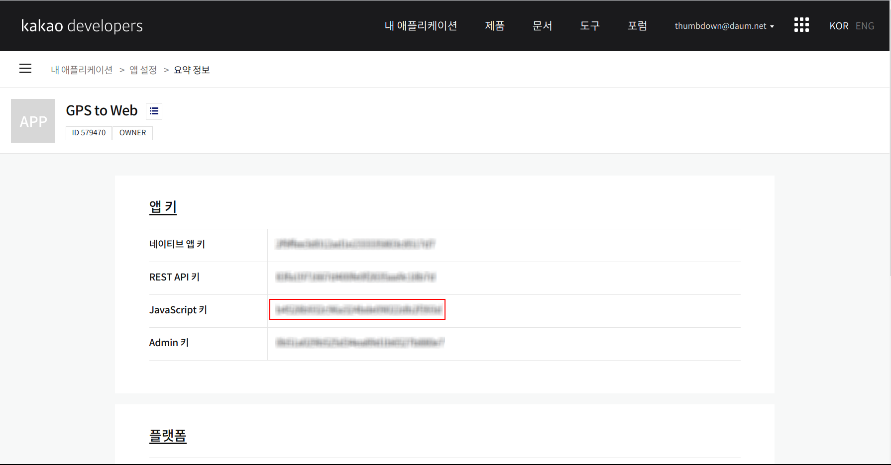

화면을 스크롤 다운하여 **'플랫폼 설정하기'** 를  클릭한다. 

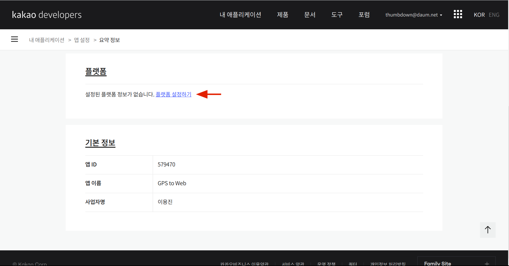

지원되는 3가지 플랫폼 중 **'Web 플랫폼 등록'** 을  클릭한다. 

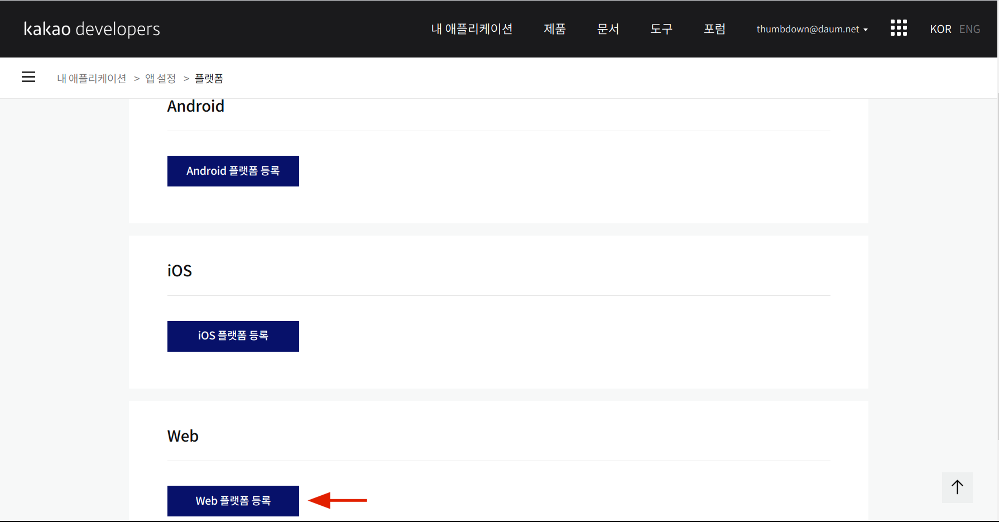

**'사이트 도메인'** 에  **`http://localhost:8080`** 을 입력 후, **'저장'**  클릭. 

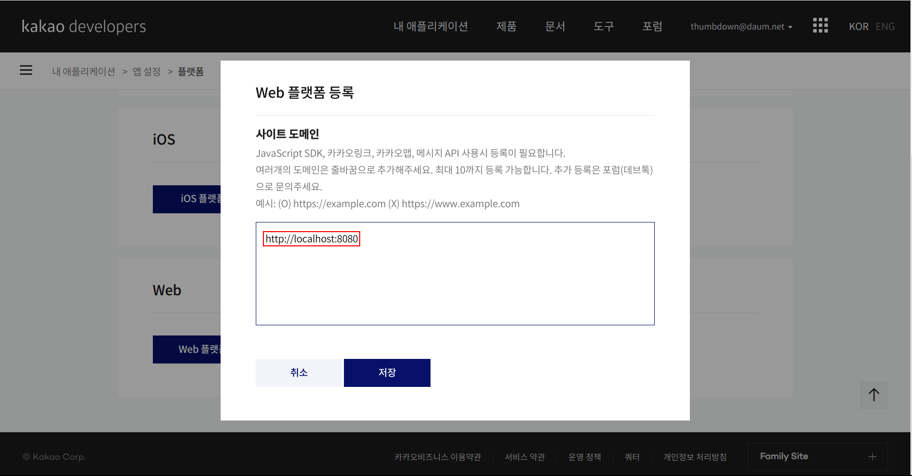

다음 화면에서 **'사이트 도메인'** 에  이 전 단계에서 입력한 도메인이 바르게 저장되었는 지 확인한다. 

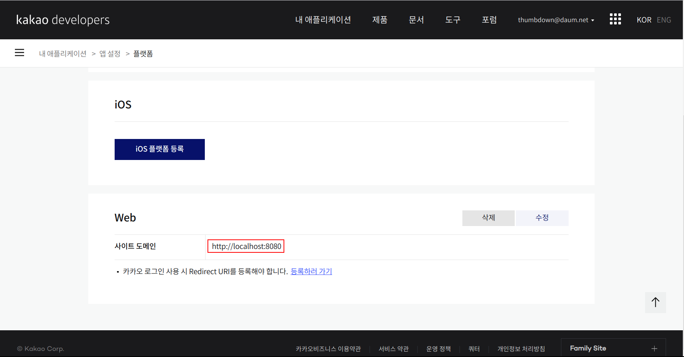


#### 2.1 node.js 설치

**node.js** 14.x 버전 설치를 위한 **repository** 등록 및 반영 

```
$ curl -sL https://deb.nodesource.com/setup_14.x | sudo -E bash -
```

( `curl` 또는 `build-essential` 에 관련된 의존성 문제 발생할 경우에는 `sudo apt-get install curl build-essential` 명령으로 의존성 설치 후 진행. )

**node.js** 14.x 버전 설치

```
$ sudo apt-get install -y nodejs
```

설치된 **node.js** 및 **npm**( Node Package Manager ) 버전 확인. 

```
$ node -v
v14.16.1
$ npm -v
6.14.12
```


#### 2.2 express.js 설치

* 다음과 같이 **express** 와 **express-generator** 를 설치한다.

```
  $ sudo npm install -g express
  $ sudo npm install -g express-generator
```


#### 2.3 간단한 웹 서버 구현

* express 를 이용하여 웹 어플리케이션 gps2web 생성

  ```
  $ express gps2web
  ```

* 생성된 gps2web 어플리케이션의 기본 의존성 설치

  ```
  $ cd gps2web
  $ npm install
  ```

* `~/gps2web/public/index.html` 을 시작 페이지로 하는 웹 서버 코드 편집

  ```
  $ gedit ~/gps2web/app.js
  ```

  자동으로 생성되어 있는 `app.js` 의 내용을 다음코드로 변경한다.

  ```javascript
  var express = require('express');
  var app = express();
  
  app.use(express.static(__dirname + '/public'));
  
  const port = 8080;
  
  app.listen(port, function(){
      console.log('listening on *:' + port);
  });
  ```

* `~/gps2web/public/index.html` 작성

  ```
  $ gedit ~/gps2web/public/index.html
  ```

  **index.html**

  ```html
  <!DOCTYPE html>
  <html>
      <head>
          <meta charset="utf-8">
          <title> Realtime GPS Location of Bebop2 on Map </title>
      </head>    
      <body>
          <!--map size -->
          <div id="map" style="width:100%;height:640px;"></div>
          <p>
              Lattitude: <input id="longi" type="text"> &nbsp;
              Longitude: <input id="latti" type="text"> &nbsp;
          </p>
          <!-- kakao Map API APP KEY -->
          <script type="text/javascript" src="//dapi.kakao.com/v2/maps/sdk.js?appkey=YourJavascriptAppKey&libraries=services"></script>
          <script>
              const mapContainer = document.getElementById('map'),
                    mapOption = {
                      center: new kakao.maps.LatLng(35.233810, 129.082845),
                      level: 1
                    };
              // load map
              const map = new kakao.maps.Map(mapContainer, mapOption);
              map.setMapTypeId(kakao.maps.MapTypeId.HYBRID);
              const imageSRC = "http://t1.daumcdn.net/localimg/localimages/07/mapapidoc/markerStar.png";
              const imageSize = new kakao.maps.Size(24, 35);
              const markerImage = new kakao.maps.MarkerImage(imageSRC, imageSize);
  
              // real-time mark bebop2 on map
              function update_gps(lat, lon){  // update_gps
                  
                  if(lat) document.getElementById('latti').value = lat;
                  else; // if(lat == undefined) do nothing
                  
                  if(lon) document.getElementById('longi').value = lon;
                  else; // if(lon == undefined) do nothing
                  
                  var drone_pos = new kakao.maps.LatLng(lat, lon);
                  var marker_drone = new kakao.maps.Marker({
                      position: drone_pos,
                      image : markerImage
                  });
                  marker_drone.setMap(map);
                  // every 1sec
                  setTimeout(function() {marker_drone.setMap(null)}, 1000);
              } 
              let timerId = setInterval(update_gps, 100);
          </script>
      </body>
  </html>
  ```


#### 2.4 웹서버 구동

다음 명령을 실행하여 웹서버를 구동할 수 있지만, 웹서버만 구동해서는 아무 것도 표시되지 않는다. 

```bash
  $ cd ~/gps2web
  $ node app.js
  listening on *:8080
```

종료는 `Ctrl` + `C` 를 입력한다. 


### 3. Sphinx 를 이용한 테스트

이 문서에서 지금까지 준비한 내용을 가지고 Sphinx 로 시뮬레이션된 Bebop2 드론의 위치를 원하는 지도 위치에 표시되도록 해보자. 


#### 3.1 지도에 표시할 지역 설정

현재 수업 중인 부산대학교 부산캠퍼스 기계기술연구동 옥상이 Sphinx 로 시뮬레이션되고 있는 Bebop2 드론이 출발 위치가 되도록 설정해보자. 

이를 위해서는 부산대학교 부산캠퍼스 기계기술연구동의 GPS 좌표가 필요한데, 구글 맵을 이용해서 쉽게 알아낼 수 있다.

[구글 맵 바로가기](https://www.google.co.kr/maps/@37.053745,125.6553969,5z?hl=ko)

위 **'구글 맵 바로가기'** 링크를 클릭 후, 열린 아래 화면의 **'Google 지도 검색'** 란에 **'부산대학교'** 를 입력한다. 

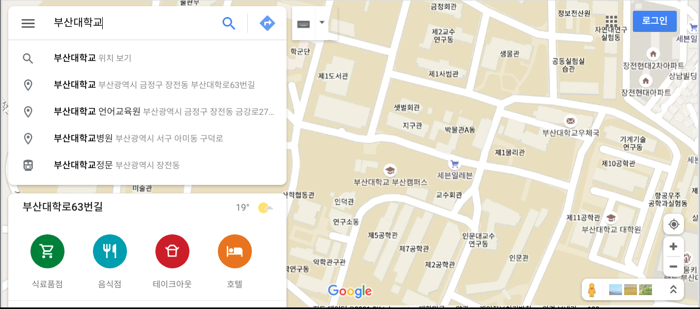

마우스 드레그하여 지도 중앙에 기계기술연구동이 나타나게 한다. ( 필요에 따라 지도를 확대/축소 한다. ) 

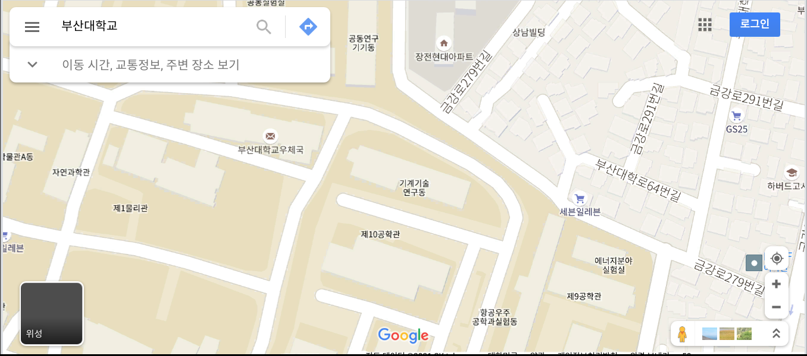

Bebop2 드론의 출발위치로 표시되도록 할 지점을 클릭하면 아래 그림과 같이 클릭한 지점의 위도, 경도를 알아낼 수 있다.

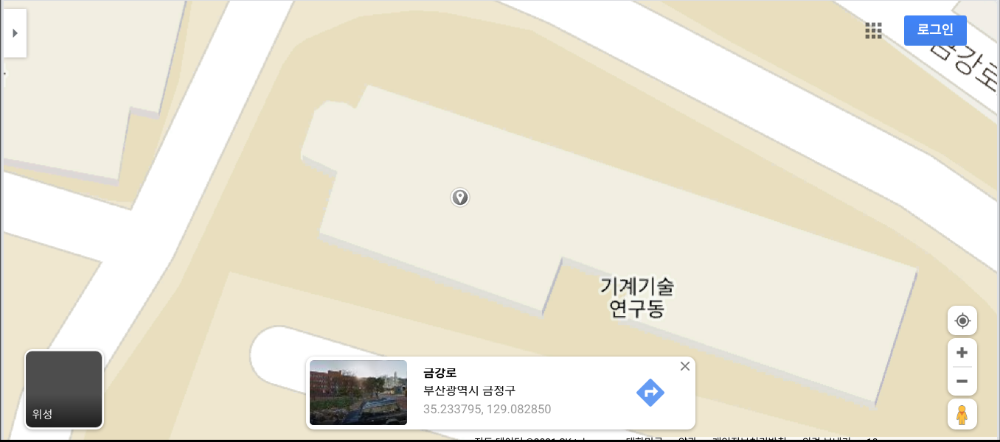

이제 위도 35.233795, 경도129.082850 인 지점을 Bebop2 드론의 출발지점으로 지도에 표시해 보자.


#### 3.2 지도에 표시할 지역 설정

현재 수업 중인 부산대학교 부산캠퍼스 기계기술연구동 옥상이 Sphinx 로 시뮬레이션되고 있는 Bebop2 드론이 출발 위치가 되도록 설정해보자. 

Bebop2 드론의 제조사인 Parrot 社 는 프랑스 기업이다. 그래서인지 Sphinx 를  구동하여  GPS 좌표를 subscribe 해보면 드론의 시작 위치가 위도 48.878900, 경도 2.367780 인데, 그 위치는 프랑스 파리이다. 

부산대학교 부산캠퍼스 기계기술연구동이 시작 위치로 표시하려면 그 GPS 좌표( 35.233795, 129.082850 ) 와 Sphinx 로 시뮬레이션 되고 있는 드론의 시작위치 GPS 좌표( 48.878900, 2.367780 ) 사이의 offset 값을 구해서 subscirbe 한 위, 경도 값에 반영해서 웹서버로 전달하면된다. 앞서 작성한 `bebop_gps2web.py` 코드 중 콜백함수 내용에 반영해 두었다.

```python
def get_gps_cb(msg):
    if USE_SPHINX is True:
        latitude  = msg.latitude  + OFFSET_LAT
        longitude = msg.longitude + OFFSET_LON
    else:
        latitude  = msg.latitude; longitude = msg.longitude        
    print("latitude = %s, longitude = %s" %(latitude, longitude))
    drv.execute_script("update_gps(%s, %s)" %(str(latitude), str(longitude)))
```

 위 코드에서 `if` 문이 참인 경우가 Sphinx 를 사용할 경우 인데, `latitude` ,  `longitude` 값에 `OFFSET` 을 더해 전달하고 있다. 거짓인 경우는 실제 드론의 GPS 값을 구독할 경우에 해당하고, 이 때는 `latitude` ,  `longitude` 값을 그대로 전달하도록 해두었다. 


#### 3.2 Sphinx 를 이용한 실시간 드론위치 표시

1. `.bashrc` 파일의 `ROS_MASTER_URI` 와, `ROS_HOSTNAME` 이 `http://localhost:11311` 와  `localhost` 로 설정되어 있는지 확인.

2. `firmwared.service` 구동

3. `sphinx` 구동

4. `bebop_driver` 패키지의 `bebop_sphinx.launch` 파일 구동

5. 웹서버 `gps2web` 구동

6. `bb2_pkg` 패키지의 `bebop_gps2web.py` 노드 구동( 구동 시 인수 `1` 을 입력해야 한다. 아래 명령 참조 )

   ```bash
   $ rosrun bb2_pkg bebop_gps2web.py 1
   ```

   이 때 웹브라우저가 자동으로 열리고 지도상에 드론위치가 마커로 표시되고, 하단에 현재 GPS 좌표가 표시된다. 

   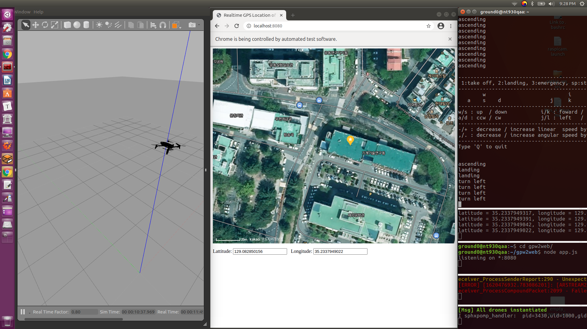

7. `bb2_pkg` 패키지의 `bebop_teleop.py` 노드를 구동하여 Sphinx 로 시뮬레이션 되는 드론을 조종하면서 지도상 드론의 위치를 나타내는 마커가 바르게 이동하는가를 살펴본다. 

   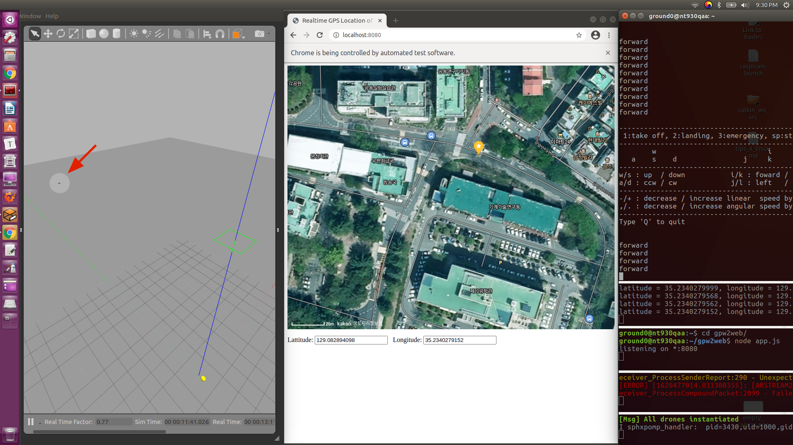


[튜토리얼 목록 열기](../README.md)
