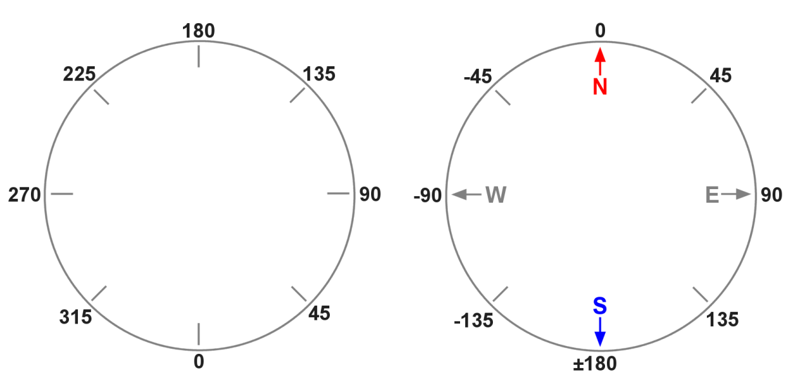

## 6. GPS 위치정보에 의한 이동 

**튜토리얼 레벨 :**  Intermediate(중급)(수정)

**이 튜토리얼 작성 환경 :**  catkin **/** Ubuntu 16.04 **/** ROS Kinetic

**다음 튜토리얼 :** [링크 수정 필요]() 

**이전 튜토리얼 :** [링크 수정 필요]() 

**목록보기:** [README.md](../../README.md) 


GPS 로부터 수신된 위도, 경도 정보를 바탕으로 드론이 최초 이륙한 GPS 위치정보를 이용한 RTB( Return to Base ) 기능 및, 목적지 GPS 좌표를 전달받아 해당 위치로 이동하는 기능을 구현한다. 

---

**필요기능 정의**

- GPS Positiion 정보 구독
- 목표 GPS 좌표 방향을 향해 회전
- 목표 GPS 좌표까지의 이동
- 이동 중 위치확인 및 보정


### 1. 두 지점의 GPS 좌표로부터 두 지점 사이의 거리 및 방위각 계산 라이브러리

#### 1.1 두 지점의 위, 경도를 이용한 거리 및 방위각 계산

두 지점의 GPS 좌표로부터 두 지점 사이의 거리 및 방위각 계산하는 코드를 작성해보자.

파이썬 라이브러리 `haversine` 과  `scipy` 를 설치한다.

```bash
$ pip install haversine
```

```bash
$ pip install scipy
```


#### 1.2 거리 및 방위각 계산

 앞서 작성한 `GPS.py` 라이브러리 테스트를 위한 코드 `gps_dist_bear.py` 를 `bb2_pkg` 패키지에 작성하기 위해 작업경로를 변경한다.

```bash
$ roscd bb2_pkg/scripts
```

`touch` 명령으로 파일명이 `gps_dist_bear.py`  이고, 크기가 0 KB 인 빈 파일을 생성한다.

```bash
$ touch gps_dist_bear.py
```

생성된 `gps_dist_bear.py` 파일에 실행속성을 부여한다. 

```bash
$ chmod +x gps_dist_bear.py
```

텍스트 에디터를 이용해 아래 코드와 같이 `gedit gps_dist_bear.py` 파일을 편집한다. 

```bash
$ gedit gps_dist_bear.py &
```

```python
#!/usr/bin/env python
import rospy
from math import pow, degrees, radians, atan2 
from scipy import cos, sin, arctan, sqrt, arctan2
from haversine import haversine
'''         
                |<-- 100(m)-->|<-- 100(m)-->|
           --- p8------------p1-------------p2-> 35.234694 (35.233795+0.0008993204)
            ^   | .-45        |0          . |
            |   |   .         |         . 45|
           100  |     .       |       .     |
           (m)  |       .     |     .       |
            |   |         .   |   .         |
            v   |-90        . | .           |
           --- p7------------p0-------------p3-> 35.233795
            ^   |           . | .         90|
            |   |         .   |   .         |
           100  |       .     |     .       |
           (m)  |     .       |       .     |
            |   -135.         |         .   |
            v   | .           |       135 . |
           --- p6------------p5-------------p4-> 35.232895 (35.233795-0.0008993204)
                v             v             v
             129.081752    129.082850    129.083947
             
     (129.082850-0.0010978720)    (129.082850+0.0010978720) 
     
        
        distance  of latitude   1(deg) = 111195.0802340(m/deg)  p1( 35, 129) p2( 36, 129)
        distance  of longtitude 1(deg) =  91085.2969372(m/deg)  p1( 35, 129) p2( 35, 130)
        latitude  of distance   1(m)   =      0.00000899320363720(deg/m)
        longitude of distance   1(m)   =      0.00001097872031629(deg/m)
        
        -------------+-----------------+-----------------
         Distance(m) |  latitude(deg)  |  longitude(deg)
        -------------+-----------------+-----------------
               1.0   |   0.0000089932  |   0.0000109787
              10.0   |   0.0000899320  |   0.0001097872
             100.0   |   0.0008993204  |   0.0010978720
        -------------+-----------------+-----------------

        p0 = (35.233795, 129.082850)
        
        p1 = (35.234694, 129.082850);   p5 = (35.232895, 129.082850) 
        p2 = (35.234694, 129.083947);   p6 = (35.232895, 129.081752) 
        p3 = (35.233795, 129.083947);   p7 = (35.233795, 129.081752) 
        p4 = (35.232895, 129.083947);   p8 = (35.234694, 129.081752) 
'''
def bearing((lat1, long1), (lat2, long2)):
    
    Lat1,  Lat2  = radians(lat1),  radians(lat2) 
    Long1, Long2 = radians(long1), radians(long2) 
    
    y = sin(Long2-Long1)*cos(Lat2) 
    x = cos(Lat1)*sin(Lat2) - sin(Lat1)*cos(Lat2)*cos(Long2-Long1) 
    
    return degrees(atan2(y, x))   
    
if __name__ == '__main__':
    try:
        rospy.init_node('get_distance_n_bearing_from_gps', anonymous = True)
        
        a = (35, 129);  b = (36, 129);  c = (35, 130)
        print "latitude  1(deg) is   %s(m)" %(haversine(a,b) * 1000)
        print "longitude 1(deg) is   %s(m)" %(haversine(a,c) * 1000)
        
        p0 = (35.233795, 129.082850)        
        p1 = (35.234694, 129.082850);   p5 = (35.232895, 129.082850) 
        p2 = (35.234694, 129.083947);   p6 = (35.232895, 129.081752) 
        p3 = (35.233795, 129.083947);   p7 = (35.233795, 129.081752) 
        p4 = (35.232895, 129.083947);   p8 = (35.234694, 129.081752) 
        
        print "p1: dist = %s(m),\tbearing = %s(deg)" %(haversine(p0,p1)*1000, bearing(p0,p1))
        print "p2: dist = %s(m),\tbearing = %s(deg)" %(haversine(p0,p2)*1000, bearing(p0,p2))
        print "p3: dist = %s(m),\tbearing = %s(deg)" %(haversine(p0,p3)*1000, bearing(p0,p3))
        print "p4: dist = %s(m),\tbearing = %s(deg)" %(haversine(p0,p4)*1000, bearing(p0,p4))
        print "p5: dist = %s(m),\tbearing = %s(deg)" %(haversine(p0,p5)*1000, bearing(p0,p5))
        print "p6: dist = %s(m),\tbearing = %s(deg)" %(haversine(p0,p6)*1000, bearing(p0,p6))
        print "p7: dist = %s(m),\tbearing = %s(deg)" %(haversine(p0,p7)*1000, bearing(p0,p7))
        print "p8: dist = %s(m),\tbearing = %s(deg)" %(haversine(p0,p8)*1000, bearing(p0,p8))
        
    except rospy.ROSInterruptException:  pass
```

코드 실행을 위해 `roscore` 를 구동하고, 다음 명령을 실행한다. 

```bash
$ rosrun bb2_pkg get_dist_bearing.py 
latitude  1(deg) is   111195.080234(m)
longitude 1(deg) is   91085.2969372(m)
p1: dist = 99.9643771291(m),	bearing = 0.0(deg)
p2: dist = 141.137637966(m),	bearing = 44.9048791623(deg)
p3: dist = 99.6346635036(m),	bearing = 89.9996835625(deg)
p4: dist = 141.217196053(m),	bearing = 135.126018751(deg)
p5: dist = 100.07557221(m),	    bearing = 180.0(deg)
p6: dist = 141.281292047(m),	bearing = -135.099915804(deg)
p7: dist = 99.7254881767(m),	bearing = -89.9996832741(deg)
p8: dist = 141.201768653(m),	bearing = -44.93098163(deg)
```

`p0` 로 부터 `p1` , `p2` , ... , `p8` 까지의 각 지점에 대한 거리와 방위각이 비교적 정확히 구해진 것을 확인할 수 있다.


### 2. 기능 구현

#### 2.1 GPS 정보 수신 가능 위성 수 토픽 Subscriber

- 토픽 명     : `/bebop/states/ardrone3/GPSState/NumberOfSatelliteChanged`

- 토픽 형식 : `bebop_msgs.msg.Ardrone3GPSStateNumberOfSatelliteChanged`

- 코드

  ```python
  #!/usr/bin/env python
  
  import rospy
  from bebop_msgs.msg import Ardrone3GPSStateNumberOfSatelliteChanged
  
  class NumOfSatellite:
      def __init__(self):
          rospy.init_node('num_of_satellite', anonymous = True)
          rospy.Subscriber('/bebop/states/ardrone3/GPSState/NumberOfSatelliteChanged',
                           Ardrone3GPSStateNumberOfSatelliteChanged,
                           self.get_num_sat_cb, queue_size = 1)
          self.num_sat = 0
                
      def get_num_sat_cb(self, msg):
          self.num_sat = msg.numberOfSatellite
          print "We can recieve gps signal from %s of satellites!" %(self.num_sat)
          
  if __name__ == '__main__':
      try:
          NumOfSatellite()
          rospy.spin()
          
      except rospy.ROSInterruptException:  pass
  ```

  

#### 2.2 GPS 위치정보 토픽 Subscriber

- 토픽 명     : `/bebop/states/ardrone3/PilotingState/PositionChanged`

- 토픽 형식 : `bebop_msgs.msg.Ardrone3PilotingStatePositionChanged`

- 코드

  ```python
  #!/usr/bin/env python
  
  import rospy
  from bebop_msgs.msg import Ardrone3PilotingStatePositionChanged
  
  class SubGPS:
      def __init__(self):
          rospy.init_node('get_gps_location', anonymous = True)
          rospy.Subscriber('/bebop/states/ardrone3/PilotingState/PositionChanged',
                           Ardrone3PilotingStatePositionChanged,
                           self.get_gps_cb, queue_size = 1)
          self.gps_pos = Ardrone3PilotingStatePositionChanged()
                
      def get_gps_cb(self, msg):
          self.gps_pos = msg
          print "lati = %s, long = %s" %(self.gps_pos.latitude, self.gps_pos.longitude)
          
  if __name__ == '__main__':
      try:
          SubGPS()
          rospy.spin()
          
      except rospy.ROSInterruptException:  pass
  ```


#### 2.3 Bebop2 방위각(Attitude) 토픽 Subscriber

- 토픽 명     : `/bebop/states/ardrone3/PilotingState/AttitudeChanged`

- 토픽 형식 : `bebop_msgs.msg.Ardrone3PilotingStateAttitudeChanged`

- 코드

  ```python
  #!/usr/bin/env python
  
  import rospy
  from bebop_msgs.msg import Ardrone3PilotingStateAttitudeChanged
  from math import degrees
  
  class SubAttitude:
      def __init__(self):
          rospy.init_node('get_bb2_attitude', anonymous = True)
          rospy.Subscriber('/bebop/states/ardrone3/PilotingState/AttitudeChanged',
                           Ardrone3PilotingStateAttitudeChanged,
                           self.get_atti_cb, queue_size = 1)
          self.atti_cur = Ardrone3PilotingStateAttitudeChanged()
                
      def get_atti_cb(self, msg):
          self.atti_cur = msg.yaw
          print "attitude = %s" %(degrees(self.atti_cur))
          
  if __name__ == '__main__':
      try:
          SubAttitude()
          rospy.spin()
          
      except rospy.ROSInterruptException:  pass
  ```

  

#### 2.4 주어진 방위각으로 회전

현재 위치의 GPS 좌표를 수신하여 `p1` 에 저장하고, 목적지 좌표를 입력받아 `p2` 에 저장 후, `p1` , `p2` 를 앞서 작성한 `GPS.py` 멤버함수 `get_bearing(p1,p2)` 호출 시 매개변수로 전달하면 방위각을 계산해 리턴한다. 이 때 리턴 받은 방위각( 목적지 방위각-Target Bearing )과 드론에 탑재된 지자기센서( 나침반 센서 )로 측정된 드론이 현재 향하고 있는 방위각 토픽 `/bebop/states/ardrone3/PilotingState/AttitudeChanged` 중 방위각에 해당하는 `yaw` 가 사용하는 방위각의 관계는 다음 그림과 같다. 



`beaing()` 구한 목적방위각( `Target_Attitude` )과 드론의 현재방위각( `Current_Attitude` )의 위치관계에 따라 다음 4가지 경우로 구분하여 회전시켜야 할 필요가 있다. 

**case1.**  `Current_Attitude` >= 0 **and**  `Target_Attitude` >= 0

**case2.**  `Current_Attitude` >= 0 **and**  `Target_Attitude` <   0

**case3.**  `Current_Attitude` <   0 **and**  `Target_Attitude` >= 0

**case4.**  `Current_Attitude` <   0 **`and`**  `Target_Attitude` <   0 

이를 이용하여  `get_bearing()` 으로 구한 방위각으로 부터 `Target_Attitude` 를 구하고,  `Target_Attitude` 에 도달할 때까지 기체를 회전시키는 코드를 구현해보자. 

```python
#!/usr/bin/env python

import rospy, sys
from std_msgs.msg import String, Empty
from geometry_msgs.msg import Twist
from bebop_msgs.msg import Ardrone3PilotingStatePositionChanged,\
                           Ardrone3PilotingStateAttitudeChanged,\
                           Ardrone3PilotingStateAltitudeChanged,\
                           Ardrone3GPSStateNumberOfSatelliteChanged
from math import pi, radians, degrees#, pow, sqrt, atan
from bb2_pkg.GPS import GPS

USE_SPHINX = bool(int(sys.argv[1]))

OFFSET_LAT   = -13.645105
OFFSET_LON   = 126.715070

LIN_SPD      =   0.5
ANG_SPD      =   0.5

START_LATI   = 500.0
START_LONG   = 500.0

LAT_M        =   0.000009008
LON_M        =   0.000010972

class MoveByGPS:    
    def __init__(self):    
        rospy.init_node("move_by_gps", anonymous=True)        
        rospy.Subscriber("/bebop/states/ardrone3/PilotingState/PositionChanged", 
                          Ardrone3PilotingStatePositionChanged, self.get_gps_cb)
        rospy.Subscriber("/bebop/states/ardrone3/PilotingState/AttitudeChanged",
                          Ardrone3PilotingStateAttitudeChanged, self.get_atti_cb, queue_size = 1)
        rospy.Subscriber("/bebop/states/ardrone3/GPSState/NumberOfSatelliteChanged", 
                          Ardrone3GPSStateNumberOfSatelliteChanged, self.get_num_sat_cb, queue_size = 1)
        
        self.pub1 = rospy.Publisher('/bebop/takeoff', Empty, queue_size = 1)
        self.pub2 = rospy.Publisher('/bebop/land', Empty, queue_size = 1)
        
        self.currentGPS   = self.startGPS = self.restartGPS = \
        self.targetGPS    = Ardrone3PilotingStatePositionChanged()        
        self.empty        = Empty()                
        self.atti_current =   0.0         
        self.start_lati   =   0.0
        self.start_long   =   0.0        
        self.restart_lati =   0.0
        self.restart_long =   0.0        
        self.tol_lati     =   LAT_M * 10
        self.tol_long     =   LON_M * 10        
        self.target_dist  =   0.0
        self.target_atti  =   0.0        
        self.num_sat      =   0        
        self.is_there_enough_satellites = False
        self.is_gps_pos_of_home_saved   = False
        self.gps_pos_is_not_0_and_500   = False

    def get_gps_cb(self, msg):  
        if USE_SPHINX is True:
            self.currentGPS.latitude  = msg.latitude  + OFFSET_LAT
            self.currentGPS.longitude = msg.longitude + OFFSET_LON
        else:
            self.currentGPS.latitude  = msg.latitude
            self.currentGPS.longitude = msg.longitude            
        self.currentGPS.altitude = msg.altitude
        #print "(%s, %s)" %(self.currentGPS.latitude, self.currentGPS.longitude)        
           
    def get_atti_cb(self, msg):
        self.atti_current = msg.yaw
        #print "%s" %(degrees(self.atti_current))        
           
    def get_num_sat_cb(self, msg):
        self.num_sat = msg.numberOfSatellite        
        if self.num_sat > 10:        
            self.is_there_enough_satellites = True
        else:
            self.is_there_enough_satellites = False        
        #print "number of satellites = %s" %(self.num_sat)        
        
    def save_starting_point(self):
        while self.currentGPS.latitude == 0.0 or self.currentGPS.latitude == 500.0:  pass
        self.startGPS = self.currentGPS
        print "gps coordination of starting point(%s, %s)" %(self.startGPS.latitude, self.startGPS.longitude)        
        
    def save_restarting_point(self):
        while self.currentGPS.latitude == 0.0 or self.currentGPS.latitude == 500.0:  pass
        self.restartGPS = self.currentGPS
        #print "gps coordination of restarting point(%s, %s)" %(self.restartGPS.latitude, self.restartGPS.longitude)
        return (self.restartGPS.latitude, self.restartGPS.longitude)        
    
    def bearing_to_attitude(self, bearing):
        if bearing >= 0 and bearing <180:
            return radians(bearing)
        else:
            return radians(bearing - 360)            
    
    def rotate_to_target(self, target):    
        
        if   abs(self.atti_current - target) > radians(315):
            print "360 > case >= 315"
            tol = abs(self.atti_current - target) * 0.0725
        elif abs(self.atti_current - target) > radians(270):
            print "315 > case >= 270"
            tol = abs(self.atti_current - target) * 0.1
        elif abs(self.atti_current - target) > radians(225):
            print "270 > case >= 225"
            tol = abs(self.atti_current - target) * 0.1
        elif abs(self.atti_current - target) > radians(180):
            print "225 > case >= 180"
            tol = abs(self.atti_current - target) * 0.175
        elif abs(self.atti_current - target) > radians(135):
            print "180 > case >= 135"
            tol = abs(self.atti_current - target) * 0.12
        elif abs(self.atti_current - target) > radians(90):
            print "135 > case >=  90"
            tol = abs(self.atti_current - target) * 0.275
        elif abs(self.atti_current - target) > radians(45):
            print " 90 > case >=  45"
            tol = abs(self.atti_current - target) * 0.275
        else:
            print " 45 > case >=   0"
            tol = abs(self.atti_current - target) * 0.55
            
        tw  = Twist()
        pub = rospy.Publisher('/bebop/cmd_vel', Twist, queue_size = 1)
        
        print "current: %s, target: %s, tolerance: %s" %(self.atti_current, target, tol)
        
        if   self.atti_current >= 0 and target >= 0:
            '''                                   |     T             C         T
            <-+-+-+-+-+-+-+-+-+-+-+-+-+-+-+-+-+-+-+-+-+-+-+-+-+-+-+-+-+-+-+-+-+-+-+-+-+->
            -180               -90                0                 90               180
            '''
            if   target - tol > self.atti_current:
                tw.angular.z = -ANG_SPD
                while target - tol > self.atti_current:
                    pub.publish(tw)
            elif self.atti_current - tol > target:
                tw.angular.z =  ANG_SPD
                while self.atti_current - tol > target:
                    pub.publish(tw)
            else:   pass
        
        elif self.atti_current >= 0 and target <  0:
            '''                     T             |         C
            <-+-+-+-+-+-+-+-+-+-+-+-+-+-+-+-+-+-+-+-+-+-+-+-+-+-+-+-+-+-+-+-+-+-+-+-+-+->
            -180               -90                0                 90               180
            '''
            tw.angular.z =  ANG_SPD
            while self.atti_current - tol > target:
                pub.publish(tw)
        
        elif self.atti_current <  0 and target >= 0:
            '''                     C             |               T
            <-+-+-+-+-+-+-+-+-+-+-+-+-+-+-+-+-+-+-+-+-+-+-+-+-+-+-+-+-+-+-+-+-+-+-+-+-+->
            -180               -90                0                 90               180
            '''
            tw.angular.z = -ANG_SPD
            while self.atti_current < target - tol:
                pub.publish(tw)
        
        elif self.atti_current <  0 and target <  0:
            '''   T           C         T         |
            <-+-+-+-+-+-+-+-+-+-+-+-+-+-+-+-+-+-+-+-+-+-+-+-+-+-+-+-+-+-+-+-+-+-+-+-+-+->
            -180               -90                0                 90               180
            '''
            if   target - tol > self.atti_current:
                tw.angular.z = -ANG_SPD
                while target - tol > self.atti_current:
                    pub.publish(tw)
            elif self.atti_current - tol > target:
                tw.angular.z =  ANG_SPD
                while self.atti_current - tol > target:
                    pub.publish(tw)
            else:   pass
            
        else:   pass
        
        tw.angular.z = 0;   pub.publish(tw);    rospy.sleep(1.5)        
        
    def move_to_target(self, target_lati, target_long):
    
        gps = GPS()
        tw  = Twist()
        
        p1  = (self.restartGPS.latitude, self.restartGPS.longitude)
        p2  = (target_lati, target_long)
        pub = rospy.Publisher('/bebop/cmd_vel', Twist, queue_size = 1)
        
        count = 0
            
        while self.currentGPS.latitude  < (target_lati - self.tol_lati) or \
              self.currentGPS.latitude  > (target_lati + self.tol_lati) or \
              self.currentGPS.longitude < (target_long - self.tol_long) or \
              self.currentGPS.longitude > (target_long + self.tol_long):
            '''
            count = count + 1
            if count % 100 == 0:
                count = 0;
                print "gps coordination of restarting point(%s, %s)" %(self.restartGPS.latitude, self.restartGPS.longitude)
            '''
            tw.linear.x = LIN_SPD
            
            target_atti = self.bearing_to_attitude( gps.get_bearing(p1, p2) )
            
            if abs(self.atti_current - target_atti) > 5:
                tw.linear.x = tw.angular.z = 0.0;   pub.publish(tw)
                rospy.sleep(2.0)
                self.rotate_to_target(target_atti)
            else:
                tw.angular.z = 0.0
            
            pub.publish(tw)
            p1 = self.save_restarting_point()    
        
        tw.linear.x = tw.angular.z = 0.0;   pub.publish(tw)
    
            
    def takeoff(self):
        self.pub1.publish(self.empty)
        
        
    def land(self):
        self.pub2.publish(self.empty)
        
                
if __name__ == '__main__':

    try:
        mbg   = MoveByGPS()
        gps   = GPS()
        empty = Empty()
        
        while mbg.is_there_enough_satellites == False:  pass
        print "number of available satellites is %s" %(mbg.num_sat)
        mbg.save_starting_point();  mbg.save_restarting_point()
        print "current gps coordinate is (%s, %s)" %(mbg.currentGPS.latitude, mbg.currentGPS.longitude)
        while mbg.atti_current == 0.0:  pass
        print "current attitude is %s(deg)\n" %(degrees(mbg.atti_current))
        
        p1 = (mbg.restartGPS.latitude, mbg.restartGPS.longitude)
        print(p1)
        '''
        mbg.targetGPS.latitude  = float(input("input latitude  of destination: "))
        mbg.targetGPS.longitude = float(input("input longitude of destination: "))
        p2 = (mbg.targetGPS.latitude, mbg.targetGPS.longitude)
        print(p2)
        
        target_distance = gps.get_distance(p1, p2)
        print "target distance = %s(m)" %(target_distance)
        
        target_bearing  = gps.get_bearing(p1, p2)
        print "target bearing  = %s(deg)" %(target_bearing)
        
        target_attitude = mbg.bearing_to_attitude(target_bearing)
        print "target attitude = %s(deg)" %(degrees(target_attitude))
        '''
        target_attitude = radians(float(input("input target attitude: ")))
        print "rotate start from %s" %(degrees(mbg.atti_current))
        mbg.rotate_to_target(target_attitude)
        print "rotate end to %s" %(degrees(mbg.atti_current))
        '''
        print "move to target start from (%s, %s)" %(p1[0], p1[1])
        mbg.move_to_target(p2[0], p2[1])
        print "move to target end to (%s, %s)" %(mbg.currentGPS.latitude, mbg.currentGPS.longitude)
        '''
        rospy.spin()
            
    except rospy.ROSInterruptException: pass
```


**Sphinx 를  이용한 GPS 좌표 지점으로 이동 테스트를 위한 지도상의 장소와 그 GPS 좌표**


| 장소                          | GPS 좌표 ( 위도, 경도 )   |
| ----------------------------- | ------------------------- |
| 0. 기계기술연구동( 출발위치 ) | ( 35.233795, 129.082850 ) |
| 1. 제10공학관                 | ( 35.233258, 129.082880 ) |
| 2. 제09공학관                 | ( 35.233111, 129.084380 ) |
| 3. 제11공학관                 | ( 35.232615, 129.082331 ) |
| 4. 자연과학관                 | ( 35.233901, 129.080838 ) |
| 5. 문창회관                   | ( 35.234040, 129.081806 ) |
| 6. 생물관                     | ( 35.234757, 129.080935 ) |


[튜토리얼 목록 열기](../../README.md)