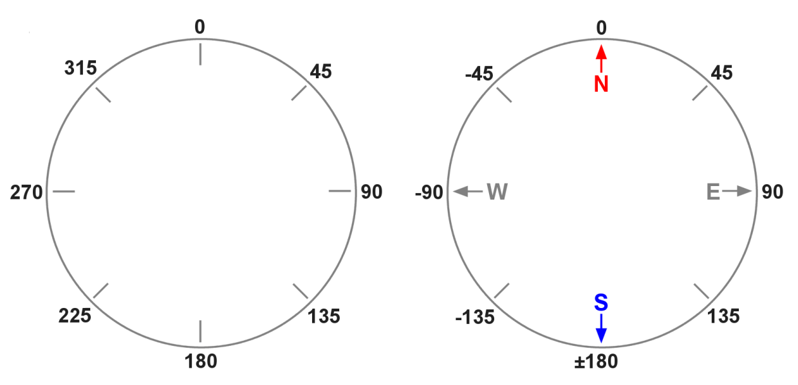

## 6. GPS 위치정보에 의한 이동 

**튜토리얼 레벨 :**  Intermediate(중급)(수정)

**이 튜토리얼 작성 환경 :**  catkin **/** Ubuntu 16.04 **/** ROS Kinetic

**다음 튜토리얼 :** [링크 수정 필요]() 

**이전 튜토리얼 :** [링크 수정 필요]() 

**목록보기:** [README.md](../README.md) 


GPS 로부터 수신된 위도, 경도 정보를 바탕으로 드론이 최초 이륙한 GPS 위치정보를 이용한 RTB( Return to Base ) 기능 및, 목적지 GPS 좌표를 전달받아 해당 위치로 이동하는 기능을 구현한다. 

---

**필요기능 정의**

- GPS Positiion 정보 구독
- 목표 GPS 좌표 방향을 향해 회전
- 목표 GPS 좌표까지의 이동
- 이동 중 위치확인 및 보정


### 1. 두 지점의 GPS 좌표로부터 두 지점 사이의 거리 및 방위각 계산 라이브러리

#### 1.1 두 지점의 위, 경도를 이용한 거리 및 방위각 계산 라이브러리 작성

두 지점의 GPS 좌표로부터 두 지점 사이의 거리 및 방위각 계산하는 라이브러리 `GPS.py` 파일을 작성을 위해 작업 경로를`bb2_pkg/src/bb2_pkg` 로 변경한다. 

```bash
$ roscd bb2_pkg/src/bb2_pkg
```

`GPS.py`  파일 생성.

```bash
$ touch GPS.py
```

`GPS.py`  파일 편집.

```bash
$ gedit GPS.py &
```

```python
#!/usr/bin/env python
from math import sqrt, sin, cos, tan, acos, asin, atan

LAT = 0;    LON = 1

# class for getting distance & bearing between p1 & p2
# p1(latitude1, longitude1), p2(latitude2, longitude2)
class GPS:

    def __init__(self):
        self.c15 = 6378137.000000000
        self.c16 = 6356752.314140910
        self.c17 =       0.0033528107        
      
    def get_distance(self, p1, p2):
        
        # convert from degree to radian
        e10 = p1[LAT] * 3.1415926535 / 180.
        e11 = p1[LON] * 3.1415926535 / 180.
        e12 = p2[LAT] * 3.1415926535 / 180.
        e13 = p2[LON] * 3.1415926535 / 180.
        
        # GRS80
        f15 = self.c17 + self.c17 * self.c17 
        f16 = f15 / 2. 
        f17 = self.c17 * self.c17 /  2. 
        f18 = self.c17 * self.c17 /  8. 
        f19 = self.c17 * self.c17 / 16. 
        
        c18 = e13 - e11
        c20 = (1. - self.c17) * tan(e10) 
        c21 = atan(c20)
        c22 = sin(c21)
        c23 = cos(c21)
        c24 = (1. - self.c17) * tan(e12) 
        c25 = atan(c24) 
        c26 = sin(c25) 
        c27 = cos(c25) 
        c29 = c18 
        c31 = (c27 * sin(c29) * c27 * sin(c29)) + (c23 * c26 - c22 * c27 * cos(c29)) * (c23 * c26 - c22 * c27 * cos(c29)) 
        c33 = (c22 * c26) + (c23 * c27 * cos(c29)) 
        c35 = sqrt(c31) / c33 
        c36 = atan(c35) 
        c38 = 0.0 
        c40 = 0.0
        c41 = cos(asin(c38)) * cos(asin(c38)) * (self.c15 * self.c15 - self.c16 * self.c16) / (self.c16 * self.c16)
        c43 = 1 + c41 / 16384 * (4096 + c41 * (-768 + c41 * (320 - 175 * c41)))
        c45 = c41 / 1024 * (256 + c41 * (-128 + c41 * (74 - 47 * c41)))
        c47 = c45 * sqrt(c31) * (c40 + c45 / 4 * (c33 * (-1 + 2 * c40 * c40) - c45 / 6 * c40 * (-3 + 4 * c31) * (-3 + 4 * c40 * c40)))
        c50 = self.c17 / 16 * cos(asin(c38)) * cos(asin(c38)) * (4 + self.c17 * (4 - 3 * cos(asin(c38)) * cos(asin(c38))))
        c52 = c18 + (1 - c50) * self.c17 * c38 * (acos(c33) + c50 * sin(acos(c33)) * (c40 + c50 * c33 * (-1 + 2 * c40 * c40)))
        c54 = self.c16 * c43 * (atan(c35) - c47)
    
        if ((p1[LAT] == p2[LAT]) and (p1[LON] == p2[LON])):
            return 0
        
        if (c31 == 0):
            c38 = 0.0
        else:
            c38 = c23 * c27 * sin(c29) / sqrt(c31)
        
        if ((cos(asin(c38)) * cos(asin(c38))) == 0):
            c40 = 0.0            
        else:
            c40 = c33 - 2 * c22 * c26 / (cos(asin(c38)) * cos(asin(c38)))
        
        return c54
        
  
    def get_bearing(self, p1, p2):
    
        Cur_Lat_radian  = p1[LAT] * (3.1415926535 / 180)
        Cur_Lon_radian  = p1[LON] * (3.1415926535 / 180)
        
        Dest_Lat_radian = p2[LAT] * (3.1415926535 / 180)
        Dest_Lon_radian = p2[LON] * (3.1415926535 / 180)
        
        # radian distance
        radian_distance = 0;
        radian_distance = acos(sin(Cur_Lat_radian) * sin(Dest_Lat_radian) + cos(Cur_Lat_radian) * cos(Dest_Lat_radian) * cos(Cur_Lon_radian - Dest_Lon_radian))
        
        radian_bearing = acos((sin(Dest_Lat_radian) - sin(Cur_Lat_radian) * cos(radian_distance)) / (cos(Cur_Lat_radian) * sin(radian_distance)))
        true_bearing = 0
        
        if (sin(Dest_Lon_radian - Cur_Lon_radian) < 0):
            true_bearing = radian_bearing * (180 / 3.1415926535)
            true_bearing = 360 - true_bearing
        else:
            true_bearing = radian_bearing * (180 / 3.1415926535)
            
        return true_bearing
```


#### 1.2 거리 및 방위각 계산 라이브러리 검증

앞서 작성한 `GPS.py` 라이브러리 테스트를 위한 코드 `test_gps_lib.py` 를 `bb2_pkg` 패키지에 작성하기 위해 작업경로를 변경한다.

```bash
$ roscd bb2_pkg/scripts
```

`touch` 명령으로 파일명이 `test_gps_lib.py`  이고, 크기가 0 KB 인 빈 파일을 생성한다.

```bash
$ touch test_gps_lib.py
```

생성된 `test_gps_lib.py` 파일에 실행속성을 부여한다. 

```bash
$ chmod +x test_gps_lib.py
```

다음 명령으로 위도, 경도 정보를 이용해 거리를 산출하는 파이썬 라이브러리 `haversine` 을 설치한다. 

```bash
$ pip install haversine
```

텍스트 에디터를 이용해 아래 코드와 같이 `gedit test_gps_lib.py` 파일을 편집한다. 

```bash
$ gedit test_gps_lib.py &
```

```python
#!/usr/bin/env python

import rospy
from bb2_pkg.GPS import GPS
from haversine import haversine
'''-------------------------------------------------------------------------------------

                  longitude 1 degree 
                |<- 90075.833903 m -->| 
                |                     | (longitude)
    ----------  +---------p1----------+  34.444029
      ^         |          |          |          input latitude  of Point1:  35.944029
      |         |          |          |          input longitude of Point1: 126.184297 --+
      |         |          |          |          input latitude  of Point2:  35.944029   |
      |         |          |          |          input longitude of Point2: 127.184297 --+
   latitude     |          |          |     distance = 90075.293451, bearing = 89.706518
   1 degree    p4---------p0----------p2 35.444029
111016.503262 m |         .|          |          input latitude  of Point1:  35.444029 --+
      |         |       .  |          |          input longitude of Point1: 126.684297   |
      |         |     .    |          |          input latitude  of Point2:  36.444029 --+
      |         |   .      |          |          input longitude of Point2: 126.684297
      v         | .        |          |      distance = 111016.503262, bearing = 0.000018
    ---------- p5---------p3----------+   36.444029
(longuitude) 126.184297 126.684297 127.184297

   longitude 1.0000000 = 90075.833903(m)       latitude 1.000000000 = 111016.503262(m)
             0.1000000 =  9007.583390(m)                0.100000000 =  11101.650326(m)
             0.0100000 =   900.758339(m)                0.010000000 =   1110.165033(m)
             0.0010000 =    90.075834(m)                0.001000000 =    111.016503(m)
             0.0001000 =     9.007583(m)                0.000100000 =     11.101650(m)
             0.0000100 =     0.900758(m)                0.000010000 =     1.1101650(m)
             0.0000010 =     0.090076(m)                0.000001000 =     0.1110165(m)
             0.0000001 =     0.009008(m)                0.000000100 =     0.0111017(m)
               
--------------------------------------------------------------------------------------'''
if __name__ == '__main__':
    try:
        rospy.init_node('test_gps_lib', anonymous = True)
        
        gps = GPS()
        
        p0 = (35.444029, 126.684297)
        p1 = (36.444029, 126.684297)
        p2 = (35.444029, 127.184297)
        p3 = (34.444029, 126.684297)
        p4 = (35.444029, 126.184297)
        p5 = (36.444029, 126.184297)
        
        print "dist_gps = %s"   %(gps.get_distance(p0, p5))
        print "dist_hav = %s\n" %(haversine(p0, p5) * 1000.0)
        
        print "point1: %s"   %(gps.get_bearing(p0, p1))
        print "point2: %s"   %(gps.get_bearing(p0, p2))
        print "point3: %s"   %(gps.get_bearing(p0, p3))
        print "point4: %s\n" %(gps.get_bearing(p0, p4))
        
        rospy.spin()
        
    except rospy.ROSInterruptException:  pass
```

`p0` 와  `p5` 지점의 거리를 `GPS.py` 와  `haversine` 라이브러리를 사용해 각각 구하고, `GPS.py` 를 이용해 `p0` 지점에 대한 `p1` ,  `p2` ,  `p3` ,  `p4` 지점의 방위각을 구하는 코드이다. 


### 2. 기능 구현

#### 2.1 GPS 정보 수신 가능 위성 수 토픽 Subscriber

- 토픽 명     : `/bebop/states/ardrone3/GPSState/NumberOfSatelliteChanged`

- 토픽 형식 : `bebop_msgs.msg.Ardrone3GPSStateNumberOfSatelliteChanged`

- 코드

  ```python
  #!/usr/bin/env python
  
  import rospy
  from bebop_msgs.msg import Ardrone3GPSStateNumberOfSatelliteChanged
  
  class NumOfSatellite:
      def __init__(self):
          rospy.init_node('num_of_satellite', anonymous = True)
          rospy.Subscriber('/bebop/states/ardrone3/GPSState/NumberOfSatelliteChanged',
                           Ardrone3GPSStateNumberOfSatelliteChanged,
                           self.get_num_sat_cb, queue_size = 1)
          self.num_sat = 0
                
      def get_num_sat_cb(self, msg):
          self.num_sat = msg.numberOfSatellite
          print "We can recieve gps signal from %s of satellites!" %(self.num_sat)
          
  if __name__ == '__main__':
      try:
          NumOfSatellite()
          rospy.spin()
          
      except rospy.ROSInterruptException:  pass
  ```

  

#### 2.2 GPS 위치정보 토픽 Subscriber

- 토픽 명     : `/bebop/states/ardrone3/PilotingState/PositionChanged`

- 토픽 형식 : `bebop_msgs.msg.Ardrone3PilotingStatePositionChanged`

- 코드

  ```python
  #!/usr/bin/env python
  
  import rospy
  from bebop_msgs.msg import Ardrone3PilotingStatePositionChanged
  
  class SubGPS:
      def __init__(self):
          rospy.init_node('get_gps_location', anonymous = True)
          rospy.Subscriber('/bebop/states/ardrone3/PilotingState/PositionChanged',
                           Ardrone3PilotingStatePositionChanged,
                           self.get_gps_cb, queue_size = 1)
          self.gps_pos = Ardrone3PilotingStatePositionChanged()
                
      def get_gps_cb(self, msg):
          self.gps_pos = msg
          print "lati = %s, long = %s" %(self.gps_pos.latitude, self.gps_pos.longitude)
          
  if __name__ == '__main__':
      try:
          SubGPS()
          rospy.spin()
          
      except rospy.ROSInterruptException:  pass
  ```


#### 2.3 Bebop2 방위각(Attitude) 토픽 Subscriber

- 토픽 명     : `/bebop/states/ardrone3/PilotingState/AttitudeChanged`

- 토픽 형식 : `bebop_msgs.msg.Ardrone3PilotingStateAttitudeChanged`

- 코드

  ```python
  #!/usr/bin/env python
  
  import rospy
  from bebop_msgs.msg import Ardrone3PilotingStateAttitudeChanged
  from math import degrees
  
  class SubAttitude:
      def __init__(self):
          rospy.init_node('get_bb2_attitude', anonymous = True)
          rospy.Subscriber('/bebop/states/ardrone3/PilotingState/AttitudeChanged',
                           Ardrone3PilotingStateAttitudeChanged,
                           self.get_atti_cb, queue_size = 1)
          self.atti_cur = Ardrone3PilotingStatePositionChanged()
                
      def get_atti_cb(self, msg):
          self.atti_cur = msg.yaw
          print "attitude = %s" %(degrees(self.atti_cur))
          
  if __name__ == '__main__':
      try:
          SubAttitude()
          rospy.spin()
          
      except rospy.ROSInterruptException:  pass
  ```

  

#### 2.4 주어진 방위각으로 회전

현재 위치의 GPS 좌표를 수신하여 `p1` 에 저장하고, 목적지 좌표를 입력받아 `p2` 에 저장 후, `p1` , `p2` 를 앞서 작성한 `GPS.py` 멤버함수 `get_bearing(p1,p2)` 호출 시 매개변수로 전달하면 방위각을 계산해 리턴한다. 이 때 리턴 받은 방위각( 목적지 방위각-Target Bearing )과 드론에 탑재된 지자기센서( 나침반 센서 )로 측정된 드론이 현재 향하고 있는 방위각 토픽 `/bebop/states/ardrone3/PilotingState/AttitudeChanged` 중 방위각에 해당하는 `yaw` 가 사용하는 방위각의 관계는 다음 그림과 같다. 



따라서 `get_bearing(p1,p2)` 가 리턴해 준 방위각( `target_bearing` )을 `...AttitudeChanged.yaw` 토픽이 사용하는 형태로 변경할 필요가 있다. 그래야만  `...AttitudeChanged.yaw` 토픽을 `subscribe` 하여 현재 드론이 향하는 방위각이 `target_bearing` 과 같아질 때까지 회전을 시키기 용이하기 때문이다. 

다음은 두 방위각( `get_bearing()` : 위 좌측 그림 참조,   `...AttitudeChanged.yaw` : 위 우측 그림 참조 )이 사용하는 방위각 형식을 1:1 로 매칭 시킨 표이다.

| get_bearing( ) | 0  | 45  | 90   | 135  | 180  | 225 | 270  | 315 |
| :--: | ---: | ---: | ---: | ---: | ---: | ---: | ---: | ---: |
|**AttitudeChanged** | **0** | **45** | **90** | **135** | **180** | **-135** | **-90** | **-45** |

위 표를 살펴보면, 

​     **0 <= `get_bearing()` < 180** 인 경우 **`Target_Attitude` = `get_bearing()`** 인 관계가 성립하고,	

**180 <= `get_bearing()` < 360** 인 경우 **`Target_Attitude` = `get_bearing()` - 360** 인 관계가 성립한다는 것을 알 수 있다. 

이렇게 구한 목적방위각( `Target_Attitude` )과 드론의 현재방위각( `Current_Attitude` )의 위치관계에 따라 다음 4가지 경우로 구분하여 회전시켜야 할 필요가 있다. 

**case1.**  `Current_Attitude` >= 0 `and`  `Target_Attitude` >= 0

**case2.**  `Current_Attitude` >= 0 `and`  `Target_Attitude` <   0

**case3.**  `Current_Attitude` <   0 `and`  `Target_Attitude` >= 0

**case4.**  `Current_Attitude` <   0 `and`  `Target_Attitude` <   0 

이를 이용하여  `get_bearing()` 으로 구한 방위각으로 부터 `Target_Attitude` 를 구하고,  `Target_Attitude` 에 도달할 때까지 기체를 회전시키는 코드를 구현해보자. 

```python

```


Sphinx 를  이용한 GPS 좌표 지점으로 이동 테스트를 위한 지도상의 장소와 그 GPS 좌표


| 장소                          | GPS 좌표 ( 위도, 경도 )   |
| ----------------------------- | ------------------------- |
| 0. 기계기술연구동( 출발위치 ) | ( 35.233795, 129.082850 ) |
| 1. 제10공학관                 | ( 35.233258, 129.082880 ) |
| 2. 제09공학관                 | ( 35.233111, 129.084380 ) |
| 3. 제11공학관                 | ( 35.232615, 129.082331 ) |
| 4. 자연과학관                 | ( 35.233901, 129.080838 ) |
| 5. 문창회관                   | ( 35.234040, 129.081806 ) |
| 6. 생물관                     | ( 35.234757, 129.080935 ) |


[튜토리얼 목록 열기](../README.md)
