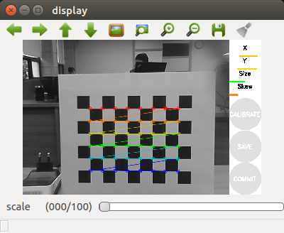
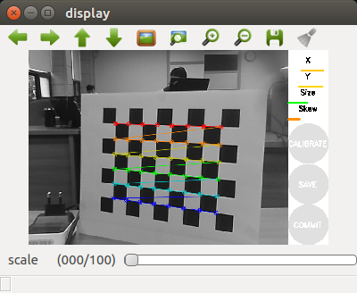
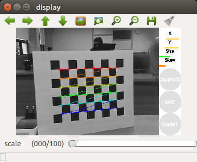
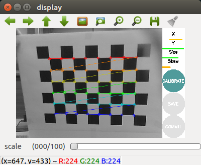
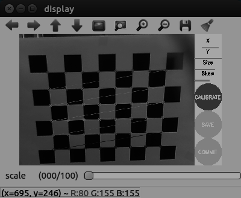
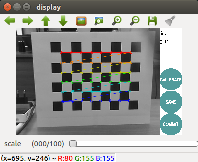

## camera_calibration/Tutorial/MonocularCalibration


## Monocular Camera Calibration

**출처 :** <http://wiki.ros.org/camera_calibration/Tutorials/MonocularCalibration> 

**튜토리얼 레벨 :**  beginner(초급)

**이 튜토리얼 작성 환경 :**  catkin **/** Ubuntu 16.04 **/** Kinetic

**튜토리얼 목록 :** [README.md](../README.md) 

------

이 튜토리얼은 `camera_calibration` 패키지의 `calibrator.py` 노드를 이용하여 `image_raw` 토픽을 발행하고 있는`Monocular Camera` ( `Stereo Camera` 가 아닌 )를 calibrate 하는 방법을 알아본다.


### 1. 시작 전 준비

[**checkerboard**](http://wiki.ros.org/camera_calibration/Tutorials/MonocularCalibration?action=AttachFile&do=view&target=check-108.pdf) 

- 이 문서의 [출처](http://wiki.ros.org/camera_calibration/Tutorials/MonocularCalibration)인 원래의 영문 튜토리얼에서는 가로의 길이가 1(m)가 넘는 체커보드를 이용하여 Calibration을 진행하지만 이 문서에서는 A4 용지에 출력한 체커보드를 이용한다. 출력한 체커보드
- Calibration 에 사용되는 체커보드는 `9x8` 의 체크무늬를 가지고 있지만 흑, 백의 사각형의 교차점의 개 수 `8x6` 체커보드라고 말한다. 
- 체크무늬를 구성하는 정사각형의 한변의 길이를 측정한다. 측정 결과는 2.45(cm) = 0.0245(m) 이었다.
- 체커보드를 이용한 Calibration 을 시작하기 전에 Calibration 이 필요한 해당 카메라를 이용한 `image_raw` 토픽이 `ROS` 네트워크에 발행 중이어야 한다.


### 2. 의존성 설치 및 카메라 구동

`camera_calibration` `ROS` 노드 패키지 구동에 필요한 의존성 설치

```bash
$ rosdep install camera_calibration
```

`roscore` 구동

```bash
$ roscore
```

`uvc_camera_node` 구동

```bash
$ rosrun uvc_camera uvc_camera_node
```

아래 내용은 `uvc_camera_node` 구동 시 출력된 메세지이다.

`camera calibration URL` 기본 경로가 `file:///home/user01/.ros/camera_info/camera.yaml` 인데, 해당 파일이 존재하지 않아 열 수 없다는 메세지와 경고가 4 ~ 7 행에,  출력된 것을 볼 수 있다. `camera calibration` 작업의 목적은 결국 제대로 된 `~/.ros/camera_info/camera.yaml` 파일을 만드는 것이다. 

```bash
[ INFO] [1622265487.419362823]: using default calibration URL
[ INFO] [1622265487.419984028]: camera calibration URL: file:///home/user01/.ros/camera_info/camera.yaml
[ INFO] [1622265487.420032830]: Unable to open camera calibration file [/home/user01/.ros/camera_info/camera.yaml]
[ WARN] [1622265487.420050872]: Camera calibration file /home/user01/.ros/camera_info/camera.yaml not found.
opening /dev/video0
pixfmt 0 = 'YUYV' desc = 'YUYV 4:2:2'
  discrete: 640x480:   1/30 1/15 
  discrete: 1280x960:   1/6 
  discrete: 352x288:   1/30 1/15 
  discrete: 320x240:   1/30 1/15 
  discrete: 176x144:   1/30 1/15 
  discrete: 160x120:   1/30 1/15 
  discrete: 800x600:   1/15 
pixfmt 1 = 'MJPG' desc = 'Motion-JPEG'
  discrete: 640x480:   1/30 1/15 
  discrete: 1280x960:   1/15 
  discrete: 352x288:   1/30 1/15 
  discrete: 320x240:   1/30 1/15 
  discrete: 176x144:   1/30 1/15 
  discrete: 160x120:   1/30 1/15 
  discrete: 800x600:   1/30 1/15 
  int (Brightness, 0, id = 980900): -64 to 64 (1)
  int (Contrast, 0, id = 980901): 0 to 30 (1)
  int (Saturation, 0, id = 980902): 0 to 127 (1)
  int (Hue, 0, id = 980903): -16000 to 16000 (1)
  bool (White Balance Temperature, Auto, 0, id = 98090c): 0 to 1 (1)
  int (Gamma, 0, id = 980910): 20 to 250 (1)
  menu (Power Line Frequency, 0, id = 980918): 0 to 2 (1)
    0: Disabled
    1: 50 Hz
    2: 60 Hz
  int (White Balance Temperature, 16, id = 98091a): 2800 to 6500 (1)
  int (Sharpness, 0, id = 98091b): 0 to 100 (1)
  int (Backlight Compensation, 0, id = 98091c): 0 to 1 (1)
  
```

카메라 관련 토픽 확인

```bash
$ rostopic list
/camera_info  
/image_raw
   .
   .
   .
```


### 3. Calibration 노드 구동

`cameracalibrator.py` 노드는 calibration 이 필요한 카메라가 발행하는 이미지 토픽을 load 해야한다. ( 이 전 단계에서  `rostopic list` 명령 수행 시 확인된 토픽명은 `/image_raw` 이었다. )

`cameracalibrator.py` 노드 구동

```bash
$ rosrun camera_calibration cameracalibrator.py --size 8x6 --square 0.0245 image:=/image_raw camera:=/
```

- --size : 체커보드 가로, 세로 교차점의 개 수

- --square : 체커보드 정사각형의 길이를 (m) 로 기입 

- image : 카메라 이미지 토픽명

- camera : 카메라 토픽들의 `name space`

  위( `uvc_camear_node` 의 경우 따로 `name space` 가 적용되지 않았기 때문에 ` / ` 만 적어주었다.

  아래의 경우는 `/usb_cam` 이 ,
  
  ```
  $ rostopic list
  /usb_cam/image_raw
  /usb_cam/camera_info
     .
     .
     .
  ```

  다음의 경우 `/bebop` 이 네임 스페이스에 해당한다. 
  
  ```
  $ rostopic list
  /bebop/image_raw
  /bebop/camera_info
     .
     .
     .
  ```

calibration 노드가 구동되면 다음과 같은 화면이 나타난다. 체커보드의 상, 하, 좌, 우가 각각 카메라에 가까와지도록 기울인 후 3~5초 유지하기를 반복한다.

 

 

체커보드를 이리저리 움직이는 동안 아래와 같은 메세지가 `calibrator.py` 노드가 실행 중인 터미널에 나타난다. 어느정도 숫자의 의미있는 sample 이 충분히 누적되면 위 4번 째 그림과 같이 `CALIBRATE` 버튼이 활성화 된다.

```
('Waiting for service', '//set_camera_info', '...')
OK
*** Added sample 1, p_x = 0.754, p_y = 0.270, p_size = 0.488, skew = 0.175
*** Added sample 2, p_x = 0.741, p_y = 0.438, p_size = 0.464, skew = 0.211
*** Added sample 3, p_x = 0.714, p_y = 0.579, p_size = 0.443, skew = 0.159
*** Added sample 4, p_x = 0.758, p_y = 0.667, p_size = 0.431, skew = 0.092
*** Added sample 5, p_x = 0.581, p_y = 0.621, p_size = 0.451, skew = 0.128
      .      .
      .      .
      .      .
*** Added sample 61, p_x = 0.726, p_y = 0.826, p_size = 0.445, skew = 0.542
*** Added sample 62, p_x = 0.834, p_y = 0.798, p_size = 0.470, skew = 0.040
*** Added sample 63, p_x = 0.785, p_y = 0.243, p_size = 0.642, skew = 0.193
*** Added sample 64, p_x = 0.484, p_y = 0.729, p_size = 0.616, skew = 0.187
*** Added sample 65, p_x = 0.888, p_y = 0.879, p_size = 0.502, skew = 0.092
```

 `CALIBRATE` 버튼을 누르면 화면이 검게 변하기를 반복하다 `SAVE` 와 `COMMIT` 버튼이 활성화되고 아래와같은 메세지가 화면에 출력된다.

 

```
('D = ', [0.11128338701864683, -0.5197493575024388, -6.375688319616212e-05, 0.009298307889686658, 0.0])
('K = ', [920.799326138786, 0.0, 315.54694835846703, 0.0, 917.4481996862099, 308.24202083788964, 0.0, 0.0, 1.0])
('R = ', [1.0, 0.0, 0.0, 0.0, 1.0, 0.0, 0.0, 0.0, 1.0])
('P = ', [926.3220825195312, 0.0, 318.6203266283628, 0.0, 0.0, 926.2139892578125, 308.51356296116137, 0.0, 0.0, 0.0, 1.0, 0.0])
None
# oST version 5.0 parameters


[image]

width
640

height
480

[narrow_stereo]

camera matrix
920.799326 0.000000 315.546948
0.000000 917.448200 308.242021
0.000000 0.000000 1.000000

distortion
0.111283 -0.519749 -0.000064 0.009298 0.000000

rectification
1.000000 0.000000 0.000000
0.000000 1.000000 0.000000
0.000000 0.000000 1.000000

projection
926.322083 0.000000 318.620327 0.000000
0.000000 926.213989 308.513563 0.000000
0.000000 0.000000 1.000000 0.000000

```

이 때 `SAVE` 버튼을 클릭하면 화면에 출력된 Calibration 결과를 `/tmp/calibrationdata.tar.gz` 로 저장했다는 메세지가 아래와 같이 화면에 출력된다. 

```
('Wrote calibration data to', '/tmp/calibrationdata.tar.gz')
```

`COMMIT` 버튼을 클릭하면 Calibration 작업을 종료한다. 


---

이전 튜토리얼 &nbsp; &nbsp; / &nbsp; &nbsp; [튜토리얼 목록](../README.md) &nbsp; &nbsp; / &nbsp; &nbsp; [다음 튜토리얼](./ar_2_analysis_marker.md)
