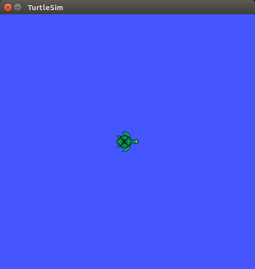

## turtlesim/ Tutorials/ Moving in a Straight Line


---

## turtlesim 직선 이동

**출처 :**  <http://wiki.ros.org/turtlesim/Tutorials/Moving%20in%20a%20Straight%20Line>

**튜토리얼 레벨 :**  중급

**빌드 환경 :**  catkin **/** Ubuntu 16.04 **/** Kinetic

**다음 튜토리얼 :** [좌/우회전](./mv_tutle_2_RotateLeftRight.md)

---

이 튜토리얼 시리즈에서는 ROS 기본을 익히기 위한 turtlesim 노드의 거북이를 움직이는 파이썬 스크립트를 작성할 것이다. 다음 링크에서 전체 소스코드를 찾을 수 있다. <https://github.com/clebercoutof/turtlesim_cleaner>


### 1. 준비작업

`geometry_msgs` 와  `rospy` 에 의존성을 갖는 새로운 패키지 `turtlesim_cleaner` 생성

```
user@computer:~$ cd ~/catkin_ws/src
user@computer:~/catkin_ws/src$ catkin_create_pkg turtlesim_cleaner geometry_msgs rospy
```

생성된 패키지 폴더로 작업경로 변경

```
user@computer:~/catkin_ws$ cd ~/catkin_ws/src/turtlesim_cleaner
user@computer:~/catkin_ws/src/turtlesim_cleaner$ _
```

`setup.py` 편집

```
user@computer:~/catkin_ws/src/turtlesim_cleaner$ gedit setup.py &
```

다음 내용과 같이 `~/catkin_ws/src/turtlesim_cleaner/setup.py` 파일 작성.

```python
from distutils.core import setup
from catkin_pkg.python_setup import generate_distutils_setup

setup_args = generate_distutils_setup(
    packages=['turtlesim_cleaner'],
    package_dir={'': 'src'},
)

setup(**setup_args)
```

파이썬 코드를 작성할 `scripts` 폴더 생성 후, 생성된 폴더로 경로 변경

```
user@computer:~/catkin_ws/src/turtlesim_cleaner$ mkdir scripts
user@computer:~/catkin_ws/src/turtlesim_cleaner$ cd scripts
user@computer:~/catkin_ws/src/turtlesim_cleaner/scripts$ 
```


### 2. 구현할 기능

이동 속도, 이동 거리, 이동 방향( 전/후진 )을 입력받아 입력값들의 형식 및 단위를 적절히 변환 후, 이동시간을 계산하여  `turtlesim_node` 에서 subscribe 하는 `'/turtle1/cmd_vel'` 토픽으로 publish 한다.


### 3. 코드

`~/catkin_ws/src/turtlesim_cleaner/scripts` 폴더에 다음 내용으로  `move.py` ( 또는 원하는 이름의 파일 )파일을 작성한다.

```python
#!/usr/bin/env python

import rospy
from geometry_msgs.msg import Twist

def move():
    # Starts a new node name 'robot_cleaner'
    rospy.init_node('robot_cleaner', anonymous=True)
    # declair publisher name:pub, topic:'/turtle1/cmd_vel', type:Twist
    pub = rospy.Publisher('/turtle1/cmd_vel', Twist, queue_size=10)
    # declair Twist type object name 'msg'
    msg = Twist()

    # Receiveing the user's input
    print("Let's move your robot")
    speed     = input("Input your speed: ")
    distance  = input("Type your distance: ")
    isForward = input("Foward?: ") # True or False(1 or 0)

    # Checking if the movement is forward or backwards
    if(isForward):
        msg.linear.x =  abs(speed)
    else:
        msg.linear.x = -abs(speed)
        
    # Since we are moving just in x-axis
    msg.linear.y  = msg.linear.z  = 0
    msg.angular.x = msg.angular.y = msg.angular.z = 0

    while not rospy.is_shutdown():

        # Setting the current time for distance calculus
        t0 = rospy.Time.now().to_sec()
        current_distance = 0

        # Loop to move the turtle in an specified distance
        while(current_distance < distance):
            # Publish the velocity
            pub.publish(msg)
            # Takes actual time to velocity calculus
            t1=rospy.Time.now().to_sec()
            # Calculates distancePoseStamped
            current_distance= speed*(t1-t0)
        # After the loop, stops the robot
        msg.linear.x = 0
        # Force the robot to stop
        pub.publish(msg)

if __name__ == '__main__':
    try:
        # Testing our function
        move()
    except rospy.ROSInterruptException: pass
```

작성한 파일에 실행 속성 부여.

```
user@computer:~/catkin_ws/src/turtlesim_cleaner/scripts$ chmod +x move.py
```


### 4. 빌드 및 실행

`catkin_make` 실행을 위해 작업 경로를 `~/catkin_ws` 로 변경한다.

```
user@computer:~/catkin_ws/src/rospy_tutorial/scripts$ cd ~/catkin_ws
```

`catkin_make` 실행.

```
user@computer:~/catkin_ws$ catkin_make
```

변경된  `~/catkin_ws/devel/setup.bash` 의 내용을 `source` 명령을 이용하여 반영시킨다.

```
user@computer:~/catkin_ws$ source ./devel/setup.bash
```


`roscore` 실행

```
user@computer:~/catkin_ws$ roscore
```


`Ctrl+Alt+T` 를 입력하여 새 터미널을 열고 `turtlesim` 노드를 실행한다.

```
user@computer:~$ rosrun turtlesim turtlesim_node
```




`Ctrl+Alt+T` 를 입력하여 새 터미널을 열고 작성한  `move.py` 를 실행한다. 

```
user@computer:~$ rosrun turtlesim_cleaner move.pyLet's move your robot
Input your speed: 0.5
Type your distance: 3.0
Foward?: 1
```


[튜토리얼 목록 열기](../README.md)

[다음 튜토리얼](./mv_tutle_2_RotateLeftRight.md)


