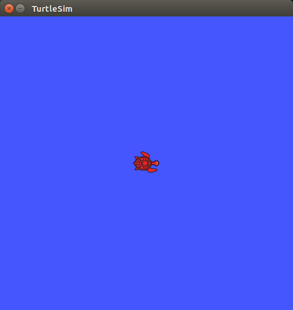
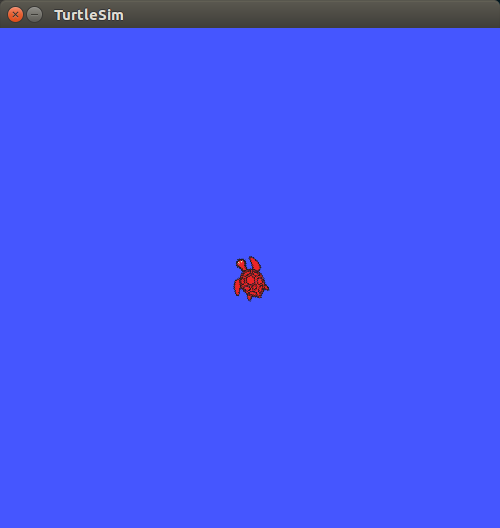

## turtlesim/ Tutorials/ Rotate Left and Right


---

## turtlesim 좌 / 우 회전

**출처 :**  <http://wiki.ros.org/turtlesim/Tutorials/Rotating%20Left%20and%20Right>

**튜토리얼 레벨 :**  Intermediate(중급)

**이 튜토리얼 작성 환경 :**  catkin **/** Ubuntu 16.04 **/** Kinetic

**다음 튜토리얼 :** [목표지점으로 이동](./mv_tutle_3_Go2Goal.md)

**이전 튜토리얼 :** [직선으로 이동](./mv_tutle_1_MoveInStraightLine.md)

**튜토리얼 목록 :** [README.md](../README.md)

---

이 튜토리얼 시리즈에서는 ROS 기본을 익히기 위한 turtlesim 노드의 거북이를 움직이는 파이썬 스크립트를 작성한다. 다음 링크에서 전체 소스코드를 찾을 수 있다. <https://github.com/clebercoutof/turtlesim_cleaner>


### 1. 준비작업

앞서 [이 전 튜토리얼](./mv_tutle_1_MoveInStraightLine.md)에서 만든  `turtlesim_cleaner` 패키지의 `scripts` 폴더로 경로를 변경한다.

```
$ cd ~/catkin_ws/src/turtlesim_cleaner/scripts
```

`rotate.py` 파일을 만들고 실행 속성을 부여한다. 

```
$ touch rotate.py
$ chmod +x rotate.py
```


### 2. 구현할 기능

회전 속도, 회전 각도, 회전 방향( 좌/우회전 )을 입력받아 입력값들의 형식 및 단위를 적절히 변환 후, 회전시간을 계산하여  `turtlesim_node` 에서 subscribe 하는 `'/turtle1/cmd_vel'` 토픽으로 publish 한다.


### 3. 코드

`~/catkin_ws/src/turtlesim_cleaner/scripts` 폴더에 `rotate.py` 파일을 작성한다.

```
$ gedit rotate.py &
```

```python
#!/usr/bin/env python

import rospy
from geometry_msgs.msg import Twist
PI = 3.1415926535897

def rotate():
    # Starts a new node
    rospy.init_node('robot_cleaner', anonymous=True)
    pub = rospy.Publisher('/turtle1/cmd_vel', Twist, queue_size=10)
    msg = Twist()

    # Receiveing the user's input
    print("Let's rotate your robot")
    speed     = input("Input your speed (degrees/sec):")
    angle     = input("Type your distance (degrees):")
    clockwise = input("Clockwise?: ") # True or false

    # Converting from angles to radians
    angular_speed  = speed*2*PI/360
    relative_angle = angle*2*PI/360

    # We wont use linear components
    msg.linear.x  = msg.linear.y  = msg.linear.z  = 0
    msg.angular.x = msg.angular.y = 0

    # Checking if our movement is CW or CCW
    if clockwise:
        msg.angular.z = -abs(angular_speed)
    else:
        msg.angular.z =  abs(angular_speed)
    # Setting the current time for distance calculus
    t0 = rospy.Time.now().to_sec()
    current_angle = 0

    while(current_angle < relative_angle):
        pub.publish(msg)
        t1 = rospy.Time.now().to_sec()
        current_angle = angular_speed*(t1-t0)


    # Forcing our robot to stop
    msg.angular.z = 0
    pub.publish(msg)
    rospy.spin()

if __name__ == '__main__':
    try:
        # Testing our function
        rotate()
    except rospy.ROSInterruptException:
        pass
```


### 4. 실행

`roscore` 실행

```
$ roscore
```

`Ctrl+Alt+T` 를 입력하여 새 터미널을 열고 `turtlesim` 노드를 실행한다.

```
$ rosrun turtlesim turtlesim_node
```




`Ctrl+Alt+T` 를 입력하여 새 터미널을 열고 작성한  `rotate.py` 를 실행한다. 

```
$ rosrun turtlesim_cleaner move.py
Let's move your robot
Input your speed (degrees/sec):20
Type your distance (degrees):120
Clockwise?: 0
```




[튜토리얼 목록 열기](../README.md)

[다음 튜토리얼](./mv_tutle_3_Go2Goal.md)


