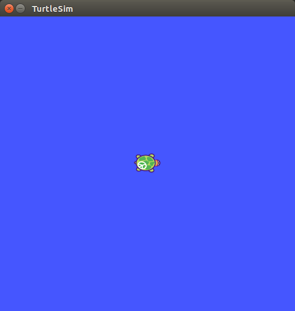
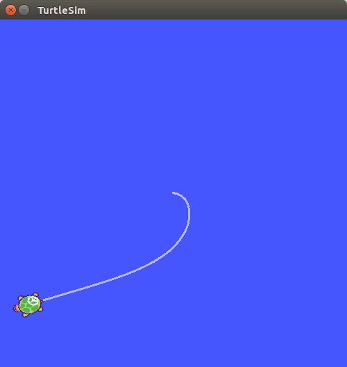

## turtlesim/ Tutorials/ Go to Goal


---

## turtlesim 목표지점 이동

**출처 :**  <http://wiki.ros.org/turtlesim/Tutorials/Go%20to%20Goal>

**튜토리얼 레벨 :**  Intermediate(중급)

**이 튜토리얼 작성 환경 :**  catkin **/** Ubuntu 16.04 **/** Kinetic

**이전 튜토리얼 :** [좌 / 우 회전](./mv_tutle_2_RotateLeftRight.md)

**튜토리얼 목록 :** [README.md](../README.md)

------

이 튜토리얼 시리즈에서는 ROS 기본을 익히기 위한 turtlesim 노드의 거북이를 움직이는 파이썬 스크립트를 작성할 것이다. 다음 링크에서 전체 소스코드를 찾을 수 있다. <https://github.com/clebercoutof/turtlesim_cleaner>


### 1. 준비작업

앞서 [이 전 튜토리얼](./mv_tutle_2_RotateLeftRight.md)에서 사용한  `turtlesim_cleaner` 패키지의 `scripts` 폴더로 경로를 변경한다.

```
user@computer:~$ cd ~/catkin_ws/src/turtlesim_cleaner/scripts
```

`go2goal.py` 파일을 만들고 실행 속성을 부여한다. 

```
user@computer:~/catkin_ws/src/turtlesim_cleaner/scripts$ touch go2goal.py
user@computer:~/catkin_ws/src/turtlesim_cleaner/scripts$ chmod +x go2goal.py
```


### 2. 작성할 코드에 대하여

#### 2.1 TurtleBot 클라스

이 튜토리얼에서 작성할 TurtleBot 클라스는 pose, publisher 와 subscriber, subscriber 와 callback 함수, move to goal 함수까지 로봇 이동에 대한 모든 측면이 반영된 코드다.

#### 2.2 Subscriber

turtlesim 의 실제 위치가 발행되는 '/turtle1/pose' 토픽을 구독하는 subscriber 를 구현한다. update_pose 함수는 메세지가 수신된고, 실제 위치가 pose라고 하는 클라스 속성에 저장될 때 호출된다.

#### 2.3 The euclidean_distance method

이 방법( 유클리드 거리계산 방법 )은 한 주기 전 저장된 turtlesim의 위치( self.pose )와  turtlesim과 목표지점사이의 거리 계산을 위한 arguments를 사용할 것이다. 선형 속도는 거북이와 목표지점 사이의 거리에 상수를 곱한 값으로 구성되며 각 속도는 y 축 거리에 대한 아크 탄젠트에 x 축 거리에 상수를 곱한 값에 따라 달라진다. 더 자세한 설명은 비디오 튜토리얼( [Go to Goal Turtlesim Video Tutorials](http://wiki.ros.org/turtlesim/Tutorials) )을 참고한다.

#### 2.4 PID 제어기

선속도와 각속도를 이용한 로봇 이동에는 PID 제어기를 사용할 것이다. 

#### 2.5 Tolerance

목표점에 정확하게 도달하기 위해서는 매우 높은 정밀도가 필요하기 때문에 목표점 주위에 오차 허용영역(  '목표 지점을 중심으로 반경 0.1m 이내' 와 같은 )을 만들어야 한다. 이 코드에서 정말로 작은 정밀도를 사용하면 거북이는 정지하지 않고 끊임 없이 조금식 움직이게 될것이다. 다시 말해, 코드와 시뮬레이터가 단순화되어 전체 정밀도로 작동하지 않는다.


### 3. 코드

`~/catkin_ws/src/turtlesim_cleaner/scripts` 폴더에 다음 내용으로  `go2goal.py` 파일을 작성한다.

```python
#!/usr/bin/env python

import rospy
from geometry_msgs.msg import Twist
from turtlesim.msg import Pose
from math import pow, atan2, sqrt


class TurtleBot:

    def __init__(self):
        # Creates a node with name 'turtlebot_controller' and make sure it is a
        # unique node (using anonymous=True).
        rospy.init_node('turtlebot_controller', anonymous=True)

        # Publisher which will publish to the topic '/turtle1/cmd_vel'.
        self.pub = rospy.Publisher('/turtle1/cmd_vel', Twist, queue_size=10)

        # A subscriber to the topic '/turtle1/pose'. self.update_pose is called
        # when a message of type Pose is received.
        self.sub = rospy.Subscriber('/turtle1/pose', Pose, self.update_pose)

        self.pose = Pose()
        self.rate = rospy.Rate(10)

    def update_pose(self, data):
        """Callback function which is called when a new message of type Pose is
        received by the subscriber."""
        self.pose   = data
        self.pose.x = round(self.pose.x, 4)
        self.pose.y = round(self.pose.y, 4)

    def euclidean_distance(self, goal_pose):
        """Euclidean distance between current pose and the goal."""
        return sqrt(pow((goal_pose.x - self.pose.x), 2) +
                    pow((goal_pose.y - self.pose.y), 2))

    def linear_vel(self, goal_pose, constant = 1.5):
        """See video: https://www.youtube.com/watch?v=Qh15Nol5htM."""
        return constant * self.euclidean_distance(goal_pose)

    def steering_angle(self, goal_pose):
        """See video: https://www.youtube.com/watch?v=Qh15Nol5htM."""
        return atan2(goal_pose.y - self.pose.y, goal_pose.x - self.pose.x)

    def angular_vel(self, goal_pose, constant=6):
        """See video: https://www.youtube.com/watch?v=Qh15Nol5htM."""
        return constant * (self.steering_angle(goal_pose) - self.pose.theta)

    def move2goal(self):
        """Moves the turtle to the goal."""
        goal_pose = Pose()

        # Get the input from the user.
        goal_pose.x = input("Set your x goal: ")
        goal_pose.y = input("Set your y goal: ")

        # Please, insert a number slightly greater than 0 (e.g. 0.01).
        distance_tolerance = input("Set your tolerance: ")

        msg = Twist()

        while self.euclidean_distance(goal_pose) >= distance_tolerance:

            # Porportional controller.
            # https://en.wikipedia.org/wiki/Proportional_control

            # Linear velocity in the x-axis.
            msg.linear.x  = self.linear_vel(goal_pose)
            msg.linear.y  = msg.linear.z  = 0

            # Angular velocity in the z-axis.
            msg.angular.x = msg.angular.y = 0
            msg.angular.z = self.angular_vel(goal_pose)

            # Publishing our vel_msg
            self.pub.publish(msg)

            # Publish at the desired rate.
            self.rate.sleep()

        # Stopping our robot after the movement is over.
        msg.linear.x = msg.angular.z = 0
        self.pub.publish(msg)

        # If we press control + C, the node will stop.
        rospy.spin()

if __name__ == '__main__':
    try:
        x = TurtleBot()
        x.move2goal()
    except rospy.ROSInterruptException:
        pass
```


### 4. 실행

`roscore` 실행

```
user@computer:~/catkin_ws$ roscore
```


`Ctrl+Alt+T` 를 입력하여 새 터미널을 열고 `turtlesim` 노드를 실행한다.

```
user@computer:~$ rosrun turtlesim turtlesim_node
```




`Ctrl+Alt+T` 를 입력하여 새 터미널을 열고 작성한  `go2goal.py` 를 실행한다. 

```
user@computer:~$ rosrun turtlesim_cleaner go2goal.py
Set your x goal: 1.0
Set your y goal: 2.0
Set your tolerance: 0.2
```




[튜토리얼 목록 열기](../README.md)


