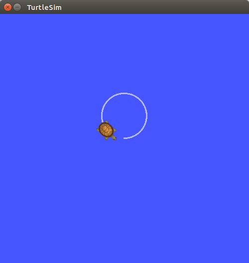

## How to use python scripts with catkin 


---

## Catkin 환경 Python 사용법

**참조1 :**  <http://wiki.ros.org/rospy_tutorials/Tutorials/Makefile>

**참조2 :**  <http://wiki.ros.org/rospy_tutorials/Tutorials/WritingPublisherSubscriber>http://docs.ros.org/jade/api/catkin/html/user_guide/setup_dot_py.html

**튜토리얼 레벨 :**  Beginner(초급)

**다음 튜토리얼 :** [Simple Publisher & Subscriber](./rospy_1_WritingPubSub.md)

**이 튜토리얼 작성 환경 :**  catkin **/** Ubuntu 16.04 **/** Kinetic

---


### 1. 패키지 생성

작업경로를 ```~/catkin_ws/src``` 로 변경 후,  ```catkin_create_pkg``` 명령으로  ```geometry_msgs``` 와 ```rospy``` 에 의존성을 가진 ```rospy_tutorial``` 패키지 생성.

```
user@computer:~$ cd ~/catkin_ws/src
user@computer:~/catkin_ws/src$ catkin_create_pkg rospy_tutorial geometry_msgs rospy
Created file rospy_tutorial/package.xml
Created file rospy_tutorial/CMakeLists.txt
Created folder rospy_tutorial/src
Successfully created files in /home/ground0/catkin_ws/src/rospy_tutorial. Please adjust the values in package.xml.
user@computer:~/catkin_ws/src$ _
```

생성된 ```rospy_tutorial``` 패키지 폴더로 경로 변경 후, 폴더 내용 확인.

```
user@computer:~/catkin_ws/src$ cd rospy_tutorial
user@computer:~/catkin_ws/src/rospy_tutorial$ ls
CMakeLists.txt  package.xml  src
user@computer:~/catkin_ws/src/rospy_tutorial$ _
```


### 2. package.xml 파일과 CMakeList.txt 편집

파이썬 스크립트를 이용하여 패키지를 작성할 경우  ```package.xml``` 파일과 ```CMakeList.txt``` 파일에서 확인할 내용은 다음과 같다. ( 자동으로 해당 내용이 작성되어 있지만, 그 내용이 몇 번 째 줄에 적혀있는 지 라도 한 번 확인해두자. )

#### 2.1 package.xml

```package.xml``` 파일은 다음 내용을 반드시 포함하고 있어야 한다. 

```
<buildtool_depend>catkin</buildtool_depend>
```

#### 2.2 CMakeList.txt

```CMakeList.txt``` 파일은 최소한 다음 내용을 반드시 포함하고 있어야 한다. 

```
cmake_minimum_required(VERSION 2.8.3)
project(rospy_tutorial)

find_package(catkin REQUIRED COMPONENTS std_msgs rospy)
catkin_package()
```

위에 언급된 내용 외의 추가적인 편집이 필요한 경우( 사용자가 정의한 형식의 메세지 또는 서비스 등을 사용하는 경우 )에 대해서는 좀 더 뒤에 ["ROS 파이썬 Makefile 작성"](./rospy_5_WritingROS_pythonMakefile.md) 에서 설명한다.


### 3. setup.py 작성

다음 내용과 같이 ```~/catkin_ws/src/rospy_tutorial/setup.py``` 파일을 작성.

```python
## ! 절대로 이 "setup.py" 파일을 '$ python setup.py'처럼 구동하지 마시오!!!( catkin을 사용하시오!! )

from distutils.core import setup
from catkin_pkg.python_setup import generate_distutils_setup

# fetch values from package.xml
setup_args = generate_distutils_setup(
    packages=['rospy_tutorial'],	# packages=['작성할 패키지명'],
    package_dir={'': 'src'},
)

setup(**setup_args)
```

위 코드 1행의 주석에도 나오지만 이  `setup.py` 파일을 일반적인 파이썬 스크립트처럼 `$ python setup.py` 또는,  `$ setup.py install` 와 같이 실행해서는 절대 않된다. 이  `setup.py` 파일은 `catkin_make` 가 실행될 때, catkin 워크스페이스의 devel 폴더안에 Makefile을 생성할 목적으로 사용되기 때문이다. 


### 4. 스크립트 작성

```scripts``` 폴더를 만들고 그 안에 필요한 스크립트를 작성 후 저장한다.

```
user@computer:~/catkin_ws/src/rospy_tutorial$ mkdir scripts
user@computer:~/catkin_ws/src/rospy_tutorial/scripts$ gedit cmd4turtle.py &
```

```python
#!/usr/bin/env python
# 위 첫 행은 이 스크립트 파일의 해석기의 위치를 지정하는 셔뱅(Shebang)이다. 파이썬으로 ROS 노드를 작성하는 
# 경우, 반드시 첫 행에 이 셔뱅(Shebang)을 적어 주어야만 한다.

import rospy                # roscpp 코드의 "#include <ros.h>"에 해당하는 구문
import geometry_msgs.msg    # ROS 메세지 중 geometry_msg 모듈 import
                            # roscpp 코드라면 "#include <geometry_msgs/Twist.h>"에 해당
def move_turtle():          # move_turtle() 함수 사용자 정의 시작
    
    # 노드명 "move_turtlesim" 노드 초기화. roscpp의 'ros::init(argc, argv, "move_turtlesim");'
    rospy.init_node("move_turtlesim")
    
    # 토픽명이 "turtle1/cmd_vel"이고, 토픽형식이 geometry_msgs.msg.Twist인 퍼블리셔 'pub' 선언
    pub = rospy.Publisher("turtle1/cmd_vel", geometry_msgs.msg.Twist, queue_size=10)
    
    # geometry_msgs 메세지 중 Twist 메세지 객체 "tw" 선언
    tw  = geometry_msgs.msg.Twist()
    
    # tw 메세지 객체의 맴버 중 "linear.x"를 0.25(m/sec)로, "angular.z"를 0.25(rad/sec)로 설정
    tw.linear.x = tw.angular.z = 0.25
    
    # tw 메세지 퍼블리쉬
    pub.publish(tw)

# 실행 중인 이 모듈의 __name__ 변수 값이 '__main__'이면 다음 내용 실행
if __name__ == '__main__': 
    try:
        # rospy가 종료되지 않았으면 반복할 루프. roscpp의 "while(ros::ok())"에 해당.
        while not rospy.is_shutdown():
            move_turtle()		# 앞 서 정의한 move_turtle()함수 호출
    
    except rospy.ROSInterruptException:
        print "Program terminated!"
```


작성한 스크립트 확인.

```
user@computer:~/catkin_ws/src/rospy_tutorial/scripts$ ls *.py -al
-rw-rw-r-- 1 user user  453  9월 21 10:55 cmd4turtlesim.py
user@computer:~/catkin_ws/src/rospy_tutorial/scripts$ _
```

작성한 스크립트에 실행 속성을 부여.

```
user@computer:~/catkin_ws/src/rospy_tutorial/scripts$ chmod +x cmd4turtlesim.py
user@computer:~/catkin_ws/src/rospy_tutorial/scripts$ _
```

결과 확인.

```
user@computer:~/catkin_ws/src/rospy_tutorial/scripts$ ls *.py -al
-rwxrwxr-x 1 user user  453  9월 21 10:55 cmd4turtlesim.py
user@computer:~/catkin_ws/src/rospy_tutorial/scripts$ _
```


### 5. 빌드 및 실행

#### 5.1 빌드

작업 경로를 ```~/catkin_ws``` 로 변경한 후, ```catkin_make``` 를 실행하여 패키지를 빌드한다. 

```
user@computer:~/catkin_ws/src/rospy_tutorial/scripts$ cd ~/catkin_ws
user@computer:~/catkin_ws$ catkin_make
```

빌드가 성공하면 ```~/catkin_ws/devel/setup.bash``` 파일의 변경 사항을 ```source``` 명령으로 반영한다.

```
user@computer:~/catkin_ws$ source ./devel/setup.bash
```

#### 5.2 실행

```Ctrl``` + ```Alt``` + ```T``` 를 눌러 새로 터미널 창을 열고,  ```roscore``` 를 실행한다.

```
user@computer:~$ roscore
```

```Ctrl``` + ```Alt``` + ```T``` 를 눌러 새로 터미널 창을 열고, ```turtlesim_node``` 를 실행한다.

```
user@computer:~$ rosrun turtlesim turtlesim_node
```

```Ctrl``` + ```Alt``` + ```T``` 를 눌러 새로 터미널 창을 열고, 지금 작성한 ```cmd4turtle.py``` 스크립트 실행한다.

```
user@computer:~$ rosrun rospy_tutorial cmd4turtle.py
```

#### 


### 6. 같은 결과, 다른 표현의 코드들

다음의 4가지 파이썬 스크립트는 모두 이 튜토리얼의 예제와 같은 동작을 하는 코드이다.


#### 6.1 일반적인 파이썬 스크립트

 `cmd4turtle_1.py` 

```python
#!/usr/bin/env python

import rospy
import geometry_msgs.msg
   
try:
    while not rospy.is_shutdown():
        rospy.init_node("move_turtle")
        pub = rospy.Publisher("turtle1/cmd_vel",geometry_msgs.msg.Twist,queue_size=10)
        tw  = geometry_msgs.msg.Twist()
        tw.linear.x = tw.angular.z = 0.25
        pub.publish(tw)

except rospy.ROSInterruptException:
    print "Program terminated!"
```


#### 6.2 main함수를 이용한 파이썬 스크립트 

 `cmd4turtle_2.py` 


```python
#!/usr/bin/env python

import rospy
import geometry_msgs.msg


if __name__ == '__main__':
    try:
        while not rospy.is_shutdown():
            rospy.init_node("move_turtle")
            pub = rospy.Publisher("turtle1/cmd_vel",geometry_msgs.msg.Twist,queue_size=10)
            tw  = geometry_msgs.msg.Twist()
            tw.linear.x = tw.angular.z = 0.25
            pub.publish(tw)
            
    except rospy.ROSInterruptException:
        print "Program terminated!"
```

`__main__` [^1]     `__name__` [^2] 


#### 6.3   6.2 의 코드 중 코드수행부를 함수로 정의해 처리한 파이썬 스크립트 

 `cmd4turtle_3.py`  : 이 튜토리얼에 사용된 코드

```python
#!/usr/bin/env python

import rospy
import geometry_msgs.msg

def move_turtle():
    rospy.init_node("move_turtle")
    pub = rospy.Publisher("turtle1/cmd_vel", geometry_msgs.msg.Twist, queue_size=10)
    tw  = geometry_msgs.msg.Twist()
    tw.linear.x = tw.angular.z = 0.25
    pub.publish(tw)
   
if __name__ == '__main__':
    try:
        while not rospy.is_shutdown():
            move_turtle()
    except rospy.ROSInterruptException:
        print "Program terminated!"
```


#### 6.4 앞의 코드를 class를 정의해 처리한 파이썬 스크립트

`cmd4turtle_4.py` 

```python
#!/usr/bin/env python

import rospy
import geometry_msgs.msg

class MoveTurtle():

    def __init__(self):
        rospy.init_node("move_turtle")
        self.pub= rospy.Publisher("turtle1/cmd_vel",geometry_msgs.msg.Twist,queue_size=10)
        self.tw = geometry_msgs.msg.Twist()
        # self.move_turtle()
   
    def move_turtle(self):
        self.tw.linear.x = self.tw.angular.z = 0.25
        self.pub.publish(self.tw)

if __name__ == '__main__':
    try:
        while not rospy.is_shutdown():
            x = MoveTurtle()
            x.move_turtle
            
    except rospy.ROSInterruptException:	# except KeyboardInterrupt:
        print "Program terminated!"
```

위  4가지 모두 이 튜토리얼 예제와 같은 결과를 가져오는 코드들이다. 필요한 자료를 찾다보면 알겠지만 ROS에서는 3, 4번 형태의 코드를 사용하는 것이 일반적이다. 


[튜토리얼 목록 열기](../README.md)

[다음 튜토리얼](./rospy_1_WritingPubSub.md)


[^1]: **`__main__`** : 최상위 코드가 실행되는 스코프의 이름. 표준 입력, 스크립트 또는 대화식 프롬프트에서 읽힐 때, 그 모듈의 `__name__` 이  `__main__` 으로 설정된다.  ( import되어 실행될 경우에는 모듈명으로 설정됨 )
[^2]:**`__name__`** : 파이썬 인터프리터에 의해 생성된 모듈명 치환을 위한 전역변수.