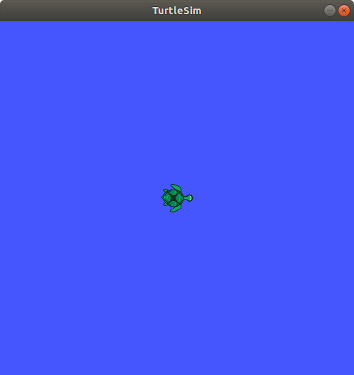
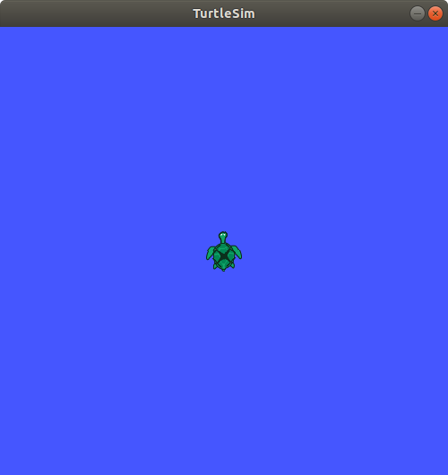
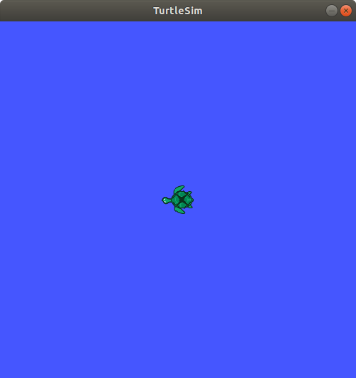
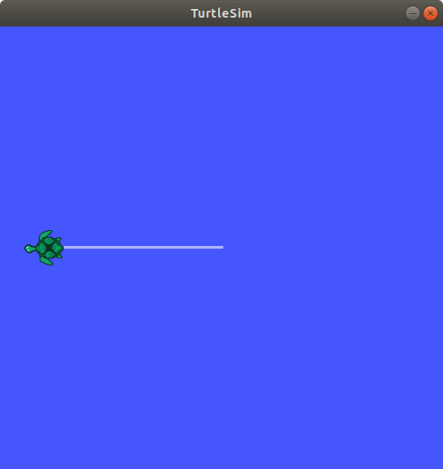

## rospy_tutorial/ Tutorials/ WritingServiceClient2


---

## 간단한 서비스 서버와 클라이언트 작성 2

**출처 :**  <http://wiki.ros.org/rospy_tutorials/Tutorials/WritingServiceClient>

**튜토리얼 레벨 :**  초급

**선수 학습 :**  ROS 튜토리얼

**이전 튜토리얼 : **[4. catkin 빌드 환경에서의 rospy 사용법(2/2) (setup.py)](./rospy_4_How2UsePythonWithCatkin_2.md) 

**다음 튜토리얼 : **[6. 간단한 Parameter 사용 예제](./rospy_6_How2UseParameter.md) 

**빌드 환경 :**  catkin **/** Ubuntu 16.04 **/** Kinetic

---

이 번 튜토리얼에서는 [2. Service Server / Client 작성(1/2)](./rospy/rospy_3_WritingServiceServerClient1.md) 에서 다룬 서비스 서버, 클라이언트( 두 정수 값을 받아 합을 구해주는 서비스 )를 `turtlesim_node` 의 이동에 적용해보려고 한다. 서비스 클라이언트에서 거북이가 회전할 각도와 이동할 거리를 매개로 서비스를 요청하면 서비스 서버는 `turtlesim_node` 의 거북이를 해당 각도와 거리만큼 회전시킨 후 이동시킨다.

**AngleDistance.srv** 서비스 파일 작성 

이 전 튜토리얼에서 사용했던 `~/catkin_ws/src/rospy_tutorial` 폴더로 경로를 변경한다.

```bash
$ roscd rospy_tutorial
```

`srv` 폴더에 서비스파일 `AngleDistance.srv` 를 아래와 같이 작성 후, 저장한다.

```bash
$ gedit ./srv/AngleDistance.srv &
```

```bash
float64 angle
float64 distance
---
bool complete
```


**CMakeLists.txt** 수정 편집

```bash
$ gedit CMakeList.txt
```

`CMakeLists.txt` 파일의  `add_service_files( ... )` 항목 `FILES` 아래에 서비스파일 `AngleDistance.srv` 를 추가한다.

```shell
add_service_files(
   FILES
   AddTwoInts.srv
   AngleDistance.srv	# <-------- add this line
#   Service1.srv
#   Service2.srv
)
```


### 1. 서비스 서버 노드 작성

`scripts` 폴더에 `move_turtle_server.py` 를 작성한다.

```bash
$ gedit move_turtle_server.py &
```

```python
#!/usr/bin/env python
from rospy_tutorial.srv import AngleDistance, AngleDistanceResponse
import rospy
from geometry_msgs.msg import Twist
from math import radians

LIN_X = ANG_Z = 1.5

def svc_cb(req):
    res_rot = rotate(radians(req.angle))
    res_mov = move(req.distance)
    if res_rot and res_mov is True:
        print "turtle is arrived destination!"
    return AngleDistanceResponse(res_rot and res_mov)

def turtlesim_svc_svr():
    rospy.init_node('turtlesim_svc_node')
    svc = rospy.Service('turtlesim_svc', AngleDistance, svc_cb)
    print "turtle1 ready to move~"
    rospy.spin()

def rotate(angle):
    p = rospy.Publisher('/turtle1/cmd_vel', Twist, queue_size=10)
    t = Twist()
    speed  = ANG_Z

    if angle < 0:
        t.angular.z = -speed
    else:
        t.angular.z =  speed

    t0 = rospy.Time.now().to_sec()
    current_angle = 0

    while(current_angle < abs(angle)):
        p.publish(t)
        t1 = rospy.Time.now().to_sec()
        current_angle = speed * (t1 - t0)
    
    t.angular.z = 0;    p.publish(t);   print "end rotate"
    return True

def move(distance):
    p = rospy.Publisher('/turtle1/cmd_vel', Twist, queue_size=10)
    t = Twist()
    speed = LIN_X    

    if distance < 0:
        t.linear.x = -speed
    else:
        t.linear.x =  speed

    t0 = rospy.Time.now().to_sec()
    current_distance = 0

    while(current_distance < abs(distance)):
        p.publish(t)
        t1 = rospy.Time.now().to_sec()
        current_distance= speed * (t1 - t0)
    
    t.linear.x = 0;     p.publish(t);   rospy.sleep(3); print "end move"
    return True


if __name__ == "__main__":
    turtlesim_svc_svr()

```

`scripts` 폴더에 작성된  `move_turtle_server.py` 파일에 실행 속성을 부여한다.

```bash
$ chmod +x ./scripts/move_turtle_server.py
```


### 2. 서비스 클라이언트 노드 작성

`scripts` 폴더에 `move_turtle_client.py` 를 작성한다.

```
$ roscd rospy_tutorial/scripts
$ gedit add_two_ints_client.py &
```

```python
#!/usr/bin/env python
import sys
import rospy
from rospy_tutorial.srv import AngleDistance

def move_turtle_client(angle, distance):
    rospy.wait_for_service('turtlesim_svc')

    try:
        svc = rospy.ServiceProxy('turtlesim_svc', AngleDistance)
        res = svc(x, y)
        return res.result
        
    except rospy.ServiceException, e:
        print "Service call failed: %s"%e

def usage():
    return "%s [angle] [distance]" %sys.argv[0]

if __name__ == "__main__":
    if len(sys.argv) == 3:
        x = float(sys.argv[1])
        y = float(sys.argv[2])
    else:
        print usage()
        sys.exit(1)

    print "Requesting rotate %s(deg) & move %s(m)"%(angle, distance)
    print "Request is %s" \
    %("complete!" if move_turtle_client(angle, distance) else "incomplete")
```

`scripts` 폴더에 작성된  `move_turtle_client.py` 파일에 실행 속성을 부여한다.

```bash
$ chmod +x ./scripts/move_turtle_client.py
```


### 3. 테스트

`CMakeList.txt` 파일의 수정한 내용을 반영하려면 다시 빌드해야 한다. 작업경로를 `~/catkin_ws` 로 변경한다.

```bash
$ cd ~/catkin_ws
```

`catkin_make` 명령으로 빌드한다.

```bash
$ catkin_make
```

빌드 결과 반영( 열려있는 모든 터미널 창에서 수행한다. )

```bash
$ source ~/catkin_ws/devel/setup.bash
```

`roscore` 실행

```bash
$ roscore
```

`turtlesim_node` 실행

```bash
$ rosrun turtlesim turtlesim_node
```



**1. 서비스 서버 실행**

```bash
$ rosrun rospy_tutorial move_turtle_server.py  
turtle1 ready to move~
```

**2.  서비스 클라이언트 실행**

```bash
$ rosrun rospy_tutorial move_turtle_client.py 180 5
Requesting rotate 170.0(deg) & move 4.0(m)
```

 

**3. 서비스 서버가 클라이언트 요청에 응답하여 서비스 요청에 대한 결과 반환 후 다시 서비스 요청 대기** 

```bash
$ rosrun rospy_tutorial move_turtle_server.py  
turtle1 ready to move~
end rotate
end move
turtle is arrived destination!
```



**4. 서비스 클라이언트 서비스 응답 확인 후 종료**

```bash
$ rosrun rospy_tutorial move_turtle_client.py 180 5
Requesting rotate 180.0(deg) & move 4.0(m)
Request is complete!
```


---


[이전 튜토리얼](./rospy_4_How2UsePythonWithCatkin_2.md) 

[다음 튜토리얼](./rospy_6_How2UseParameter.md) 

[튜토리얼 목록](../README.md) 