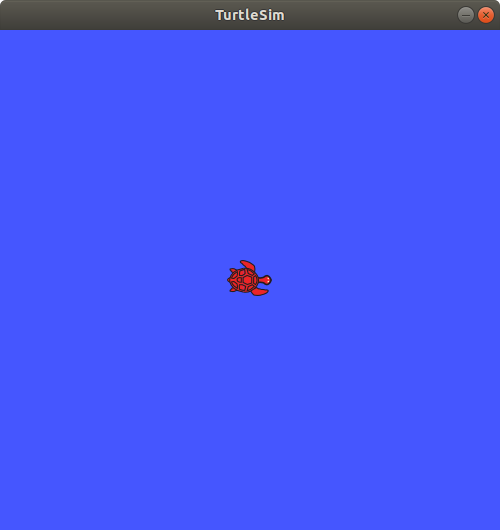
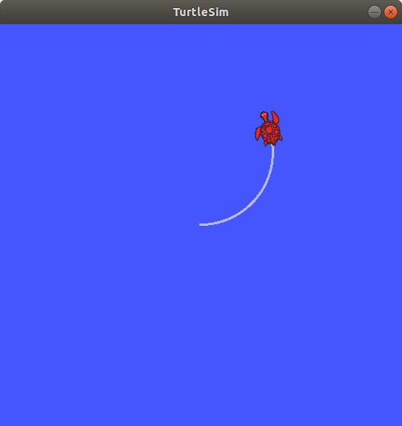
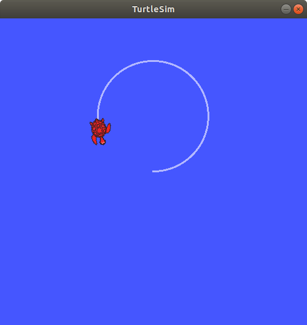

## rospy/ Tutorial/ How to Use Parameter


---

## 간단한 Parameter 사용 예제

**참조 :**  <http://wiki.ros.org/rospy/Overview/Parameter%20Server>

**튜토리얼 레벨 :**  초급

**선수 학습 :**  ROS 튜토리얼

**빌드 환경 :**  catkin **/** Ubuntu 16.04 **/** Kinetic

---

프로그래밍 언어를 사용하여 프로그램을 작성할 때 변수( Variable )를 만들어 사용하게 된다. 이 때 변수의 사용범위에 따라 지역 변수( Local Variable )과 전역 변수( Global Variable )로 나누어 볼 수 있다. 지역 변수는 변수가 선언된 함수안에서만 사용할 수 있는 반면, 전역 변수는 프로그램 전체에서 사용가능하다. Parameter 는 ROS 네트워크 전체에서 효력을 갖는 전역 변수와 같은 개념이다. `roscore` 가 실행되고 Parameter 가 등록되면 실행 중인 모든 ROS 노드에서 그 값을 가져오거나( `rospy.get_param()`) 설정( `rospy.set_param()`)할 수 있다. 

특정 Parameter 값에 따라 `turtlesim_node` 의 거북이가 움직이거나 멈추는 ROS 노드를 작성하여 간단한 Parameter 사용법을 알아보자. 이를 위해 다음 작업이 필요하다. 

​	**1. `move_by_param.launch` 파일작성 **

​		- `turtlesim_node` 실행

​		- Parameter `go_turtle` 등록

​	**2. `move_turtle.py` 파일 작성**

​		- Parameter `go_turtle` 이 `True` 이면 거북이가 움직이고, `False` 이면 멈추는 파이썬 스크립트

​	**3. `set_go_turtle.py` 파일 작성**

​		- 키보드 입력이 `1` 이면 Parameter `go_turtle` 을 `True` 로, `0` 이면 `False` 로 설정하는 파이썬 스크립트


### 1. `move_by_param.launch` 작성

이전 튜토리얼에서 작성해 둔 `rospy_tutorial` 패키지에 `move_by_param.launch` 파일 추가를 위해 우선 경로를  `~/catkin_ws/src/rospy_tutorial` 로 변경하고

```bash
$ roscd rospy_tutorial/scripts
```

`launch` 폴더를 만든다.

```bash
$ mkdir launch
```

만들어진 `launch` 폴더에  `move_by_param.launch` 파일을 작성한다. 

```bash
$ gedit ./launch/move_by_param.launch
```


```xml
<launch>
    <node pkg="turtlesim" type="turtlesim_node" name="turtle1">
      <param name="go_turtle" type="bool" value="False" />
    </node>
</launch>
```

작성한  `move_by_param.launch` 파일을 테스트 해보자. 

```bash
$ roscore
```

```bash
$ roslaunch rospy_tutorial 
```



`turtlesim_node` 가 실행되었으면 `rosparam list` 명령으로 Parameter `go_turtle` 이 Parameter Server 에 등록되었는지 확인한다. 

```bash
$ rosparam list
/rosdistro
/roslaunch/uris/host_localhost__34885
/rosversion
/run_id
/turtle1/background_b
/turtle1/background_g
/turtle1/background_r
/turtle1/go_turtle
```

`rosparam get` 명령으로 Parameter `go_turtle` 의 값이 `False` 인지 확인한다. 

```bash
$ rosparam get /turtle1/go_turtle
false
```


### 2. `move_turtle_by_param.py` 작성

```
$ gedit ./scripts/move_turtle_py_param.py &
```

```python
#!/usr/bin/env python
import rospy 
from geometry_msgs.msg import Twist
        
def move_turtle():
    pb = rospy.Publisher("/turtle1/cmd_vel", Twist, queue_size=10)
    tw = Twist()
    tw.linear.x  = 0.50
    tw.angular.z = 0.25        
    pb.publish(tw)
    
if __name__ == '__main__':
    try:
        rospy.init_node('move_by_param')

        while not rospy.is_shutdown():
            param = rospy.get_param("/turtle1/go_turtle")
            
            if param is True:
                move_turtle()                
            else:	pass

    except rospy.ROSInterruptException:   pass
```

작성된 `move_turtle_by_param.py` 파일에 실행 속성 부여.

```bash
$ chmod +x ./scripts/move_turtle_by_param.py
```

이 전 단계에서 실행한 `move_by_param.launch` 파일이 아직 실행 중이면 종료한 후, 이 번에 작성한 `move_turtle_by_param.py` 도 함께 실행하도록  `move_by_param.launch` 파일을 수정한다. 

```bash
$ gedit ./launch/move_by_param.launch
```


```xml
<launch>
    <node pkg="turtlesim" type="turtlesim_node" name="turtle1">
      <param name="go_turtle" type="bool" value="False" />
    </node>
    <node pkg="rospy_tutorial" type="move_turtle_by_param.py" name="teat_param" />
</launch>
```

수정 편집한  `move_by_param.launch` 파일을 실행한다.

```bash
$ roslaunch rospy_tutorial 
```

`move_turtle_by_param.py` 테스트를 위해 다음 명령을 실행한다. 

```bash
$ rosparam set /turtle1/go_param 1
```

거북이가 움직이는 것을 확인 후 다음 명령을 실행한다. 

```bash
$ rosparam set /turtle1/go_param 0
```

 


### 3. `set_go_turtle.py` 작성 

역시 `rospy_tutorial` 패키지의  `scripts` 폴더에 `set_go_turtle.py` 파일을 작성한다. 

```
$ gedit ./scripts/set_go_turtle.py &
```

```python
import rospy
from rospy_tutorial.GetChar import GetChar

class SetParam:
    def __init__(self):    
        rospy.init_node('set_go_tutle', anonymous=True)        
        param = rospy.get_param("/turtle1/go_turtle")
        print(param)

if __name__ == '__main__': 
    try:
        SetParam()        
        kb_input = GetChar()        
        print "\nType '1' for 'go', '0' for 'stop', any other key for 'quit'."
        
        while not rospy.is_shutdown():        
            key = kb_input.getch()
            
            if   key == '1':
                rospy.set_param("/turtle1/go_turtle", True)
                print(rospy.get_param("/turtle1/go_turtle"))            
            elif key == '0':
                rospy.set_param("/turtle1/go_turtle", False)
                print(rospy.get_param("/turtle1/go_turtle"))
            else:
                break
        print "program terminated"           
    except rospy.ROSInterruptException:   pass
```

작성된 `move_turtle_by_param.py` 파일에 실행 속성 부여.

```bash
$ chmod +x ./scripts/set_go_turtle.py
```

이 전 단계에서 실행한 `move_by_param.launch` 파일이 아직 실행 중이면 그대로 진행한다. ( 종료했으면 다시 실행 후 진행한다. )

```bash
$ rosrun rospy_tutorial set_go_turtle.py
Type '1' for 'go', '0' for 'stop', any other key for 'quit'.
True
False
```

`1` 을 입력 했을 때 `turtlesin_node` 의 거북이가 움직이고,  `0` 을 입력했을 때 멈추는 지, 또 `0` ,  `1` 이 아닌 다른 키 입력시 프로그램이 종료 되는 지 확인한다. 


---

[다음 튜토리얼]() 

[이전 튜토리얼](./rospy_5_WritingServiceServerClient2.md)  

[튜토리얼 목록](../README.md)

