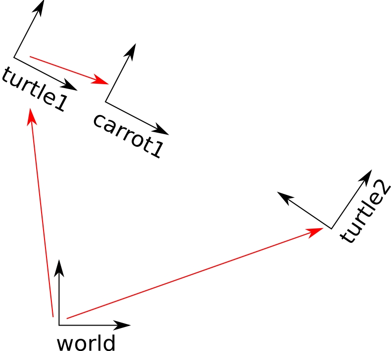

## tf/ Tutorials/ Adding a frame (Python)


------

## tf 프레임 추가하기 (Python)

**튜토리얼 레벨 :**  Intermediate(중급)

**이 튜토리얼 작성 환경 :**  catkin **/** Ubuntu 16.04 **/** Kinetic

**이전 튜토리얼 :** [tf listener](./tf_2_listener.md)

**다음 튜토리얼 :** [tf and time]()

**튜토리얼 목록 :** [README.md](../README.md)

------

이 전의 튜토리얼에서 tf Demo와 같이 동작하는 코드를 tf broadcaster와 tf listener를 추가함으로써 재현할 수 있었다. 이 튜토리얼은 tf Tree에 추가 tf 프레임을 추가하는 방법을 알려 줄 것이다. 이 작업은 tf broadcaster를 생성하는 것과 매우 유사하며, 어느정도 우리에게 tf 의 강력한 가능성을 보유줄 것이다.


### 1. 프레임을 추가하는 이유

예를 들자면 레이저 스캐너 중앙의 프레임에서가 레이저 스캔에 대해 따지기가 더 쉬운 것 처럼, 대부분의 작업에서는 로컬 프레임안에서 생각하는 것이 더 편리하다. 

tf 는 우리가 다루는 시스템의 모든 센서, 링크, 그 외 것들 마다의 로컬 프레임을 만들 수 있도록 해준다. 또한 tf 는 추가된 모든 프레임에 대한 관리방법을 제공한다.


### 2. 프레임을 추가해야하는 경우

tf 는 프레임으로 이루어진 tree 구조를 만든다. tf 는 이 프레임 구조안에서 루프가 닫히는 것을 허용하지 않는다. 이 것은 하나의 프레임은 오직 하나의 parent 프레임을 가진다는 의미이다. 하지만 복수의 child 프레임을 가질 수 있다.

이 튜토리얼에서 작업 중인 tf tree는 3개의 프레임을 가지고 있다. world, turtle1, turtle2 프레임들이다.  그 중에서 tutrtle1, turtle2 프레임은 world 프레임의 child 프레임들이다. 따라서 만약 프레임을 추가하려면 이미 만들어진 3개의 프레임들 중 하나가 parent 프레임이 되어 그 child 프레임으로만 추가가 가능하다.

{ width="50%"}


### 3. 프레임 추가하기

이 tf 튜토리얼 시리즈 거북이 예제의 첫 번 째 거북이에게 두 번 째 거북이를 위한 'carrot'이라는 이름의 새로운 프레임을 추가하자.

우선 소스 코드를 작성하기 위해 이 전 튜토리얼에서 만든 learing_tf 패키지 폴더로 이동하자

```
user@computer:roscd ~/catkin_ws/learning_tf/nodes
```


#### 3.1 코드

자신이 선호하는 편집기를 가지고 ~/catkin_ws/src/learning_tf/nodes 에 아래 코드와 같이 **fixed_tf_broadcaster.py** 파일을 작성한다.

```python
#!/usr/bin/env python  
import roslib
roslib.load_manifest('learning_tf')

import rospy
import tf

if __name__ == '__main__':
    rospy.init_node('fixed_tf_broadcaster')
    br = tf.TransformBroadcaster()
    rate = rospy.Rate(10.0)
    
    while not rospy.is_shutdown():
        br.sendTransform((0.0, 2.0, 0.0),
                         (0.0, 0.0, 0.0, 1.0),
                         rospy.Time.now(),
                         "carrot1",
                         "turtle1")
        rate.sleep()
```

작성한 코드에 실행속성 주는 것을 잊지말자.

```
user@computer:~/catkin_ws/learning_tf/nodes$ chmod +x fixed_tf_broadcaster.py
```


#### 3.2 코드 설명

일단 가장 키가 되는 코드는 아래의 코드다.

turtl1 프레임을 parent 프레임으로 하는 새로운 child 프레임 'carrot1'을 만들고 있다. 이 'carrot1' 프레임은 'turtle1' 프레임으로부터 offset(2m) 만큼 떨어져 있다.

```python
        br.sendTransform((0.0, 2.0, 0.0),
                         (0.0, 0.0, 0.0, 1.0),
                         rospy.Time.now(),
                         "carrot1",
                         "turtle1")
```


### 4. 프레임 브로드캐스터 실행

 ~/catkin_ws/src/learning_tf/launch 폴더의 **start_demo.launch** 파일을 열고 아래의 노드 블럭을 `<launch>` 블럭 안에 추가하라.

```xml
  <launch>
    <!-- Turtlesim Node-->
    <node pkg="turtlesim" type="turtlesim_node" name="sim"/>

    <node pkg="turtlesim" type="turtle_teleop_key" name="teleop" output="screen"/>
    <!-- Axes -->
    <param name="scale_linear" value="2" type="double"/>
    <param name="scale_angular" value="2" type="double"/>

    <node pkg="learning_tf" type="turtle_tf_broadcaster"
          args="/turtle1" name="turtle1_tf_broadcaster" />
    <node pkg="learning_tf" type="turtle_tf_broadcaster"
          args="/turtle2" name="turtle2_tf_broadcaster" />
    <node pkg="learning_tf" type="turtle_tf_listener"
          name="listener" />
    <!-- 여기에 추가 -------------------------------------->
    <node pkg="learning_tf" type="fixed_tf_broadcaster.py"
          name="broadcaster_fixed" />
    <!--------------------------------------------------->

  </launch>
```

우선 앞 서 진행한 튜토리얼의 launch 파일이 실행 중이라면 ctrl-c 를 입력하여 종료시킨다. 이제 turtle broadcaster demo 를 시작할 준비가 완료되었다.

```
user@computer:~/catkin_ws$ roslaunch learning_tf start_demo.launch
```


### 5. 결과 확인

일단 첫 번 째 거북이를 조종해보면 새로운 프레임을 추가했음에도 불구하고 이 전 튜토리얼 코드의 동작과 별반 차이가 없다고 느낄 것이다.

그 것은 추가된 프레임이 다른 어느 프레임에도 영향을 주고 있지 않기 때문이다. listener는 여전히 이 전 에 정의한 프레임을 이용하고 있다.

그렇다면 listener가 새로 추가된 프레임을 사용하도록 바꿔주자. 매우 간단한 작업이다. `~/catkin_ws/src/learning_tf/nodes/turtle_tf_listener.py` 파일을 열어 단순히 `"/turtle1"` 을 `"/carrot1"` 으로 바꿔주기만 하면 된다.

```python
(trans,rot) = listener.lookupTransform("/turtle2", "/carrot1", rospy.Time(0))
```

재미있는 부분은 지금부터다. 일단 turtle demo를 재시작하면 2번째 거북이가 첫 번 째 거북이 대신 당근을 쫓아다니는 것을 볼 수 있다. 당근( carrot1 프레임 )은 1번 거북이로부터 왼쪽으로 2m 떨어져 있다. 시각적으로 당근을 표시하는 것은 없지만 두 번 째 거북이가 그 포인트를 쫓아다니는 것을 볼 수 있다.

```
user@computer:~/catkin_ws$ roslaunch learning_tf start_demo.launch
```


### 6. 이동 프레임 브로드캐스팅

이 튜토리얼에서 추가한 프레임은 시간에 따른 변화가 없고, parent 프레임의 움직임에 연관시킨 고정 프레임( fixed frame )이다. 이동 프레임( moving frame )을 퍼블리쉬하려면 시간에 대해 변하는 브로드캐스터를 코딩하면 된다. 'carrot1' 프레임을 시간경과에 따라 'turtle1' 프레임에 대해 변하도록 고쳐보자.

아래 코드를 작성하여 `~/catkin_ws/src/learning_tf/nodes/dynamic_tf_broadcaster.py` 로 저장하고 실행가능하도록 속성을 변경한다. ( `$ chmod +x dynamic_tf_broadcaster.py` )

```python
#!/usr/bin/env python  
import roslib
roslib.load_manifest('learning_tf')

import rospy
import tf
import math

if __name__ == '__main__':
    rospy.init_node('dynamic_tf_broadcaster')
    br = tf.TransformBroadcaster()
    rate = rospy.Rate(10.0)
    while not rospy.is_shutdown():
        t = rospy.Time.now().to_sec() * math.pi
        br.sendTransform((2.0 * math.sin(t), 2.0 * math.cos(t), 0.0),
                         (0.0, 0.0, 0.0, 1.0),
                         rospy.Time.now(),
                         "carrot1",
                         "turtle1")
        rate.sleep()
```

turtle1프레임으로 부터의 offset 에 대한 정의 대신, 시간을 기준으로 한 sin, cos 함수를 이용한다.

이 코드를 테스트해보려면 launch 파일을 수정해야만 한다. 이 전에 만든 fixed 브로드캐스터의 'carrot1' 프레임 정의대신에 dynamic 브로드캐스터의 'carrot1' 프레임 정의를 사용할 것이기 때문에, launch 파일의 해당부분을 1:1 로 교체 수정해야만한다.  

```xml
  <launch>
    <!-- Turtlesim Node-->
    <node pkg="turtlesim" type="turtlesim_node" name="sim"/>

    <node pkg="turtlesim" type="turtle_teleop_key" name="teleop" output="screen"/>
    <!-- Axes -->
    <param name="scale_linear" value="2" type="double"/>
    <param name="scale_angular" value="2" type="double"/>

    <node pkg="learning_tf" type="turtle_tf_broadcaster"
          args="/turtle1" name="turtle1_tf_broadcaster" />
    <node pkg="learning_tf" type="turtle_tf_broadcaster"
          args="/turtle2" name="turtle2_tf_broadcaster" />
    <node pkg="learning_tf" type="turtle_tf_listener"
          name="listener" />
    <!-- 이 부분 대신에 ------------------------------------>
    <!-- node pkg="learning_tf" type="fixed_tf_broadcaster.py"
          name="broadcaster_fixed" / -->
    <!--------------------------------------------------->
    <!-- 이 부분 추가 -------------------------------------->
    <node pkg="learning_tf" type="dynamic_tf_broadcaster.py"
          name="broadcaster_dynamic" />
    <!---------------------------------------------------->

  </launch>
```

[다음 튜토리얼]()은 tf 와 time 에 대한 튜토리얼이다. 


[튜토리얼 목록 열기](../README.md)


[다음 튜토리얼]()

[이전 튜토리얼](./tf_1_broadcaster.md)