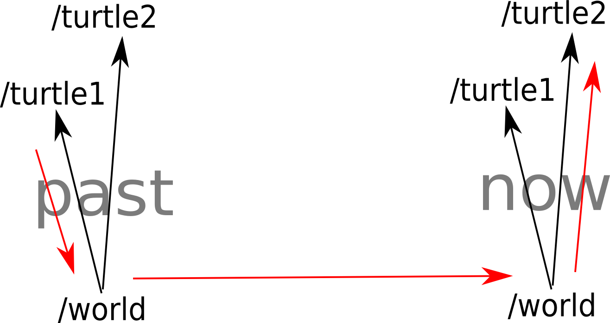

## tf/ Tutorials/ Time travel with tf(Python)


------

## tf 와의 시간여행(Python)

**튜토리얼 레벨 :**  Intermediate(중급)

**이 튜토리얼 작성 환경 :**  catkin **/** Ubuntu 16.04 **/** Kinetic

**이전 튜토리얼 :** [tf and Time](./tf_4_tf_n_time.md)

**튜토리얼 목록 :** [README.md](../README.md)

**튜토리얼 원문 :** <http://wiki.ros.org/tf/Tutorials/Time%20travel%20with%20tf%20%28Python%29>

------

이 전 튜토리얼에서 tf 와 Time 의 기본 컨셉에 대해 알아봤다. 이 번 튜토리얼은 거기서 한 걸음 더 나아가, 가장 강력한 tf 트릭을 경험하게 할 것이다.


### 1. 시간 여행

지난 튜토리얼을 마친 시점으로 되돌아 가보자.

```
user@computer:~$ cd ~/catkin_ws/src/learning_tf/nodes
```

이제 두 번 째 거북이가 첫 번 째 거북이가 현재 있는 곳으로 가도록 하지않고, 5초 전의 첫 번 째 거북이가 있었던 곳으로 가도록 만들자. 이를 위해 `~/catkin_ws/src/learning_tf/nodes/turtle_tf_listener` 를 편집한다.

```python
       try:
            now = rospy.Time.now() - rospy.Duration(5.0)
            listener.waitForTransform("/turtle2", "/turtle1", now, rospy.Duration(1.0))
            (trans, rot) = listener.lookupTransform("/turtle2", "/turtle1", now)
        except (tf.Exception, tf.LookupException, tf.ConnectivityException):
```

이제 이 코드를 실행해 볼 수 있다. 무엇을 보게 될 것이라 기대하는가? 당연히 처음 5초간 두 번 째 거북이는 어디로 가야하는 지 조차 모른다. 아직 첫 번 째 거북이에게는 5초 전이라는 과거가 존재하지 않기 때문이다. 하지만 5초 후에는? 일단 시작해 보자.

```
user@computer:~$ cd ~/catkin_ws
user@computer:~/catkin_ws$ catkin_make
user@computer:~/catkin_ws$ roslaunch learning_tf start_demo.launch
```


당신의 거북이도 이 캡쳐 화면처럼 정신없이 통제불능으로 움직이는가? 그렇다면 무슨 일이 일어난 것인가?

* tf 에게 5초 이전 `/turtle1` 의 pose를 요구 했다. 이것은 우리가 5 초 전의 위치와 5 초 전의 첫 번째 거북이의 위치에 따라 두 번째 거북이를 제어하고 있음을 의미한다.
* 실제 요구는 현재 두 번 째 거북이의 위치에 대한 5초 전의 첫 번 째 거북이의 상대적인 위치는 어느 지점인가 하는 것이다.


### 2. Advanced API for lookupTransforms

그럼 어떻게 tf 에게 그와 같은 요청을 할 수 있을까? 이 API는 우리에게 각 프레임이 transform 되었을 때 명시적으로 그 같은 요구를 할 수 있는 권한을 주었다. 아래의 코드가 바로 그것이다. 무슨 코드 처럼 보이는가?

```python
       try:
            now = rospy.Time.now()
            past = now - rospy.Duration(5.0)
            listener.waitForTransformFull("/turtle2", now,
                                      "/turtle1", past,
                                      "/world", rospy.Duration(1.0))
            (trans, rot) = listener.lookupTransformFull("/turtle2", now,
                                      "/turtle1", past,
                                      "/world")
```

`waitForTransform()` 함수를 위한 고급 API는 6개의 인수(argument)가 필요하다. 

1. 이 프레임부터의 transform 과,
2. 이 시간의,
3. 이 프레임까지,
4. 이 시간의,
5. 이 번 경우 "/world"프레임에 해당하는 시간 초과 시에도 변하지 않는 프레임의 특정,
6. 결과를 넣어 둘 변수.

**주의: **`waitForTransform()` 은 마치 `lookupTransform()` 처럼 basic API 와 advanced API 두 가지 API를 가지고 있다.



이 그림은 tf 가 background 에서 무얼 하는 가를 보여준다. 과거에는 첫 번 째 거북이로부터 'world' 프레임으로의 transform을 계산하고, 'world' 프레임 안에서 과거로부터 현재까지 tf 시간 여행을 한다. 그리고 지금 tf 는 'world' 프레임으로 부터 두 번 째 거북이로의 transform을 계산한다.


### 3. 결과 확인

이 번에는 고급 시간여행 API를 통해 다시 한 번 시뮬레이터를 구동해보자.

```
user@computer:~$ roslaunch learning_tf start_demo.launch
```

그렇다. 두 번 째 거북이는 첫 번 째 거북이의 5초전 위치로 바로 이동한다! 


[튜토리얼 목록 열기](../README.md)


[이전 튜토리얼](./tf_4_tf_n_time.md)