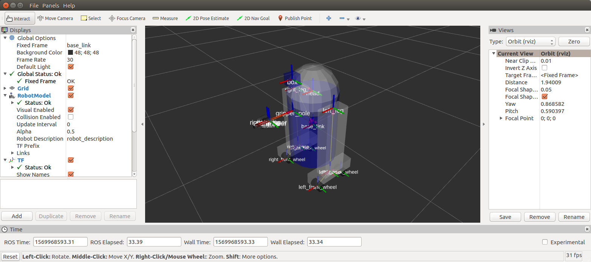

## urdf/ Tutorials/ Building a Visual Robot Model with URDF


------

## Building a Visual Robot Model with URDF

**튜토리얼 레벨 :**  Beginner(초급)

**이 튜토리얼 작성 환경 :**  catkin **/** Ubuntu 16.04 **/** Kinetic./tf_2_listener.md)

**다음 튜토리얼 :** [Making a Model Move](./urdf_2_making_a_model_move.md)

**튜토리얼 목록 :** [README.md](../README.md)

**튜토리얼 원문 :** <http://wiki.ros.org/urdf/Tutorials/Building%20a%20Visual%20Robot%20Model%20with%20URDF%20from%20Scratch>

------

이 튜토리얼에서 비쥬얼한 로봇 모델( 스타워즈의 R2D2 비슷한... )을 생성할 것이다. 그 이 후 튜토리얼에서 xacro를 사용하여 구체적이면서, 물리적 특성이 반영된 간결한 로봇 모델 코드를 만드는 방법과, 그 것을 Gazebo 시뮬레이터에서 움직이도록 만드는 방법을 학습할 것이다. 하지만 지금 당장은 정확한 Visual Geometry 를 만드는 데에 집중할 것이다.

진행하기 전에 joint_state_publisher 패키지를 설치했는 지 확인한다. 이 패키지는 'apt-get' 명령어를 이용하여 이 'urdf_tutorial' 패키지를 설치했다면 그 과정에서 함께 설치된다. 그렇지 않다면 'rosdep' 명령을 사용하여 모든 패키지 설치를 업데이트한다.

이 튜토리얼에 언급된 모든 로봇( 과 그 소스코드 )는 [urdf_tutorial](https://github.com/ros/urdf_tutorial) 패키지에서 찾아 볼 수 있다.


### 1. One Shape

일단 간단한 모양의 모델부터 시작해 보자. 다음은 가능한 가장 간단한 형태의 urdf 파일이다.

```xml
<?xml version="1.0"?>
<robot name="myfirst">
  <link name="base_link">
    <visual>
      <geometry>
        <cylinder length="0.6" radius="0.2"/>
      </geometry>
    </visual>
  </link>
</robot>
```

위 코드를 번역하자면, 'myfirst' 라는 이름의 로봇이며, 단 하나의 링크( 파트 )를 가졌으고, 그 모양은 반경 0.2m, 높이 0.6m 의 원기둥이다. 이 예제는 마치 "hello world"를 화면으로 출력하는 것과 같은 간단한 urdf 예제이지만 그것보다는 좀 더 복잡하다. 

이 urdf로 기술된 로봇 모델의 테스트를 위해 아래와 같이 경로를 'urdf_tutorial' 로 변경 후, 'display.launch' 파일을 구동한다.

```
user@computer:~$ roscd urdf_tutorial
user@computer:~/catkin_ws/src/urdf_tutorial$ roslaunch urdf_tutorial display.launch model:=urdf/01-myfirst.urdf
```

이 launch 파일을 실행하면 3가지 작업이 이루어 진다. 

- 특정 로봇 모델을 parameter 서버로 로드한다.
- sensor_msgs/JointState 와 transforms( 좀 더 나중에 자세히 다루겠다. )를 발행하는 노드를 실헹한다.
- 설정파일을  적용하여 rviz 를 시작한다.

**주의 : **위에 실행한 launch 파일은 꼭 경로를 'urdf_tutorial' 패키지 폴더로 변경 후, 실행해야 동작한다는 점에 주의한다. 그렇지 않을 경우 상대적으로 표현한 '01-myfirst.urdf' 파일의 경로가 유효하지 않게되고,  roslaunch가 parameter에 urdf 로드를 시도하다 발생한 에러 메세지가 화면에 나타날 것이다. 

launch 파일 구동 시 아래와 같이 argument를 수정, 실행하면 현재 작업 폴더의 위치에 상관없이 실행된다.

```
roslaunch urdf_tutorial display.launch model:='$(find urdf_tutorial)/urdf/01-myfirst.urdf'
```

launch 파일이 제대로 구동되면 아래와 같은 rviz 화면을 볼 수 있다.


이 rviz 화면에서 

- 그리드가 위치한 한 가운데로 고정프레임을 변환했으며, 이것은 urdf 에 정의된 하나뿐인 링크인 base_link 이다.
- 시각적으로 표시된 요소( 원기둥 )은 기본값으로 원점이 그 기하 중심으로 설정 되어있을 뿐 아니라 원기둥의 절반은 그리드평면 아래에 배치되어 있다.

라는 것 들을 알 수 있다.


### 2. Multiple Shape

이제 다른 여러 모양의 링크를 어떻게 추가하는 지 살펴보자. 만약 단순히 몇 개의 링크를 추가하기만 해서는 parser는 추가된 링크를 어디에 배치해야하는 지 알 수 없다. 그래서 joint를 추가해야 한다. 구부러 질 수 있는 관절과 같은 두 링크의 연결도, 고정된 연결도 모두 joint라고 한다.

```xml
<?xml version="1.0"?>
<robot name="multipleshapes">
  <link name="base_link">
    <visual>
      <geometry>
        <cylinder length="0.6" radius="0.2"/>
      </geometry>
    </visual>
  </link>

  <link name="right_leg">
    <visual>
      <geometry>
        <box size="0.6 0.1 0.2"/>
      </geometry>
    </visual>
  </link>

  <joint name="base_to_right_leg" type="fixed">
    <parent link="base_link"/>
    <child link="right_leg"/>
  </joint>

</robot>
```

- 이 urdf 에서 0.6m x 0.1m x 0.2m 육면체를 어떻게 정의 했는가?
- joint는 parent 와 child로 정의 된다. URDF는 궁극적으로 하나의 루트 링크를 가진 트리 구조이다. 이는 다리의 위치가 base_link( 몸통 )의 위치에 의존한다는 것을 의미한다

```
roslaunch urdf_tutorial display.launch model:=urdf/02-multipleshapes.urdf
```


원기둥 모양의 링크와 직육면체 모양의 링크가 서로 겹쳐있는데, 두 링크가 같은 원점( 0, 0 )을 사용하기 때문이다. 원점을 추가하여 이문제를 해결할 수 있다.


### 3. Origins

R2D2의 다리는 자기 몸통의 절반 위 측면에 붙어있다. 그렇다면 어느 위치를 joint의 원점으로 지정해야 하겠는가? 또, 다리의 한 가운데가 아닌 윗부분이 연결되도록 하려면 다리의 원점을 이격 시켜야한다. 그리고 다리를 몸통 오른 편 윗부분으로 위치하도록 회전시켜야 한다.

```
<?xml version="1.0"?>
<robot name="origins">
  <link name="base_link">
    <visual>
      <geometry>
        <cylinder length="0.6" radius="0.2"/>
      </geometry>
    </visual>
  </link>

  <link name="right_leg">
    <visual>
      <geometry>
        <box size="0.6 0.1 0.2"/>
      </geometry>
      <origin rpy="0 1.57075 0" xyz="0 0 -0.3"/>
    </visual>
  </link>

  <joint name="base_to_right_leg" type="fixed">
    <parent link="base_link"/>
    <child link="right_leg"/>
    <origin xyz="0 -0.22 0.25"/>
  </joint>

</robot>
```

- Let’s start by examining the joint’s origin. It is defined in terms of the parent’s reference frame. So we are -0.22 meters in the y direction (to our left, but to the right relative to the axes) and 0.25 meters in the z direction (up). This means that the origin for the child link will be up and to the right, regardless of the child link’s visual origin tag. Since we didn’t specify a rpy (roll pitch yaw) attribute, the child frame will be default have the same orientation as the parent frame.
- Now, looking at the leg’s visual origin, it has both a xyz and rpy offset. This defines where the center of the visual element should be, relative to its origin. Since we want the leg to attach at the top, we offset the origin down by setting the z offset to be -0.3 meters. And since we want the long part of the leg to be parallel to the z axis, we rotate the visual part PI/2 around the Y axis.

```
roslaunch urdf_tutorial display.launch model:=urdf/03-origins.urdf
```


- The launch file runs packages that will create TF frames for each link in your model based on your URDF. Rviz uses this information to figure out where to display each shape.
- If a TF frame does not exist for a given URDF link, then it will be placed at the origin in white (ref. [related question](http://answers.ros.org/question/207947/how-do-you-use-externally-defined-materials-in-a-urdfxacro-file/)).


### 4. Material Girl

“Alright,” I hear you say. “That’s very cute, but not everyone owns a B21. My robot and R2D2 are not red!” That’s a good point. Let’s take a look at the material tag.

```xml
<?xml version="1.0"?>
<robot name="materials">

  <material name="blue">
    <color rgba="0 0 0.8 1"/>
  </material>

  <material name="white">
    <color rgba="1 1 1 1"/>
  </material>


  <link name="base_link">
    <visual>
      <geometry>
        <cylinder length="0.6" radius="0.2"/>
      </geometry>
      <material name="blue"/>
    </visual>
  </link>

  <link name="right_leg">
    <visual>
      <geometry>
        <box size="0.6 0.1 0.2"/>
      </geometry>
      <origin rpy="0 1.57075 0" xyz="0 0 -0.3"/>
      <material name="white"/>
    </visual>
  </link>

  <joint name="base_to_right_leg" type="fixed">
    <parent link="base_link"/>
    <child link="right_leg"/>
    <origin xyz="0 -0.22 0.25"/>
  </joint>

  <link name="left_leg">
    <visual>
      <geometry>
        <box size="0.6 0.1 0.2"/>
      </geometry>
      <origin rpy="0 1.57075 0" xyz="0 0 -0.3"/>
      <material name="white"/>
    </visual>
  </link>

  <joint name="base_to_left_leg" type="fixed">
    <parent link="base_link"/>
    <child link="left_leg"/>
    <origin xyz="0 0.22 0.25"/>
  </joint>

</robot>
```

- The body is now blue. We’ve defined a new material called “blue”, with the red, green, blue and alpha channels defined as 0,0,0.8 and 1 respectively. All of the values can be in the range [0,1]. This material is then referenced by the base_link's visual element. The white material is defined similarly
- You could also define the material tag from within the visual element, and even reference it in other links. No one will even complain if you redefine it though.
- You can also use a texture to specify an image file to be used for coloring the object

```
roslaunch urdf_tutorial display.launch model:=urdf/04-materials.urdf
```


### 5. Finishing the Model

Now we finish the model off with a few more shapes: feet, wheels, and head. Most notably, we add a sphere and a some meshes. We’ll also add few other pieces that we’ll use later.

```xml
<?xml version="1.0"?>
<robot name="visual">

  <material name="blue">
    <color rgba="0 0 0.8 1"/>
  </material>
  <material name="black">
    <color rgba="0 0 0 1"/>
  </material>
  <material name="white">
    <color rgba="1 1 1 1"/>
  </material>

  <link name="base_link">
    <visual>
      <geometry>
        <cylinder length="0.6" radius="0.2"/>
      </geometry>
      <material name="blue"/>
    </visual>
  </link>

  <link name="right_leg">
    <visual>
      <geometry>
        <box size="0.6 0.1 0.2"/>
      </geometry>
      <origin rpy="0 1.57075 0" xyz="0 0 -0.3"/>
      <material name="white"/>
    </visual>
  </link>

  <joint name="base_to_right_leg" type="fixed">
    <parent link="base_link"/>
    <child link="right_leg"/>
    <origin xyz="0 -0.22 0.25"/>
  </joint>

  <link name="right_base">
    <visual>
      <geometry>
        <box size="0.4 0.1 0.1"/>
      </geometry>
      <material name="white"/>
    </visual>
  </link>

  <joint name="right_base_joint" type="fixed">
    <parent link="right_leg"/>
    <child link="right_base"/>
    <origin xyz="0 0 -0.6"/>
  </joint>

  <link name="right_front_wheel">
    <visual>
      <origin rpy="1.57075 0 0" xyz="0 0 0"/>
      <geometry>
        <cylinder length="0.1" radius="0.035"/>
      </geometry>
      <material name="black"/>
      <origin rpy="0 0 0" xyz="0 0 0"/>
    </visual>
  </link>
  <joint name="right_front_wheel_joint" type="fixed">
    <parent link="right_base"/>
    <child link="right_front_wheel"/>
    <origin rpy="0 0 0" xyz="0.133333333333 0 -0.085"/>
  </joint>

  <link name="right_back_wheel">
    <visual>
      <origin rpy="1.57075 0 0" xyz="0 0 0"/>
      <geometry>
        <cylinder length="0.1" radius="0.035"/>
      </geometry>
      <material name="black"/>
    </visual>
  </link>
  <joint name="right_back_wheel_joint" type="fixed">
    <parent link="right_base"/>
    <child link="right_back_wheel"/>
    <origin rpy="0 0 0" xyz="-0.133333333333 0 -0.085"/>
  </joint>

  <link name="left_leg">
    <visual>
      <geometry>
        <box size="0.6 0.1 0.2"/>
      </geometry>
      <origin rpy="0 1.57075 0" xyz="0 0 -0.3"/>
      <material name="white"/>
    </visual>
  </link>

  <joint name="base_to_left_leg" type="fixed">
    <parent link="base_link"/>
    <child link="left_leg"/>
    <origin xyz="0 0.22 0.25"/>
  </joint>

  <link name="left_base">
    <visual>
      <geometry>
        <box size="0.4 0.1 0.1"/>
      </geometry>
      <material name="white"/>
    </visual>
  </link>

  <joint name="left_base_joint" type="fixed">
    <parent link="left_leg"/>
    <child link="left_base"/>
    <origin xyz="0 0 -0.6"/>
  </joint>

  <link name="left_front_wheel">
    <visual>
      <origin rpy="1.57075 0 0" xyz="0 0 0"/>
      <geometry>
        <cylinder length="0.1" radius="0.035"/>
      </geometry>
      <material name="black"/>
    </visual>
  </link>
  <joint name="left_front_wheel_joint" type="fixed">
    <parent link="left_base"/>
    <child link="left_front_wheel"/>
    <origin rpy="0 0 0" xyz="0.133333333333 0 -0.085"/>
  </joint>

  <link name="left_back_wheel">
    <visual>
      <origin rpy="1.57075 0 0" xyz="0 0 0"/>
      <geometry>
        <cylinder length="0.1" radius="0.035"/>
      </geometry>
      <material name="black"/>
    </visual>
  </link>
  <joint name="left_back_wheel_joint" type="fixed">
    <parent link="left_base"/>
    <child link="left_back_wheel"/>
    <origin rpy="0 0 0" xyz="-0.133333333333 0 -0.085"/>
  </joint>

  <joint name="gripper_extension" type="fixed">
    <parent link="base_link"/>
    <child link="gripper_pole"/>
    <origin rpy="0 0 0" xyz="0.19 0 0.2"/>
  </joint>

  <link name="gripper_pole">
    <visual>
      <geometry>
        <cylinder length="0.2" radius="0.01"/>
      </geometry>
      <origin rpy="0 1.57075 0 " xyz="0.1 0 0"/>
    </visual>
  </link>

  <joint name="left_gripper_joint" type="fixed">
    <origin rpy="0 0 0" xyz="0.2 0.01 0"/>
    <parent link="gripper_pole"/>
    <child link="left_gripper"/>
  </joint>

  <link name="left_gripper">
    <visual>
      <origin rpy="0.0 0 0" xyz="0 0 0"/>
      <geometry>
        <mesh filename="package://urdf_tutorial/meshes/l_finger.dae"/>
      </geometry>
    </visual>
  </link>

  <joint name="left_tip_joint" type="fixed">
    <parent link="left_gripper"/>
    <child link="left_tip"/>
  </joint>

  <link name="left_tip">
    <visual>
      <origin rpy="0.0 0 0" xyz="0.09137 0.00495 0"/>
      <geometry>
        <mesh filename="package://urdf_tutorial/meshes/l_finger_tip.dae"/>
      </geometry>
    </visual>
  </link>
  <joint name="right_gripper_joint" type="fixed">
    <origin rpy="0 0 0" xyz="0.2 -0.01 0"/>
    <parent link="gripper_pole"/>
    <child link="right_gripper"/>
  </joint>

  <link name="right_gripper">
    <visual>
      <origin rpy="-3.1415 0 0" xyz="0 0 0"/>
      <geometry>
        <mesh filename="package://urdf_tutorial/meshes/l_finger.dae"/>
      </geometry>
    </visual>
  </link>

  <joint name="right_tip_joint" type="fixed">
    <parent link="right_gripper"/>
    <child link="right_tip"/>
  </joint>

  <link name="right_tip">
    <visual>
      <origin rpy="-3.1415 0 0" xyz="0.09137 0.00495 0"/>
      <geometry>
        <mesh filename="package://urdf_tutorial/meshes/l_finger_tip.dae"/>
      </geometry>
    </visual>
  </link>

  <link name="head">
    <visual>
      <geometry>
        <sphere radius="0.2"/>
      </geometry>
      <material name="white"/>
    </visual>
  </link>
  <joint name="head_swivel" type="fixed">
    <parent link="base_link"/>
    <child link="head"/>
    <origin xyz="0 0 0.3"/>
  </joint>

  <link name="box">
    <visual>
      <geometry>
        <box size="0.08 0.08 0.08"/>
      </geometry>
      <material name="blue"/>
    </visual>
  </link>

  <joint name="tobox" type="fixed">
    <parent link="head"/>
    <child link="box"/>
    <origin xyz="0.1814 0 0.1414"/>
  </joint>
</robot>
```

```
roslaunch urdf_tutorial display.launch model:=urdf/05-visual.urdf
```



How to add the sphere should be fairly self explanatory

```xml
  <link name="head">
    <visual>
      <geometry>
        <sphere radius="0.2"/>
      </geometry>
      <material name="white"/>
    </visual>
  </link>
```

The meshes here were borrowed from the PR2. They are separate files which you have to specify the path for. You should use the `package://NAME_OF_PACKAGE/path` notation. The meshes for this tutorial are located within the `urdf_tutorial` package, in a folder called meshes.

```xml
  <link name="left_gripper">
    <visual>
      <origin rpy="0.0 0 0" xyz="0 0 0"/>
      <geometry>
        <mesh filename="package://urdf_tutorial/meshes/l_finger.dae"/>
      </geometry>
    </visual>
  </link>
```

- The meshes can be imported in a number of different formats. STL is fairly common, but the engine also supports DAE, which can have its own color data, meaning you don’t have to specify the color/material. Often these are in separate files. These meshes reference the `.tif` files also in the meshes folder.
- Meshes can also be sized using relative scaling parameters or a bounding box size.
- We could have also referred to meshes in a completely different package, i.e. `package://pr2_description/meshes/gripper_v0/l_finger.dae` which will work if the `pr2_description` package is installed.

There you have it. A R2D2-like URDF model. Now you can continue on to the next step, [making it move](http://wiki.ros.org/urdf/Tutorials/Building a Movable Robot Model with URDF).


[튜토리얼 목록 열기](../README.md)


[다음 튜토리얼](./tf_4_tf_n_time.md)