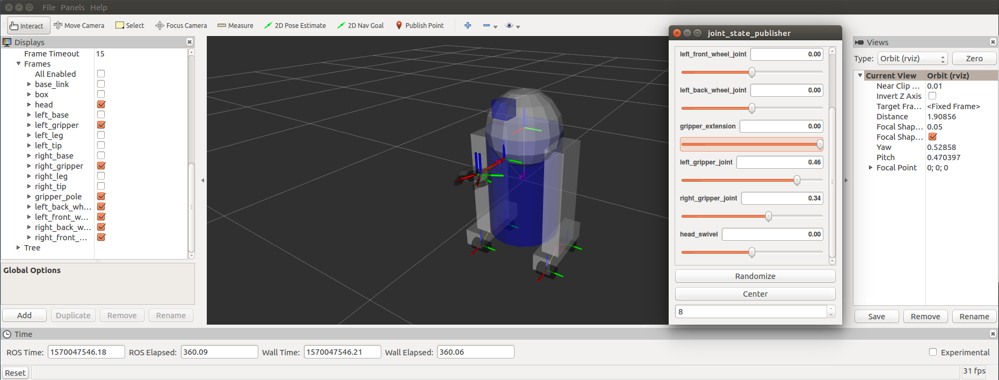

## urdf/ Tutorials/ Building a Movable Robot Model with URDF


------

## Building a Movable Robot Model with URDF

**튜토리얼 레벨 :**  Beginner(초급)

**이 튜토리얼 작성 환경 :**  catkin **/** Ubuntu 16.04 **/** Kinetic

**이전 튜토리얼 :** [Building a Visual Robot Model](./urdf_1_building_visual_robot_model.md)

**다음 튜토리얼 :** [Adding Physical & Collision](./urdf_3_adding_physical_n_collision.md)

**튜토리얼 목록 :** [README.md](../README.md)

**튜토리얼 원문 :** <http://wiki.ros.org/urdf/Tutorials/Building%20a%20Movable%20Robot%20Model%20with%20URDF>

------

이 튜토리얼에서 이 전 튜토리얼에서 만든 R2D2 모델을 수정하여, 움직이는 joint를 갖도록 만들 것이다. 전에 만든 모델의 모든 joint는 고정된( fixed ) joint 였다. 이제 중요한 다른 3가지 타입( `continuous` , `revolute` , `prismatic` )의 joint( non-fixed joint )에 대해 알아볼 것이다.


여기 <u>움직일 수 있는</u>( flexible ) joint들이 적용된 [새로운 urdf 파일](https://github.com/ros/urdf_tutorial/tree/master/urdf/06-flexible.urdf)이 있다. 이 전 파일들과 비교해 보면, 모든 것이 바뀐 것을 알 수 있다. 앞 서 언급한 3가지 종류의 <u>움직일 수 있는</u>( flexible ) joint들에 대해 주의 깊게 들여다 보자.

이 로봇모델을 시각화하고 제어하기위해 지난 튜토리얼과 같은 명령을 실행한다. 

`roslaunch urdf_tutorial display.launch mode:=urdf/06-flexible.urdf` 

하지만 이번에는 팝업 GUI 에서 non-flexible joint들에 대한 제어를 허용하고 있다. 이 GUI 컨트롤을 통해 어떻게 동작하는 지 움직여 보자.

 


### 1. The Head

```xml
  <joint name="head_swivel" type="continuous">
    <parent link="base_link"/>
    <child link="head"/>
    <axis xyz="0 0 1"/>
    <origin xyz="0 0 0.3"/>
  </joint>
```

몸통과 머리를 연결하는 joint는 continuous joint 이다. continuous joint 는 -∞ ~ +∞ 범위의 어떤 각도로도 회전이 가능한 joint 이다. 바퀴를 모델링할 때도 이 continuous joint 를 사용하므로 앞, 뒤방향으로 얼마든지 회전이 가능하다.

고정( fixed ) joint 와 비교할 때 단 하나의 정보만이 더 추가되는 데, 그것은 바로 회전축이다. xyz 의 세트로 x, y, z축 중에서 어느 축을 회전축으로 연결된 링크가 회전하는 지를 특정한다. 이 모델에서 머리부분은 z축을 회전축으로 회전하므로 'axis' 태그를 사용하여 `xyz = "0 0 1"` 와 같이 표현한다.


### 2. The Gripper

```xml
  <joint name="left_gripper_joint" type="revolute">
    <axis xyz="0 0 1"/>
    <limit effort="1000.0" lower="0.0" upper="0.548" velocity="0.5"/>
    <origin rpy="0 0 0" xyz="0.2 0.01 0"/>
    <parent link="gripper_pole"/>
    <child link="left_gripper"/>
  </joint>
```

그리퍼( 집게 )의 좌, 우 파트는 모두 revolute joint 로 모델링 되었다. 이것은 이 두 joint 가 continuous joint 와 같이 회전한다는 뜻이지만 revolute joint 는 엄격한 제한이 있다. 반드시 상, 하한값을 limit 태그에 'lower' 와 'upper' 속성으로표시( radian 값으로 )해야만 한다. 또한 최대 동작속도를 'velocity' , 동작에 필요한 최대 힘을 'effort' 속성으로 표시해야 하지만 이 예제에서는 크게 중요하지 않다.


### 3. The Gripper Arm

```xml
  <joint name="gripper_extension" type="prismatic">
    <parent link="base_link"/>
    <child link="gripper_pole"/>
    <limit effort="1000.0" lower="-0.38" upper="0" velocity="0.5"/>
    <origin rpy="0 0 0" xyz="0.19 0 0.2"/>
  </joint>
```

그리퍼 암은 prismatic joint 라고 하는 지금까지 나온 joint 들과는 특성이 많이 다른 joint 이다. 그것은 축을 중심축으로 회전하는 것이 아니라, 축을 따라 축방향으로 움직이는 joint 이기 때문이다. 이같은 병진 운동으로 인해 로봇 모델이 그리퍼 암을 앞으로 늘이거나 안으로 줄일 수 있다.

revolute joint 와 마찬가지로 prismatic  joint 역시 움직을 수 있는 한계를 명시해야 하는데, 회전운동이 아닌 병진운동이므로 그 단위를 radian이 아닌 m로 표시한다.


### 4. Other Types of Joints

지금까지 소개한 것들 외에도 공간에서 움직이는 두가지 다른 joint 가 있다. 그 중 하나는 평면상에서 움직이거나 2차원으로 움직일 수 있는 planar joint 이다. 다른 하나는 구속되지 않고 어떤 방향이던지 자유롭게 3차원으로 움직일 수 있는 floating joint 이다. 이 들은 하나의 숫자로는 특정할 수가 없으므로 이 튜토리얼에서는 다루지 않는다.


### 5. Specifying the Pose

GUI 컨트롤( Joint State Publisher )의 슬라이더를 이리저리 움직여보면 rviz 화면의 로봇 모델이 그에 따라 움직인다. 어떻게 이런 작업이 이루어질까? 먼저  URDF 를 parsing 하여 모든 움직이는( non-fixed ) joint 들과 그 한계값을 찾아낸다. 그리고나서 슬라이더의 값을 이용하여 [sensor_msgs/JointState](http://docs.ros.org/api/sensor_msgs/html/msg/JointState.html) 타입의 메세지를 발행( publish ) 후, [robot_state_publisher](http://wiki.ros.org/robot_state_publisher) 에 의해 모든 서로다른 부품들 사이의 상대변환( tf )을 계산하는데 사용된다. 마침내 Rviz 가 그 계산 결과물인 tf tree 를 이용하여 온갖 모양의 파트들을 화면에 디스플레이하는 것이다.

 

### 6. Next steps

이제 시각화 되고, 기능적으로 동작하는 로봇 모델이 만들어졌다. 이제 만들어진 [로봇 모델에 물리적인 속성을 추가]()하거나, [xacro를 이용하여 URDF를 간략화 하는 과정]()으로 넘어가면 된다. 

---

[이전 튜토리얼](./urdf_1_building_visual_robot_model.md)                                                             [튜토리얼 목록 열기](../README.md)                                                        [다음 튜토리얼](./urdf_3_adding_physical_n_collision.md)


